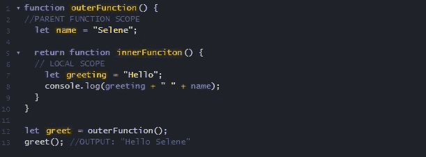

# 重新解释作用域和闭包:第 2 部分

> 原文：<https://medium.com/nerd-for-tech/scopes-closures-re-explained-part-2-8f1092837781?source=collection_archive---------23----------------------->

欢迎回到困惑:第 2 部分。我指的是作用域和闭包:第 2 部分。如果你错过了我谈到示波器的第一部分，你可以在这里找到它。

在这一部分，我将讨论闭包！闭包可能是一个令人害怕的话题。看看 [MDN](https://developer.mozilla.org/en-US/docs/Web/JavaScript/Closures) 是怎么定义的:

> 一个**闭包**是一个函数的组合，该函数被捆绑在一起(被封闭)并引用其周围的状态(即**词法环境**)。

在这篇文章中，我将用一些例子来分解这个概念。闭包是一个如此重要的概念，以至于我们作为开发人员每天都在代码中使用它，不管我们是否知道！

## 简化的闭包定义

**闭包**是指内部函数 ***可以访问外部函数作用域*** 中的变量的特性，即使在它已经被执行之后。每当在 JavaScript 中创建一个函数时，也会创建一个闭包。

闭包有三个作用域:

*   局部范围—访问自己的变量。
*   父函数范围—使用外部函数访问变量。
*   全局范围—对全局变量的访问。

# 让我们仔细看看

这里有一个简单的例子。

这里我们有一个包含已定义变量`name`的父函数。它还创建了一个内部函数。

内部函数有一个局部变量`greeting` 。内部函数可以访问父函数中的变量，这就是它能够在控制台中输出变量的原因。

## 故障

在第 12 行，外部函数第一次被调用。让我们从顶部开始看看这里发生了什么:

1.  创建了`name`变量，其值为“塞勒涅”。
2.  第 5 行声明并返回了内部函数。
3.  内部函数的内容存储在变量`greet`中。
4.  存储后，外部函数完成执行，其作用域不再存在。(局部变量只在其功能持续期间存在)。一旦函数返回，任何局部变量都会被删除。
5.  然而，当 greet 被调用时，name 变量仍然可以被访问和使用。这就是为什么我们的输出是“你好，塞勒涅”。

怎么会？闭包！内部函数是在调用外部函数时创建的。在这一点上形成了一个封闭。

让我们回到 MDN 的定义。

闭包是函数和它的**词法环境、**或者对它周围状态的引用的组合。

当内部函数被创建时，它保存一个对其父词法环境的引用，变量`name`就存在于该环境中。它“记住”创建它的环境，这将包括范围内考虑的任何局部变量。

这就是闭包的力量！

# 结论

闭包是 JavaScript 和其他编程语言中的一个关键特性。我们在日常编程生活中使用它，但是很难完全掌握。但是通过了解它的实际功能，我们可以更好地控制我们的代码。

# 来源

[MDN —闭包](https://developer.mozilla.org/en-US/docs/Web/JavaScript/Closures)

[用例子解释 JavaScript 中的闭包](https://www.freecodecamp.org/news/closures-in-javascript-explained-with-examples/)