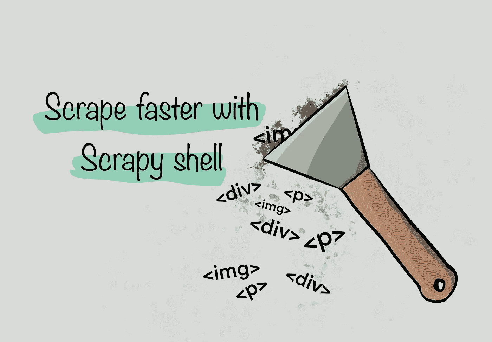
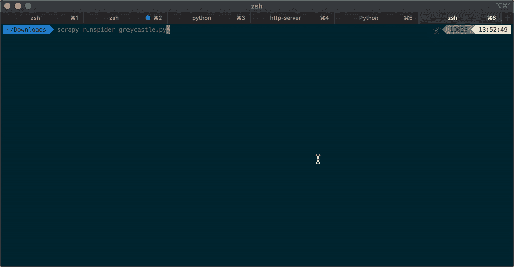
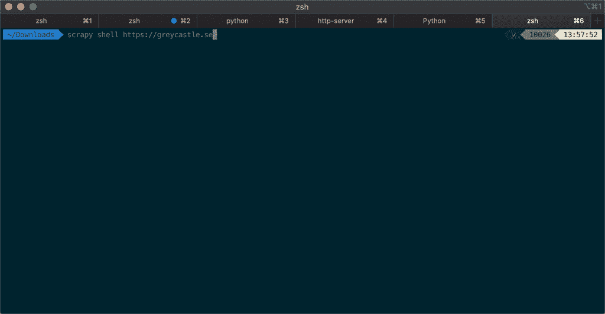

# 用刮削的外壳刮得更快

> 原文：<https://medium.com/nerd-for-tech/scrape-faster-with-scrapy-shell-9e75ea11e24d?source=collection_archive---------5----------------------->



您是否添加了打印语句并一次又一次地运行 scraper 来测试您的输出？你希望你能设置断点吗？你有没有在后台打开 chrome，并使用 jQuery 在你试图抓取的网站上测试这些选择器？

我知道这种感觉，我很乐意分享一个更好的方法！这个技巧节省了我几个小时。

# 使用外壳

Python 有一个优秀的命令行解释器，我经常用它来检查简单的语法或事情是如何工作的。在你的 shell 中运行`python`,你就进入了。我用它来测试小代码片段，因为它自动评估对象而不需要打印，所以它非常适合快速检查结果。


使用 python 命令行解释器测试小代码片段

免责声明:如果您正在构建比小脚本更大的东西，我强烈推荐您拥有一个测试套件。相反，通过在文件更新时运行此命令，您可以验证您的功能和语法，而不必复制/粘贴或重写代码。

# 你可以在 Scrapy 中添加断点

首先，让我们谈谈如何在不依赖打印报表的情况下验证我们的 scraper 内部正在发生的事情。这里的解决方案是使用 [inspect_response](https://docs.scrapy.org/en/latest/topics/shell.html#invoking-the-shell-from-spiders-to-inspect-responses) 方法。这使得 Scrapy 停止 python 的执行，并在您放置方法调用的地方打开一个交互式提示。这是中断代码执行和调试进程的一个很好的方法。

以我为自己的博客设置的这个示例 scraper 为例:

示例蜘蛛

在这个文件中添加一个对`inspect_response`的调用，我现在可以运行它并立即检查响应:



闯入运行中的铲运机检查响应

`response`对象和任何其他局部变量都是可用的，并且可以实时调用它们的任何方法。

```
response.css('.entry-title a::text').getall()
```

您可以使用`Ctrl+D`退出外壳并继续抓取，或者使用`quit()`中止。

# 也可以实时刮

现在是最精彩的部分。你甚至不需要造一台铲运机。您可以简单地将您的 URL 传递给 Scrapy，并使用 [Scrapy shell](https://docs.scrapy.org/en/latest/topics/shell.html) 运行它:

```
scrapy shell https://greycastle.se
```



运行 Scrapy shell 来快速检查页面

# 智能工作是快速工作

在上面的例子中，从使用 jQuery 和 print 语句转移到使用 Scrapy shell-like 进行调试，将我构建抓取器的时间减少了几个小时。当然，你的 scraper 变得越复杂，如果你有多个步骤等，使用 shell 可能会变得越来越困难，但我仍然认为它可以帮助你在完成代码之前证明你的想法。当需要更改时，`inspect_response`是您快速验证结果的最好朋友。

希望这有所帮助，享受你的刮擦！