# 实时抓取新闻和公司公告— 3(NLP)

> 原文：<https://medium.com/nerd-for-tech/scrape-news-and-corporate-announcements-in-real-time-3-nlp-99faebfb6684?source=collection_archive---------11----------------------->

以前的帖子可以在下面的链接中找到。

[](https://charliethewanderer.medium.com/scrape-news-and-corporate-announcements-in-real-time-dc4b7724a53e) [## 实时抓取新闻和公司公告

### 如果你已经安装了 telegram，你可以在 Telegram 的搜索栏中输入@info_scraper_bot 来添加 news _ bot

charliethewanderer.medium.com](https://charliethewanderer.medium.com/scrape-news-and-corporate-announcements-in-real-time-dc4b7724a53e) [](https://charliethewanderer.medium.com/scrape-news-and-corporate-announcements-in-real-time-2-deployment-27ae489f598a) [## 实时抓取新闻和公司公告— 2(部署)

### 之前的帖子可以在下面的链接中找到。

charliethewanderer.medium.com](https://charliethewanderer.medium.com/scrape-news-and-corporate-announcements-in-real-time-2-deployment-27ae489f598a) 

在这篇文章中，我想谈谈我在项目中实现的自然语言处理。

在项目开始时，我计划构建的是一个功能，它会提示与每篇新闻文章相关的上市公司名称，并预测该新闻对其股票价格有正面还是负面影响。

我想到的第一件事就是用深度学习对新闻文章做自然语言处理。然而，经过大量的试错，我发现这比我想象的要难得多。有些问题。最大的问题之一是准备数据集。训练一个深度学习模型，要有足够的数据和标签来喂养。我能够收集成吨的新闻文章，但标记每一个数据是一个完整的故事。
我不得不判断每篇新闻报道是否正面，找出与新闻相关的公司名称来做标签。

在这个过程中，我的视角不可避免地渗透到模型中，因为标签是基于我的视角制作的。更糟糕的是，我不是股票投资专家，所以我甚至不能提供一个完美的标签。
换句话说，我无法判断一篇新闻文章是否会对相关公司的股价产生积极影响，而且，即使是专家，对同一条新闻的想法也可能不同。

其次，深度学习模型需要很高的计算资源。对我来说，速度和效率是我的项目的关键，因为我必须每 10 秒钟处理 50 多篇新闻文章，这对像 BERT 这样的深度学习模型来说是一个相当大的文本数据。
深度学习模型需要两个阶段的高计算能力。一个是训练过程，一个是推理过程。
至于培训，我计划实施迁移学习，以最小化我的任务的计算成本。多亏了谷歌，这看起来是合理的，因为谷歌已经在 100 多种语言上训练了它的 BERT 模型，并免费发布给任何人使用。然而，在推理阶段，我们无法在 10 秒钟内处理这么多新闻文章。

因此，不管模型本身的性能如何，任何基于监督学习的模型都不适合我的情况。

所以，我必须想出一种不需要监督学习的方法，我尝试了 TF-IDF 算法，这是自然语言处理的传统算法之一。TF-IDF 算法的机制是对在一个文档中频繁出现的单词进行加权，但对同时出现在多个文档中的单词进行惩罚。换句话说，它假定一个在文档中频繁出现的单词是一个重要的关键字。然而，如果它只根据单词出现的次数来评估单词，则像 the、a、of、to 这样的单词将被认为是最重要的单词。为了避免这些问题，它惩罚了出现在许多其他文档中的常用词。
因此，它不需要监督学习，因为它利用了统计数据，这意味着我不必为它准备标签。

在实现 TF-IDF 算法之前，我必须收集文本数据来提取关键字和权重，以区分每个公司。为此，我刮了 2000 多家上市公司的论坛版块。一个论坛板看起来像下面的图片。


我使用 Scrapy 在数据库中存储了每个论坛一年的帖子，为了不被服务器禁止，我使用 Docker 容器通过 VPN 为每个容器分配不同的 IP 地址。

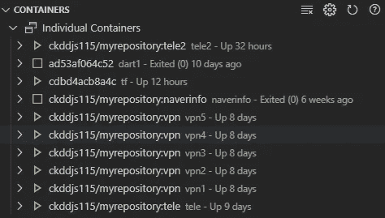

花了几天时间才从论坛上刮下所有文字。然后，我开始用 Python scikit-learn 库实现 TF-IDF。
实施 TF-IDF 的概要如下。

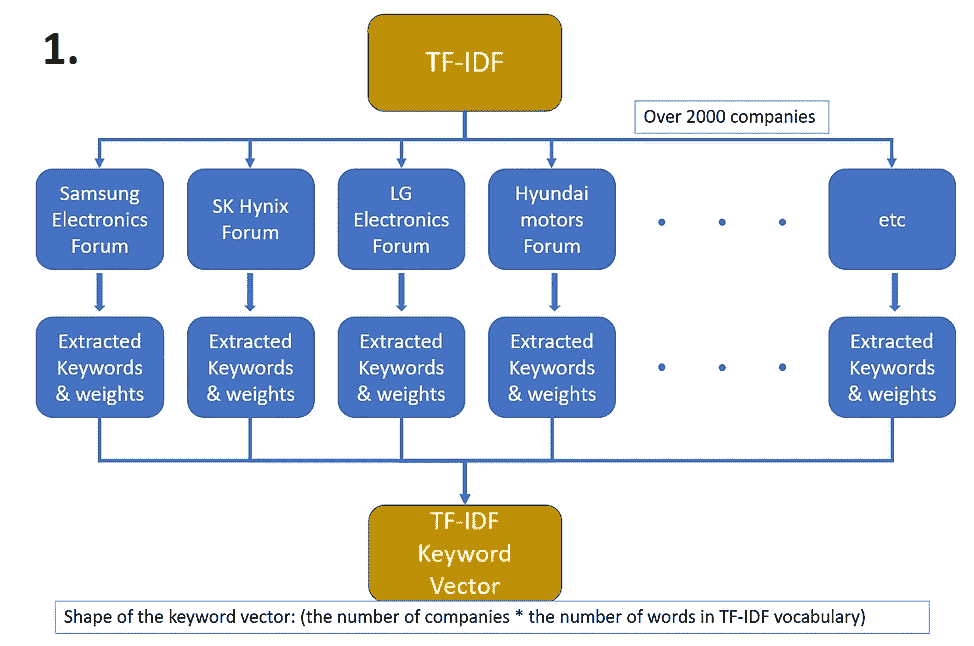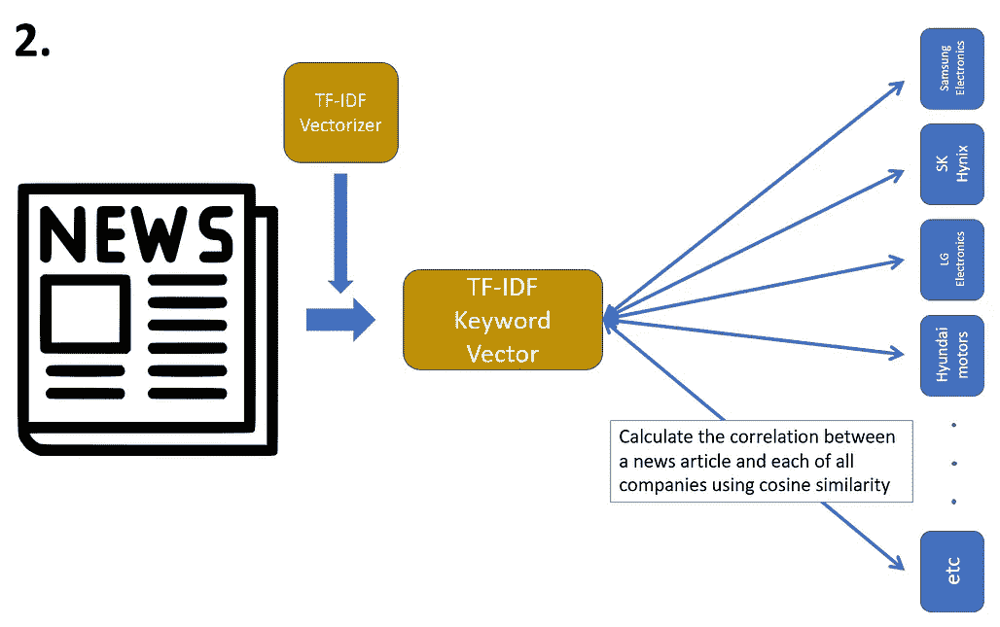

从从数据库加载数据开始，我排除了点击率低于前 60%或好的计数低于 3 的帖子。

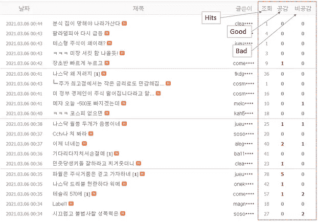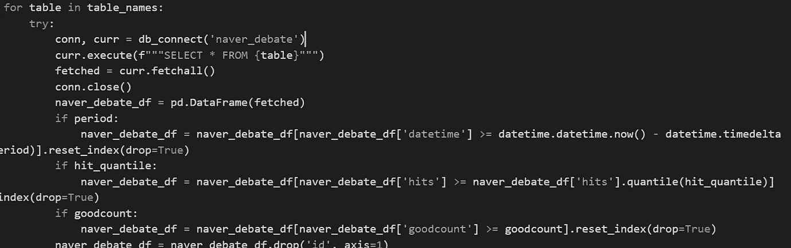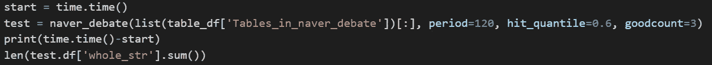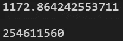

我过滤掉那些帖子的原因是，在大多数情况下，点击率高、计数好的帖子往往与股票本身更相关，质量也比其他帖子高。否则，我将不得不处理太多的文本数据，这会导致浪费时间和计算资源。

然后，我使用 Mecab 标记器从文本中只提取名词，这是一种流行的朝鲜语标记器。因此，TF-IDF 的词汇表由来自所有股票论坛的所有名词组成。然后 scikit-learn 的 TF-IDF 矢量器计算每个论坛中每个名词的权重，这样它就可以生成一个包含所有公司词汇权重的矢量。

然而，当我对我的数据实现 scikit-learn TF-IDF 矢量器时，它并没有像我预期的那样工作。
它适用于长度小于 20，000，000 的短文本，但是在我的例子中，要处理的整个字符串的长度超过了 150，000，000，这似乎导致了一个致命的问题。
经过无数次试验和错误，我发现问题来自 scikit-learn 的矢量器本身。在构建词汇和向量化令牌时，它没有利用 CPU 的多核，甚至连续几天都停留在无限计算上。

因此，我决定构建一个函数来替换 scikit-learn 的 rolls 的某些部分。首先，我将所有文本字符串标记为名词，为 TF-IDF 过程构建词汇，这样 scikit-learn 的矢量器就不必自己完成这项工作。然后，我将 max_df 过滤器应用于词汇表，以删除在许多文档中出现太频繁的一些关键字。为了实现这一点，我使用了 Python 多处理模块来并行化这个过程，如下所示。

```
# max_df_filter parallelization
start = time.time()

empty_list = []

def max_df_filter_multi(vocab, index, df, max_df, return_dict):
    processed_vocab = []
    document_num = len(df)
    i = 0
    for x in vocab:
        score = 0
        for whole_str in df:
            if x in whole_str:
                score += 1
        if (score/document_num) < max_df:
            processed_vocab.append(x)

        if i % 100 == 0:
            print(f"{index+1}th processor: {i+1}th word is done!")
        i += 1
    return_dict[index] = processed_vocab

if __name__ == '__main__':
    manager = multiprocessing.Manager()
    return_dict = manager.dict()
    cores = 14
    step =  int(len(extracted_vocab) / cores)
    remainder = len(extracted_vocab) % step
    vocabs = []
    for i in range(cores):
        if i == 13:
            vocab_part = extracted_vocab[i*step:]
        vocab_part = extracted_vocab[i*step:i*step + step]
        vocabs.append(vocab_part)
    procs = []

    for index, vocab in enumerate(vocabs):
        proc = Process(target=max_df_filter_multi, args=(vocab, index, test.df['whole_str'][:], 0.75, return_dict))
        procs.append(proc)
        proc.start()

    for proc in procs:
        proc.join()

for processed_vocab in return_dict.values():
    for word in processed_vocab:
        empty_list.append(word)

print(time.time() - start)
```

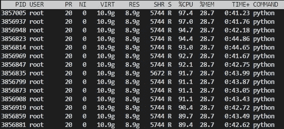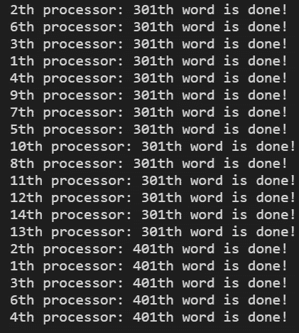

在对词汇表应用 max_df 过滤器之后，我将它传递给 scikit-learn 的 TfidfVectorizer，用。fit_transform 方法。

一旦我给了矢量器词汇表，它就可以用它来提取关键字来计算权重，因为它不需要自己生成词汇表，所以不需要花太多时间就可以从中获得一个矢量。

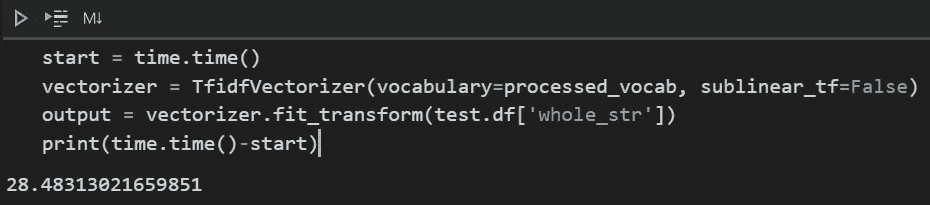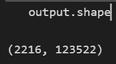

输出向量的形状变成了公司的数量(行)*词汇表中的字数(列)，因为每个公司都有自己的基于词汇表的关键字向量。

你可以看到 TF-IDF 算法已经成功地从每个股票论坛中提取出关键词，如下图。

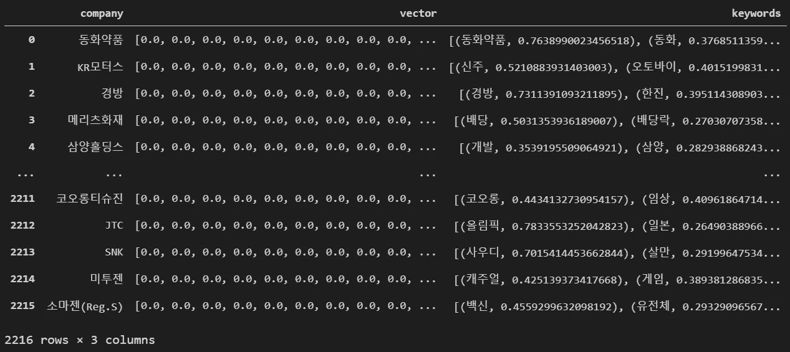

我们来看看这两个股票论坛的关键词是怎么提取出来的。

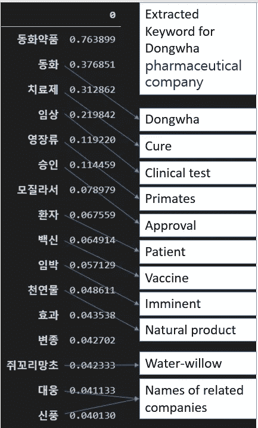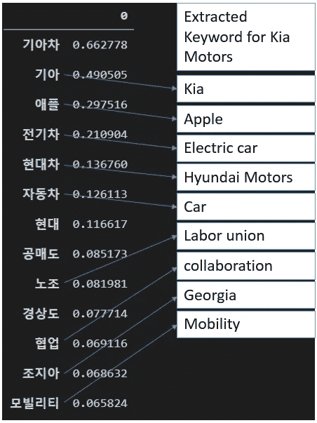

左图显示了东华制药公司的提取关键字。可以看到关键词很好的代表了东华制药公司的身份。特别是，像治愈、临床试验、批准、疫苗这样的关键词代表东华在制药行业中的地位，而像灵长类动物和水柳这样的关键词代表东华区别于其他药物的独特特征。

同样，右图包含起亚汽车的关键词。由于最近苹果和起亚汽车之间有几次关于苹果汽车的对话，这些话题自然渗透到由 TF-IDF 算法提取的关键词中。因此，这些关键词不仅代表了起亚汽车所属的行业，也代表了起亚汽车的独特之处。

现在，是时候将 TfidfVectorizer 应用于新闻文章，以计算每篇新闻文章和每个股票论坛之间的相关性了。
首先，新闻文章必须使用已经在股票论坛上训练过的 TfidfVectorizer 进行矢量化。
由于 TfidfVectorizer 已经有了自己的词汇表，新文章可以很容易地用一个简单的。“转换”方法。

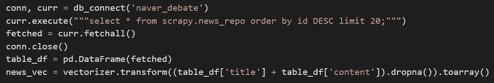

向量化从数据库加载的新闻文章

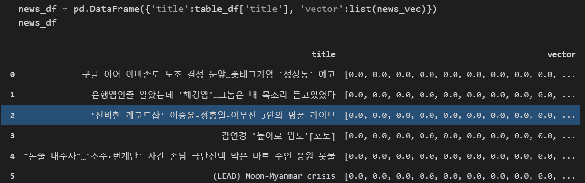

矢量化新闻文章

由于每篇新闻文章都有一个长度与词汇表长度相同的向量，所以整个矩阵的形状就变成了新闻文章的数量*词汇表的字数。

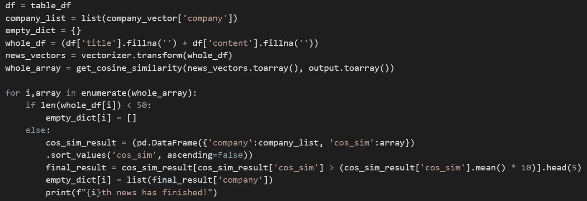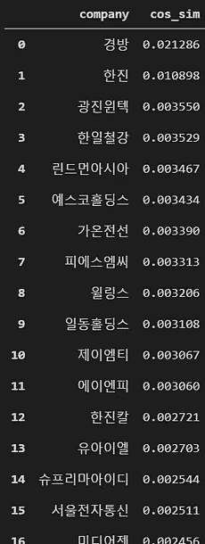

左:计算每篇新闻文章和所有股票论坛之间的相关性/右:计算其中一篇新闻文章的余弦相似度

您可以通过计算两个向量之间的余弦相似性来计算每篇新闻文章和所有股票论坛之间的相关性，如右图所示。

下图显示了我为电报机器人构建的最终实现。

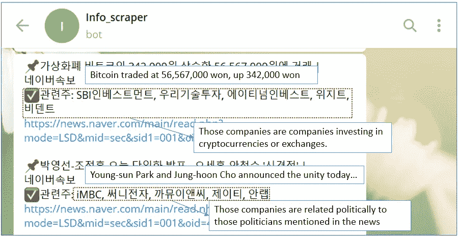

此外，所有股票论坛的向量可以用 T-SNE 算法可视化，如下所示。你可以看到，类似的公司往往位置相近。由于相似性是基于来自股票论坛的关键字向量的余弦相似性来计算的，所以在计算相似性的过程中自然地反映了每个股票论坛中的人所生成的所有对话和话题。

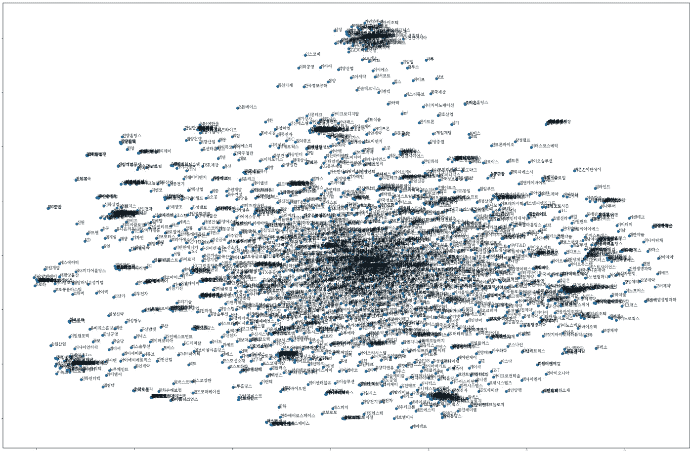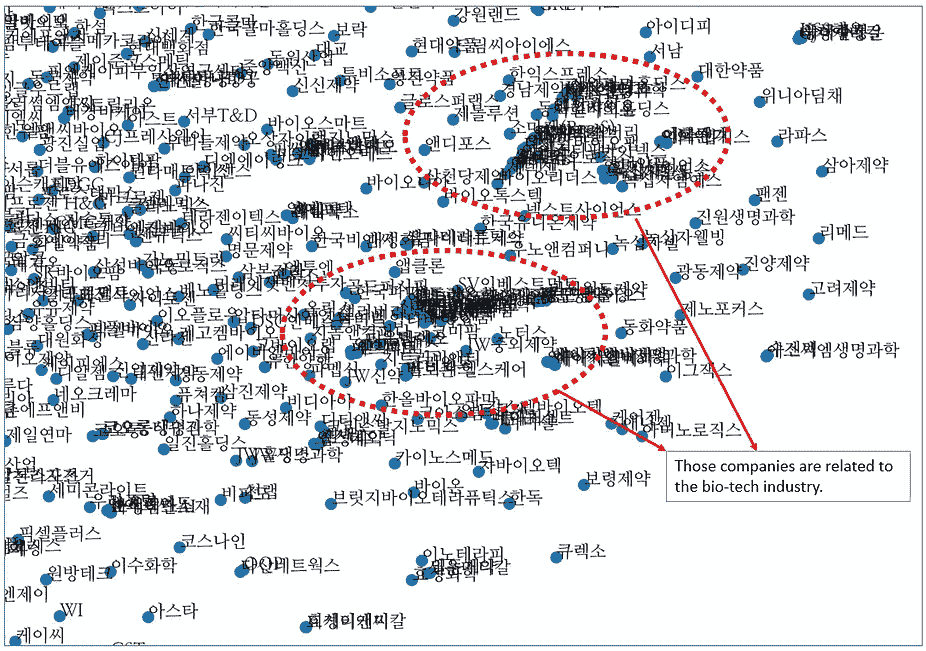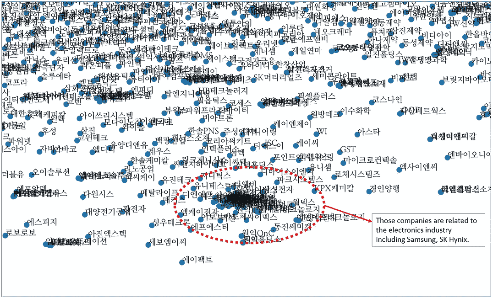

同样，你可以为你输入的某个词找到相关的公司。
有了每个股票论坛的向量，就可以比较每个股票论坛的一个向量中对应词的权重。

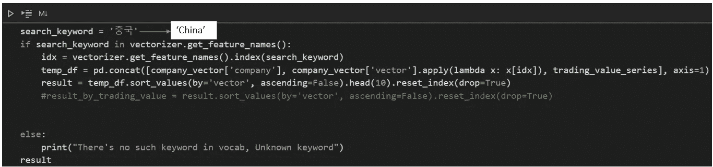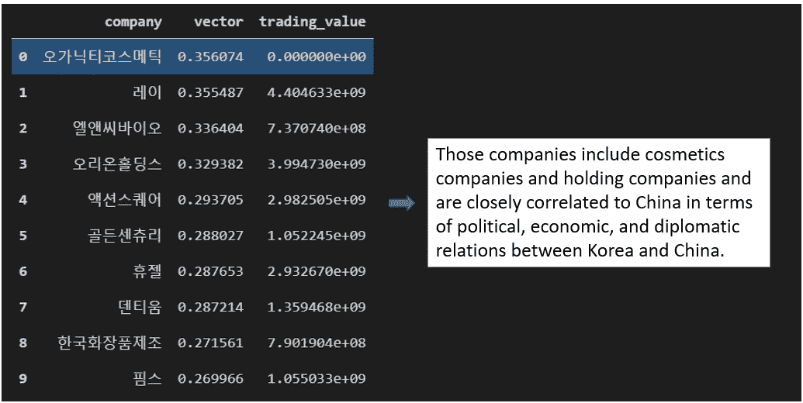

正如你在上面的图片中看到的，这些公司是那些对关键词'중국(China)'.有很高权重的公司因此，高度依赖韩中关系的公司排名靠前。

电报机器人的最终实现如下。


# 外卖食品

在做这个项目时，我感到惊讶的一件事是，传统算法可能足够强大，甚至比尖端算法更好，因为传统算法不需要大量带有手工标签的数据。
此外，与庞大的深度学习模型相反，传统方法不需要超级计算机来进行训练和推理过程。我将一台游戏笔记本电脑用作远程服务器，在那里我可以全天候运行从开发和培训到运行我在上面构建的东西的所有事情，我甚至听不到风扇的噪音，这意味着 TF-IDF 算法既有效又非常高效。

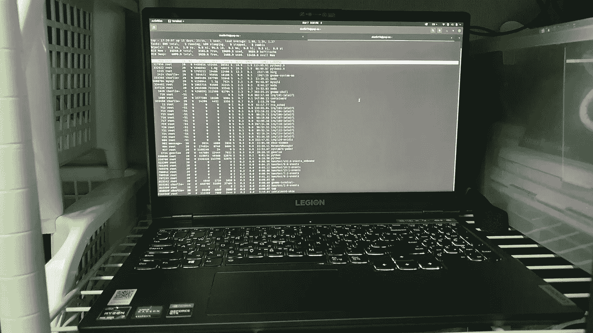

尽管如此，我认为对大多数人来说，实现深度学习模型的途径非常有限，除非他们属于学术界或谷歌、苹果或三星这样的企业集团。
这是因为获取足够的数据和使用计算资源来训练深度学习模型的成本很高。即使在训练了一个模型之后，你也必须有一个像样的系统来处理你的模型的推理过程，这将导致巨大的计算成本。

在做这个项目时，我开始了另一个项目，作为一个分支，它是关于用包括财务报表在内的历史数据预测股票价格的趋势。
所以，下一篇文章将会是关于这个的。感谢阅读。