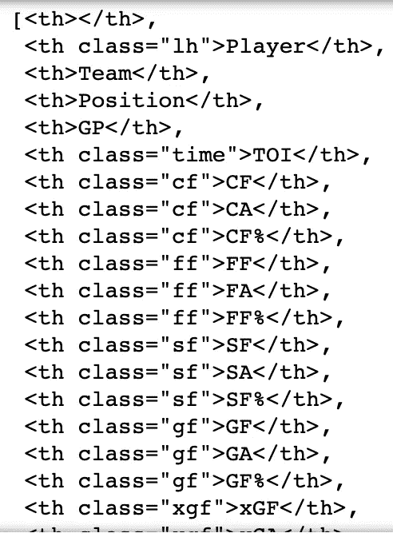
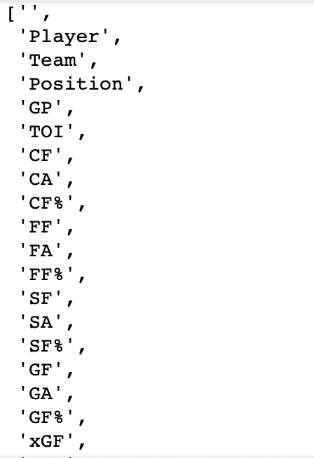
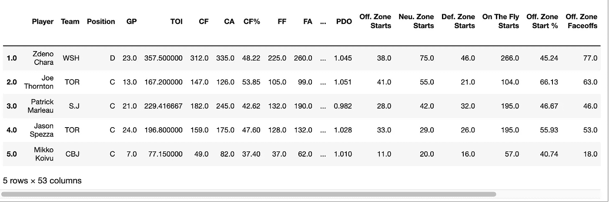
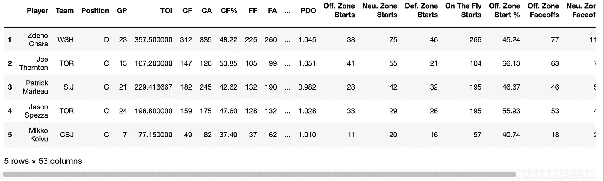
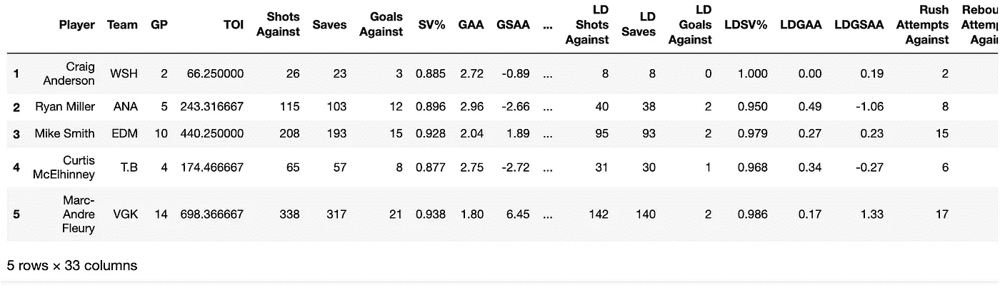

# 用漂亮的汤从自然统计技巧中抓取数据表

> 原文：<https://medium.com/nerd-for-tech/scraping-data-tables-from-natural-stat-trick-using-beautiful-soup-3251191bc3e1?source=collection_archive---------5----------------------->


信用:[布鲁斯·班尼特](https://www.gettyimages.com/search/photographer?family=editorial&photographer=Bruce+Bennett) /职员

在这篇文章中，我将演示如何从 [Natural Stat Trick](http://naturalstattrick.com) 的表格中抓取数据，这是一个获取标准和高级 NHL 统计数据的网站。Natural Stat Trick 是一个著名的、经常被引用的非霍奇金淋巴瘤分析数据源，被作家和粉丝们广泛使用。

首先，使用这个漂亮的汤库，我将按照步骤抓取 html 并将数据转换成熊猫数据帧。然后，我将展示一个方便的 liner，它适用于 Natural Stat Trick 上的表格，也适用于其他网页上的表格，这取决于它们的复杂程度。最后，关于改变 URL 以改变您可以获得的数据的参数的提示。

这里是一个 jupyter 笔记本的 [github repo](https://github.com/gschwaeb/scraping_naturalstattrick) 和所有下面的代码。

# 一步一步的美汤

导入以下库

```
import requests
from bs4 import BeautifulSoup
import pandas as pd
```

requests.get()方法将下载一个网页并返回一个响应对象

```
url = “[http://www.naturalstattrick.com/playerteams.php?fromseason=20202021&thruseason=20202021&stype=2&sit=5v5&score=all&stdoi=oi&rate=n&team=ALL&pos=S&loc=B&toi=0&gpfilt=none&fd=&td=&tgp=410&lines=single&draftteam=ALL](http://www.naturalstattrick.com/playerteams.php?fromseason=20202021&thruseason=20202021&stype=2&sit=5v5&score=all&stdoi=oi&rate=n&team=ALL&pos=S&loc=B&toi=0&gpfilt=none&fd=&td=&tgp=410&lines=single&draftteam=ALL)"req = requests.get(url)
```

为了确认它没有错误地工作，我们可以运行。状态代码方法。我们正在寻找这个返回 200，这意味着我们都很好。 [HTML 代码](https://en.wikipedia.org/wiki/List_of_HTTP_status_codes)。

```
req.status_code
```

这里我们将请求中的 html 文本传递到一个漂亮的 Soup 对象中，这样我们就可以使用漂亮的 Soup 库来解析它。

```
soup = BeautifulSoup(req.content)
```

我们使用。方法来遍历 html 中的子节点级别。我们将把它传递给一个列表来访问不同的级别。对于此网页，顶层只有一个孩子

```
top = list(soup.children)
```

在第二层，有两个子节点:header 和 body。表的内容将位于索引 1 处的正文中。

```
body = list(top[0].children)[1]
```

使用。find_all 方法过滤所有具有指定 html 标签的数据，并将其放入一个列表中。我们希望所有的“th”标签都获得表格标题。

```
body.find_all(‘th’)
```



body.find_all('th') return 语句

的。text 方法将提取标记中的文本。我们将把列文本传递到一个列表中，供以后使用。

```
columns = [item.text for item in body.find_all(‘th’)]
columns
```



列返回语句

现在我们将找到所有包含数据的“td”标签

```
body.find_all(‘td’)
```

我们将把数据的文本传递给一个列表

```
data = [e.text for e in body.find_all(‘td’)]
```

这里我们将遍历数据列表，为表中的每一行数据创建一个列表列表。稍后我们将使用它来创建一个熊猫数据帧。

```
start = 0
table= []
#loop through entire data
while start+len(columns) <= len(data):
    player = []
    #use length of columns as iteration stop point to get list of info for 1 player 
    for i in range(start,start+len(columns)):
        player.append(data[i])
    #add player row to list
    table.append(player)
    #start at next player
    start += len(columns)
```

将列表的列表读给熊猫数据帧

```
df = pd.DataFrame(table, columns = columns, dtype = ‘float’).set_index(‘’)
```

瞧啊。我们已经有了一个熊猫数据框架，可以用来做一些分析。

```
df.head()
```



# 唯一的班轮

如前所述，我们可以在一行简洁的代码中完成所有的抓取、搜索和转换到数据帧的工作！熊猫。read_html 方法将 html 表格读入 DataFrame 对象列表，它建立在 BeautifulSoup4 和 lxml 之上。它还可以将列转换为适当的数据类型。

```
df2 = pd.read_html(url, header=0, index_col = 0, na_values=[“-”])[0]
df2.head()
```



容易多了！

# 关于 URL 参数的注释

通过改变代码中传递的 URL 中的元素，可以改变表中返回的数据。这允许动态提取不同类型的数据。例如，你可以切换到不同的赛季，日期，看守门员统计，看率而不是计数，过滤不同的比赛情况等…

我从 URL 中提取了所有潜在的参数选项作为它们自己的变量。有关参数选项的完整指南，请查看 Github 笔记本。使用 python 方法。格式，我可以更改 URL 字符串中的参数。与我之前使用的 URL 字符串相比，我将把 stdoi 参数改为‘g ’,以获得守门员的具体统计数据来进行演示

```
fromseason = 20202021thruseason = 20202021stype = 2 sit = ‘5v5’score = ‘all’ stdoi = ‘g’ rate = ‘n’team = ‘ALL’ pos = ‘S’ loc = ‘B’ toi = 0 gpfilt = ‘none’ fd = ‘’ td = ‘’ lines = ‘single’ draftteam = ‘ALL’ url = ‘[http://www.naturalstattrick.com/playerteams.php?fromseason={}&thruseason={}&stype={}&sit={}&score={}&stdoi={}&rate={}&team={}&pos={}&loc={}&toi={}&gpfilt={}&fd={}&td={}td&tgp={}&lines={}&draftteam={}'.format(](http://www.naturalstattrick.com/playerteams.php?fromseason={}&thruseason={}&stype={}&sit={}&score={}&stdoi={}&rate={}&team={}&pos={}&loc={}&toi={}&gpfilt={}&fd={}&td={}td&tgp={}&lines={}&draftteam={}'.format()
 fromseason,
 thruseason,
 stype, 
 sit,
 score, 
 stdoi, 
 rate, 
 team, 
 pos, 
 loc, 
 toi, 
 gpfilt, 
 fd, 
 td, 
 tgp, 
 lines, 
 draftteam)print(url)df3 = pd.read_html(url, header=0, index_col = 0, na_values=["-"])[0]
df3.head()
```



# 结论

你现在有了从 Natural Stat Trick 和其他类似网站的表格中获取数据的工具。首先尝试一下 pd.read_html，如果这不起作用，您可以一步一步地使用漂亮的汤库。您还可以动态更新 URL 参数来获取不同类型的数据。

尽管 Natural Stat Trick 的提供商允许公众免费访问这些数据，但如果你发现自己经常使用这些数据，可以考虑订阅 [Patreon](https://www.patreon.com/naturalstattrick) 来支持网站的持续运营。

# 来源

-【http://www.naturalstattrick.com/-
-[-【https://requests.readthedocs.io/en/master/user/quickstart/](https://requests.readthedocs.io/en/master/user/quickstart/)
-[https://theathletic . com/415611/2018/07/05/an-advanced-stats-primer-with-natural stattricks-Brad-Tim mins/](https://theathletic.com/415611/2018/07/05/an-advanced-stats-primer-with-naturalstattricks-brad-timmins/)
-[https://www.crummy.com/software/BeautifulSoup/bs4/doc/](https://www.crummy.com/software/BeautifulSoup/bs4/doc/)
-[https://pandas . pydata . org/pandas-docs/stable/user _ guide/io . html #阅读](https://pandas.pydata.org/pandas-docs/stable/user_guide/io.html#reading-html-content)