# 抓取 Instagram 来人工创建运动鞋设计(DCGAN PyTorch)

> 原文：<https://medium.com/nerd-for-tech/scraping-instagram-to-artificially-create-sneaker-designs-dcgan-pytorch-c449c5ebfad0?source=collection_archive---------15----------------------->

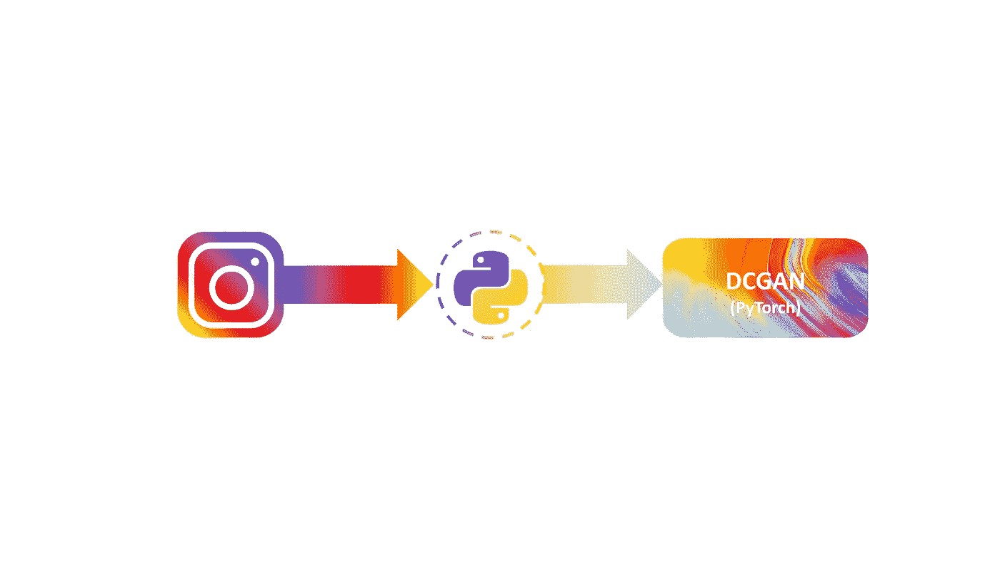

在这个特别的博客中，这是“**关于 GANs** 系列的第三部分，在这里我将讨论 DCGAN(深度卷积生成的对抗网络)的架构&工作及其实现。

在这里，我们将使用 PyTorch 框架实现 DCGAN，以在从 Instagram 抓取的数据集上生成运动鞋图像。

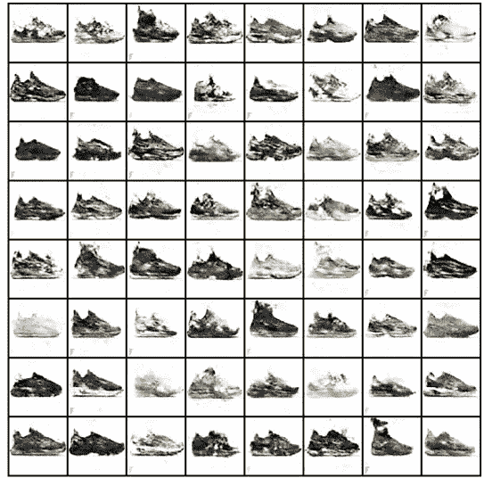

从 DCGAN 生成的图像

因此，本文主要分为三个部分:

*   **什么是 DCGAN？DCGAN 是如何工作的？**
*   **从 Instagram 上抓取图片，创建我们的数据集**
*   **使用 PyTorch 实际实施 DCGAN】**

如果您熟悉 DCGAN 的工作方式，那么您可以直接跳到实际实施部分。

此外，如果你不太熟悉 GAN 的工作方式(或者有兴趣了解 GAN 的其他变体以及它们的深入工作方式)，那么你可以参考下面提到的我以前关于 GAN 的博客。

博客 1: [**【生成对抗网络】简介**](https://sudeepdas27.medium.com/introduction-to-gan-generative-adversarial-networks-9f96ab80de0b)

博客 2: [**关于甘的一切(上)**](https://sudeepdas27.medium.com/all-about-gans-part-1-84547262ab38)

博客 3: [**关于甘氏的一切(下)**](https://sudeepdas27.medium.com/all-about-gans-part-2-ba104334d2cf)

我强烈建议你先看一遍，因为我已经详细解释了甘的工作原理。所以，让我们开始吧！

# **DCGAN(深度卷积生成对抗网络)**

DCGAN 架构

DCGAN 是 GAN 的另一种变体，由两个模块组成，即生成器和鉴别器。鉴别器模块可以由任何使用步进卷积层的 CNN 分类器架构组成，而在发生器模块的情况下，它从噪声/潜在向量中提取值，然后通过转置卷积运算将其转换为 64x64x3 输出/图像。

## **发电机**

生成器由卷积转置层组成。在生成器中，输入取自潜在向量(100×1 维的正态分布),并通过执行转置卷积运算产生 64×64×3 维图像的输出。

转置卷积的公式为:

**输出尺寸=步幅*(输入尺寸— 1) +滤波器尺寸— 2 *填充**

从图中我们可以看到，维度的转换发生在:

100 x1→4x4x 1024→8x8x 512→16x 16x 256→32 x32x 128→64x 64x 3

**4x4x1024 → 8x8x512**

步幅= 2，填充= 1，过滤器大小= 4

输出尺寸(高度):2 *(4–1)+4–2 * 1 = 8

输出尺寸(重量):2 *(4–1)+4–2 * 1 = 8

有 512 个过滤器，因此输出为:8x8x512

**8x8x512 → 16x16x256**

步幅= 2，填充= 1，过滤器大小= 4

输出尺寸(高度):2 *(8–1)+4–2 * 1 = 16

输出尺寸(重量):2 *(8–1)+4–2 * 1 = 16

有 256 个滤波器，因此输出为:16×16×256

这就是转置卷积运算的工作原理，也称为分数步长卷积。还包括批量规范层，使用 ReLU 激活。

## **鉴别器**

鉴别器由步进卷积层组成。它区分取自实际分布的样本“x”和来自生成器“G(x)”的输出。

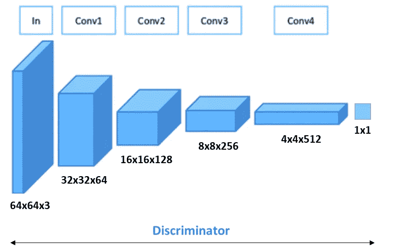

卷积运算的公式为:

**输出尺寸=(输入尺寸+ 2 *填充-滤波器尺寸)/步幅+1**

从图中我们可以看到，维度的转换发生在:

64 x64 x3→32 x32 x64→16 x16 x128→8x8x 256→4x4x 512→1x1

**64x64x3 → 32x32x64**

步幅= 2，填充= 1，过滤器大小= 4

输出尺寸(高度):(64+2 * 1–4)/2+1 = 32

输出尺寸(重量):(64+2 * 1–4)/2+1 = 32

有 64 个过滤器，因此输出为:32x32x64

**32x32x64 → 16x16x128**

输出尺寸(高度):(64+2 * 1–4)/2+1 = 32

输出尺寸(重量):(64+2 * 1–4)/2+1 = 32

有 128 个过滤器，因此输出为:32x32x128

类似地，在其他层上执行这种步进卷积操作。它还包括批量规范化层，并使用 LeakyReLU 激活。

## **损失函数和优化器**

在 DCGAN 的情况下，我们倾向于使用二进制交叉熵损失函数，其给出为:

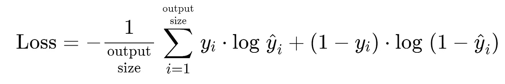

二元交叉熵损失

计算损失，并且相应地，用多个时期更新权重和其他参数，直到我们获得最小损失。在 DCGAN 中，我们倾向于使用 Adam 优化器进行优化，学习率为 0.0002，beta1 = 0.5。

根据 [**白皮书**](https://arxiv.org/pdf/1511.06434.pdf) ，在实施稳定的 DCGAN 时，还有一些其他重要事项需要记住，它们是:

*   用步长卷积(鉴别器)和分数步长卷积(生成器)替换任何池层
*   在生成器和鉴别器中使用批处理规范
*   为更深层次的架构移除完全连接的隐藏层
*   在发生器中对所有层使用 ReLU 激活，但输出层除外，它使用 Tanh
*   在所有层的鉴别器中使用 LeakyReLU 激活。

# **从 Instagram 抓取数据**

对于我们的项目，我们决定生成或者说人工创建运动鞋的图像。为了做到这一点，我们需要在各种运动鞋图片上训练我们的模型。这就是 Instagram 的用武之地，因为它是一个全球多位才华横溢的人发布内容的平台。

我用“[**”insta gram-scraper**](https://github.com/arc298/instagram-scraper)”刮掉了账号公开的用户上传的照片。我已经链接了他们的 git repo，scrapper 在收集数据方面做得非常好。

安装完成后，在 cmd 中执行存储库中提到的命令，它就会下载所有的媒体内容。下面是我的 cmd 在废弃数据时的快照。

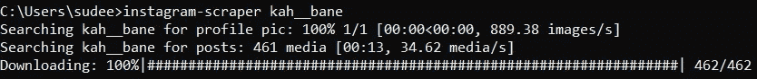

instagram-scraper

在我的项目中，我决定收集这些天才艺术家的媒体和一个运动鞋页面:

*   [@chenchicharo](https://www.instagram.com/chenchicharo/)
*   [@kah__bane](https://www.instagram.com/kah__bane/)
*   [@ sneaker labour](https://www.instagram.com/sneakerslabour/)

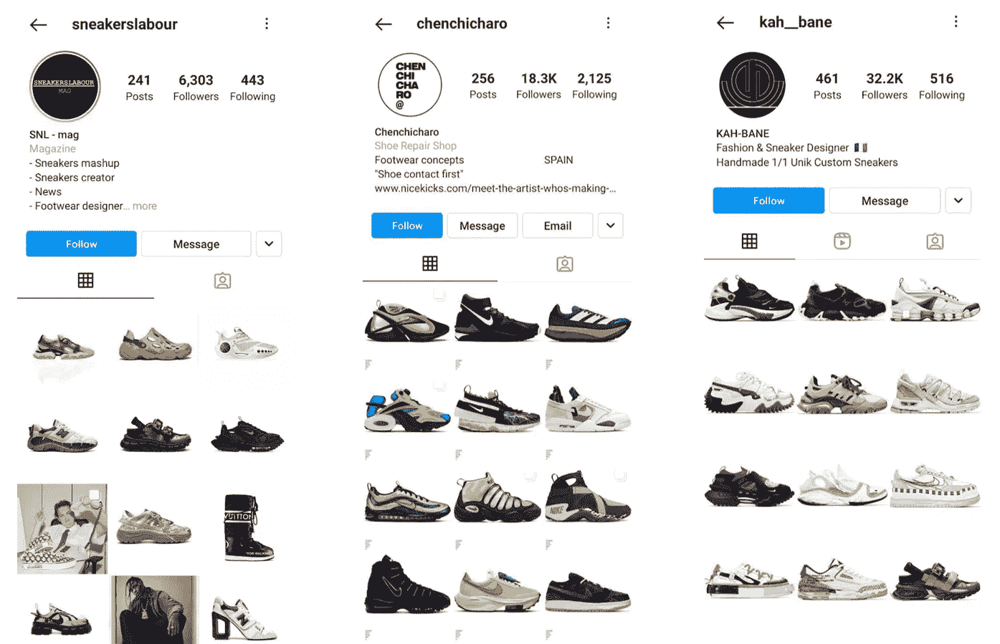

下载完所有文件后，将它们整理到一个文件夹中，并筛选出将用于训练我们模型的相关图像。

# **使用 PyTorch 实现 DCGAN】**

第一步是安装所有的依赖项，然后导入所有的图像，并通过使用数据加载器将它们全部转换到相同的维度，然后将这些维度输入到我们的模型中。

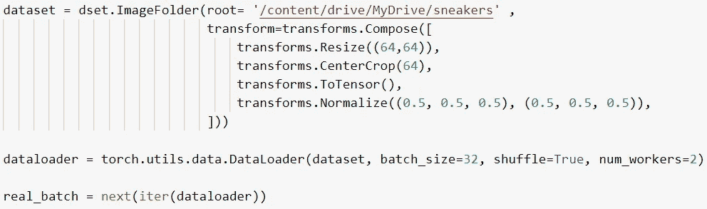

转换和数据加载器

然后，我们将生成块定义为:

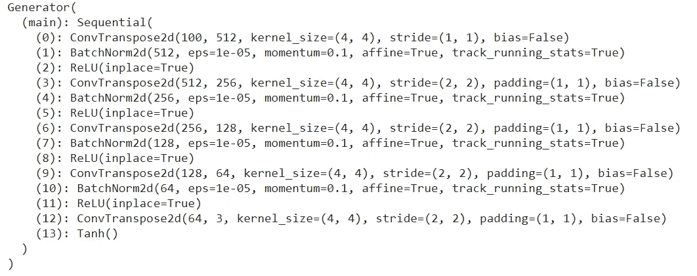

发电机组

然后，我们将鉴别器模块定义为:

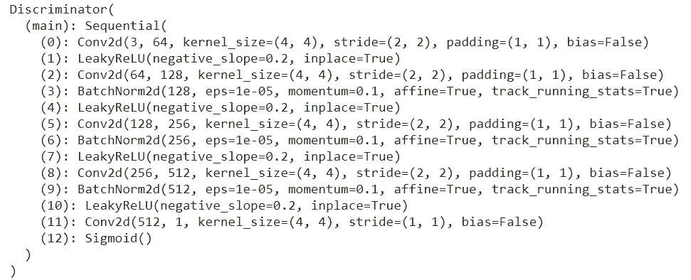

鉴别器块

一旦我们定义了生成器和鉴别器块，下一步将是通过定义一些其他参数，如优化器、学习速率、批量大小和损失函数(二进制交叉熵损失)标准，在一定数量的时期内训练它们。

该模型被训练了超过 100 个时期。我也尝试过分别使用 TPU 和 GPU 开发 TensorFlow 框架，这比 PyTorch 慢多了。在 PyTorch 中执行 100 个 epochs 需要 10 多分钟，而在 TensorFlow 中执行相同的操作需要 2 个多小时。

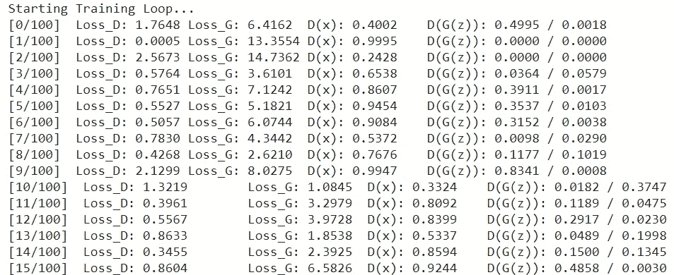

培训模式

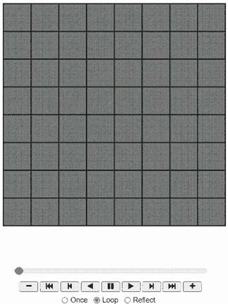

跨时代的图像

上面的 gif 显示了该模型如何生成与我们数据集中的实际鞋子非常相似的运动鞋的逼真图像。下面是运动鞋的真假图片对比。

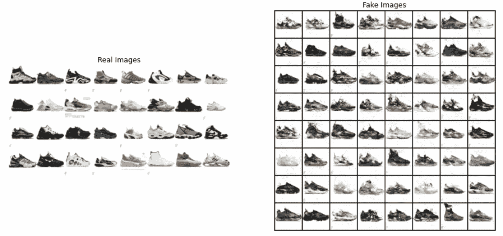

真假图像的比较

# **结论**

与 GAN 的其他变体相比，DCGAN 相对更容易理解，这是它真正受欢迎的原因，除此之外，它也很有效。与以前的 GANs 变体相比，它克服了多重障碍。

PyTorch 特别让玩 DCGAN 变得简单有趣！

# 作者

> ***苏迪普达斯****:*[***https://www.linkedin.com/in/sudeepdas27/***](https://www.linkedin.com/in/sudeepdas27/)