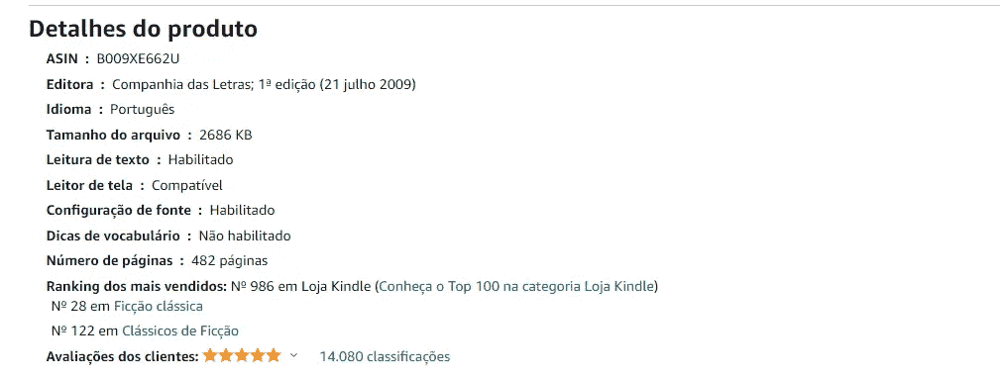
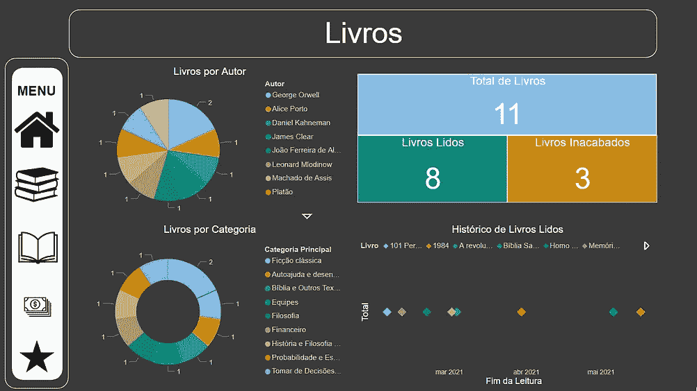
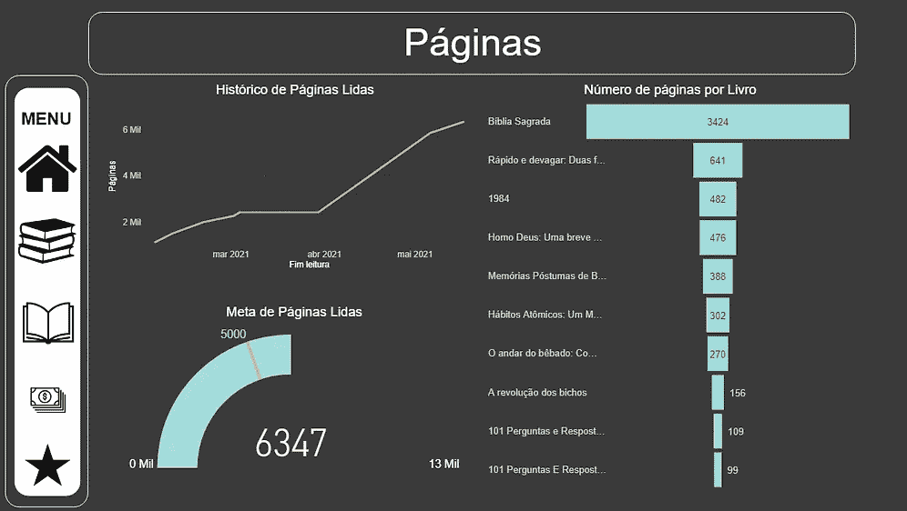
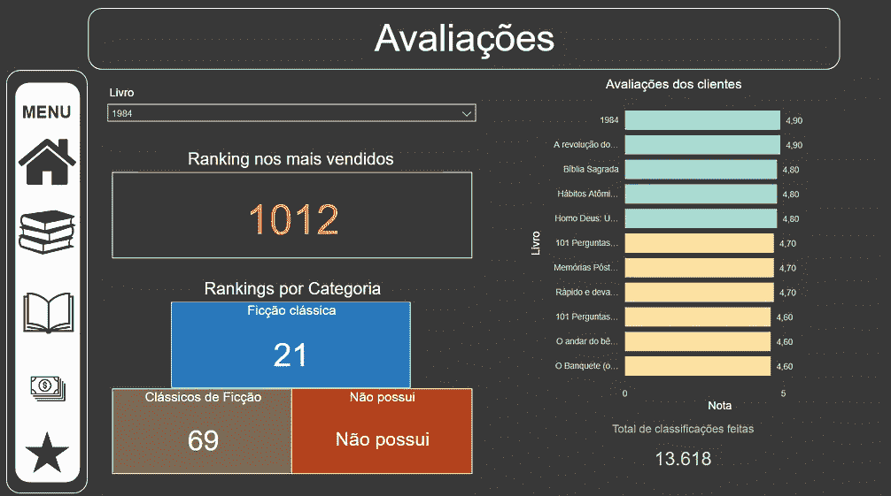

# 废弃亚马逊网站的图书信息

> 原文：<https://medium.com/nerd-for-tech/scrapping-amazon-website-for-book-information-7ed494197acd?source=collection_archive---------9----------------------->

苏珊·Q·尹在 [Unsplash](https://unsplash.com?utm_source=medium&utm_medium=referral) 上的照片

# **动机**

去年，像很多年前一样，我计划在即将开始的一年里实现一些目标。我的目标之一是**读**一定量的书，或者更准确地说，一定量的书页: **5000** 。

当我开始阅读的时候，我就开始思考我能做些什么来帮助我实现最终目标。首先，我想我可以填写一个 Excel 电子表格，然后将其加载到 **Power BI** desktop 中，以创建一些可视化效果，并获得一些关于我所阅读内容的见解。

考虑到我为我的 Kindle 购买所有的书，这是一件非常容易的事情，亚马逊的网页上有我可能需要的关于它们的所有信息，这只是将信息从书籍页面复制到电子表格中的问题。

然后，我开始思考如何挑战自己，只用书名和语言作为变量来自动完成这个过程。于是，我开始学习使用 **Python** 的 **Web 报废**和 **Web 抓取**。

[Alex Chumak](https://unsplash.com/@ralexnder?utm_source=medium&utm_medium=referral) 在 [Unsplash](https://unsplash.com?utm_source=medium&utm_medium=referral) 上拍摄的照片

# **第一步:网页抓取**

Python 有很多库来做很多不同的事情，这是这种语言如此受欢迎的原因之一。在这个项目中，我使用了 **Selenium** 库来执行**网页抓取**。

Selenium 是一个有很多功能的库，它可以用来自动化很多信息收集过程。在这个特别的项目中，我用它来:

*   打开亚马逊的网页；
*   将搜索类别更改为 Kindle 商店；
*   在搜索栏中传递书名和语言；
*   根据用户的分数对结果进行排序；
*   在结果列表中找到正确的书。如果这本书不在第一个列表中，我会跳到下一页，直到找到正确的书；
*   最后，获取页面书的 html，包含我需要的所有信息。

所有这些都是使用**前端**中的一些基础知识来完成的，以便能够找到正确的元素。

好了，现在我有了包含数据的 html，接下来呢？

马库斯·温克勒在 [Unsplash](https://unsplash.com?utm_source=medium&utm_medium=referral) 上的照片

# **第二步:**卷筒纸报废

一个网页的 html 包含了大量的信息，特别是像亚马逊这样的流行网站。为了帮助我找到我需要的东西，我使用了另外两个库: **Beautiful Soup** 和 **lxml** 来从 htm 中抓取数据。

这些库有助于提高 html 的可读性，并帮助选择混杂在单词中的特定元素。有了它们，我可以获得我需要的所有书籍信息，比如作者、价格、页数、出版商等等。

亚马逊网站上的图书信息示例

现在，我只需要以一种易于使用的方式组织数据。如果你认为是熊猫，那你就对了。

照片由 [Elena Loshina](https://unsplash.com/@lena_pixl?utm_source=medium&utm_medium=referral) 在 [Unsplash](https://unsplash.com?utm_source=medium&utm_medium=referral) 上拍摄

**Pandas** 是 Python 中最著名的库之一。在保持令人愉快的外观的同时操纵数据的能力使它非常受欢迎。

我用它将所有书籍中的所有信息连接成一个数据框架。然后，我删除了一些在我的分析中没有用的列。

为了存储数据，我使用了安装在本地的微软 SQL 服务器，但是这一步是可选的，我这样做只是为了练习保存数据的新方法。csv 文件**提供了相同的结果**，Pandas 已经内置了一个函数，可以轻松地生成文件**。**

**这个项目的最后一部分，是**可视化**所有的数据，这样我就可以跟踪我的最终目标，同时也能了解其他很酷的事情。用于可视化的工具是 **Power BI** 软件。**

**因为我离实现我的目标还有点远，所以我用了一些我没读过的书来模拟一些数据。结果如下图所示。**

**每一页都显示了该项目的不同方面的信息。**

# ****结果****

****************

**第一个**(左上)**展示了关于我买过的书的更**宏观的观点**。我已经**读了多少本**，我已经**读完了多少本**，还有多少本**还在读**，以及这些书的**类别**和**作者**以及显示每本书何时完成的**时间线**。**

****第二个(右上)**显示项目的**财务方面**。**花了多少钱给**买书，**花了多少钱是明智的**(已经完成的书)，以及有多少钱可能是**追加购买的**(不会完成的书)。还显示了全年花费的时间表。**

****第三个(左下)**显示书籍的**页信息。全年**读了**多少页，每本书**有**多少页，还有一个米记**跟踪我今年设定的目标**。****

**最后，**最后一个面板(右下角)**显示了亚马逊 Kindle 商店的用户如何对这些书进行**评级**，它们在**最畅销排行榜**以及它们所属的**类别**中排名。**

****

# ****结论****

**这是一个非常有趣的项目，开始只是作为记录我今年阅读页数的一种方式，最终却传递了很多我起初没有想到的额外信息。**

**所有带有解释的代码和使用的库的链接都可以在我的 **Github** 中找到，我会在下面留下链接。**

**[**GitHub 项目文件夹**](https://github.com/alerlemos/Projects/tree/main/Scrapping%20Amazon%20Website%20for%20Book%20Information)**

**希望你喜欢！任何建议和意见都非常欢迎。**

**谢谢！**