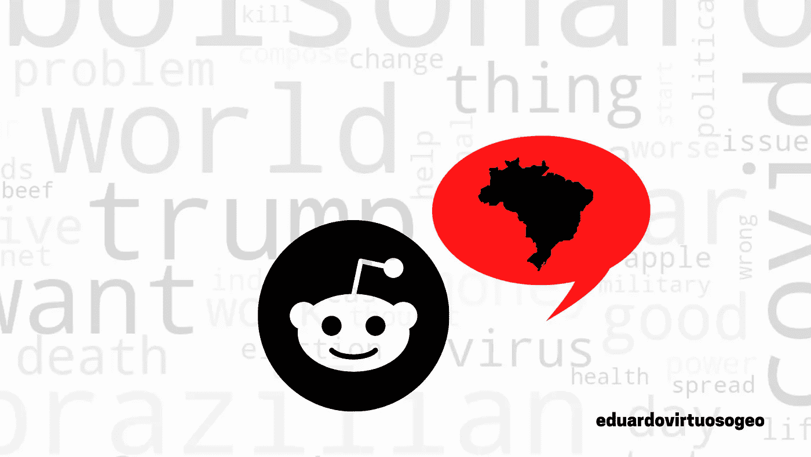
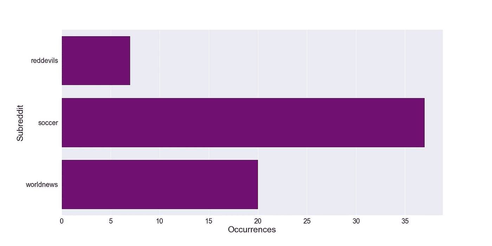
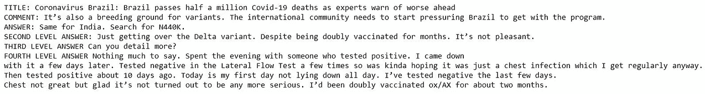
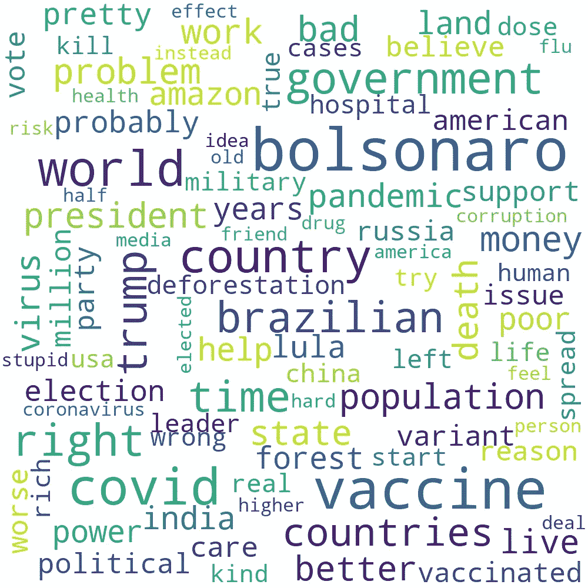

# 抓取 Reddit 创建一个关于巴西的文字云

> 原文：<https://medium.com/nerd-for-tech/scrapping-reddit-to-create-a-word-cloud-about-brazil-f5bb445bf6a6?source=collection_archive---------8----------------------->

最近，我受邀协助一项心理健康研究，在这项研究中，有必要从大量 Reddit 出版物中删除文本。这就是我如何发现 Praw 的，Praw 是“Python Reddit API Wrapper”的缩写，这是一个 Python 库，旨在使从 Reddit 提取内容和向 Reddit 提交内容变得容易。其实我就是这样发现 Reddit 本身的。我已经知道这个平台，但我不知道它有多大。

Reddit 是一个巨大的社交媒体，每月用户超过 400.000 万，活跃社区超过 130.000 个。它是由 subredditss 构成的，subreddit 是由用户自己创建和管理的讨论特定主题的论坛。

对于我之前评论的研究，我必须在子编辑 r/depression 中定位特定的单词。这给了我做以下练习的想法:在 Reddit 上搜索单词“Brazil”(英语单词，因为它在葡萄牙语中拼写为“Brasil”)，以查看国外社区对我们的评论。

我将在两篇文章中介绍这个练习。在这里的这篇文章中，我将展示我如何通过搜索子编辑来找出哪个子编辑有更多包含单词“Brazil”的帖子，然后提取帖子、评论和回复，并将它们保存到用于创建图形单词云的列表中。

在第二篇文章中，我将尝试对我从 subreddit 中提取的文本应用机器学习技术进行情感分析。如果你不知道 Reddit，我建议你花些时间去探索它，搜索你可能感兴趣的子主题和话题。这样做可以更容易理解这篇文章的后续步骤。

# PRAW

在开始使用 PRAW 之前，您必须拥有一个 Reddit 帐户，并且需要在以下地址创建一个 bot:

 [## reddit.com:登录

### 别担心，我们不会告诉任何人你的用户名。登录您的 Reddit 帐户。

www.reddit.com](https://www.reddit.com/prefs/apps) 

因此，你需要点击**创建另一个应用**，并确保你标记了**脚本**选项。填写空白处，然后你会收到一个**客户 id** 和一个**秘密令牌**，把它们保存在某个地方。

## 搜索最频繁出现的子记录

首先，我们需要导入库:

*   **Praw** :用于提取 Reddit 帖子。
*   **熊猫**:用于操纵数据。
*   **Numpy** :用于支持多维数组和矩阵。
*   **Pil** :影像库。
*   Nltk:一个 NLP 库。这里我们将只使用它来管理停用词。
*   **Wordcloud** :创建和定制我们的云所必需的。
*   **Gensim** :用于 ML 和统计应用，在这里管理停用词。

现在，我们将使用 **Praw 连接到 Reddits。**你需要**客户端 id** 和**密钥。**

## WHE 打算用 SUBREDDIT 来定义搜索

为了定义我们的目标子编辑，我们将在所有子编辑中搜索我们的关键字“Brazil ”,我们使用出现次数更多且不太臃肿的子编辑进行搜索。

为此，我们创建一个表示所有子编辑的变量(**all _ subreddit**)，并使用它来搜索我们的关键字，遍历变量元素(子编辑)和**，将**的名称添加到一个名为 **subreddit_list** 的列表中。

可能会检索一个列表，如下图所示，但是有超过 200 个子条目。

**['selfie '，' antimeme '，' transpositive '，' sehnsuchtpics '，' aww '，' BrasilOnReddit '，' GachaClub '，' softwaregore '，' Cringetopia '，' science '，' COVID19 '，' Basil_cult '，' lgbt '，' unexpectedsimpsons '，' worldnews '，' UFObelievers '，' worldnews '，' NoNewNormal '，' Brazil']**

这个列表显示了我们找到关键字的子编辑。然而，这是一个很大的列表，包含一些子条目，用来讨论更具体的话题，比如足球和金融话题，这些话题我们不感兴趣。我们需要更普通的东西。

因此，我们使用来自 **Pandas** 库的 **groupby** 函数和 **loc** 函数来过滤出现次数较多的子记录。之后，我们将尝试识别最普通的子编辑。

现在我们用 **Seaborn** 绘制分组变量:

从上面这三个子主题来看,**世界新闻**似乎最适合我们的练习。那是我们正在使用的一个

## **在 R/WORLDNEWS 子编辑中搜索**

现在我们将创建并执行一个函数来提取 PRAW 的文本:

在**错误列表**上，我在我们有错误的地方添加了帖子来检索文本。在**阅读列表**上，我附加了文本，指明它是否是标题、帖子、评论或回复的一部分。在 **raw_list** 上，我添加了没有引用帖子相应部分的文本。

为此，我创建了一系列循环来遍历标题、帖子、评论和回复。，将字符串追加到列表中。

让我们将 **raw_list** 和 **reading_list** 保存在两个不同的文本文件中，我将在本出版物的第二篇文章中使用它们。

如果你打开 **readinglist** 文本文件，你会看到这样的结构:

这种结构是为了便于阅读而组织的。然而，对于我们的 NLP 项目，原始数据更有用。这就是为什么我创建了两个不同的文件。

# 创建我们的词云

为了创建单词云，我使用了库 word cloud 和库 Nltk 和 Gensim(后两个是创建我们的停用词表所必需的)。

在自然语言处理( **NLP** )中，我们需要去除句子中只用作连接词的无用单词(如“the”、“is”、“本身”、“my”)。它们被称为停用词。

在本文中，我们将从两个不同的库中导入两个不同的停用词表， **Nltk** 和 **Gensim** 。将它们结合起来是改善我们结果的好策略。

在我们创建 wordcloud 之前，我们需要将 **raw_list** 转换成一个字符串。此外，将所有文本转换为小写也是一个很好的做法。这样做我们肯定会得到更好的结果。

我们还必须创建停用词集，用 Gensim 和 nltk 中的列表更新它(在这一步中，我还用我在云中找到的一些脏话进行了更新)。

现在，我们终于可以创建我们的云了。我们可以用 **matplotlib** 来可视化。

瞧啊。我们到了那里，这里是云这个词！这是一个包含从 subreddit Worldnews 中提取的超过 1000 页文本的汇编的图形表示。

有许多不同的方法来定制它。您可以通过阅读库文档来检查它们。

 [## WordCloud for Python 文档- wordcloud 1.8.1 文档

### 在这里你可以找到如何用我的 Python wordcloud 项目创建 wordcloud 的说明。与其他词云相比…

amueller.github.io](https://amueller.github.io/word_cloud/) 

# 最终意见:

好了，现在我们用 Reddit 数据完成了练习的第一部分。如果你看一下 cloud 这个词，你会发现一些通常在国际媒体上谈论或写巴西时看到的词。

作为一个巴西人，看看外国普通人写的关于我的国家的东西是很有趣的。我知道这不一定代表巴西的国际形象。但是这个 90 个单词长的图表综合了超过 1000 页的外国人提到巴西的文字，当然也告诉了 Reddit 公众对这个国家的看法。

你也可以通过阅读我们创建的 reading_list 文本文件来欣赏文章。

在下一期出版物中，我们将尝试使用相同的数据集进行情感分析。我希望你喜欢它。