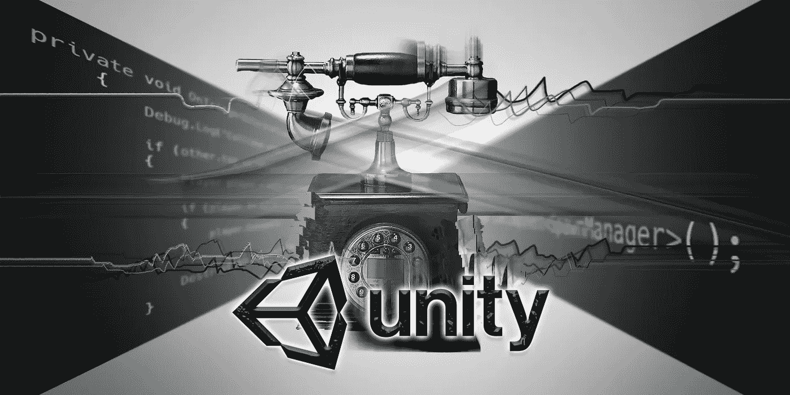

# 使用 GetComponent 编写 Unity 中的通信脚本

> 原文：<https://medium.com/nerd-for-tech/script-communication-in-unity-using-getcomponent-242cbea403af?source=collection_archive---------4----------------------->

好了，让我们来谈谈最重要的**之一**也是更难理解的游戏编码概念:脚本交流。在 Unity 中，这可以通过使用 **GetComponent** 来完成。变换，碰撞，刚体和脚本都是游戏对象的组成部分，也是一些最常用的。