# 使用 GetComponent 编写 Unity 中的通信脚本

> 原文：<https://medium.com/nerd-for-tech/script-communication-in-unity-using-getcomponent-2eaaea4c49d0?source=collection_archive---------10----------------------->

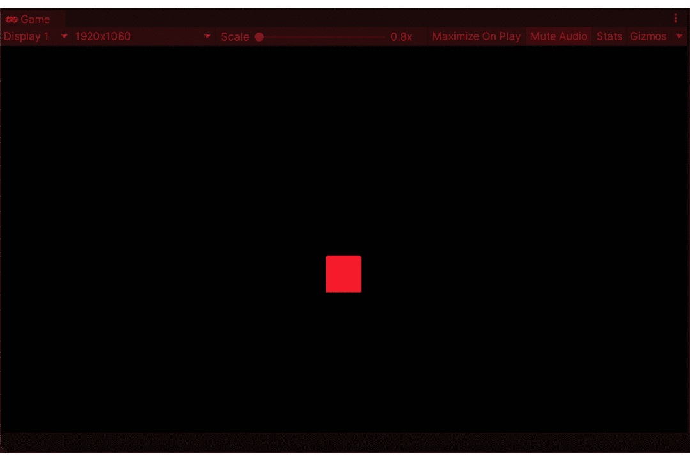

从前面的文章中，我们知道了如何给游戏对象添加一个行为。但是是时候我们学习如何改变或影响其他游戏对象的行为了。

但是在我们继续之前，让我们看看我们的玩家游戏对象。

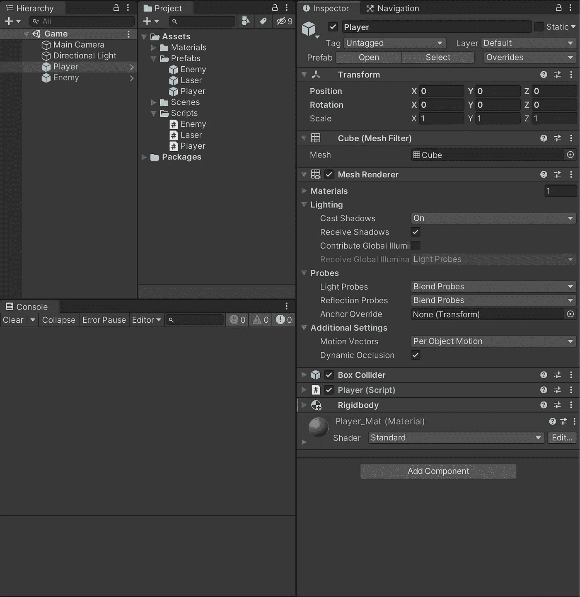

在**检查器**窗口中呈现的一切就是我们所说的**组件，**从**变换**到**网格渲染器**到**播放器(脚本)**甚至**刚体**。

***第一阶段:***

让我们从为玩家**创建一个其他游戏对象可以影响的方法开始。**

变量 health 是序列化的，因此我们可以通过编辑器更改它的值。

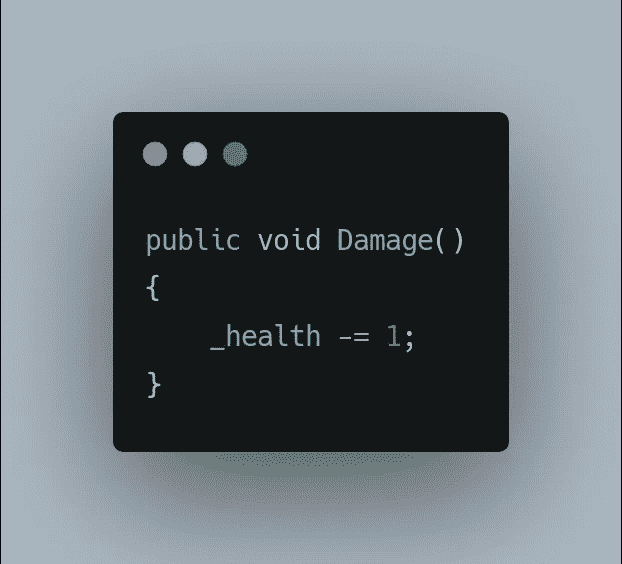

这里， **Damage()** 是公开的，因为我们希望其他脚本/类可以访问它。还有，“ *x -= 1* ”是“ *x = x - 1* ”的简称。

***二期:***

让我们改变[敌人的行为](/nerd-for-tech/simple-enemy-behaviour-in-unity-b38f88009635)，这样一旦接触到**玩家**游戏对象，它就会对**玩家**造成伤害。

为了实现这一点，我们必须在我们的 **OnTriggerEnter()** 中添加以下内容，

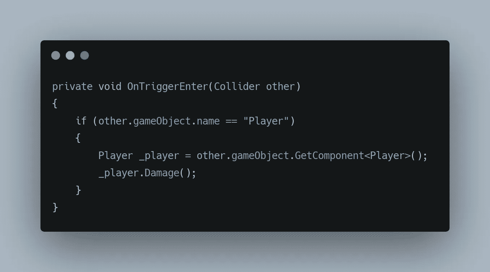

这里的“其他”存储了与触发器接触的碰撞器的信息

其中， **_player** 是对 **Player** 类型数据的引用。所以项目中的每个组件从技术上来说都是一个**类型的**数据。

**other.gameObject** ，这表示包含碰撞器的游戏对象，该碰撞器参与了与**触发器的碰撞。**

现在我们有了游戏对象，我们只需要引用我们需要的组件，这是在 **GetComponent()的帮助下完成的。**由于我们需要 **Player (Script)** 组件，我们可以将 **Player** 作为组件传递，

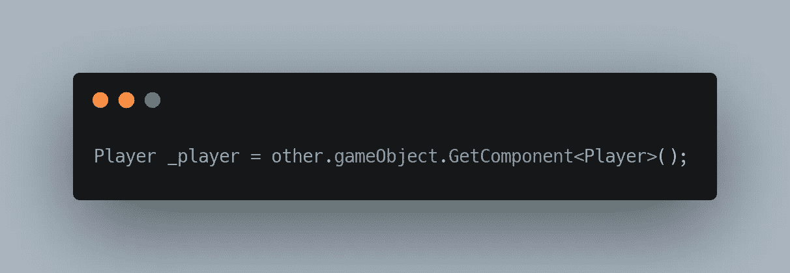

例如，假设您想要引用 **MeshRenderer** 组件，我们可以创建一个 _meshRenderer 变量来存储 **MeshRenderer** 类型的数据，

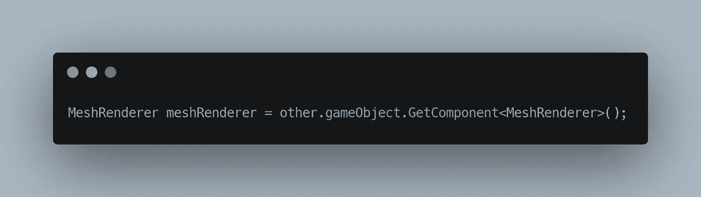

有了这个，我们可以访问**播放器**组件，我们可以访问它的所有公开声明。**伤害()**是我们要影响**、**的方法

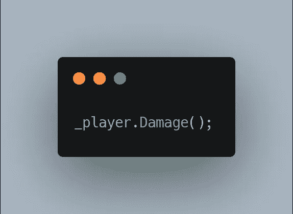

只有当我们的游戏对象的名字与我们的**玩家**游戏对象的名字匹配时，所有这些才会被调用，这就是为什么我们在 **if** 语句中添加了条件。

***第三期:***

现在我们已经在**玩家**和**敌人**游戏对象之间建立了通信。让我们给我们的玩家游戏对象添加一个逻辑，当游戏对象的生命值达到 0 时，我们就销毁它。

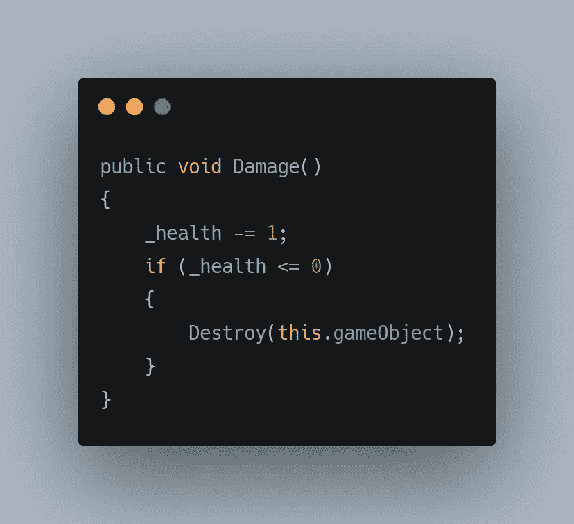

将此添加到您的玩家脚本中

一旦你的**玩家**游戏物品的生命值达到 0，它就会被摧毁。

并且还增加了敌人在相互接触时识别激光游戏对象的方法。

一种方法是使用，

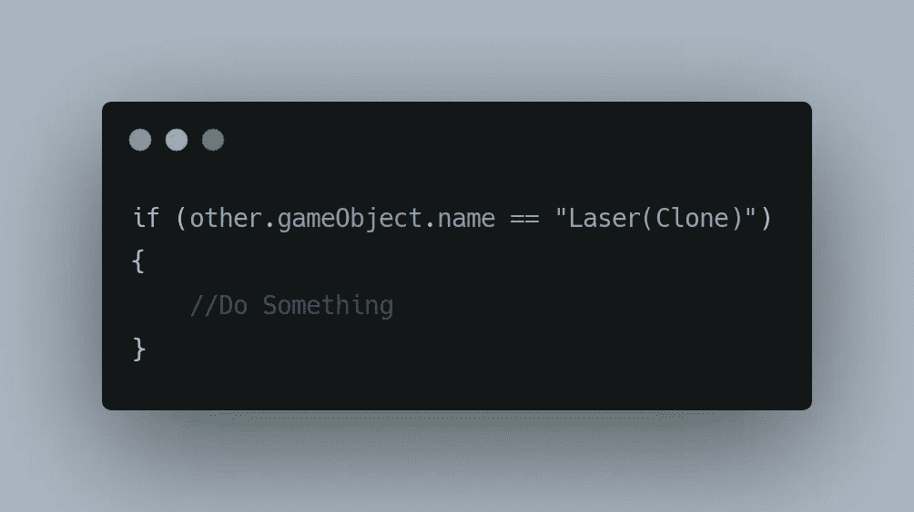

最好的方法是使用**标签。**

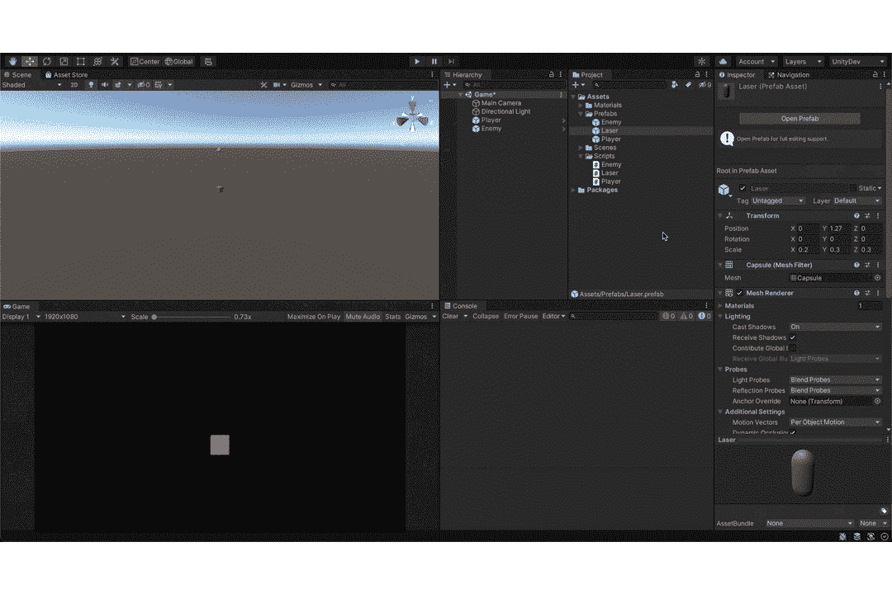

这样，激光组件现在有了一个激光标签。可以通过执行以下操作来访问它，

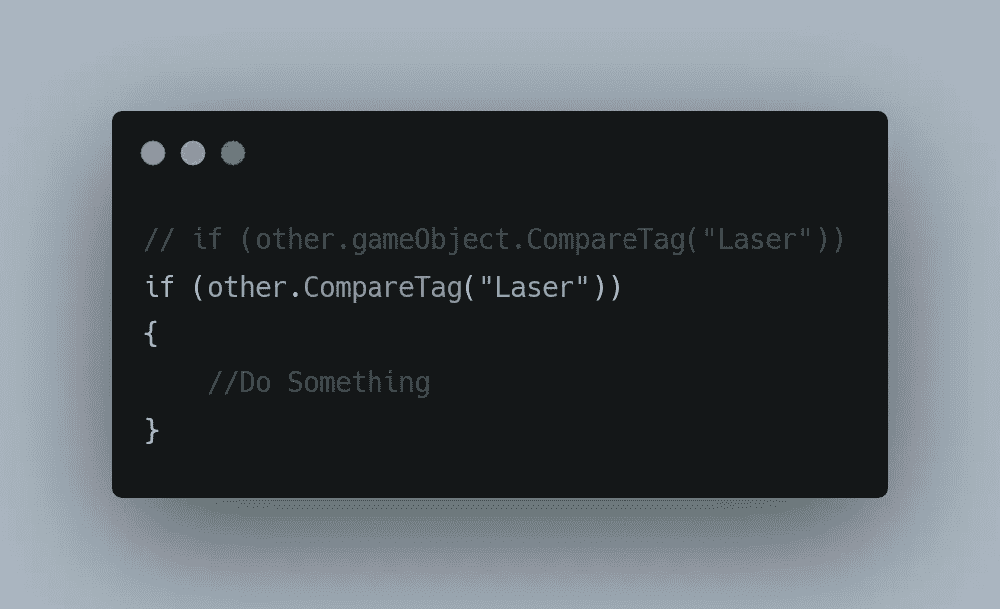

两个都是。CompareTag()和 other.gameObject.CompareTag()在处理触发器时功能相同。

最后，让我们添加一个检查来避免 **NullReferenceException，**这是一个运行时异常，通常在试图引用未初始化的变量或引用任何对象时发生，当它发生时，它被视为 **null，**这在运行时给我们带来了 **NullReferenceException** 。

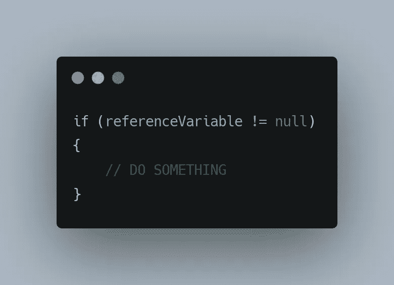

最终结果如下所示，

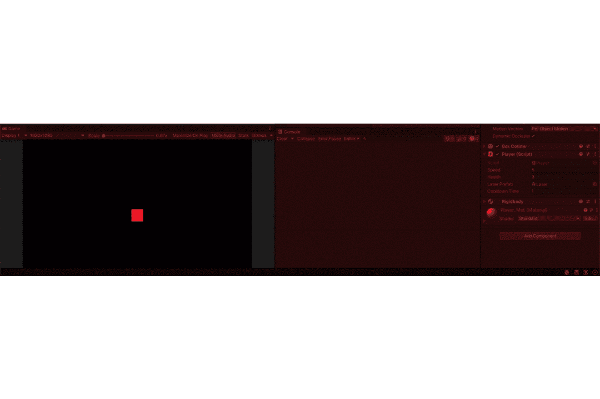

为了实现这种行为，使用了以下逻辑，

玩家伤害逻辑，

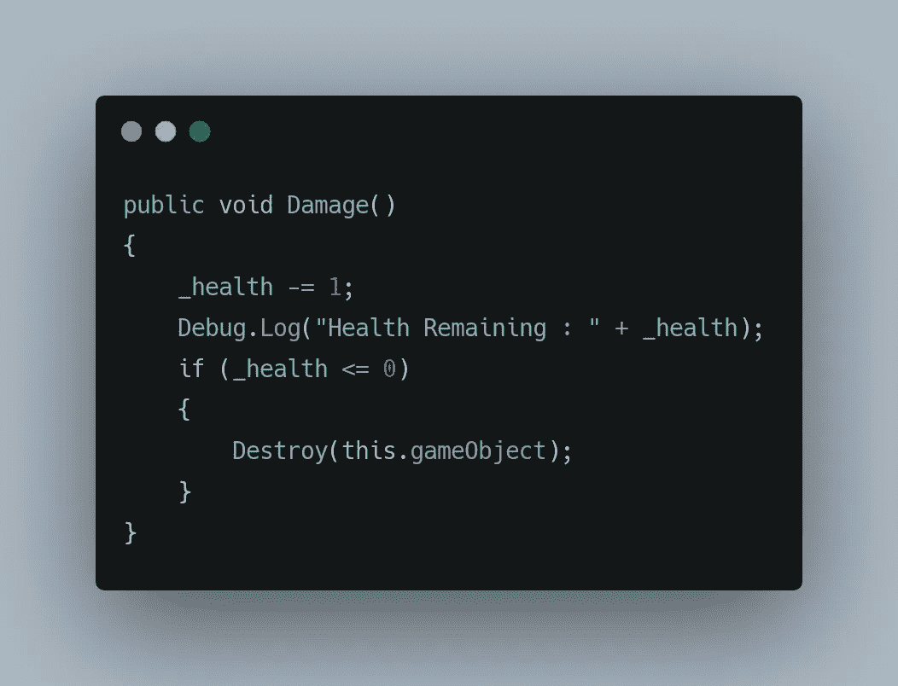

玩家脚本

敌人摧毁逻辑，

敌方脚本

更多即将推出！！！