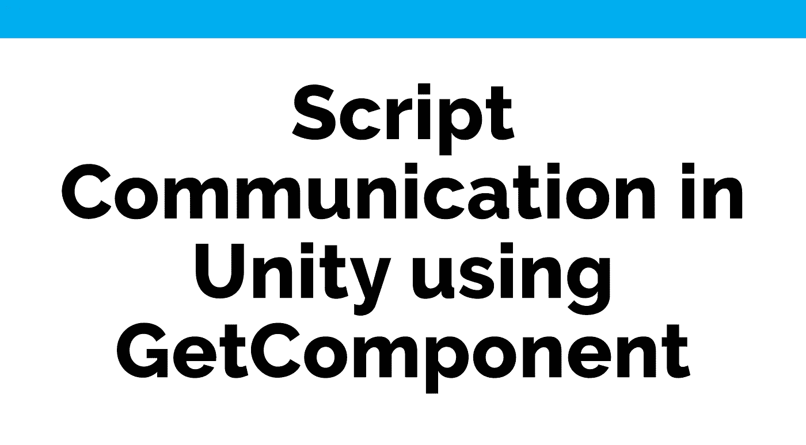
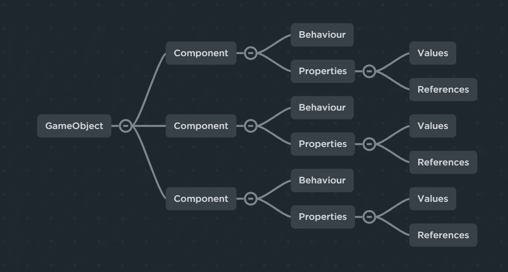
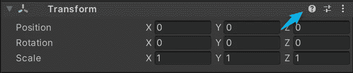
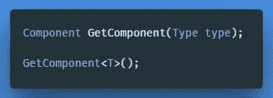
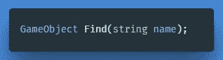
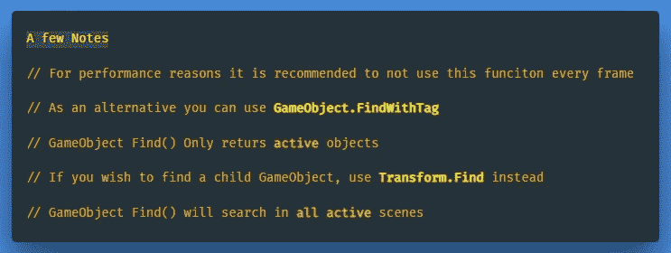
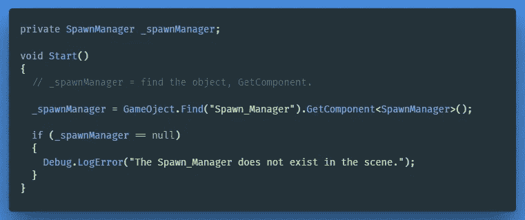
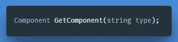

# 使用 GetComponent 编写 Unity 中的通信脚本

> 原文：<https://medium.com/nerd-for-tech/script-communication-in-unity-using-getcomponent-45fba58f322a?source=collection_archive---------12----------------------->

组件是所有游戏对象的基类。

它定义了游戏对象的每个方面及其行为。基本上任何附加到游戏对象上的脚本都会编译成一种*组件*。

然而，如果我们只想存储数据，我们可以创建一个名为 **ScriptableObject** 的可访问类，这个类*不直接与游戏对象*关联。我们稍后肯定会对此进行调查，但如果您希望了解更多信息，请点击此处。

如果您想了解更多关于使用某个特定组件的信息，您可以随时点击**中的小图标来访问组件的参考页面。**在检查器中的组件头上。

> **提示:**当使用**复制组件** t 命令时，组件的类型和当前属性设置被保存。这些可以通过**粘贴组件值**粘贴到同类型的另一个组件中，也可以通过**粘贴组件为新** *创建为一个新组件，并带有各自的值和设置。*最近以来你还可以分别复制粘贴位置、旋转和缩放。

# **脚本通信**

**GetComponent()**

Unity 为我们提供了一个方法，返回我们想要获取的游戏对象的组件，以便访问它的属性或行为。

如果游戏对象有一个附加的组件，则返回类型为' **type** 的**组件**，如果没有，则返回“ ***null*** ”，包括禁用的游戏对象。

声明和一般声明

使用示例

**游戏对象。Find()**

为了在一个**不同的**游戏对象上获得一个组件，我们可以使用 ***游戏对象。找到*** 来获得另一个游戏对象的引用，然后使用 ***游戏对象。GetComponent*** 。

通过**名称**找到游戏对象并返回

这对于在加载时自动连接对其他对象的引用很有用，例如在 Monobehaviour 的***【Awake()***和 ***Start()*** 方法中。通常我们在启动时将结果缓存在一个成员变量中，并让它的函数代码在 ***Update()*** 方法中运行。

在下面的文章中，我们将添加一个产卵管理器来协调我们敌人的产卵，我们将开始利用 ***游戏对象。*** 寻找()【方法:

永远记得做一个*零点检查。*

在某些情况下，我们将不得不使用 ***GetComponent()*** 方法的变体，通过**名称**而不是**类型**来访问组件，但是出于性能原因，最好避免使用带有字符串的 GetComponent。

> **提示:** **组件。GetComponent** 将返回找到的第一个组件，没有任何特定的顺序。如果你期望有多个相同类型的组件，使用**组件。取而代之的是 GetComponents** ，并通过获取一个唯一的属性来遍历返回的组件。

在本文中，我们已经了解了 Unity 的组件系统，以及如何通过脚本与它们交互。在下面的文章中，我们将通过添加一个种子管理器来处理我们的敌人，掉落，加电等等，来实现这个逻辑。

← [上一张](/nerd-for-tech/oncollisionenter-vs-ontriggerenter-when-to-use-them-37b08f3249a5) | [下一张](/nerd-for-tech/spawn-manager-a7c0e6446b2a) →