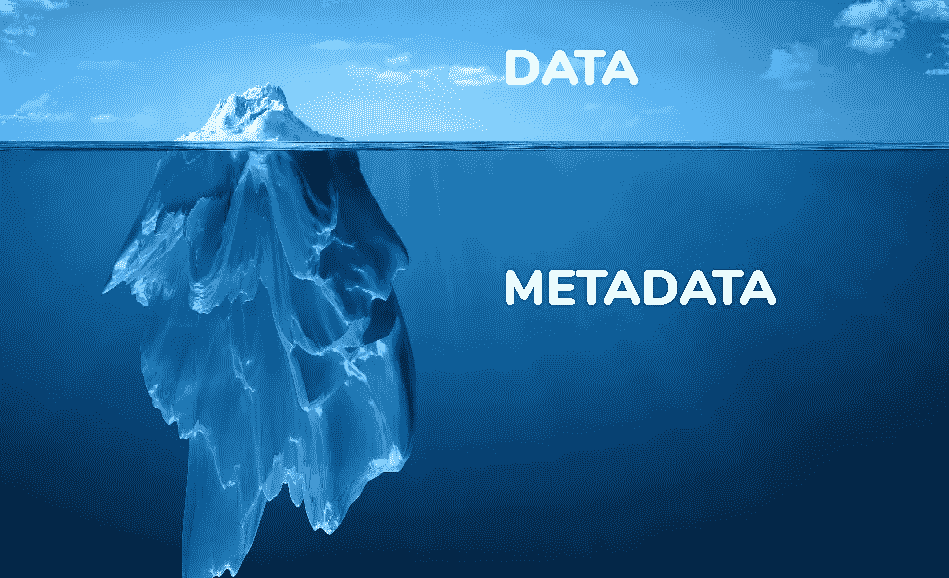
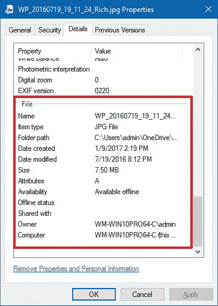

# 使用 Python 和 Pillow 库提取图像元数据的脚本。

> 原文：<https://medium.com/nerd-for-tech/script-to-extract-image-metadata-using-python-and-pillow-library-53a6ae56ccc3?source=collection_archive---------0----------------------->

“数据是新的石油。”

信用:[https://zeenea.com/](https://zeenea.com/the-role-of-metadata-in-a-data-driven-strategy/)

# 那么什么是元数据呢🤔？

**元数据**是提供其他数据信息的*数据。简单地说，关于数据的数据就是元数据。元数据有多种用途。它帮助用户查找相关信息和发现资源。*

> "任何系统的好坏都取决于它所吸收的元数据."
> ― **克里斯·布洛克**

我希望元数据这个术语现在已经很清楚了，现在来看图像元数据部分…每当你用数码相机或智能手机拍照时，都会记录大量的**隐藏数据**。

**照片元数据**是描述和提供关于图像的权利和管理的信息的一组数据。这个数据也被称为 **EXIF 元数据。**

以下是图像元数据的一个示例:

红框部分是图像元数据。

我们必须首先安装 Python Pillow Imaging 库:增加了对打开、操作和保存许多不同图像文件格式的支持。您可以使用“ *pip install pillow* ”下载它，或者在基于您的操作系统的文档中查看它。

**我也将很快在**[**geeks forgeeks**](https://www.geeksforgeeks.org/.)**上发表。**

这是代码:

P.s .不要忽略评论。

> 谢谢大家！😇