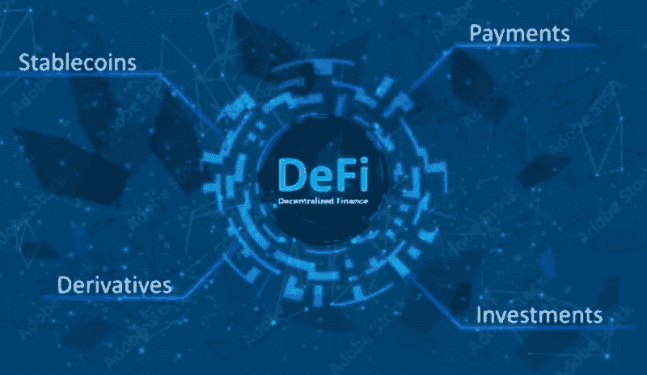

# 脚本你自己的 DeFi 贷款和借款与最好的 DeFi 开发公司

> 原文：<https://medium.com/nerd-for-tech/script-your-own-defi-lending-and-borrowing-with-the-best-defi-development-company-a2fa853ef5e1?source=collection_archive---------2----------------------->

**叙述债务借贷的主要特征是什么？**

在 DeFi 的帮助下，DeFi 借贷平台提供了一种简单的借贷方式。在当今世界，他们正在成为其中的佼佼者。如果你开始开发 DeFi 借贷平台，你会看到更好的结果。

**DeFi 借贷平台建设必备的功能**

在使用这项服务之前，用户必须首先拥有一个加密货币钱包。因此，网站支持的钱包列表是必要的。

在开始之前，决定你的站点需要哪些集成。以下是最基本的功能。

**闪贷**

无抵押贷款是快速贷款的一个例子。随着 DeFi lending services 的兴起，这一功能变得越来越受欢迎。

用户可以在不提供任何担保的情况下借钱。另一方面，这些贷款有一个固定的期限，如果用户没有在规定的时间内付款，贷款将被立即取消。

智能合同控制着这一过程，如果不满足某些条件，它会阻止资金转移。

因此，借款人负责偿还贷款并完成交易。如果出现这种情况，智能合同将取消贷款。

**速率切换**

加密资产市场本质上是不稳定的。结果，用户将欣赏改变费率的能力。

用户可以通过选择固定利率和可变利率来保护自己免受市场波动的影响。这个功能会让借款人更有安全感。

**菲亚特网关**

它使用户能够在法定货币的帮助下购买数字资产。他们会访问第三方网站，而不是被网站的复杂性所吓倒。

该功能改善了用户体验，同时也满足了客户的需求。它还能让新用户轻松入门。

**投资回报**

给予用户合理的投资回报是鼓励他们提供资金进行借贷的一种方式。贷方将这些平台视为以被动方式从加密资产中获利的一种方式。

考虑为贷款人创建各种激励计划，鼓励他们在网站上进行长期投资。

在 DeFi 发展公司的帮助下，DeFI 借贷变得很容易。