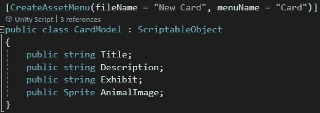
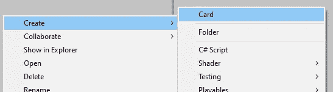
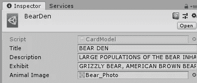
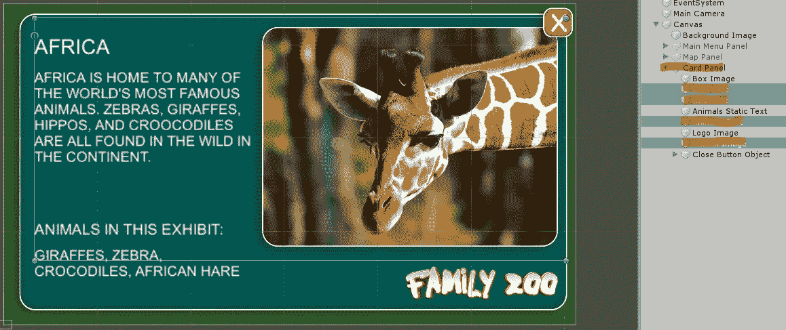
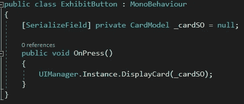
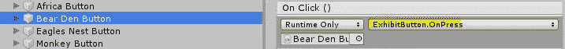
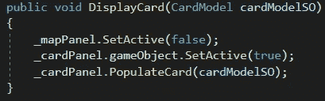
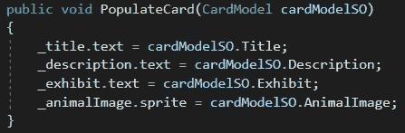
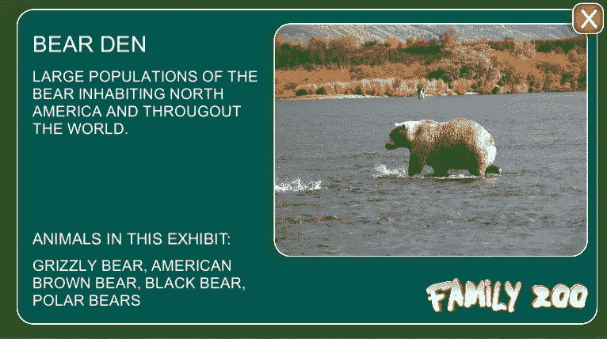

# Unity 中的可脚本化对象

> 原文：<https://medium.com/nerd-for-tech/scriptable-objects-in-unity-6ccdc218c81b?source=collection_archive---------3----------------------->

**目标:**使用可脚本化的对象填充一个游戏对象模板。

我们的任务是为参观动物园的游客创造一个互动环境。当用户点击地图上的某个区域时，我们会显示一张卡片，上面有适用于该区域的动物和事实。

想象一下如果我们有 50 件展品。为每个人创建一个页面需要做大量的工作。幸运的是，我们可以创建一个模板并使用可脚本化的对象来填充它！

我们的*可脚本化对象*定义非常简单:三个字符串保存文本信息，一个 sprite 保存图片。我们所有的*可脚本化的对象*都将包含这些字段。从*【CreateAssetMenu…*开始的第一行将允许我们使用 Unity 的编辑器通过这个模板创建*可脚本化的对象*。

在资产菜单中有我们的卡片项目！

我们将创建一张新卡，并将其命名为*比尔登*。然后我们简单地填写字段。

这是我们的卡片面板模板。*标题文本*、*信息文本*、*动物文本*、*动物图像*对象将由我们的*可脚本化对象*填充。

这是我们的展示按钮脚本。当按钮被按下时，将调用 *OnPress* 方法，将我们的可脚本化对象传递给 *UIManager* 的 *DisplayCard* 方法。

这是我们的熊窝按钮。我们可以看到*展示按钮。OnPress* 方法与之连接。

这里是 *UIManager* 的 *DisplayCard* 方法。它关闭地图面板，启用卡片面板，并调用卡片面板的 *PopulateCard* 方法，传入我们的可脚本化对象。

我们解决方案的最后一部分是卡片面板的 *PopulateCard* 方法。它接受可脚本化的对象，并将每个字段分配给其子对象。

这是我们完成的熊穴卡！

