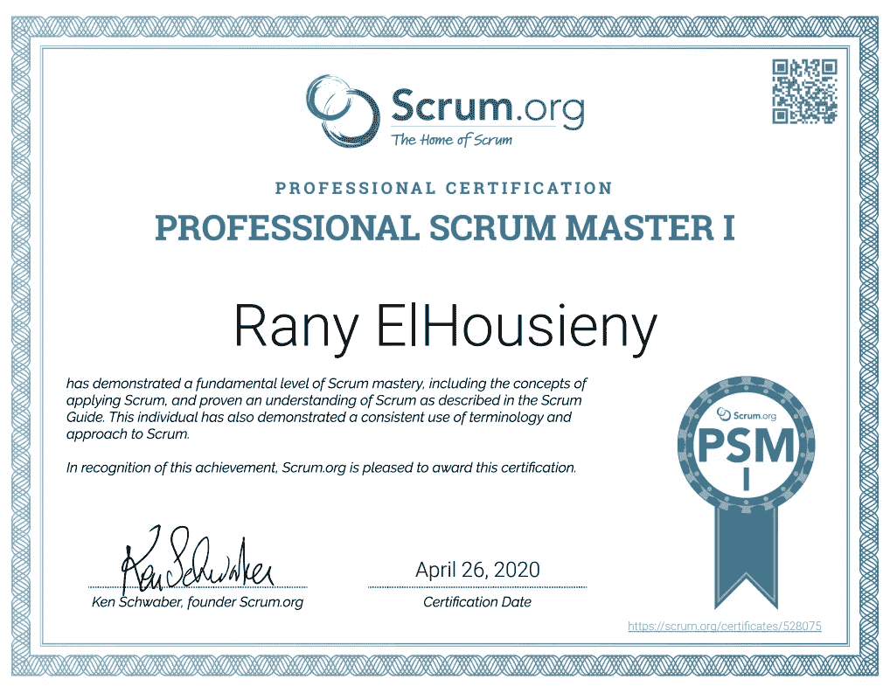

# Scrum 和建立高效的自我管理团队

> 原文：<https://medium.com/nerd-for-tech/scrum-and-building-high-performing-self-managed-teams-996bc50ab91b?source=collection_archive---------6----------------------->

18 年前(2003 年)，我向微软([https://lnkd.in/gJy2GUJ](https://lnkd.in/gJy2GUJ))介绍了 Scrum 和敏捷，并赢得了金星奖。使用 Scrum，我能够发布一个使用瀑布不可能发布的产品。我能够引入培训并帮助团队建立流程。从那时起，我就一直在练习 Scrum，这成了我的第二天性。然而，在微软，我们没有一个专门的 Scrum Master 角色，并且很容易随着时间的推移偏离最初的 Scrum。

当我离开微软加入 APFM 时，我很幸运能和不同团队的 scrum 专家一起工作。我注意到我们可以很容易地偏离最初的 Scrum 原则来适应不同的情况。因此，我决定让其中一个团队使用纯 scrum，并指派最有天赋和经验的 scrum 大师 [**安德烈斯·帕拉维契尼**](https://www.linkedin.com/sharing/share-offsite/?url=https%3A%2F%2Fapi.badgr.io%2Fpublic%2Fassertions%2FVPy3zwAKQOKDmUKeOmU4VA%3Fidentity__email%3Dranyel%2540msn.com) 。我一直在保护这个团队不受外部干扰和变化的影响，使他们能够做到最好。该团队被评为表现最佳的团队，尽管面临各种挑战，但仍能够交付复杂且具有挑战性的项目。由于 Scrum 的主要目标是拥有一个自我管理的团队，这个团队成为了一个能够克服所有挑战并一次又一次超越期望的自我管理的团队。

让我们来认识一下获奖的最佳 Scrum 团队:

[**安德烈斯·帕拉维奇尼**](https://www.linkedin.com/sharing/share-offsite/?url=https%3A%2F%2Fapi.badgr.io%2Fpublic%2Fassertions%2FVPy3zwAKQOKDmUKeOmU4VA%3Fidentity__email%3Dranyel%2540msn.com) **(Scrum Master)**

[**亚历克斯·阿尔塔维亚·埃雷拉**](https://www.linkedin.com/in/ACoAAAzuyWoBOLBwlx9ZbmAyPcVTO5XFe51y4IE/) **(产品负责人)**

## 开发团队:

[**【卡洛】**](https://www.linkedin.com/in/ACoAABbYbL8BkNbKWu_CLyJXhb_VA5GoYnUV0Ps/) (引者)

[**劳伦斯·奥尔蒂斯·巴迪利亚**](https://www.linkedin.com/in/ACoAAAcwuVMBlkgjJO3Q2tNUpBBDVh5NU4N4sI8/) (全栈)

[**迪迪埃科拉莱斯**](https://www.linkedin.com/in/ACoAAAYqYoQBp70VK3Ycc59fclefiLk2IRdjwl0/) (问答)

[**艾萨克**](https://www.linkedin.com/in/ACoAAAV7WN8BDRy2uGcxiNlNjhkQ4G0lRzyHg2E/) (前端)

当我加入 Zulily 的时候，我发现了一个很好的机会来应用我在没有 Scrum Masters 的时候学到的东西。因此，我决定刷新一下我的记忆，参加 2020 年新 Scrum 认证考试，以便在一头扎进去之前建立 Scrum 规则。大多数组织只将 Scrum 术语应用到同一个瀑布过程中，这导致了一个不确定的过程。Scrum 已经在数百万个成功的项目中得到测试和体验。任何偏差都需要研究和实验，然后才能假设它会起作用。Scrum 使团队能够自我管理和自我组织，这是拥有高绩效团队的最佳方式。根据 Scrum 指南，“ ***虽然只实现 Scrum 的一部分是可能的，但结果不是 Scrum。***

*2020 年 4 月，我成为了官方认证的专业 Scrum 大师，开始了我与最好的 Scrum 团队的旅程。*

* [## 兰尼·埃尔豪斯尼

### Rany ElHousieny Twitter Rany ElHousieny LinkedIn Rany ElHousieny GitHub

www.scrum.org](https://www.scrum.org/user/655750)  [## 证书

### 编辑描述

www.scrum.org](https://www.scrum.org/certificates/528075) 

**# PSM**# scrum master# scrum

[**Scrum.org**](https://www.linkedin.com/sharing/share-offsite/?url=https%3A%2F%2Fapi.badgr.io%2Fpublic%2Fassertions%2FVPy3zwAKQOKDmUKeOmU4VA%3Fidentity__email%3Dranyel%2540msn.com)

参考:

 [## “水-Scrum-fall”的阴险制度化

### 水球到底是什么，为什么你不应该靠近它…

medium.com](/@stefanedbrittain/the-insidious-institutionalisation-of-water-scrum-fall-4af7de8865b9) 

# 发布者

 [## 兰尼·埃尔豪斯尼，PhDᴬᴮᴰ -软件工程高级经理- Zulily | LinkedIn

### 𝙈𝙞𝙘𝙧𝙤𝙨𝙚𝙧𝙫𝙞𝙘𝙚𝙨解决方案架构师𝘼𝙒𝙎𝙎𝙤𝙡𝙪𝙩𝙞𝙤𝙣𝙨𝘼𝙧𝙘𝙝𝙞𝙩𝙚𝙘𝙩𝘾𝙚𝙧𝙩𝙞𝙛𝙞𝙚𝙙…

www.linkedin.com](https://www.linkedin.com/in/ranyelhousieny/) 

*原载于*[*https://www.linkedin.com*](https://www.linkedin.com/pulse/building-high-performing-self-managed-teams-rany-elhousieny-phd%E1%B4%AC%E1%B4%AE%E1%B4%B0/)*。*

 [## Scrum 和建立高效的自我管理团队

### 15 年前，我向微软介绍了 Scrum 和敏捷(https://lnkd.in/gJy2GUJ)并获得了金星奖。

www.linkedin.com](https://www.linkedin.com/pulse/building-high-performing-self-managed-teams-rany-elhousieny-phd%E1%B4%AC%E1%B4%AE%E1%B4%B0/)*