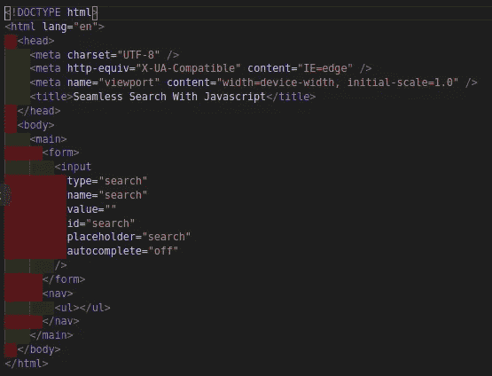
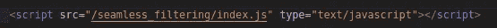
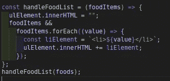
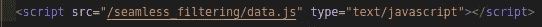
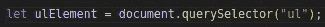
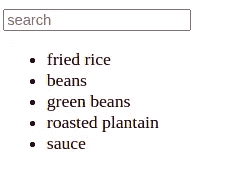
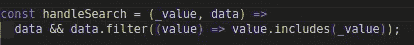
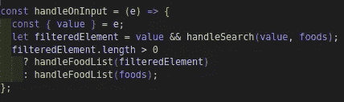
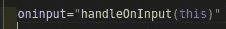

# 使用普通 JAVASCRIPT 进行无缝搜索

> 原文：<https://medium.com/nerd-for-tech/seamless-search-with-vanilla-javascript-e447c440ef59?source=collection_archive---------12----------------------->


内森·杜姆劳在 [Unsplash](https://unsplash.com?utm_source=medium&utm_medium=referral) 上的照片

作为一名 JavaScript 开发人员，你会同意我的观点，在构建应用程序时，有时需要从一组项目中进行 ***无缝*** 筛选。

我写这篇文章是为了让每个人都知道如何使用以下方式实现**无缝搜索**:

*   超文本标记语言
*   java 描述语言

在本文中，我们将了解:

*   Es6 函数/语法
*   如何从数组中筛选项目
*   最佳代码实践

接下来，我将指导我们如何使用 ***普通 JavaScript*** 来实现这个任务。我将使用 visual studio 代码作为我的代码编辑器。

让我们从创建一个包含 javascript 和 HTML 文件的文件夹开始。在终端上，导航到桌面文件夹并在其中创建文件，如下所示:

```
cd Desktopmkdir seamless_filteringcd seamless_filteringtouch index.html index.jscode .
```

这些将引导我们创建文件夹、文件，并在 visual studio 代码中打开文件夹。进入 HTML 文件并添加以下内容:



index.html

这显示了我们的 HTML 文件的布局。在其中，我创建了一个表单字段，它有一个输入字段和一个 nav 元素，我将在其中显示一个食品列表，我们将使用该列表进行无缝过滤。

接下来，让我们开始在我们之前创建的 index.js 文件中添加这个任务的逻辑。在 body 元素的结束标记之前，让我们添加一个脚本标记，它将允许我们的 js 文件在 HTML 文件上生效。



index.js 脚本

在 index.js 中添加以下内容:



handleFoodList

上面是一个将我们的列表项呈现到 DOM 的函数。一个参数(foodItems)被传递给了该函数——它保存了一个我们将呈现给 DOM 的食物数组。每当函数运行时，我们清除无序列表项以前的值，并用传递给 **handleFoodList** 函数的参数设置新值。

我们已经向 **handleFoodList** 函数传递了一个未定义的参数(foodItems ),让我们声明并定义保存数据的变量。与 react.js 不同，变量可以导出到任何组件。VanillaJS 有一种独特的方式来访问一个单独文件中的数据集合。

继续，在 seamless_filtering 文件夹中，创建一个名为 **data.js.** 的新文件，在其中添加以下内容:


食物收集

如果您已经这样做了，请打开 index.html 文件，在 index.js 脚本标记之前添加以下内容:



数据收集脚本

现在可以在 index.js 文件中访问食品集合。在 index.js 文件中，让我们将 ul 元素赋给一个变量，并将其设置在文件的顶层，如下所示:



无序列表引用

让我们看看我们的浏览器，看看我们走了多远。



食物清单

上面的屏幕截图显示了一个输入字段和所有食品的列表。我们一直在等待的大问题仍然是如何过滤食品。

在我们取得进展的同时，让我们创建一个函数，它总是返回在输入字段更新时找到的食物列表。



筛选找到的集合

这是一个仅根据输入值过滤找到的食物的功能。像 **handleFoodList** 函数一样，我们也向 **handleSearch** 函数传递了一个参数。这次我们传递了两个参数，第一个是我们将从输入字段获得的值，第二个是食物集合。

接下来，让我们创建一个函数来触发下面的搜索操作；



on 输入函数

每次更新输入字段时，都会调用这个函数。我从事件对象(this)中析构了输入值，将它作为参数传递给了 **handleSearch** 函数，第二个参数是食品集合。 **handleSearch** 函数返回找到的食物，并分配给要使用的 **filteredElement** 变量。

检查条件以了解是否找到食物。如果是，找到的食物作为 **handleFoodList 的当前参数传递。**如果没有找到食物或输入字段为空，我们将原始食物集合设置回列表。

在哪里调用了 **handleOnInput** 函数？在 index.html 中会调用 **handleOnInput** 函数。让我们进入该文件，用以下内容更新它:



关于输入函数

我使用了一个名为 **oninput** 的输入属性事件来触发 **handleOnInput** 函数，每当输入字段中有更新时。 ***这个关键字*** 是我们在上面的 **handleOnInput** 函数中构造的事件的值。

现在我们已经实现了这些，让我们看看我们在下面的 [***演示中构建了什么。***](https://res.cloudinary.com/hobbyluv07/video/upload/v1623937558/Screencast_from_17-06-2021_14_33_04_jivlid.webm) 这里的源代码可用[](https://github.com/chibuike07/seamless_filtering_vanillaJs/tree/main/seamless_filtering)***。***

*最后，我们已经到了本文的结尾，我希望每个人现在都可以构建一个应用程序，使用普通的 JavaScript 从集合中过滤一个项目。*

*如果这篇文章对你有帮助，别忘了点击拍手图标，分享这篇文章，关注我的 [***中的***](https://princewillchime43.medium.com/) 和[***Linkedin***](https://www.linkedin.com/in/chime-princewill-3a2b1b192/)以查看我的更多文章。*

*请放弃任何评论或建议。如果你有一个基于 JavaScript/React.js 生态系统的主题，请随时联系我，我很乐意就此进行写作。谢了。*