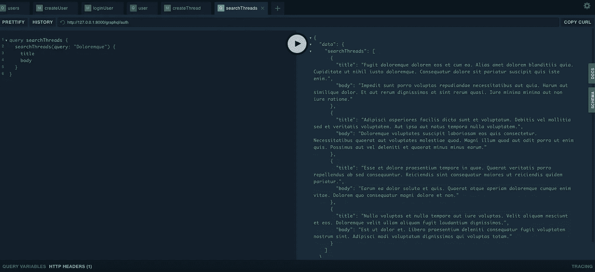

# 在线程中搜索 Laravel 中的论坛 GraphQL 驱动的 API 第 4 部分]

> 原文：<https://medium.com/nerd-for-tech/search-in-threads-forum-graphql-powered-api-in-laravel-part-4-ead4ed28b70f?source=collection_archive---------14----------------------->

为此，我们将使用 Laravel scout，但我们不会使用 Algolia 搜索引擎，我们将使用 MySql 作为驱动程序。

那么什么是拉勒维尔童军:

> Laravel Scout 提供了一个简单的、基于驱动程序的解决方案，为您的[雄辩模型](https://laravel.com/docs/8.x/eloquent)添加全文搜索。使用模型观察员，Scout 将自动保持您的搜索索引与您的雄辩记录同步。目前，侦察兵飞船有一个 [Algolia](https://www.algolia.com/) 驾驶员；然而，编写自定义驱动程序很简单，您可以自由地用自己的搜索实现来扩展 Scout。

## 什么是 MySql **全文搜索**

全文搜索是一种搜索不完全符合搜索条件的文档的技术。文档是包含文本数据的数据库实体，例如产品描述、博客文章和文章。

例如，您可以搜索`Water and Oil`，**全文搜索**可以返回单独包含所搜索单词的结果，只返回`Water`或`Oil`，或者返回包含顺序不同的单词的结果`Water and Oil`或`Water and Oil`。

## MySQL 全文搜索功能:

*   类似 SQL 的本机接口
*   完全动态索引—每当文本列的数据发生变化时，MySQL 都会自动更新该列的索引。
*   适度的索引大小——`FULLTEXT`索引的大小相对较小。

MySql 全文搜索是通过 **MATCH( )** 函数执行的:

```
SELECT * FROM threads WHERE MATCH (title,body) AGAINST ('database');
```

**MATCH( )** 函数针对文本集合(包含在 **FULLTEXT** 索引中的一个或多个列的集合)执行字符串的自然语言搜索。搜索字符串作为参数提供给**对抗()**。搜索以不区分大小写的方式执行。对于表中的每一行， **MATCH( )** 返回一个相关性值，即搜索字符串与在 **MATCH( )** 列表中命名的列中的该行中的文本之间的相似性度量。

返回的行将自动排序，相关性最高的排在最前面。相关性值是非负浮点数。零相关性意味着没有相似性。

布尔全文搜索功能支持以下运算符:

*   **+** —包含，该词必须存在。
*   **–**—排除，这个词一定不能出现。
*   **>** — 包含，并增加排名值。
*   **<** —包含，减少排名值。
*   * 星号是截断符。与其他操作符不同，它应该被**附加到单词的**后面，而不是前置。

## 全文限制

*   除非在布尔模式下 **MATCH( )** 为**，否则 **MATCH( )** 函数的所有参数必须是来自同一个表的列，该表是同一个**全文本**索引的一部分。**
*   **MATCH( )** 列列表必须与表的某个**全文**索引定义中的列列表完全匹配，除非这个 **MATCH( )** 在布尔模式下是**。**
*   **对()**的参数必须是常量字符串。

有了基本的方法，我们需要配置我们的应用程序。为此，我们将使用 laravel scout 库并为其安装 mysql 驱动程序。为此，我们需要运行以下命令:

```
composer require laravel/scout
composer require yab/laravel-scout-mysql-driverphp artisan vendor:publish -- select the option with scout.
```

在`config/scout.php`中，我们需要添加如下所示的驱动程序:

```
'mysql' => [
    'mode' => 'NATURAL_LANGUAGE',
    'model_directories' => [app_path()],
    'min_search_length' => 0,
    'min_fulltext_search_length' => 4,
    'min_fulltext_search_fallback' => 'LIKE',
    'query_expansion' => false
]
```

因此，在每个需要使用搜索功能的模型中，我们都需要使用`Searchable`:

```
class Thread extends Model
{
    use HasFactory;

    use Searchable; ...
}
```

在我们的模型中添加之后，我们需要创建索引，为此我们需要运行以下命令:

```
php artisan scout:mysql-index App\\Models\\Thread
```

现在让我们定义我们的查询，并将其映射到我们的应用程序中:

询问

```
searchThreads(query: String): [Thread!]!
```

应用代码

```
use GraphQL\Type\Definition\Type;
use Rebing\GraphQL\Support\Query;
use GraphQL;

class SearchThreads extends Query
{

    public function type(): Type
    {
        return Type::*nonNull*(Type::*listOf*(Type::*nonNull*(GraphQL::*type*('Thread'))));
    }

    public function args(): array
    {
        return [
            'query' => [
                'name' => 'query',
                'type' => Type::*string*(),
            ]
        ];
    }
}
```

为了保持代码的整洁，我们需要创建一个处理数据操作的类。为此，我们将使用一个存储库，它将是模型之上的层，它将处理不同的。对于我们的情况，它将处理搜索。

为了获得更精确的搜索，我们需要清理用户输入的查询，并添加一些我们之前说过的操作符。首先我们需要做的是清理查询中小于 3 个字符的单词。对于查询中的每个单词，我们将附加*和+这样的东西:`*apple+`

为此，我们创建了以下函数:

```
protected function fullTextWildcards(string $term): string
{
    // removing symbols used by MySQL
    $reservedSymbols = ['-', '+', '<', '>', '@', '(', ')', '~'];
    $term = str_replace($reservedSymbols, '', $term);

    $words = explode(' ', $term);

    foreach($words as $key => $word) {
        if(strlen($word) >= 3) {
            $words[$key] = '+' . $word . '*';
        }
    }

    $searchTerm = implode( ' ', $words);

    return $searchTerm;
}
```

我们的 ThreadRepository 类将如下所示:

```
class ThreadRepository implements ThreadRepositoryInterface
{
    protected Thread $model;

    public function __construct(Thread $model)
    {
        $this->model = $model;
    }

    public function search(string $query): Collection
    {
        $query = $this->fullTextWildcards($query);

        return $this->model->search($query)->get();
    }
protected function fullTextWildcards(string $term): string
    {
        $reservedSymbols = ['-', '+', '<', '>', '@', '(', ')', '~'];
        $term = str_replace($reservedSymbols, '', $term);

        $words = explode(' ', $term);

        foreach($words as $key => $word) {

            if(strlen($word) >= 3) {
                $words[$key] = '+' . $word . '*';
            }
        }

        $searchTerm = implode( ' ', $words);

        return $searchTerm;
    }
}
```

修改后的 MySql 查询如下所示:

```
**select *, MATCH(body,slug,title) AGAINST("+Doloremque* +voluptates*" IN NATURAL LANGUAGE MODE) AS relevance from `threads` where MATCH(body,slug,title) AGAINST("+Doloremque* +voluptates*" IN NATURAL LANGUAGE MODE)**
```

这样一来，我们需要我们的 graphql 查询类看起来如下所示:

```
class SearchThreads extends Query
{
    protected ThreadRepositoryInterface $threadRepository;

    public function __construct(ThreadRepositoryInterface $threadRepository)
    {
        $this->threadRepository = $threadRepository;
    }

    public function type(): Type
    {
        return Type::*nonNull*(Type::*listOf*(Type::*nonNull*(GraphQL::*type*('Thread'))));
    }

    public function args(): array
    {
        return [
            'query' => [
                'name' => 'query',
                'type' => Type::*string*(),
            ]
        ];
    }

    public function resolve($root, $args, $context, ResolveInfo $resolveInfo, Closure $getSelectFields)
    {
        return $this->threadRepository->search($args['query']);
    }
}
```



回购链接:[https://github.com/mihaisolomon/forum-app](https://github.com/mihaisolomon/forum-app)

第 1 部分:[用 GraphQL 驱动的 API 构建一个论坛——构建我们的第一个查询和变异。](https://solomons.work/build-a-forum-with-graphql-powered-api-in-laravel-part-1-de032d13d628)

第 2 部分:[用 GraphQL 驱动的 API 构建一个论坛——用 passport 进行用户认证](/nerd-for-tech/build-a-forum-with-graphql-powered-api-in-laravel-part-2-auth-ede9b57a3cf0)

第 3 部分:[在 Laravel 中用 GraphQL Powered API 构建一个论坛—【第 3 部分】通道、线程和回复](/nerd-for-tech/build-a-forum-with-graphql-powered-api-in-laravel-part-3-channels-threads-and-replies-bd7423ee1c98)

第四部分:[线程中的搜索—论坛 GraphQL 提供的 Laravel 中的 API【第四部分】](https://solomons.work/search-in-threads-forum-graphql-powered-api-in-laravel-part-4-ead4ed28b70f)