# 寻找反解释

> 原文：<https://medium.com/nerd-for-tech/searching-for-anti-explanations-418d26816b44?source=collection_archive---------36----------------------->

## 让可解释的人工智能模型为错误答案辩护

由、赵和宋在 2020 年 ACL 大会上展示的 WinoWhy 数据集为歧义句提供了人类的解释。

```
Bill passed the half-empty plate to John because he was full.
```

从这个句子的意思可以理解，这个“他”指的是比尔。人类对代词先行词的众包解释包括:

```
Bill was full, so he gave the rest of his food to John
Bill is full and couldn't eat more
```

WinoWhy 数据集的目的是微调解释性模型。但是在每一个提示中，我怀疑在模型的概率空间中存在一个相反的*反解释*(即*约翰吃饱了，所以他只需要一半*)。
对于不明确的陈述，也许当我们探索输出时，“Bill”是最有可能的标记，而另一个选择(“John”)紧随其后。另一种可能性是“约翰”是最不可能的标记之一(在其他单词和名字下面)，因为我们知道它是错误的。

WinoWhy 数据集确实包括一些反解释，但这些反解释通常是换个词，而不是创造有趣的新解释或动机。

有几种不同的模型类型可以解决这个问题:

*   在 GPT 模型中，每个令牌都是按顺序生成的，因此我们可以随时查看下一个令牌的概率。我们可以强迫一个模型选择“错误”的答案，然后看看接下来会发生什么。它会纠正自己并捍卫正确答案吗？还是会看到一个反解释？
*   WinoWhy 论文通过给 BERT 和 RoBERTa 模型一个二元分类任务(正确或不正确的解释)来评估它们。我们不能轻易地对输入的一部分进行逆向工程来翻转二进制输出。:(
*   seq2seq 模型可能能够完成这项任务，但是 WinoWhy 没有讨论它。

## 如果反解释是错误的，它们怎么可能有用？

*   概率可以告诉我们排名第一的答案的可信度。
*   如果我们正在开发一个新的人在回路中的人工智能系统，我们可以测试人类是否更喜欢真实的模型和解释，并对虚假的模型和反解释进行裁决。
*   一个反解释在概率空间里可能看起来很有趣。
*   相反的选择可能有助于我们理解为什么人们会互相指责。
*   反解释也可能让人类困惑或发笑。

# 在 WinoWhy 上微调 GPT-2

我使用谷歌云对 180 个提示的多个人类提交的答案进行了微调。结果就是一个我称之为 [gpt-winowhy](https://huggingface.co/monsoon-nlp/gpt-winowhy) 的模型。

接下来，我根据培训中遗漏的一些提示对模型进行评估
[CoLab 笔记本](https://colab.research.google.com/drive/1-qU9F5x5yZeGgcyPLKGbm0EcHOS3ZZvb)


这些不是很好的答案，但是说明了当留给概率时，模型的几种不同的回答方式:名字不在提示中，答案复杂但有效，以及答案具有某种程度的正确性。
我收到了另一个正确答案，是*非常好*，但结果是从训练数据中记忆的:(所以要小心。

## 在一个好的 WinoWhy 答案上检查 GPT-2

让我们使用 [ecco](https://github.com/jalammar/ecco) 包来探索概率空间中最流行的答案。( [CoLab 笔记本](https://colab.research.google.com/drive/1-qU9F5x5yZeGgcyPLKGbm0EcHOS3ZZvb))

```
Bill passed the gameboy to John because his turn was next.
```

作为人类，在模型中，我们看到约翰(或约翰)是最有可能的答案(47%)，只有介绍词(the，he，因为)是其他受欢迎的选项。

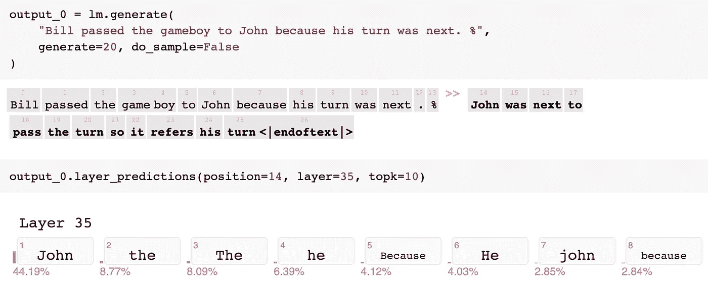

我们的模型考虑过回答“Bill”吗？让我们扩展结果。

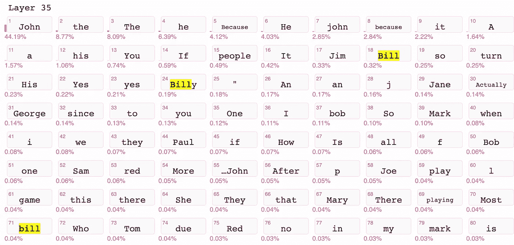

这里我们看到“bill”、“Billy”或“Bill”合在一起有 0.55%的机会成为第一个令牌。一个甚至没有出现在提示中的名字(Jim)很可能是“Bill”。

结论:响应的第一个标记的概率可用于找到 WinoWhy 提示的正确答案。

# 检索反解释

如果我们强迫我们的模型将“Bill”作为第一个令牌，会发生什么呢——我们会产生一个反解释吗？

我打开`do_sample=True`浏览 GPT 可能的令牌:
[CoLab 笔记本](https://colab.research.google.com/drive/1-qU9F5x5yZeGgcyPLKGbm0EcHOS3ZZvb)

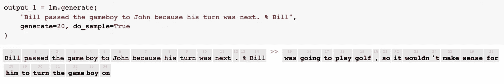

*这是一个很好很奇怪的反解释——它改变了“转向”的意思，并为比尔发明了另一个活动。*

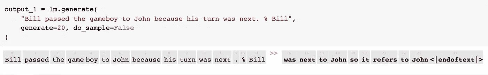

*输出自我纠正(“它指的是约翰”)并改变“下一个”的意思。*

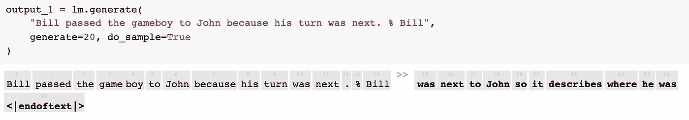

*另一个输出操纵“下一个”的含义。*

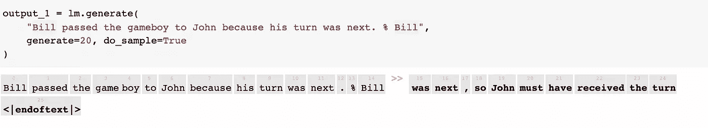

*走棋纠正自己:“约翰一定是收到了转牌”。*

# 探索歧义句

如果我们造一个完全歧义的句子——*比尔和约翰是医生，那会怎么样？他照顾一个病人。*

概率看起来怎么样？

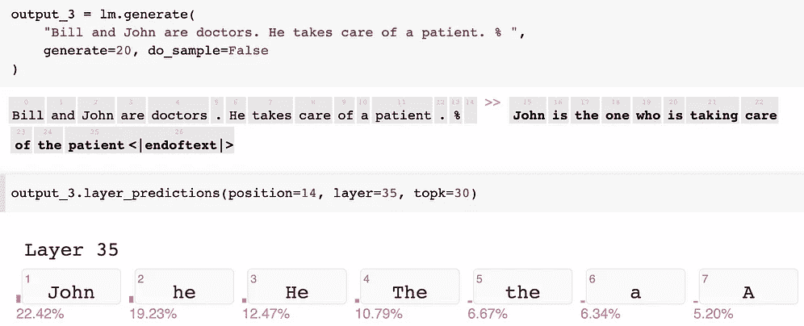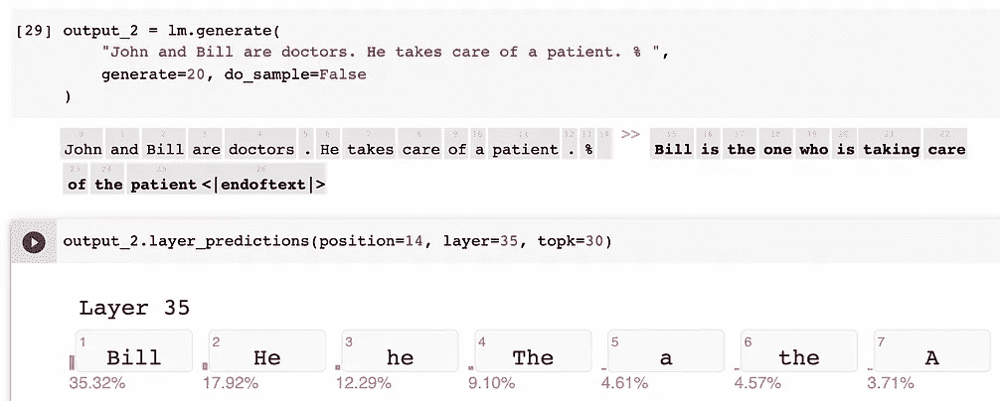

**第二个指定的人**假定是照顾病人的人。

在测试了更多不明确的例子后，我发现**对微调数据集中使用的名称有偏见或不同的行为。**
当我用 Sarah 和 Jane’重新运行这个模棱两可的例子时，返回的令牌是‘Jane’。当我切换到‘简和莎拉’时，返回的令牌是‘她’，只有 2.23%的几率是‘莎拉’。
当我重新运行带有“Nick 和 Pablo”(这两个名字在训练数据中不存在)的模糊示例时，返回的令牌是“he”(并且只有 0.61%的 Pablo)。

我们还可以讨论在新 GPT 协议中哪些名字作为单个令牌包含在内，但这很复杂。

# 采样 GPT 概率树

仅仅看第一个令牌的概率是不够的。该模型的一些解释(尤其是对物体的解释)需要一段时间才能抓住要点:

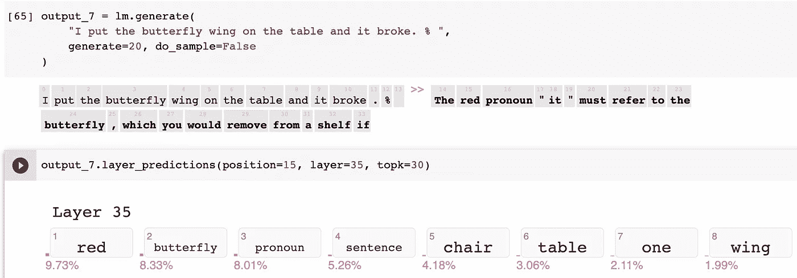

收集人类解释的工具可能会用红色突出显示单词。

我们应该收集大量的句子样本，用“蝴蝶”和“翅膀”，或者“桌子”在回答中出现*最终*来寻找解释。
我们最初的运行只跟踪最受欢迎的令牌，直到第 11 轮才找到答案(蝴蝶)。
如果我们跟踪五个最有可能的代币 11 轮，那就是 5 =将近 4900 万个输出。太多样品了！

## 爬行策略

我决定跟随 6 个最可能的记号，然后 5，然后 4，然后 3…意思是 6！= 720 个输出。我对`ecco`包进行了逆向工程，所以它会递归地生成这些句子。

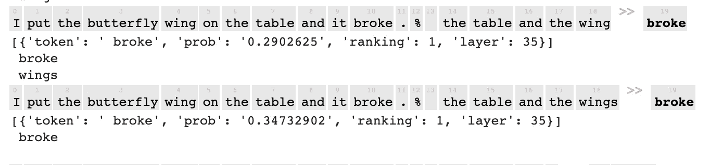

**反解释说桌子和翅膀都破了**(显示的概率是下一个单词是‘破’的)。这些特定反应的概率大约是 1:309，000 和 1:4，000，000

我们可以在 718 个样本句子(2 个提前结束)中搜索关键词。如果模型继续写下去，我们不知道最终的意义或答案，但我们可以在响应中测量存在。

25%的人提到了蝴蝶或翅膀，5%的人提到了桌子，1.7%的人提到了两者，68%的句子一开始都没有提到(类似于我们第一次测试提示时看到的情况)。
当我们将**累积概率**乘以特定标记时，两个句子都没有 20%的可能性，蝴蝶 5%，表格 1%，两者都有 2%。
有趣的是，这个唯一正确的答案出现在许多回答的前面，尽管我们最初的顶级令牌运行没有看到它。

> 为什么这些累积概率加起来不是 100%？如果您查询该模型，28%的情况下您会从我的样本中得到响应，而 72%的情况下您会走另一条路。

我们可以搜索关键字最可能的句子:

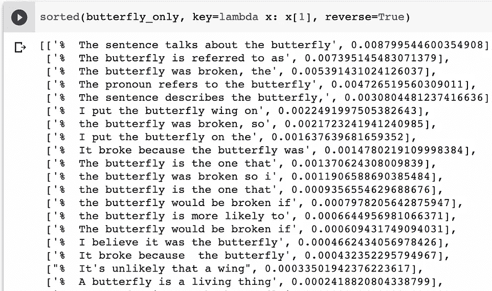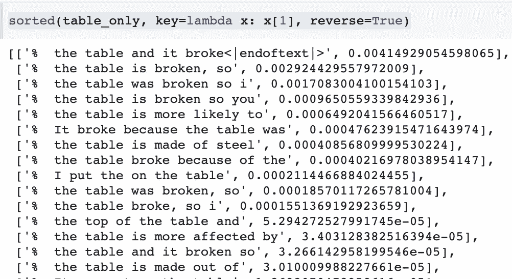

最受欢迎的“桌子”解释(桌子和它碎了)有 0.4%的可能性，排名前四的“蝴蝶”解释超过了它。

我注意到蝴蝶句子偏向于大写的“The”——这是因为模型答案的正确性和流畅性，还是因为人类短语反应的顺序…？

然后我意识到我们主要是在前两个令牌中查看概率:

*   (71%)
    *蝴蝶(第二最有可能)(8%) = 6%
    *表格(第六最有可能，被淘汰)(3%) = 2%
*   (15%)
    *蝴蝶(第二大可能性)(14.4%) = 2.2%
    *桌子(第一大可能性)(15.5%) = 2.3%

通过粗略的计算，“桌子”、“蝴蝶”和“桌子”应该有相似数量的响应。不幸的是‘桌子’被我的取样方法切掉了(这一轮的前 5 个代币选项)。

# 用 7 重新运行！样品

从我们的样本中删除“表格”(初始回复的 2%)感觉不公平。毕竟，这个帖子是从寻求反解释开始的！按照前 7 个记号，然后 6 个，然后 5 个… (5，040 个例子)会给我们一个更好的样本吗？

通过在开始添加第 7 个标记，并继续添加另一个标记，我们添加了数千个句子。这对我来说并不直观，但是样本中的回答的*组合概率*从 6-token 回答的 28%下降到 7-token 回答的 23%*。
一个典型的例子:之前的响应“*句子谈论蝴蝶*”减少了，因为 7 个标记的运行只采样了一个添加了逗号标记的版本“*”。句子谈论蝴蝶* **，**’
在最后一轮中包括更多的标记和概率不需要任何额外的 GPT 计算，所以我决定最后挑选前 5 个标记。现在有将近 25，000 个例子(从概率上来说，如果你问模型一个 7-token 响应，有 31%的可能性它在我的样本中)。*

## 新结果

示例划分:64%都不是，27%是蝶形，7%是表格，1.5%都是
概率划分:13%都不是，12%是蝶形，3.4%是表格，2.7%都是
“表格”句子出现在 15 个最可能的“表格”回答中的 5 个中。

## 概率图

让我们从 7 中复制前 15 个概率！碰到图表。我不确定是否有一个完美的方法来比较这些，因为样本中有 4 倍多的“蝴蝶”句子，它们的“前 15 名”更强(想想学校从或多或少的学生中招募一支足球队)，但两者都来自相同的语言模型样本，所以这可能是公平的。

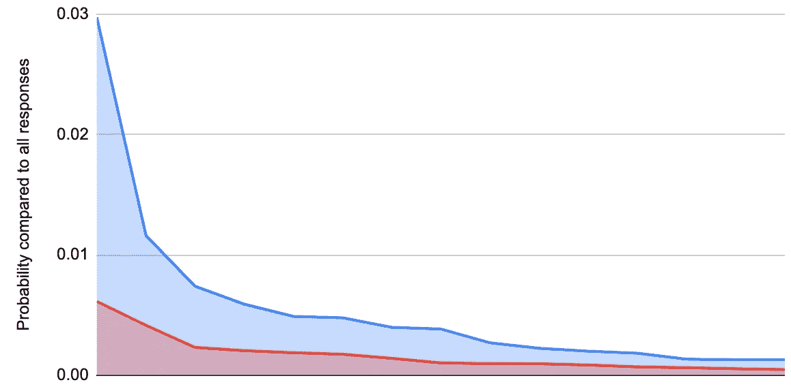

最可能的“蝴蝶”句子的概率是 3.0%，最可能的“桌子”句子的概率是 0.6%。如果我们继续绘制这些类别中最受欢迎的句子，这两个列表的概率都下降了，但下降不是成比例的；顶部响应的可能性为 1/5，样本中的第 15 个响应的可能性为 2/5。

# 总结想法

*   我预测我们可以看看第一个令牌概率，错误的答案将是超级不可能的；相反，任何在提示中被命名的人或事物排名都很高。强行起‘错误’的名字，往往骗不了模型的解释作用，在更长的回应中会给出正确的答案。
*   我们可以使用“歧义语句”测试来测量生成模型中的偏差，但前提是我们打乱名称的顺序，并检查它们在数据集中出现的频率。
*   在更大的解释数据集([arxiv.org/abs/2102.12060](https://arxiv.org/abs/2102.12060))上进行训练，并包括各种各样的名字，这将是很好的。
*   搜索前 6！还是 7！期权并不是一种超级科学的方法:更实际的是，我应该在某个象征性概率或累积概率下切断期权。
*   在 WinoWhy 上微调 T5 或 GPT-尼奥模型会很有趣。

# 更新？

这篇文章发表于 2021 年 5 月。关于我的最新推荐，请查看[这篇 GitHub 自述](https://github.com/mapmeld/use-this-now/blob/main/README.md#anti-explanations)。