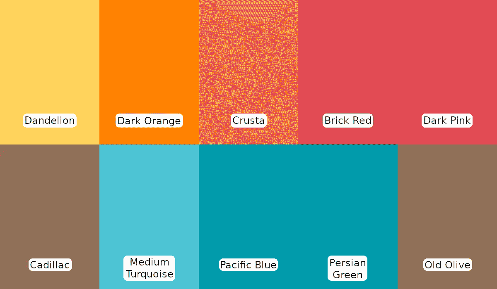
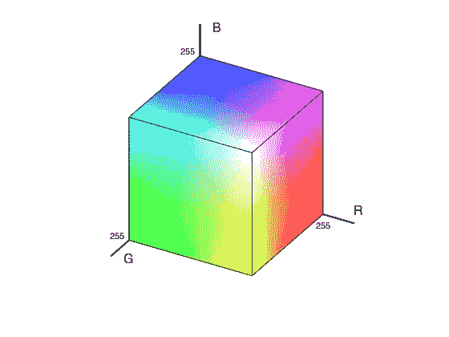
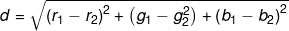

# 在 Go 中从给定的调色板中搜索图像中的突出颜色—第一部分

> 原文：<https://medium.com/nerd-for-tech/searching-for-prominent-colors-in-an-image-from-a-given-palette-in-go-part-i-13e8e511a6b0?source=collection_archive---------10----------------------->

这篇由两部分组成的文章( [I](/@philojjohny/searching-for-prominent-colors-in-an-image-from-a-given-palette-in-go-part-i-13e8e511a6b0) ， [II](/@philojjohny/searching-for-prominent-colors-in-an-image-from-a-given-palette-in-go-part-ii-d4fd8e698fb7) )探讨了使用 kd-tree 数据结构的概念，以便使用 go 从给定的调色板中识别图像中的突出颜色。

> 这篇文章的源代码可以在 https://github.com/philoj/tree-palette[的](https://github.com/philoj/tree-palette)找到

## 以下是我们正在尝试做的事情:

假设我们有一个物体的图像，我们试图识别它的颜色。我们不是猜测一些随机的颜色，而是试图将我们的猜测限制在一个选定的颜色列表中。一个示例场景是使用标准发行颜色分析知名产品目录中的产品照片。

## 好吧，我们已经知道了什么？

假设这些是我们可以选择的颜色，我们称之为*调色板*:

对于图像中的每个像素，我们将从上面的调色板中选择**最相似的颜色**。所以基本上，我们需要转换整个图像，以便图像中的所有颜色都来自调色板。

> 首先，我们需要定义什么是颜色相似度。

显而易见的方法是考虑这样一个事实，即每种颜色都由红色、蓝色和绿色成分组成，就像一个三维点。如果我们用红色、绿色和蓝色值作为三个轴将它们绘制在一个图表中，我们可以看到相似的值仍然彼此接近:

我们现在有了相似性的定义:最相似的那些之间的距离最小！

我们现在需要做的就是计算不同颜色之间的距离。在像图中这样的 3d [笛卡尔坐标](https://en.wikipedia.org/wiki/Cartesian_coordinate_system)系统中，两种颜色之间的距离公式为:

*其中(r₁,g₁,b₁)是第一种颜色，(r₂,g₂,b₂)是第二种颜色。*

我们可以找到每个像素的颜色与每个调色板颜色之间的距离，并找出最相似的调色板颜色。

现在让我们写代码，对吗？

## 不对！

在深入研究代码之前，让我们再次看看我们的解决方案。假设图像尺寸为 1920x768，调色板尺寸为 10。我们需要计算上式 1920*768*10 = 1，47，45，600 次，就为了找出最突出的颜色！我们花点时间探索优化它的方法难道不重要吗？

> 让我们看看:
> 
> 眼前的问题类似于数学中所谓的最近邻搜索。

我们上面已经讨论过的就是所谓的[线性搜索](https://en.wikipedia.org/wiki/Nearest_neighbor_search#Linear_search)。数学界还有很多其他的方法来解决这个问题！

在 [***的下一部分***](/@philojjohny/searching-for-prominent-colors-in-an-image-from-a-given-palette-in-go-part-ii-d4fd8e698fb7) 中，我们将探索一种相对简单高效的方法，称为 [kd-tree](https://en.wikipedia.org/wiki/K-d_tree) ..【T10***>>***