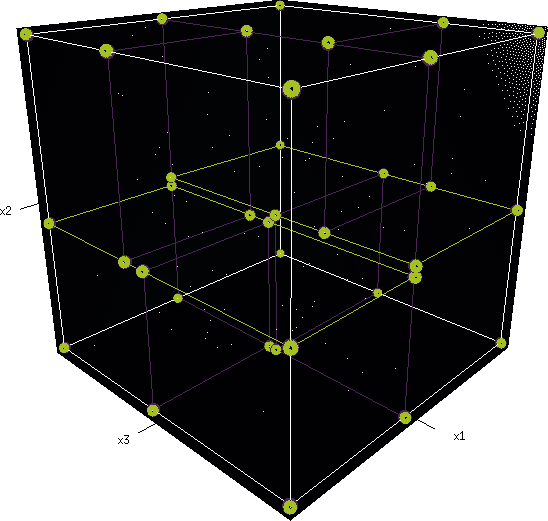
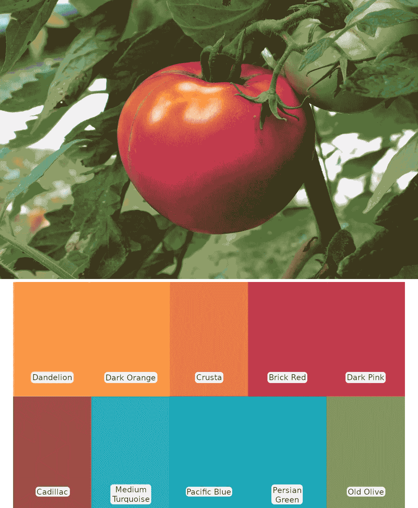

# 在 Go 中从给定调色板中搜索图像中的突出颜色—第二部分

> 原文：<https://medium.com/nerd-for-tech/searching-for-prominent-colors-in-an-image-from-a-given-palette-in-go-part-ii-d4fd8e698fb7?source=collection_archive---------8----------------------->

这篇由两部分组成的文章( [I](/@philojjohny/searching-for-prominent-colors-in-an-image-from-a-given-palette-in-go-part-i-13e8e511a6b0) ， [II](/@philojjohny/searching-for-prominent-colors-in-an-image-from-a-given-palette-in-go-part-ii-d4fd8e698fb7) )探讨了使用 kd-tree 数据结构从给定的调色板中识别图像中的突出颜色的概念。

> 这篇文章的源代码【https://github.com/philoj/tree-palette 

本文第一部分[这里](/@philojjohny/searching-for-prominent-colors-in-an-image-from-a-given-palette-in-go-part-i-13e8e511a6b0)。

## [kd 树](https://en.wikipedia.org/wiki/K-d_tree)方法

简而言之，我们将创建一个类似于[树](https://en.wikipedia.org/wiki/Binary_tree)的数据结构来存储调色板。这将在数据结构本身中保留关于每种颜色彼此接近的信息。当我们搜索相似的颜色时，我们不是计算调色板中所有颜色的距离，而是只计算最接近的几个颜色，从而节省了计算时间。



检查是否有人已经在开源世界中做了你正在尝试做的事情，这总是一个很好的做法，这将带我们到 GitHub 中这个很酷的 kd-tree 实现，作者是 [Dennis Kuhnert](https://github.com/kyroy) :

> [https://github.com/kyroy/kdtree](https://github.com/kyroy/kdtree)(围棋中的 k-d 树实现)

太好了！现在我们不必完全从头开始了！

为了更好地适应我们的场景，我们可以对代码进行一些重大的修改:

*   内置的 go 图像和颜色包使用 *uint32* 作为 RGB 值的类型，而 kdtree 使用 *float* 来存储值。我们可以在实现中使用 *uint32* 来代替 *float* 。
*   我们的基本假设是调色板在整个过程中保持不变。这意味着我们可以抛弃原始实现中的插入、删除、重新平衡功能(对不起，丹尼斯)。
*   kdtree 实现能够找到 n 个最相似的颜色，而我们只关心最相似的颜色。所以是的，把它全部刮开，只找到最相似的颜色。
*   此外，在进行实际距离比较的地方，我们可以不在距离方程中应用平方根，因为我们只是用它来进行比较。

## 编码时间到了！

创建界面，

(类似于 kdtree 的*点*接口)

实现这些接口，

(我们也增加了对 alpha 值的可选支持)

实现 kd 树并将其称为“调色板”，

(kd 树创建需要在向树中插入值时，沿不同的轴对调色板值进行排序。为此，我们将保留来自 kdtree 的原始实现)

对原来的 *knn()* 函数进行修补，将其变成一个 *nn()* 函数，

我们完事了。！

## 无论什么...有用吗？

让我们试试这张图片和我们在一开始看到的调色板:



下面是示例代码:

结果是:

```
1\. OLD OLIVE(13) - 508392 Occurances
2\. CADILLAC(9) - 314677 Occurances
3\. BRICK RED(7) - 142207 Occurances
4\. DANDELION(1) - 62331 Occurances
5\. CRUSTA(3) - 44161 Occurances
6\. MEDIUM TURQUOISE(10) - 19462 Occurances
7\. DARK PINK(8) - 601 Occurances
8\. PACIFIC BLUE(11) - 9 Occurances
```

希望这是有用的。如果我仓促行事，请让我知道。还有，欢迎各种有创意的批评！