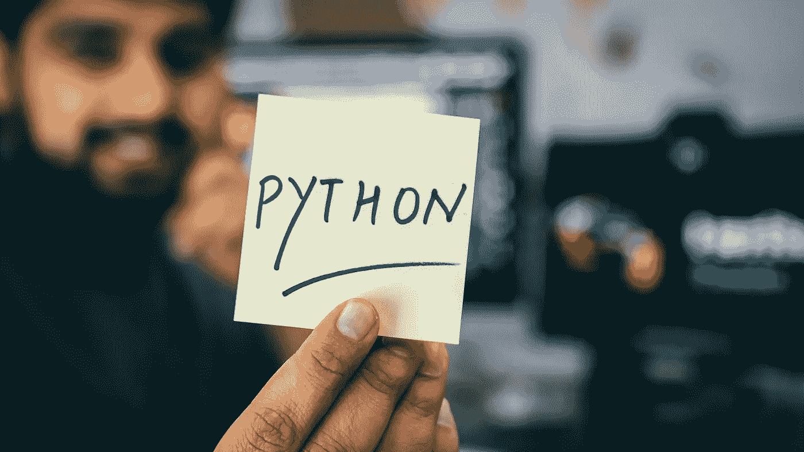
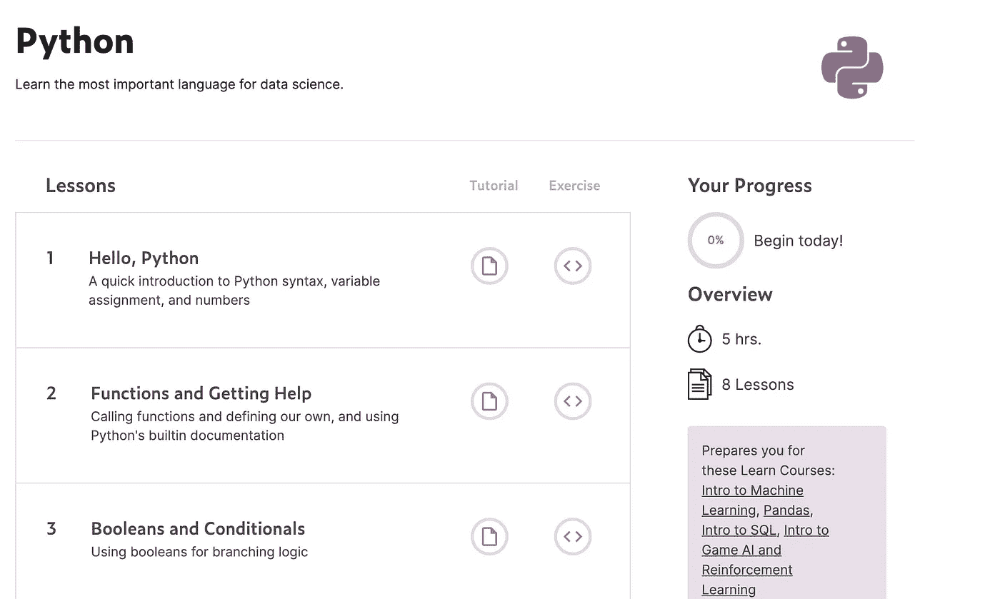
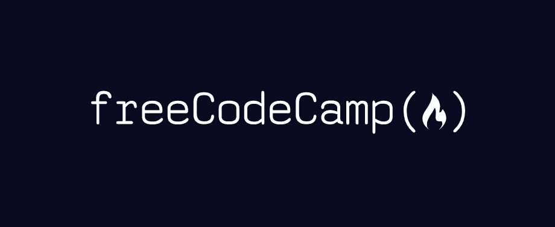

# “2021 年怎么学 python？”

> 原文：<https://medium.com/nerd-for-tech/second-part-why-you-should-learn-python-available-resources-28d3e57ade38?source=collection_archive---------18----------------------->

来源:[希特什·乔杜里](https://unsplash.com/@hiteshchoudhary)

所以，在学习了一些基本概念之后，是时候学习一些 python 了。

Python 对于机器学习和数据科学非常重要。现在让我们理解为什么会有人想在设计任何机器学习项目时使用唯一的 Python。例如，您可以构建一个垃圾邮件检测算法，从数据中学习规则，或者根据您之前分配的标签(垃圾邮件或非垃圾邮件)排列您的电子邮件(此过程称为模型训练)

所以对于像我这样的机器学习工程师/计算机视觉工程师或者一个崭露头角的数据科学家/机器学习/算法工程师/深度学习工程师为什么我会推荐 Python **，因为它简单易懂**。

insights.stackoverflow.com

上表说明了 python 是世界上所有其他编程语言中最受业界欢迎的语言。

**为什么会出现这种趋势？**

如果您曾经阅读过 python 的一行代码，并将其与另一种编程语言进行比较，您肯定会同意 python 要简单得多。其次，有大量不同的框架可供学习。通常，框架有助于构建应用程序或服务，而不必处理诸如协议、套接字或进程/线程管理等底层细节。

[***2021 年 7 大框架学习***](https://www.upgrad.com/blog/python-frameworks/)

因此，众所周知，机器学习算法、线性代数概念、微积分是如此复杂，以至于它们需要最大的努力。Python 中的快速实现帮助 ML 工程师验证一个想法。

## 我们来谈谈包(框架)

python 的包最好的一点是，它们不需要任何知识就可以开始使用。它们都是免费的，所以只要你学习了 python 的基础知识，你就可以在你的代码中实现它们。

作为一个例子，我将列出一些最常见和最著名的包，用于不同的目的。

## 顶级 Python 框架

*Django —用于网络开发*

Scipy —用于科学编程

*OpenCV、Scikit —用于图像工作*

Numpy —用于文本(数据科学的最佳框架)

*Librosa —用于音频处理*

*熊猫*， *Numpy* —用于数据整理

*Matplotlib——用于数据可视化*

*OpenCV，TensorFlow，py torch——用于深度学习*

今天，Python 到处都在使用，从会计开始，到科学结束。我认为唯一可能不使用 python 的领域是系统构建。然而，还有许多其他的低级编程语言，比如 C 和汇编，它们做得很好。

现在，让我们来发现一些平台，在这些平台上，您可以快速高效地获得 python 技能。

kaggle.com

[*Kaggle learn*](http://kaggle.com/learn/python) *有一个*关于 python 基础知识的完整课程。您将从“hello world”开始，并完成与外部库的工作。

正如 Kaggle 向我们保证的那样，本课程将需要近 5 个小时才能完成。我想如果你是 python 的新手，但你已经有了一些其他编程语言的经验，你肯定会喜欢这门课的。

freecodecamp.org

然而，如果你是计算机科学领域的新手，那么，我会推荐你访问[*freeCodeCamp.org*](https://www.youtube.com/watch?v=rfscVS0vtbw)*，在那里你可以找到*他们为初学者开设的令人惊叹的 python 课程。就人类是观想者而言，我们更热衷于通过观看来学习一些东西。所以，对一些人来说，这门课可能是有帮助的。

请继续收听😇。明天将会有关于初学者最佳读物的帖子