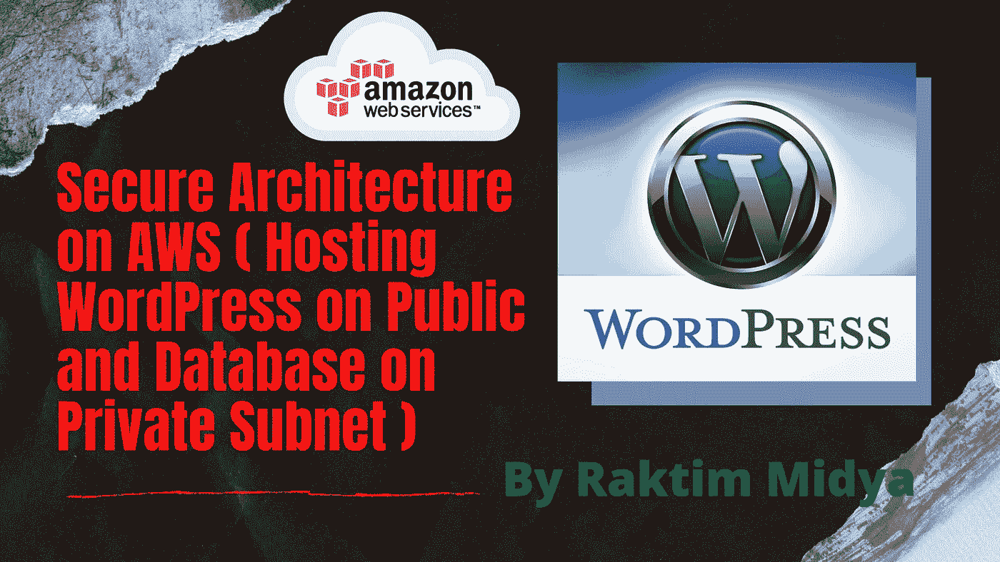
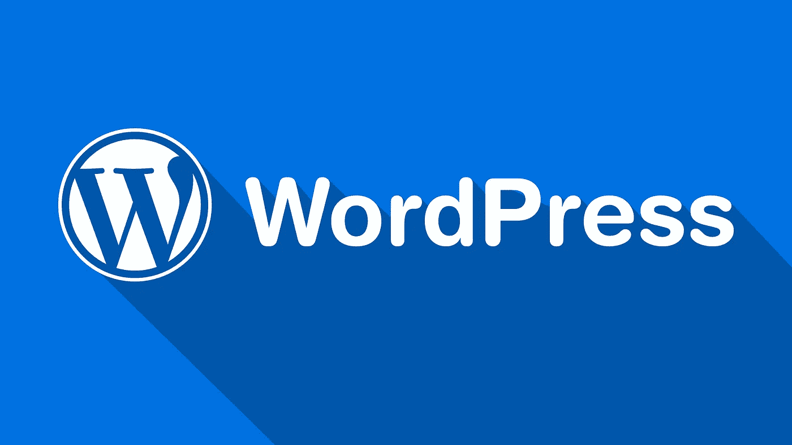
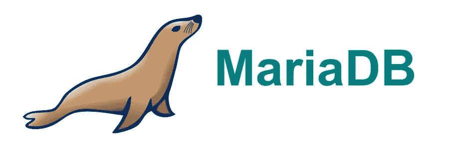
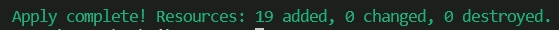
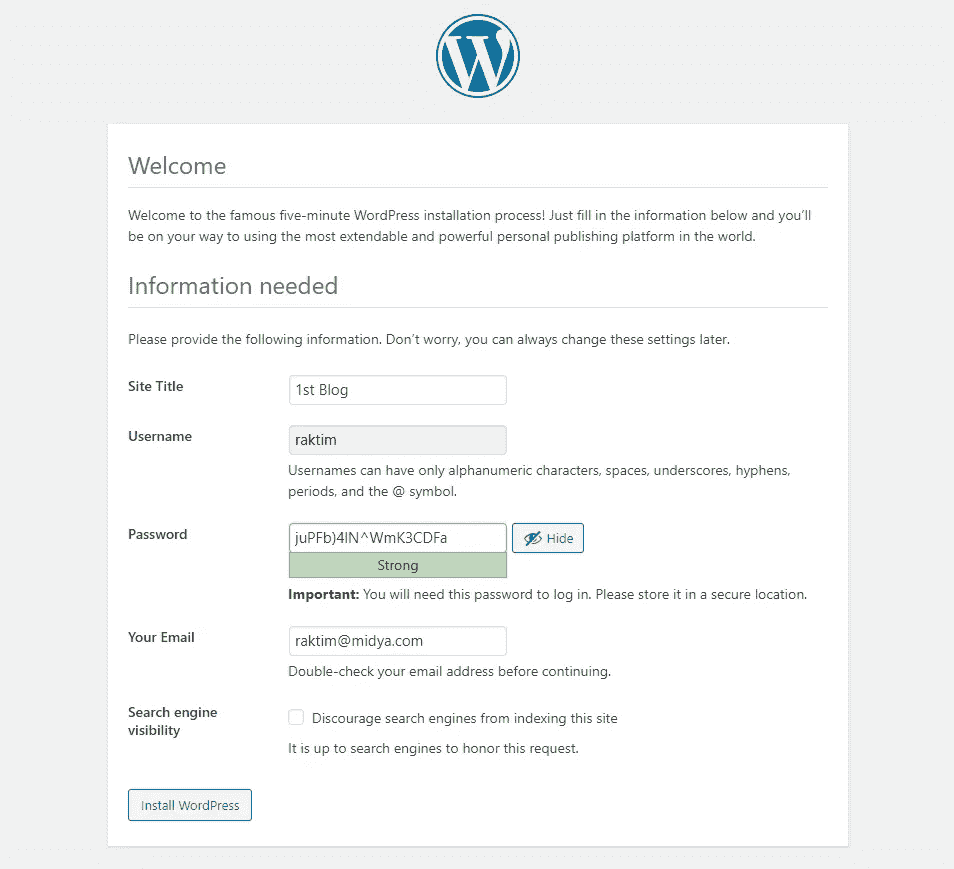
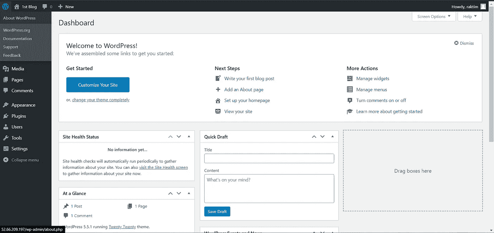

# AWS 上的安全架构(在公共网上托管 WordPress，在私有网上托管数据库)

> 原文：<https://medium.com/nerd-for-tech/secure-architecture-on-aws-hosting-wordpress-on-public-and-database-on-private-subnet-8d21ade6ab75?source=collection_archive---------1----------------------->



由 Raktim 创建

在这篇文章中，我将演示**如何使用 Terraform 自动化脚本**创建 VPC、子网、互联网网关、Nat 网关、弹性 IP、根表。我还将**在公共子网**上部署一个 EC2 实例，在私有子网上托管 **WordPress** 和**一个 EC2 实例，使用 Terraform 脚本托管 **MariaDB 数据库**。**

> **但在开始之前，我们先来看看 WordPress 和 MariaDB 数据库的简要概述……**

# WordPress:



WordPress 标志

*   WordPress 是一个用 PHP 编写的免费开源内容管理系统，配有 MySQL 或 MariaDB 数据库。特性包括插件架构和模板系统，在 WordPress 中称为主题。
*   WordPress 最初是作为一个博客发布系统创建的，但已经发展到支持其他类型的网络内容，包括更传统的邮件列表和论坛、媒体画廊、会员网站、学习管理系统和在线商店。
*   ***了解更多 WordPress:***[***https://WordPress . org/support/article/overview-of-WordPress/***](https://wordpress.org/support/article/overview-of-wordpress/)

# MariaDB:



MariaDB 徽标

*   MariaDB 是社区开发的、商业支持的 MySQL 关系数据库管理系统(RDBMS)的分支，旨在 GNU 通用公共许可证下保持自由和开源软件。MySQL 的开发是由一些最初的开发者领导的，他们因为担心 2009 年被甲骨文公司收购而放弃了 MySQL。
*   关系数据库将数据组织成一个或多个数据表，在这些数据表中，数据类型可以彼此相关；这些关系有助于组织数据。SQL 是程序员用来从关系数据库中创建、修改和提取数据，以及控制用户对数据库的访问的语言。
*   ***了解更多 MySQL:***[***https://mariadb.org/about/***](https://mariadb.org/about/)

# 让我们看看问题陈述:

陈述:我们必须为我们的公司创建一个尽可能安全的门户网站。所以，我们使用 WordPress 软件和专用的数据库服务器。
出于安全考虑，外部世界不应访问数据库。我们只需要向客户公开 WordPress。
下面是正确理解的步骤！

1.使用 terraform 将基础架构编写为代码，这将自动创建 VPC。
2。在 VPC 中，我们必须创建 2 个子网:
3。公共子网【公共世界可访问！】
4。私有子网【仅限公共世界！】
5。创建一个面向公众的互联网网关，将我们的 VPC/网络连接到互联网世界，并将此网关连接到我们的 VPC。
6。为 Internet 网关创建路由表，以便实例可以连接到外部世界，更新并将其与公共子网相关联。
7。创建一个 NAT 网关，用于将我们的 VPC/网络连接到互联网世界，并将此网关连接到我们公共网络中的 VPC
8。更新私有子网的路由表，以便使用在公共子网
9 中创建的 NAT 网关访问互联网。启动一个 ec2 实例，它的 WordPress 设置已经有了允许端口 80 的安全组，这样我们的客户端可以连接到我们的 WordPress 站点。还要将密钥附加到实例，以便进一步登录。
10。启动一个 ec2 实例，它已经用安全组设置了 MYSQL，允许私有子网中的端口 3306，这样我们的 WordPress vm 就可以连接到相同的端口。同样附上钥匙。注意:WordPress 实例必须是公共子网的一部分，这样我们的客户才能连接我们的站点。MySQL 实例必须是私有子网的一部分，这样外界就不能连接到它。
不要忘记添加要启用的自动 ip 分配和自动 dns 名称分配选项。

# 先决条件:

在开始实施这整个设置之前，有一些先决条件来执行这一实践。让我想想…

*   首先，您需要**一个活动的 AWS 帐户**以及安装在您本地系统上的 **Terraform 软件**。另外**要理解本文，还需要掌握 AWS 和 Terraform 的基础知识**。但是不了解这些也不用担心。最近，我发表了一篇文章，其中我谈到了这些基本的东西，所以请随时查看…

[](/faun/getting-started-with-aws-terraform-293e9125dff) [## AWS & Terraform 入门。

### 如何入门使用 Terraform 在 AWS 中构建基础设施？

medium.com](/faun/getting-started-with-aws-terraform-293e9125dff) 

*   接下来，对于这篇文章，我们还有一个先决条件。**就在一天前，我做了同样的实际操作，但是用了一种不同的有点手工的方式**，所以，在开始之前，我建议请浏览一遍那篇文章。链接如下…

[](/@raktim00/webapp-on-aws-ec2-instance-with-best-possible-security-9184d5d44981) [## AWS EC2 实例上的 WebApp 具有最佳的安全性！！！

### 这篇文章将帮助您建立 AWS AMI，并实现 VPC，子网，互联网网关，路由表，安全…

medium.com](/@raktim00/webapp-on-aws-ec2-instance-with-best-possible-security-9184d5d44981) 

好了，现在我们准备开始实际操作了。

# 让我们开始:

在我之前的博客中，我演示了如何创建 VPC、子网、互联网网关、路由表、安全组和其他一些东西。

这就是为什么在这篇博客中，我不会深入探讨这些话题，因为我相信如果你满足了这些先决条件，那么你就已经知道如何构建这些东西了。在这里，我主要关注的是使用纯自动化在 EC2 实例上设置 WordPress 和 MariaDB。像往常一样，让我们看看代码的不同部分，并了解…

## 密钥对:

*   我们可以注意到这段代码正在创建一个 **tls 私钥**。接下来我们**将密钥存储在本地存储的一个文件中**。
*   接下来使用“aws_key_pair”资源，我使用这个 tls 密钥和**创建一个 aws 密钥对**。我们将在以后使用这个密钥来启动 EC2 实例。

## VPC 和子网:

*   这段代码创建了一个 **VPC** ，其 IP 范围为“ **192.168.0.0/16** ”。此外，在问题中提到的**允许启用 dns 名称分配选项**，这就是为什么这两个选项在 VPC 块内启用。
*   接下来，我们创建了一个公共子网，我在“ **ap-south-1a** ”可用性区域中启动了该子网。此外，由于这是一个公共子网，所以我们希望该子网下的那些实例获得**公共 IP，这就是启用“map_public_ip_on_launch”选项的原因**。
*   接下来，我们在“ **ap-south-1b** ”可用性分区中创建了一个专用子网。

## 互联网网关、弹性 IP 和 NAT 网关:

*   起初，我们在自己创建的 VPC 内部创建了一个互联网网关。这个互联网网关将帮助公共子网获得外部流量。
*   接下来，我们创建了一个**弹性 IP，因为需要这个 EIP 来创建 NAT 网关。**
*   接下来，我们在公共子网内创建了 NAT 网关，因为我们需要为其分配 EIP。这个 **NAT 网关会帮助我的私有子网上网下载软件**但是上网流量无法通过 NAT 网关进入。

## 路由表和子网关联:

*   这段代码创建了两个路由表。一个用于公共子网，另一个用于私有子网。
*   **公共子网路由表应用于互联网网关，私有子网路由表应用于 NAT 网关**。此外，两个路由表都允许来自世界任何地方的任何类型的流量。
*   接下来，我们将公共路由表关联到公共子网，将私有路由表关联到私有子网。

## 安全组:

*   这段代码创建了两个安全组。一个是针对 **WordPress 实例的，它允许 SSH 和 HTTP 分别在端口 22 & 80** 上通信。此外，因为我们需要从互联网上下载一些软件，所以在出口这个安全组允许我的实例去互联网上的任何地方。
*   第二个安全组用于 **MariaDB 实例，该实例允许端口 3306** 上的流量。还有一个更有趣的事实，这个安全组只允许来自属于 WordPress 安全组的那些实例的流量。在出口中也允许所有类型的地址。

## MariaDB 实例:

*   这里我使用的是**亚马逊 Linux 2 镜像**，我在**私有子网**上启动我的 MariaDB 实例。我还使用了为数据库实例创建的安全组。在问题**中，它被要求附加密钥，所以我在这里附加了我们在开始时创建的密钥**。
*   最后，使用用户数据，我正在建立数据库。现在一个有趣的事实是，由于这个实例运行在私有子网上，所以我们没有公共 IP，所以**我们不能从外界进行 SSH**。此外，此实例的**防火墙将不允许除 3306** 之外的任何其他流量。这就是为什么我们使用用户数据建立数据库。
*   要设置 MariaDB，首先我们需要一些软件，如 php，mariadb server 等。待安装。安装后，我们登录到数据库中，**创建了一个** **用户名和密码以及一个数据库**。收集这些用户名、密码和数据库名称，用于 WordPress 设置。还有一件更有趣的事情，这个数据库只允许来自 WordPress 实例的私有 IP 的流量。

## WordPress 实例:

*   接下来使用这段代码，我在公共子网上启动了一个实例。这里我也附上了相同的 aws 密钥对，这里我也使用了 Amazon Linux 2 AMI。

## WordPress 设置:

*   我们远程访问我们的实例，然后一个接一个地运行这些命令来设置 WordPress。
*   主要是这些命令首先安装一些软件，如 httpd，php-gd 等。然后从官方网站下载 WordPress 的最新软件。接下来，它解压缩文件，并使用 **sed 命令更改配置文件**的内部行，并提到用户名、密码、数据库名称，最后是数据库主机的 ip。
*   最后我们**把 wordpress 里面的文件复制到“/var/www/html”**文件夹里，更改了一些权限。然后我们**启动了 httpd 的服务并使其启用。**

## Chrome 打开:

*   最后，我们打开 chrome 浏览器，它会自动把我们带到 WordPress 实例的公共 IP。

# 让我们部署:

所以，最后是时候部署我们的 Terraform 代码来完成整个设置了。像往常一样，我们将在存放代码的文件夹中运行下面提到的两个命令。这里是 GitHub 的链接，你可以在这里找到完整的代码…

[](https://github.com/raktim00/AWS-WordPress) [## raktim00/AWS-WordPress

### 在 GitHub 上创建一个帐户，为 raktim00/AWS-WordPress 开发做贡献。

github.com](https://github.com/raktim00/AWS-WordPress) 

*   最后运行下面提到的两个命令，等待 3 分钟，你会看到你的 chrome 浏览器会自动启动并带你到 WordPress 实例的公共 IP。

```
terraform initterraform apply --auto-approve
```



# 让我们看看 WordPress:

> **免责声明:**当 Chrome 打开时，你可能会看到它显示**【错误数据库连接】**，不要担心。这只是因为数据库实例需要更多的时间来完全启动。**等待 1 分钟，然后刷新页面**，您将看到一个欢迎屏幕。

**选择语言并点击“继续”。然后它会询问一些基本的细节，如用户名、密码、电子邮件地址等。随便给这些细节吧。这些将在将来用于登录 WordPress。
请参考下面提到的截图…**



> 接下来点击**安装 WordPress** 然后登录，你会在下面的屏幕上看到这个…



**快点…我们终于成功地在 AWS 上建立了一个最安全的架构来托管一个 Web 应用程序。**

# 最后的话:

*   我们可以通过使用多个实例来扩展这个特殊的实用程序。此外，使用任何类型的集中存储，如 EFS，我们可以连接许多数据库实例，以获得更好的架构。此外，我们可以在这些实例上使用负载平衡器，使其更加完善。这种实用性在未来有很多可能性。
*   我试图让它尽可能简单。希望你从这里学到了一些东西。请随意查看我的 LinkedIn 个人资料，当然也可以随意发表评论。
*   我写 DevOps，云计算，机器学习等。博客，所以请随时关注我的媒体。最后但同样重要的是，如果你有任何疑问，请在 LinkedIn 上联系我。

[](https://www.linkedin.com/in/raktim00/) [## 微软学习学生大使(Alpha) -微软学习学生大使 CEE |…

### ★我是一名技术爱好者，致力于更好地理解不同热门技术领域背后的核心概念…

www.linkedin.com](https://www.linkedin.com/in/raktim00/) 

**感谢大家的阅读。就这样…结束…😊**

