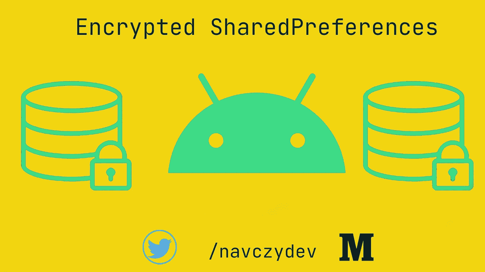
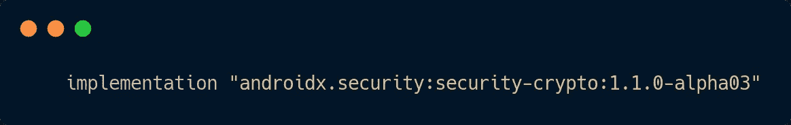
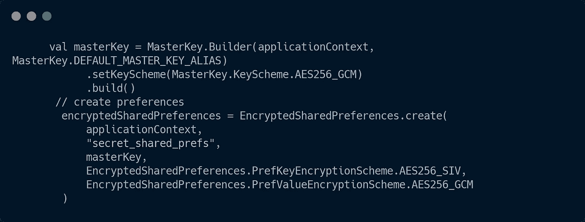
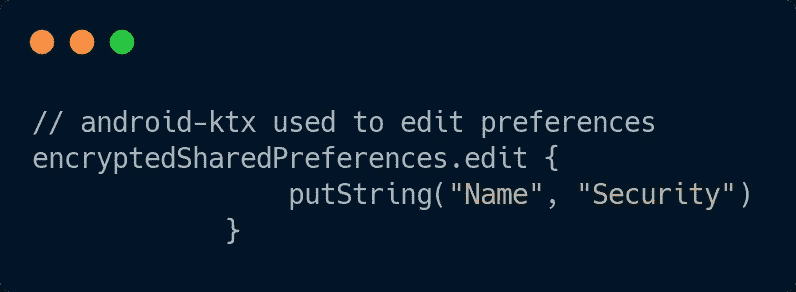
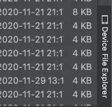
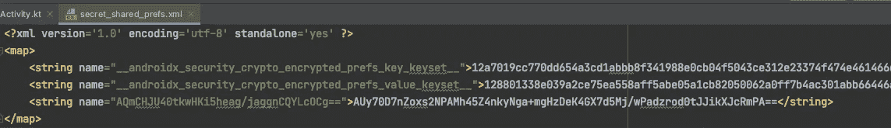

# 安全共享首选 Android

> 原文：<https://medium.com/nerd-for-tech/secure-sharedpreferences-android-9ba1e59f4250?source=collection_archive---------0----------------------->

在这篇文章中，我们将学习如何使用 **Jetpack 的安全库**来加密我们在 Android 中的 **SharedPreferences**



**定义**:一个**加密密钥和值的`[SharedPreferences](https://developer.android.com/reference/android/content/SharedPreferences.html)`实现。**

*   首先，您需要在 app 模块的 **build.gradle** 文件中添加以下依赖项。

检查最新版本[这里](https://developer.android.com/jetpack/androidx/versions)为这个**库**



安全库的依赖性

> 只需同步您的项目，我们就可以开始了。

*   现在您可以轻松地创建**加密的 SharedPrefernces 实例**:



创建加密的共享引用

*   万能钥匙**:**

```
val masterKey = MasterKey.Builder(*applicationContext*)
    .build()
```

它用于生成用于加密密钥和值的加密密钥。

*   **PrefKeyEncryptionScheme。AES256_SIV :** 用来加密**密钥🔑**
*   **PrefValueEncryptionScheme。AES256_GCM :** 用于加密数值

*   现在我们有了**个共享的优先级**。我们在里面加一些**值**吧。我们将使用 **Android-KTX 库**编写更简洁的代码:
*   你可以在这里了解更多关于 **Android-KTX** [的信息。](https://developer.android.com/kotlin/ktx?gclid=Cj0KCQiAqo3-BRDoARIsAE5vnaL5EHH48WnqZFlq2DIbzKaqWv8NYeqJ2C67TaRKeGuLusWtxAzJdqsaAt0CEALw_wcB&gclsrc=aw.ds)



在 SharedPreferences 中保存字符串值

*   我们已经在我们的**加密共享引用**中保存了字符串类型的**名称。**

让我们检查保存的 sharedPreferences 的**内容，以确保值被保存为**加密的**。**

*   在 **AndroidStudio** 中，你可以使用**设备文件浏览器**看到你连接的设备的数据/仿真器的**数据。**

在**data/data/your _ package _ name**下，可以看到你的 app 的内容。



*   下面是**加密共享偏好文件**的**内容**:



你可能想知道为什么存储了 3 个值，因为我们只输入了名字。

*   **EncryptedSharedPreferences**存储**键值**，该键值用于**加密 **SharedPreference 文件**中的**值**。**

## 今天到此为止。我希望你能学到新东西。

*   下面是与本文相关的**示例代码**:

[](https://github.com/navczydev/EncryptedPreferences) [## navczydev/EncryptedPreferences

### Jetpack 的安全库实现 GitHub 是超过 5000 万开发者的家园，他们一起工作来托管和…

github.com](https://github.com/navczydev/EncryptedPreferences) 

# 保持联系:

*   [领英](https://www.linkedin.com/in/navczydev/)
*   [推特](https://twitter.com/navczydev)

# 参考资料:

[](https://developer.android.com/topic/security/data?authuser=1) [## 安卓开发者

### 安全库提供了与在…上读写数据相关的安全最佳实践的实现

developer.android.com](https://developer.android.com/topic/security/data?authuser=1) [](https://developer.android.com/kotlin/ktx?gclid=Cj0KCQiAqo3-BRDoARIsAE5vnaL5EHH48WnqZFlq2DIbzKaqWv8NYeqJ2C67TaRKeGuLusWtxAzJdqsaAt0CEALw_wcB&gclsrc=aw.ds) [## Android KTX | Android 开发者

### Android KTX 是一组 Kotlin 扩展，包含在 Android Jetpack 和其他 Android 库中。KTX…

developer.android.com](https://developer.android.com/kotlin/ktx?gclid=Cj0KCQiAqo3-BRDoARIsAE5vnaL5EHH48WnqZFlq2DIbzKaqWv8NYeqJ2C67TaRKeGuLusWtxAzJdqsaAt0CEALw_wcB&gclsrc=aw.ds) 

# 👏👏👏👏快乐编码👏👏👏👏