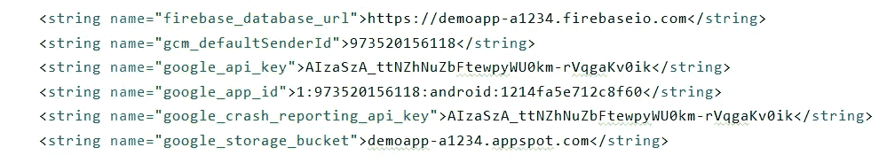
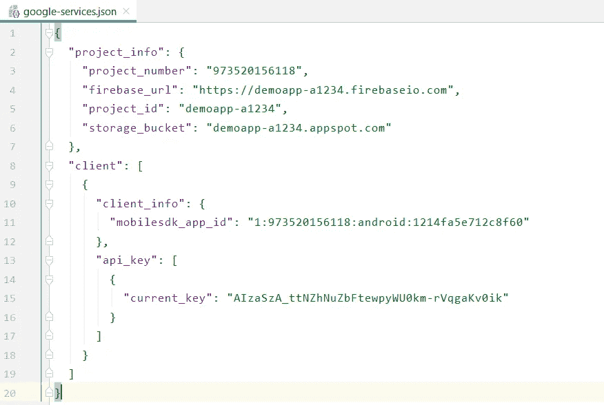
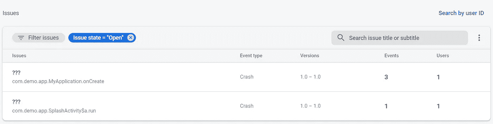
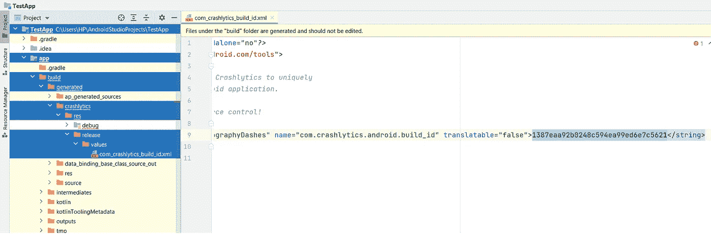
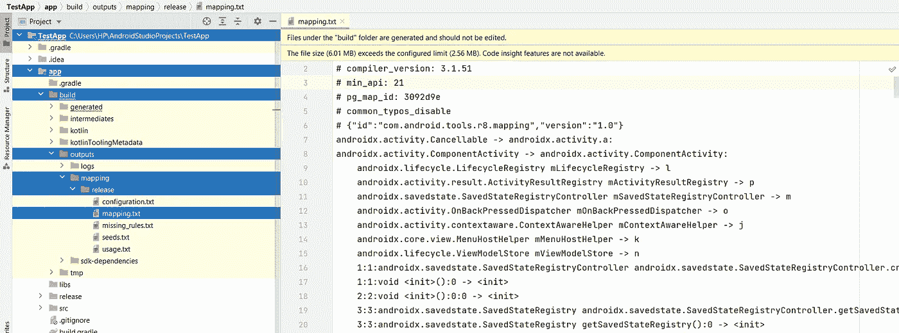

# 在 android 中保护你的 firebase 的 google-services.json 文件

> 原文：<https://medium.com/nerd-for-tech/secure-your-firebases-google-services-json-file-in-android-16680f8e5fb4?source=collection_archive---------3----------------------->


如今，firebase 通常用于 android 项目，因为它提供了一个快速记录崩溃的解决方案，提供了一个存储应用程序数据的数据库，以及许多其他东西。在 android 应用程序中实现 firebase 最常用的方法包括从 firebase 控制台下载 **google-services.json** 文件，并将其放在我们项目的应用程序目录中。这个文件负责在应用程序启动时自动初始化 firebase。
但是你知道吗，这个文件包含了一些不应该泄露的重要密钥和网址，因为它可能会破坏你的应用程序的安全性。此外，你有没有想过，在逆向工程的帮助下，从你的应用程序中获取那些密钥和 URL 有多容易？
如果你使用一些逆向工程工具如 [Apktool](https://ibotpeaches.github.io/Apktool/install/) 来反编译你的 apk，那么你会发现这些键出现在你的应用程序的 strings.xml 文件中，如下图所示



任何人都可以提取它，并可能篡改您的应用程序的安全性。

如何将键和 URL 存储在 strings.xml 中？
基本上，firebase 会在编译时将这些来自 **google-services.json** 文件的密钥放入 strings.xml 文件，并在自动初始化时使用它们。
那么，是否有可能停止这种做法，使这些密钥和 URL 无法从我们的应用程序中检索出来，从而有助于减少篡改应用程序的机会？
答案是**是的。**


如何做到这一点？
第一步是从 **google-services.json** 文件中获取所需的密钥，如下文中的*所示，并将它们存储在您的应用程序中。你可以看看我以前的[文章](https://mittalkartik1.medium.com/secret-management-in-android-c2a44f23fc59)来了解如何在 android 中安全地存储密钥。*



将这些密钥存储在应用程序中后，您可以从应用程序中删除 **google-services.json** 文件。同样，如果你已经在你的应用级 build.gradle 文件中添加了下面一行，那么你必须**移除**这一行。

```
apply plugin: ‘com.google.gms.google-services’
```

现在，您想通过将以下代码添加到清单文件来禁用 firebase 的自动初始化—

```
<provider
    android:name="com.google.firebase.provider.FirebaseInitProvider"
    android:authorities="${applicationId}.firebaseinitprovider"
    tools:node="remove"
    />
```

现在，最后一步是手动初始化 firebase，方法是放置您之前从 **google-services.json** 文件中获得的相应密钥——

注意—如果您已经在项目中添加了 firebase crashlytics，那么您必须在应用程序级' *build.gradle* '文件中添加以下代码，以防止在发布时自动将映射文件上传到 firebase crashlytics:-

```
android **{** *//...* buildTypes **{** release **{** *//...* ***firebaseCrashlytics {
                mappingFileUploadEnabled false
            }*
        }
    }
}**
```

但是在阻止映射文件的自动上传后，您的信息将不会被保留，您将不再看到崩溃发生的特定行号和活动名称，如您在下面的截图中所见——



但是不要担心，为了保存信息并获得正确的崩溃报告，您必须将以下代码添加到应用程序的 **proguard-rules.pro** 文件中

# **更新—2022 年 2 月 13 日**

如果您在 firebase crashlytics 中得到混乱的崩溃报告，那么您可能需要在生成 apk 后手动上传一个映射文件到 firebase。但是由于 firebase 没有为此提供任何官方文档，我们将使用 android studio 来定制上传映射文件的 gradle 任务，这样就可以实现了。

但是在开始之前，让我们看看当你生成一个 apk 时，在后台发生了什么—

> 因此，基本上，当你生成一个 apk 时，firebase crashlytics 会在***injectCrashlyticsMappingFileId***gradle task 的帮助下生成一个 **UUID** ，并将其与应用关联起来。之后，执行***uploadCrashlyticsMappingFile****grad 任务，将映射文件上传到特定 UUID 的 firebase。因此，最终，当特定 apk 中发生崩溃时，firebase 将检查 apk 中存在的属于 crashlytics UUID 的映射文件，以消除崩溃报告的影响。*

**

# *第一步*

*你需要在你的应用级' *build.gradle'* 中再次将***mappingFileUploadEnabled***设置为 **true** ，如果你之前已经将此设置为 false。这将确保我们每次生成 apk 时都会生成一个 32 位的 UUID。*

```
*android **{** *//...* buildTypes **{** release **{** *//...* ***firebaseCrashlytics {
                mappingFileUploadEnabled true
            }*
        }
    }
}***
```

# *第二步*

*您需要通过在您的项目级 *build.gradle* 的底部添加以下代码来限制**uploadcrashlyticsmappingfilererelease**任务的执行*

> *注意—任务名称可能会有所不同，这取决于您要为其生成 apk 的构建风格。例如，如果您有一个构建变体“uat ”,那么任务的名称将是 uploadCrashlyticsMappingFile**Uat**Release。*

# *第三步*

*为您想要的构建变体生成 apk。成功创建 apk 后，将生成一个 32 位 UUID 和映射文件，用于手动上传映射文件。*

# *步骤 4*

*现在，您需要替换您在项目级 *build.gradle* 中添加的代码，如下所示。另外，请注意，语法可能会根据您要使用的 gradle 版本而有所不同。为此，我使用了 gradle 版本 **7.2** 。*

*   ****mappingFileId*** —它是一个 32 位的 UUID，将从*com _ crashlytics _ build _ id****中获得。*** *xml* 文件存在于"*/app/build/generated/crashlytics/RES/{ build variant }/values "*路径中，如下图所示—*

**

*   ****path _ to _ mapping _ file****—是已经生成的映射文件的绝对路径*出现在*"/app/build/outputs/mapping/{ build variant }/mapping . txt " path*中，如下图所示—*

**

*   ****path _ to _ resource _ root****—*为此，您需要创建一个名为“*values . XML”*的文件，并将其放在“values”命名文件夹中，并使用 values 文件夹的父目录的绝对路径。例如，如果 values.xml 的路径是"*C:\ \ Users \ \ HP \ \ Downloads \ \ values \ \ values . XML "*，那么' *path_to_resource_root'* 将是" *C:\\Users\\HP\\Downloads "。*values . XML 文件的内容如下所示*

```
*<?xml version="1.0" encoding="utf-8"?>
<resources>
    <string name="google_app_id" translatable="false">           ***mobilesdk_app_id*** </string>
</resources>*
```

# *第五步*

*最后一步是使用 android studio 中的终端执行您之前在项目级 *build.gradle* 中指定的定制任务，如下所示*

```
*gradlew uploadCrashlyticsMappingFileRelease*
```

*等待任务执行完成，现在就可以开始了。*

*感谢您阅读这篇文章。如果你遇到任何问题，请告诉我。你可以在 [LinkedIn](https://www.linkedin.com/in/kartik-mittal-18ab23106) 和[脸书](https://www.facebook.com/kartik.mittal.7739)上联系我。*