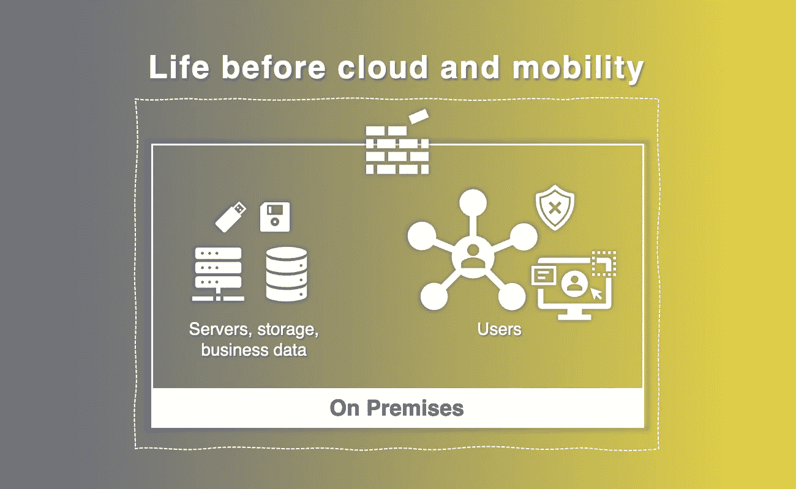
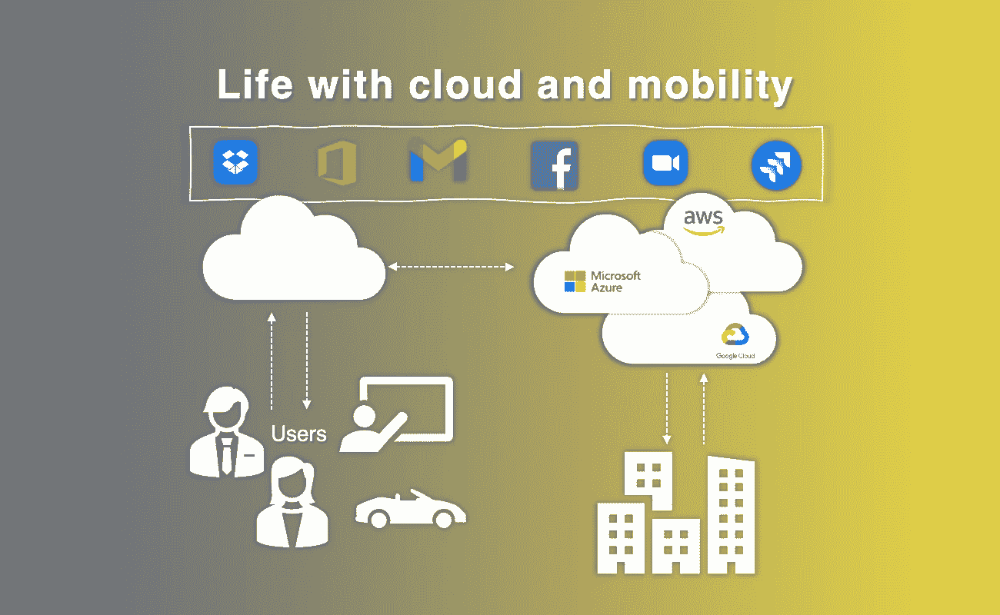
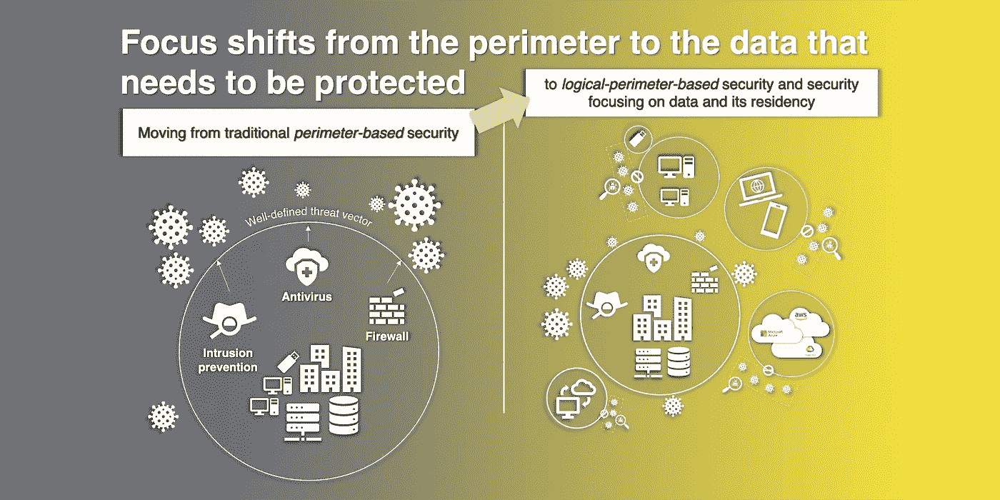
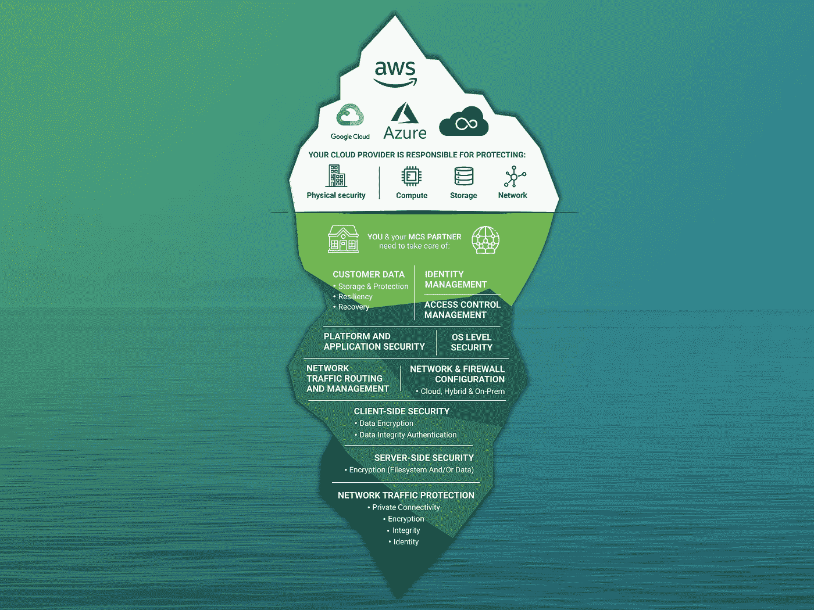
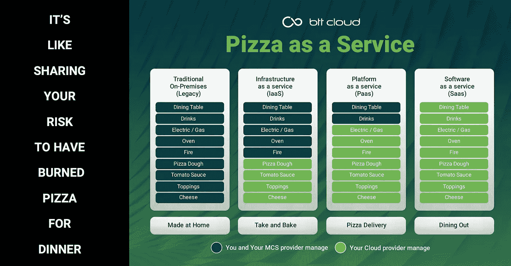

# 云中的安全性与云的安全性

> 原文：<https://medium.com/nerd-for-tech/security-in-the-cloud-vs-security-of-the-cloud-114dbcf962a9?source=collection_archive---------4----------------------->

我喜欢纠正那些说云服务是明天的现实的人，我认为它已经是昨天的或者至少是今天的现实。事实上，到 2019 年，90%的公司都在云上*(来源:451research.com)*无论是一英尺高还是全高。

亚马逊网络服务(AWS)、微软 Azure、谷歌云平台和其他公共云平台为组织提供了许多好处，使他们能够更快地响应、可用、经济高效地上市。云还提供了许多新的安全功能(强大的身份和访问管理、策略执行、分层安全、威胁保护)，但这并不意味着组织不应该担心他们的 AWS、Azure、GCP 或其他平台环境中的安全。

Gartner 估计，到 2025 年， [99%的云安全故障将是客户的过错](https://www.gartner.com/smarterwithgartner/is-the-cloud-secure/)。这是一种令人震惊的事实。AWS 甚至发明了现在著名的[共享责任模型](https://aws.amazon.com/compliance/shared-responsibility-model/)来教育客户这些风险以及他们在保护工作负载中的作用，但看起来大多数组织仍然不明白，仍然不明白“云的安全性”和“云中的安全性”之间的区别。后一个是我们应该更好理解和掌握的，到 2025 年证明高德纳是错的😎

# 有什么区别，为什么要关心？

“云中的安全性”和“云的安全性”听起来好像是同一件事情的不同说法，但它们是两种不同形式的安全性。它们也代表了现代 IT 安全从业者正在经历的思维模式的转变。

云安全**:**

*   指云本身运行应用程序、存储数据和处理事务的安全性，
*   涉及保护云计算环境免受外部和内部网络安全威胁的程序和技术，
*   当使用公共云时，数据和应用程序由第三方托管，而在传统 IT 中，大多数数据保存在自我控制的网络中。

安全**中的**云:

*   指使用云计算存储、处理和交换数据的用户的安全性和意识，
*   就像使用 Gmail、Microsoft Office 365 和其他在云中运行的应用程序一样，如果你把密码给了一个陌生人，
*   作为应用程序/产品所有者的组织负责保护应用程序、网络服务、存储访问、操作系统、支持基础架构和云中运行的其他资产。
*   完全依赖云供应商内置安全性的组织将他们的组织暴露在不必要的风险中。

# 从传统的基于边界的安全性转变为基于数据的安全性

组织仍然面临安全漏洞，尤其是由简单的云错误配置导致的安全漏洞的主要原因是，IT 安全从业者落后于从传统 IT 向云和移动性驱动的 IT 的转变。

## 是什么推动了这种变化？

在大多数组织中，云计算、自带设备和移动性出现之前的生活是这样的:

组织'它有一个明确的边界，可以得到妥善的保护

*   组织资源只能通过受管理的设备和网络访问，
*   它只安装经过批准的应用程序，
*   它有保护内部基础设施、资源和业务应用程序的多层防御，
*   它有一个已知的安全边界和充分的能见度。

如今，拥有支持云和移动性的用户的典型组织如下所示:

组织的 IT 边界模糊不清，数据分散在许多不同的位置

*   用户现在可以(且需要)从任何地方访问数据，
*   用户现在可以(并且想要)选择应用程序，这有时会带来未经批准的/影子 IT，
*   数据被用户和云 app 大量共享(用户决定如何共享数据)，
*   它对组织数据的可见性和保护非常有限。

## **焦点从外围转移到需要保护的数据**

上面提到的组织明确的 IT 边界的消失迫使关注点从基于边界的安全转移到以数据为中心的安全。

# **共担责任模式**

好了，现在我们知道我们需要在云端保护我们的数据，但是下一件需要理解的重要事情是组织与其云供应商分担的责任级别。

这不是什么秘密，但大多数组织并不了解他们在云中独自承担的安全责任级别

我已经提到了共享责任模型，它由 AWS 和现在所有的公共云提供商进行了很好的定义。为了使它更容易理解，我总是喜欢与“比萨饼作为一种服务”的著名比较，你可以在互联网上找到许多形式。

简化了云的共享责任模型

强烈建议看看最受欢迎的公共云提供商提供的共同责任模型:

*   AWS:[https://AWS . Amazon . com/compliance/shared-responsible-model/](https://aws.amazon.com/compliance/shared-responsibility-model/)
*   微软:[https://docs . Microsoft . com/en-us/azure/security/fundamentals/shared-respons ibility](https://docs.microsoft.com/en-us/azure/security/fundamentals/shared-responsibility)
*   Google:[https://services . Google . com/FH/files/misc/GCP _ PCI _ SRM _ _ apr _ 2019 . pdf](https://services.google.com/fh/files/misc/gcp_pci_srm__apr_2019.pdf)

# **少数**即将到来的**相关文章**

如果你对这篇文章感兴趣，你可能会想以后再来这里，因为我将会发布几篇相关的文章:

1.  **云中的主要安全风险—** 简而言之，为了更好地理解组织在云中可能面临的安全风险，下面的文章将介绍云中的一些主要安全风险。
2.  **IT 安全专员在现代组织中需要具备的五大能力—** 还将有一篇文章介绍现代 IT 安全专员最重要的新能力。