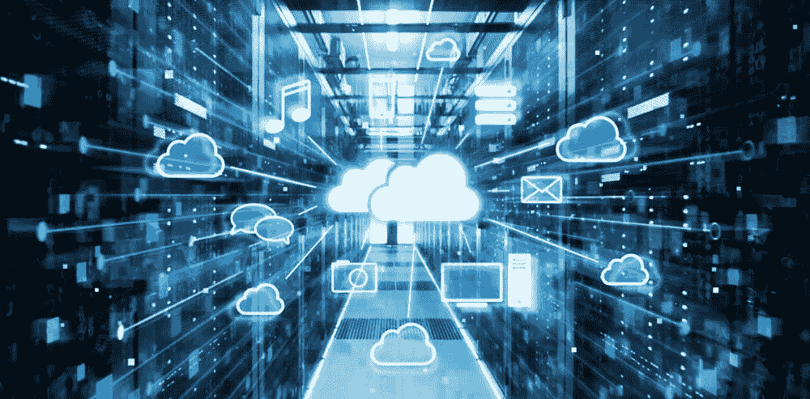
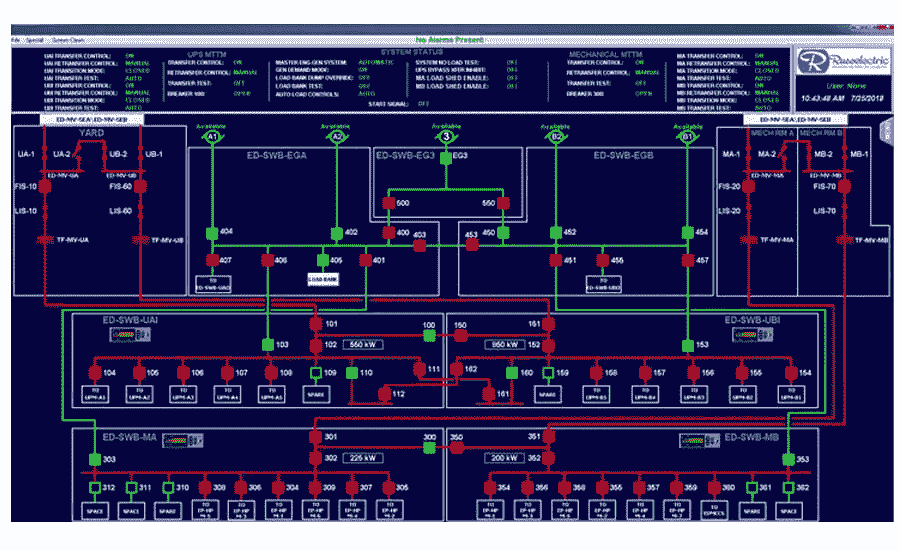
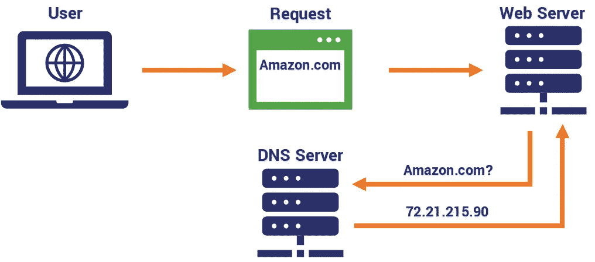
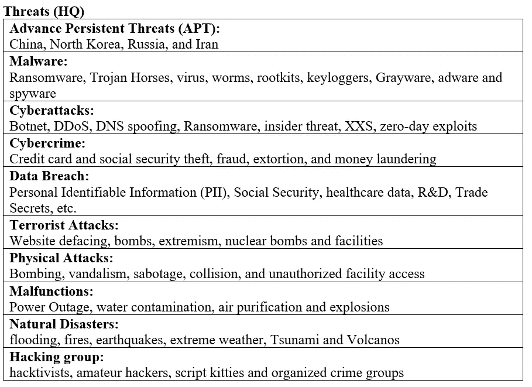
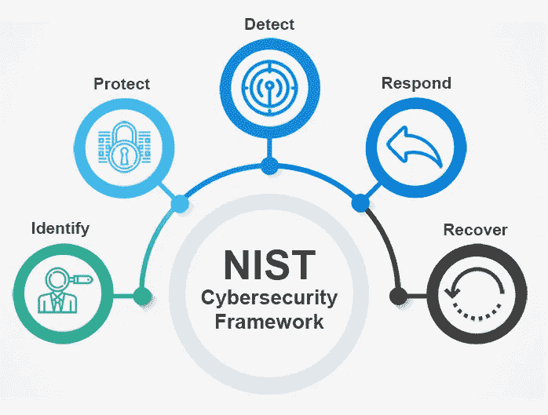
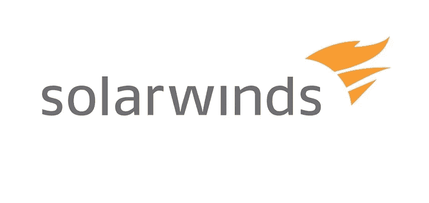
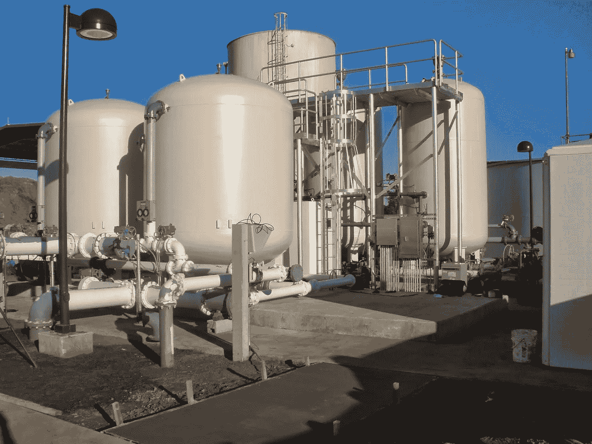

# 安全矩阵—关键基础设施

> 原文：<https://medium.com/nerd-for-tech/security-matrix-critical-infrastructure-4ef84f3a1a13?source=collection_archive---------11----------------------->

**信息技术(IT)部门**

信息技术(IT)部门生产和提供“为全球政府、关键基础设施部门、商业企业和个人提供高质量的 IT 产品和服务”(CISA)。第 21 号总统政策指令(PPD-21)宣布信息技术部门是美国的关键基础设施。本质上，IT 部门与通信部门是相互联系的，这使得政府和私营公司能够保持联系。因此，这就形成了一个很大的攻击面，使其容易受到网络攻击。IT 部门是动态而复杂的，因为它在全球范围内连接了数量可观的信息系统和设备。国土安全部(DHS)正在政府和私营部门之间开展合作。他们的目标是，“持续减少事故对该部门关键职能的影响”(CISA)。为了实现这一目标，实施了 3 项战略:IT 部门产品和服务风险管理战略、IT 部门事故管理战略和 IT 部门互联网路由风险管理战略。(DHS)该部门不仅包括有形资产，还包括虚拟网络以及为私营和政府部门提供关键服务的网络。信息技术部门提供 6 项关键职能:(CISA)

1.IT 产品和服务

2.事故管理能力

3.域名解析服务(DNS)

4.确定管理和相关的信托支持服务

5.基于互联网的内容、信息和通信服务

6.互联网路由、访问和连接服务

政府和私人实体之间必须共同努力，公开沟通，以最大限度地减少威胁，收集情报，提高认识，确保有效的事件响应，并减轻损失。最终，我们必须通力合作，确保 IT 基础设施的安全。

**组织**

国家基础设施保护计划(NIPP)是一个部门伙伴关系模式，鼓励公共和私营部门在各自的基础设施保护活动中开展合作。伙伴关系由联邦、州、地方、部落和地区政府实体组成。国土安全部(DHS)被指定专门监督信息技术部门。(CISA)

**国土安全部(DHS)**

DHS 采用了解风险、防范所有危害的方法来保护网络空间的关键基础设施。它与国内和国际伙伴合作，共同保护网络威胁。集体方法是预防、防范、缓解、响应、调查和恢复网络事件。(DHS)

**网络安全&基础设施安全局(CISA)**

作为国家旗舰网络防御、事件响应和运营整合中心，CISA 的任务是降低网络安全和通信挑战的风险。(CISA) CISA 是全国网络和通信、技术知识和运营整合的中心。该组织每周 7 天、每天 24 小时运营，以提高意识、分析和提供事件响应。它通过通知漏洞、入侵、事件、缓解和恢复措施，帮助确保私营部门和政府部门共享信息。(CISA)

**资产**

IT 部门由物理资产组成，包括硬件，如服务器、台式机、笔记本电脑等。监控和数据采集(SCADA)系统、软件以及信息技术系统和服务。资产是动态的，随着数据和服务转移到基于云的环境，资产的数量也在增加。下面列出的是两种资产，它们按照高、中或低的重要程度以及发生的可能性进行评级。

**SCADA**

**危险程度:高可能性:中等**

监控和数据采集(SCADA)系统对于工业组织来说至关重要，有助于保持效率，处理数据以做出更明智的决策，并传达系统问题以帮助缓解市中心问题。(自动化感应)SCADA 系统有几个组件，如与其他传感器、机器和设备通信的可编程逻辑控制器(PLC)。关键基础设施严重依赖 SCADA 系统运行。例子包括运输、交通灯、水分配和发电厂。(自动化归纳)信息系统不断受到高级持续威胁(APT)和其他威胁参与者的攻击。保护这些资产是确保 IT 部门安全的重要任务之一。

**DNS**

**关键程度:高—可能性:低**

域名系统(DNS)，也称为互联网的电话簿，负责包含所有 IP 地址并将它们连接到域。IP 地址到域的转换允许网络浏览器加载互联网资源。DNS 是互联网主干网的主要组成部分之一。DNS 是一项重要资产，保护对于确保互联网及其资源的完整性、可用性和可访问性的安全任务至关重要。保护这些资产对于确保 IT 部门的安全至关重要。

**安全条例**

网络安全领域正在发展壮大，并且变得越来越难以监管、理解和控制。确保个人受到保护和安全至关重要。个人、政府和商业实体之间的隐私问题是复杂的，需要政府为个人、企业和国家制定政策。

**1986 年电子通信隐私法(ECPA)**

最初的隐私法已经被修改，以包括当前技术的信息收集。美国政府可以通过传票收集信息，如通过手机、电子邮件、社交媒体消息等进行 GPS 跟踪。ECPA 是一种对犯有知识产权盗窃、欺诈和间谍行为的个人和实体进行迫害和定罪的手段。

**通用数据保护条例(GDPR)**

GDPR 是目前在欧盟使用的隐私法。美国受国际商业关系和政府参与的法律影响。这项法律是为了保护用户的数据在他们不知情的情况下不被收集。GDPR 为企业和其他组织如何处理与他们交互的个人相关的信息提供了协议。(GDPR) GDPR 定义了个人数据、责任标准、同意类型、数据的解释和处理。(GDPR)

**情报来源**

有许多情报收集实体与政府和私营部门合作。他们的目的是收集、处理和分析数据，以了解威胁参与者的动机、目标和攻击行为。(FireEye)这是为了创建更好的安全态势，以防止、检测和阻止来自犯罪集团、黑客和民族国家的威胁。

Mandiant 提供软件即服务(SaaS)平台。这些工具跟踪已知的威胁，并为安全从业者提供可见性和信息，以预防、检测和阻止威胁。该公司专注于调查、威胁追踪、事件响应和对手研究。(FireEye) FireEye 负责检测 2019 年 3 月的网络安全管理软件产品攻击，并提供专业知识来找到问题并帮助减轻损失。

**国土安全部(DHS)**

情报和分析办公室(I&A)是 DHS 的一个组成部分。它管理整个部门的流程，在联邦和地方两级协调和执行情报周期。(DHS)他们的重点是威胁识别、缓解和响应。该部向联邦和地方政府的其他机构提供威胁情报。

**框架**

**国家标准与技术研究所(NIST)**

2014 年《加强网络安全法案》更新了 NIST 的作用，将识别和制定网络安全风险框架纳入其中。他们的责任是“优先考虑灵活、可重复、基于性能和具有成本效益的方法，包括关键基础设施的所有者和运营商可能自愿采用的信息安全措施和控制，以帮助他们识别、评估和管理网络风险”(NIST)。

**IT 行业风险评估方法**

信息技术部门方法采用自上而下基于职能的方法，将该部门支持经济和国家安全的能力作为国家一级风险评估范围的一部分。这些步骤如下所示:(NIST)

**步骤 1:** 范围评估

**第二步:**评估威胁

**第三步:**评估漏洞

第四步:评估后果

**步骤 5:** 创建风险简介

**漏洞**

IT 基础设施与政府和私人实体相互连接。攻击面很大，允许大量的漏洞。(康斯坦丁)

**预防性&检测控制**

**入侵防御系统**

IPS 是一种预防性控制，为分析互联网流量提供了另一层保护。IPS 内置于(源和目的地之间的直接通信路径中)，主动分析进入网络的所有流量并采取自动措施。(Palo)威胁的设备/软件警报管理员会丢弃恶意的互联网数据包，并根据不同的标准(如 IP 地址、Mac 地址和域名)阻止互联网流量。

**防病毒保护**

防病毒软件具有多种功能来帮助检测 IT 系统上的恶意软件，例如基于签名的检测来检测当前已知的威胁。(诺顿)这些工具用于台式机、笔记本电脑和手机上的终端安全，下至个人用户级别。

**事件响应**

**国家网络事件响应计划**

NCIRP 是一种应对网络事件的国家方法，强调私营部门、州和地方政府以及联邦机构在应对事件中发挥的重要作用，以及这些活动如何相互配合。(CISA)此计划与 NIST 框架协调工作，以提供最佳安全实践和事件响应。示例包括安全设计、安全架构和安全编码技术。(NIST)

**安全运营中心(SOC)审计清单**

审计清单评估您当前的安全状况，并将评估您的 SOC 的流程和技术以适应特定的行业。示例包括医疗保健数据和遵守 HIPAA、PII、PCI 法律，以及数据的正确存储。(CISA)US-CERT 和 DHS 是负责 IT 部门事件响应的两个机构。

**最近发生的事件**

**网络安全管理软件产品供应链攻击:2019 年 3 月**

网络安全管理软件产品提供软件即服务(SaaS)，截至 2019 年总收入约为 9.38 亿美元。(维基百科)网络安全管理软件产品提供的服务之一，产品套件*猎户座*早在 2019 年 3 月就被攻破，直到 2020 年 12 月才被发现。(Pam，Baker)向 18，000 名客户推出了更新，安装了更新的客户受到了恶意软件通过远程访问特洛伊木马(RAT)对系统的访问。(奥尔德逊)网络安全管理软件产品供应链黑客极其复杂。数据泄露的估计恢复成本为 1000 亿美元，因为它损害了联邦机构和私营公司的利益。(拉特南)

**科洛尼亚管道:2021 年 5 月 6 日**

科洛尼亚管道提供了大约 45%的东海岸石油产品。该公司每天运输超过 1 亿加仑的燃料。(奥斯本)2021 年 5 月 6 日，黑暗势力攻击并获得了 IT 系统的访问权。第二天，他们发起了勒索软件攻击，加密了超过 100GB 的数据，关闭了管道。该团伙要求大约 500 万美元的赎金。该管道于 2021 年 5 月 12 日重新开通。这是迄今为止对一个国家基础设施的关键组成部分最成功的网络攻击。(奥斯本)

**佛罗里达水系:2021 年 2 月 5 日**

佛罗里达州奥尔德斯马尔的水处理厂遭到破坏，入侵者将供水中的氢氧化钠(或碱液)含量提高到正常水平的 100 倍。当攻击者退出系统时，工程师将固体水平降低到正常水平。有适当的安全措施来防止水被释放。此次攻击提醒州政府和联邦政府，这些系统是多么容易受到攻击，以及当前 IT 系统的安全差距有多大。

**作品引用**

自动化，归纳。“什么是 SCADA？”*感应自动化*，感应自动化，2018 年 9 月 12 日，inductiveautomation.com/resources/article/what-is-scada.

贝克帕姆。“突发事件和更新。” *CSO* 。IDG 通讯，2021 年 6 月 4 日。网络。2021 年 9 月 11 日。

贝加尔珍妮。"佛罗里达黑客暴露了供水系统的危险."*皮尤慈善信托基金*，皮尤，2021 年 3 月 21 日，[www . Pew Trusts . org/research-and-analysis/blogs/state line/2021/03/10/Florida-hack-exposes-danger-to-water-systems。](http://www.pewtrusts.org/research-and-analysis/blogs/stateline/2021/03/10/florida-hack-exposes-danger-to-water-systems.)

布兰登拉塞尔。"网络安全管理软件产品在毁灭性的黑客攻击后隐藏了高知名度客户的名单."*濒临绝境*。The Verge，2020 年 12 月 15 日。网络。2021 年 9 月 11 日。

CISA。"网络安全和基础设施安全局."*www.cisa.gov/.*、[CISA 网络安全与基础设施安全局](http://www.cisa.gov/.)

康斯坦丁，卢西恩。" 33 硬件和固件漏洞:威胁指南." *CSO Online* ，CSO，2021 年 1 月 7 日，[www . csoonline . com/article/3410046/hardware-and-firmware-vulnerabilities-a-guide-to-the-threats . html？page=2。](http://www.csoonline.com/article/3410046/hardware-and-firmware-vulnerabilities-a-guide-to-the-threats.html?page=2.)

DHS。“通过保护信息技术来保护关键基础设施。”*国土安全部*2018 年 9 月 21 日[www . DHS . gov/blog/2011/07/22/protecting-critical-infra structure-securing-information-technology。](http://www.dhs.gov/blog/2011/07/22/protecting-critical-infrastructure-securing-information-technology.)

火眼。“Mandiant 英特尔网格”*火眼*，火眼，2021，[www.fireeye.com/mandiant/intel-grid.html.](http://www.fireeye.com/mandiant/intel-grid.html.)

GDPR。" GDPR——通用数据保护条例用户友好指南."*www.gdpreu.org/. GDPR 欧盟*GDPR 2020 年 12 月 21 日

美国宇航局。《NASA . gov》*NASA*，NASA，2016，[www.hq.nasa.gov/security/it_threats_vulnerabilities.htm.](http://www.hq.nasa.gov/security/it_threats_vulnerabilities.htm.)

NIST。“改善关键基础设施网络安全的框架。”*NIST.gov*，NIST.gov，2018 年 4 月 6 日，nvlpubs.nist.gov/nistpubs/CSWP/NIST.CSWP.04162018.pdf.

诺顿。"有哪些关于互联网和数据安全的法律？"*有哪些关于互联网和数据安全的法律？*，诺顿，2021，us . Norton . com/internet security-privacy-laws-about-internet-data-security . html。

奥斯本，查理。"殖民管道攻击:你需要知道的一切."ZDNet ，ZDNet，2021 年 5 月 13 日，[www . ZDNet . com/article/colonial-pipeline-ransomware-attack-everything-you-need-to-know/。](http://www.zdnet.com/article/colonial-pipeline-ransomware-attack-everything-you-need-to-know/.)

帕洛阿尔托网络。"什么是入侵防御系统？"*帕洛阿尔托网络*，帕洛阿尔托网络，2021，[www . Palo Alto Networks . com/cyber pedia/what-a-an-intrusion-prevention-system-IPS。](http://www.paloaltonetworks.com/cyberpedia/what-is-an-intrusion-prevention-system-ips.)

拉特南，戈帕尔。"恢复网络安全管理软件产品黑客攻击可能需要 1000 亿美元以上." *GovTech* 。政府技术，2021 年 4 月 21 日。网络。2021 年 9 月 12 日。

泰勒·丽贝卡。"四种主要的 DNS 攻击类型以及如何减轻它们." *BlueCat Networks* ，BlueCat Networks，2021 年 8 月 13 日，blue cat Networks . com/blog/four-major-DNS 攻击类型以及如何减轻攻击

维基百科，维基百科。“网络安全管理软件产品。”*维基百科*。维基媒体基金会，2021 年 9 月 4 日。网络。2021 年 9 月 11 日。