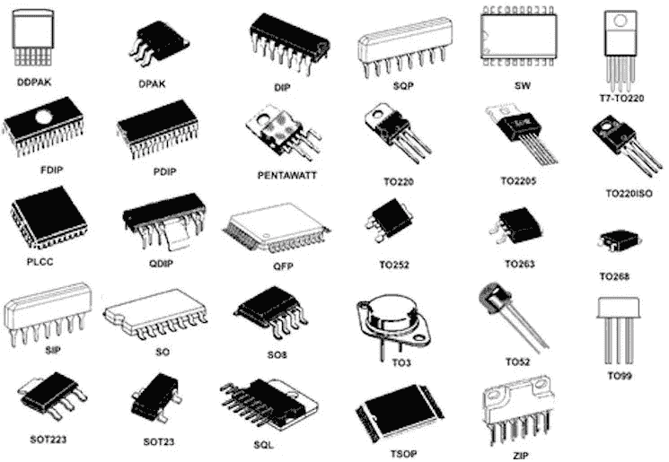

# 为您的嵌入式系统解决方案选择合适的微控制器

> 原文：<https://medium.com/nerd-for-tech/selecting-the-right-microcontroller-for-your-embedded-systems-solution-ce4ef7ecb906?source=collection_archive---------4----------------------->

**为项目选择正确的微控制器**总是一个复杂的决定，因为它是项目的核心，系统的成败取决于此。

有一千种不同类型的微控制器，每一种都有独特的功能或竞争优势；从外形尺寸到封装尺寸，再到 RAM/ROM 的容量，它们适合某些应用，而不适合其他应用。因此，为了避免两者之间带来的头痛，设计人员通常选择他们熟悉的微控制器，这有时会导致灾难性的结果，因为所选的 MCU 可能无法满足项目的要求。为了提供一种更简单的方法，今天的文章将探讨为您的项目选择微控制器时需要考虑的一些重要因素，从架构、存储器到接口和 I/O 面积。

# 选择 MCU 时需要考虑的重要因素

以下是选择微控制器之前需要考虑的一些重要因素:

# 1.应用

在为任何项目选择微控制器之前，要做的第一件事是深入了解项目要部署的任务。在此过程中，设计团队通常会制定一份技术规格表，应参考该表来确定微控制器所需的具体特性。器件的应用/使用如何决定所使用的微控制器的一个很好的例子是选择具有浮点单元的微控制器，用于设计将用于执行涉及许多十进制数的运算的器件。

# 2.选择微控制器架构

微控制器的架构是指微控制器的内部结构。有两种主要的架构用于微控制器的设计；

1.  冯·诺依曼建筑
2.  哈佛建筑

冯诺依曼架构的特点是使用相同的总线来传输数据和从存储器中提取指令集。因此，数据传输和取指令不能同时执行，通常是按计划进行的。另一方面，哈佛体系结构的特点是使用单独的总线来传输数据和获取指令。

每种架构都有自己的优点和缺点。例如，基于哈佛体系结构的 MCU 是 RISC(精简指令集)计算机，因此比基于冯·诺依曼体系结构的 CISC(复杂指令集)计算机能够以更低的周期执行更多的指令。基于 Harvard (RISC)的微控制器的一个重要优点是，数据和指令集的不同总线的存在使得存储器访问和算术逻辑单元(ALU)的操作分离。这降低了微控制器所需的计算能力，从而降低了成本、功耗和散热，非常适合电池供电器件的设计。许多 ARM、AVR 和 PIC 微控制器都基于哈佛架构。使用冯诺依曼架构的微控制器的例子包括 8051、Zilog Z80 等。

3.比特大小

微控制器可以是 8 位、16 位、32 位和 64 位，这是微控制器当前拥有的最大位长。微控制器的位大小代表微控制器的指令集中使用的“字”的大小。这意味着在 8 位微控制器中，每个指令、地址、变量或寄存器的表示都需要 8 位。位大小的一个关键含义是微控制器的存储容量。例如，在 8 位微控制器中，有 255 个由位大小决定的唯一存储器位置，而在 32 位微控制器中，有 4，294，967，295 个唯一存储器位置，这意味着位大小越高，微控制器上可用的唯一存储器位置的数量就越多。然而，目前制造商正在开发通过分页和地址向较小位尺寸的微控制器提供对更多存储位置的访问的方法，从而使 8 位微控制器变成 16 位可寻址的，但这往往会使嵌入式软件开发人员的编程变得复杂。

> 在为微控制器开发固件时，尤其是算术运算时，位大小的影响可能更明显。对于不同的微控制器位大小，各种数据类型具有不同的存储器大小。例如，使用声明为无符号整数的变量，由于数据类型的原因，将需要 16 位的存储器，在 8 位微控制器上执行的代码将导致数据中最高有效字节的丢失，该字节有时对于完成使用微控制器的设备所设计的任务可能非常重要。

因此，**选择位大小与待处理数据**相匹配的微控制器非常重要。

值得注意的是，由于芯片的先进性能，目前大多数应用都是 32 位到 16 位微控制器。

# 4.通信接口

微控制器和将用于该项目的一些传感器和致动器之间的通信可能需要使用微控制器和传感器或致动器之间的接口来促进通信。例如，将模拟传感器连接到微控制器将要求微控制器具有足够的 ADC(模数转换器),或者正如我前面提到的，改变 DC 电机的速度可能需要使用微控制器上的 PWM 接口。因此，确认要选择的微控制器具有足够的所需接口非常重要，包括 UART、SPI、I2C 等。

# 5.工作电压

工作电压是系统设计运行的电压水平。它也是与系统的某些特性相关的电压电平。在硬件设计中，工作电压有时决定微控制器与组成系统的其它元件通信的逻辑电平。

5V 和 3.3V 电压电平是微控制器最常用的工作电压，在技术规格开发过程中，应决定使用哪种电压电平。在大多数外部组件、传感器和致动器将在 5V 电压电平上工作的设备设计中使用具有 3.3V 工作电压的微控制器将不是非常明智的决定，因为将需要实现逻辑电平移位器或转换器来实现微控制器和其他组件之间的数据交换，并且这将不必要地增加制造成本和设备的总成本。

# 6.I/O 引脚的数量

微控制器拥有的通用或专用输入/输出端口和(或)引脚的数量是影响微控制器选择的最重要因素之一。
如果微控制器具备本文提到的所有其他特性，但没有项目所需的足够多的 IO 引脚，则无法使用。重要的是微控制器有足够的 PWM 引脚，例如，控制 DC 电机的数量，其速度将由设备改变。虽然可以通过使用移位寄存器来扩展微控制器上 I/O 端口的数量，但是它不能用于所有类型的应用，并且增加了所设计器件的成本。因此，最好确保所选的微控制器具有所需数量的通用和专用 I/O 端口。

> 在确定项目所需的通用或专用 I/O 引脚数量时，需要记住的另一个关键因素是未来可能对器件进行的改进，以及这些改进会如何影响所需的 I/O 引脚数量。

# 7.内存要求

有几种与微控制器相关的存储器类型，设计人员在选择时应该注意。最重要的是 RAM、ROM 和 EEPROM。在使用之前，可能很难估计这些存储器的数量，但是根据微控制器所需的工作量来判断，可以做出预测。上面提到的这些存储设备形成了微控制器的数据和程序存储器。

微控制器的程序存储器存储微控制器的固件，因此当微控制器断电时，固件不会丢失。所需的程序内存量取决于固件正常工作所需的数据量，如库、表、映像的二进制文件等。

另一方面，数据内存在运行时使用。在运行期间，作为其他活动的处理结果而生成的所有变量和数据都存储在该存储器中。因此，在运行期间发生的计算的复杂性可以用来估计微控制器所需的数据存储量。

# 8.包装尺寸

封装尺寸指的是微控制器的**外形尺寸**。微控制器通常采用从 QFP、TSSOP、SOIC 到 SSOP 的封装，以及常规 DIP 封装，这使得安装在试验板上进行原型制作变得容易。重要的是在生产之前就做好计划，并设想哪种包装是最好的。

包装

# 9.功率消耗

这是选择微控制器时要考虑的最重要因素之一，尤其是当微控制器要部署在电池供电的应用中时，如[物联网设备](https://circuitdigest.com/internet-of-things-iot-projects)，要求微控制器的功耗尽可能低。大多数微控制器的数据手册包含有关不同硬件和(或)基于软件的技术的信息，这些技术可用于最小化微控制器在不同模式下的功耗。确保您选择的微控制器满足您项目的电源要求。

# 10.支持微控制器

重要的是，您选择使用的微控制器要有足够的支持，包括:代码样本、参考设计，如果可能的话，还有一个大型在线社区。第一次使用微控制器可能会遇到不同的挑战，访问这些资源将有助于您快速克服这些挑战。虽然使用最新的微控制器是一件好事，因为它具有很酷的新功能，但建议确保微控制器已经存在至少 3-4 个月，以确保大多数可能与微控制器相关的早期问题已经得到解决，因为各种客户已经用不同的应用对微控制器进行了大量测试。

选择具有**良好评估套件**的微控制器也很重要，这样您可以快速开始构建原型并轻松测试功能。评估套件是获取经验、熟悉开发工具链以及节省器件开发时间的好方法。

为项目选择正确的微控制器将继续是每个硬件设计人员必须解决的问题，虽然可能影响微控制器选择的因素不多，但上面提到的这些因素是最重要的。