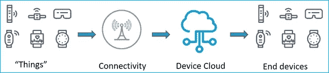
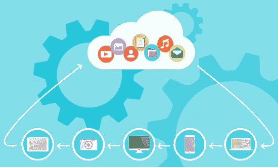
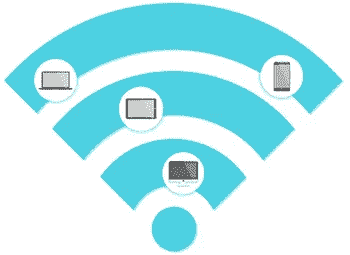

# 为物联网解决方案选择合适的平台

> 原文：<https://medium.com/nerd-for-tech/selecting-the-right-platform-for-your-iot-solution-f2a9db661068?source=collection_archive---------3----------------------->

Gartner 在 2017 年的一份报告中预测，到 2020 年，互联网上连接的“*事物*的数量将超过 204 亿。但是，从目前发现物联网如何帮助优化其流程的企业，以及利用各种创新解决方案颠覆现有市场并开拓新市场的企业家在世界各地部署物联网解决方案的速度来看，可以肯定地说，到 2020 年，物联网解决方案的数量将会大大增加。

到 2020 年，联网设备的预期数量

联网设备数量稳步增长的主要促进因素之一是物联网平台。它们提供一系列集成服务和基础设施(数据存储、连接等)。)一般需要将“物”连接到互联网。他们处理项目的大部分繁重工作，减少部署解决方案所需的工作量和投资，并且是目前一些最成功的物联网解决方案背后的主要原因之一。

这使得它们成为任何物联网解决方案部署中不可或缺的一部分。然而，根据 IoT-Analytics 的一份报告，物联网平台市场一直在增长，截至 2017 年的最后一次统计，**物联网平台的数量已增加到约 450 个**，比上一年增加了 200 个。这种大量的选择为开发人员带来了一系列独特的挑战，因为选择完美的平台变得相当困难。本文将通过研究**不同类型的物联网平台**，并强调在做出选择时要考虑的一些**因素，来简化这项任务。**

# 物联网平台的类型

将物联网平台分为不同类型的最简单方法之一是根据最基本的**物联网架构**(如下所示)对其进行分类。

基本物联网解决方案架构

基于此，我们可以将物联网平台分为四种主要类型；

1.  硬件平台
2.  连接平台
3.  设备云平台
4.  端到端平台

一个接一个地检查它们；

# 1.硬件平台

我在 [Circuit Digest 这里](https://circuitdigest.com/article/top-hardware-platforms-for-internet-of-things-iot)的一篇文章中谈到了这种平台。它们本质上是用于物联网中“事物”的设计和开发的平台。它们包括多种多样的**微控制器和微处理器**，这些微控制器和微处理器具有特殊功能，适合多种物联网用例。例子包括刨花板等。

# 2.连接平台

这些平台主要关注设备如何使用从 NB-IoT 到 LoRa 的各种低功耗、低成本电信介质连接到互联网。好的例子包括 Sigfox、AirVantage、Hologram 和 particle。

# 3.设备云平台

这些平台有不同的风格，这可能是你拥有最多玩家的地方。传统上，它们为设备数据提供网络基础设施和存储空间，能够连接数千到数百万台设备。其中一些平台附带了额外的差异化功能，用于数据分析和可视化、设备监控/管理等。好的例子包括:AWS，PTC 的 ThingsWrox，Thingspeak，Azure 等。了解[如何开始使用物联网 AWS](https://circuitdigest.com/tutorial/getting-started-with-amazon-aws-for-iot-projects)。

设备云

# 4.端到端平台

这些平台在技术上结合了上述其他平台的所有成果。他们提供硬件(直接或通过合作关系)、连接性、设备云、安全性以及将设备连接到互联网所需的所有其他东西。从服务到硬件的集成特性使设备管理成为他们的一项轻松任务。当部署您的第一个物联网解决方案时，这些平台可能是最好的选择，因为它们有助于消除组合不同物联网堆栈和平台所涉及的复杂性。本节中一个很好的平台例子是*粒子*。

除了使用基本物联网架构进行分类之外，**这些平台还可以根据其支持的物联网垂直领域进行分类**(从特定行业到独特类型的客户)。例如，GE Predix 和 Honeywell IoT suite 等平台专为服务工业物联网市场的用户而设计，而 BluePillar 等平台则提供服务能源行业用户的能源即服务平台。像 AWS 和 thingsWorx 这样看似通用的平台也存在，并且可能最适合某些项目。

# 选择平台时要考虑的因素

对于物联网平台来说，任何项目都没有“一刀切”。*根据*[*engineering.com*](https://www.engineering.com/IOT/ArticleID/11759/IBM-Watson-IoT-Platform-to-Help-Engineers-with-Product-Development.aspx?utm_source=datafloq&utm_medium=ref&utm_campaign=datafloq)*的一份报告，由于平台挑战，物联网设备产生的 90* %的数据目前没有被使用。因此，需要仔细考虑，以确保所使用的平台是项目的最佳选择。

以下是您在选择平台时需要考虑的一些因素；

1.  服务类型和模式
2.  兼容性(架构和技术堆栈)
3.  领域专业知识
4.  可靠性
5.  连通性
6.  可量测性
7.  安全性
8.  设备管理和监控功能
9.  集成和数据处理
10.  支持
11.  费用

# 1.服务类型/模式

选择平台时首先要考虑的是他们提供的服务种类。重要的是**确定它们是真正的端到端平台还是仅仅是一个连接平台**。真正理解平台的产品并确定它如何适应项目的目标是很重要的。

# 2.和睦相处

当您不使用端到端平台时，这个因素甚至更加重要。确保要使用的平台的架构(网络、连接)和技术堆栈(例如支持的协议)适合您的用例、您现有的产品 IP 和您项目的未来目标，这一点很重要。你应该确保在你的项目**的任何部分使用的平台之间存在互操作性。例如，如果您的“东西”基于 MQTT 通信协议，那么确保您选择作为设备云的平台支持协议**是很重要的。

# 3.领域专业知识

领域专业知识可以是围绕特定物联网垂直领域的专业知识，也可以是所提供服务的专业知识。如上所述，某些物联网平台是在考虑物联网市场的某一部分的情况下开发的，如果围绕该垂直市场开发，那么选择该空间内的平台可能是明智的。一个很好的例子是选择 GE predix 或 IBM Watson 而不是 Particle 来实施基于工业物联网的解决方案。对于所提供服务的专业知识，重要的是要确保平台提供商已经在该领域工作了很多年。

# 4.连通性

这在选择连接平台时最为重要。**需要考虑的问题包括连接方式、覆盖范围、计划等**。这个问题的答案与您的解决方案的用例以及您的硬件的兼容性尤其重要。通信模式必须在您设备的功耗预算和位置限制范围内有效，而数据计划必须基于您设备上传和下载数据的速率具有成本效益。

# 5.可靠性

平台有多靠谱？失败的可能性有多大？失败了会怎么样？数据能恢复吗？这是围绕所用平台的可靠性而提出的问题。在作出决定之前，尽可能多地获取有关生产级可靠性平台产品的详细信息。

# 6.可量测性

选择物联网设备云平台时，带宽和延迟是需要牢记的两个因素。您必须确保选择的**平台拥有所需的基础设施**，以实现您为项目设想的规模。

# 7.安全性

在选择平台时，安全性无疑是一个非常重要的考虑因素。您应该知道平台提供商为确保平台安全所采取的措施，从定期更新到身份验证和数据加密。物联网解决方案的互联性质使其成为各种攻击的可能目标，这些攻击可能会危及您的数据和项目的整体本质。这个因素应该是首先要考虑的因素之一。

# 8.设备管理和监控功能

物联网实施通常涉及在访问受限的地方部署设备。这使得通过物联网平台监控和管理设备健康和状态成为一项重要功能。一些平台对于设备管理来说非常强大，它们包括将 OTA 固件更新推送到设备的功能。确保平台能够支持您的设备可能需要的所有监控和管理功能。

# 9.集成和数据处理

设备云平台对于数据收集至关重要，但大多数平台都超越了这一点，实现了一些支持数据分析和生成可操作见解的功能。对于一些平台来说，这是额外的费用，而对于其他平台则是免费的。除了数据分析之外，物联网生成的大部分数据都用于服务不同的流程。确保该平台能够产生您的项目所需的洞察力，并且能够直接受益于您的物联网解决方案的流程能够在做出决策之前轻松集成。

# 10.支持

支持的重要性怎么强调都不为过，尤其是在部署您的第一个物联网项目时，或者第一次使用特定平台时**，可能会出现几个问题，这些问题可能会花费项目不必要的时间**。在使用任何特定平台之前，您需要确定您将获得的支持类型。

# 11.费用

物联网平台存在多种计费模式，成本往往是选择平台的主要因素。**您需要评估平台**的计费模式，将它与您的解决方案将涉及的设备数量、将生成的数据量和频率放在一起，并决定该特定平台是否最适合您。

这份清单绝非详尽无遗；物联网部署可能很复杂。让具有合适经验水平的人获得成功是很重要的。

PS:我也在 Circuit Digest 上发表了这篇文章。你可以在这里阅读它，以及我的其他几篇文章。