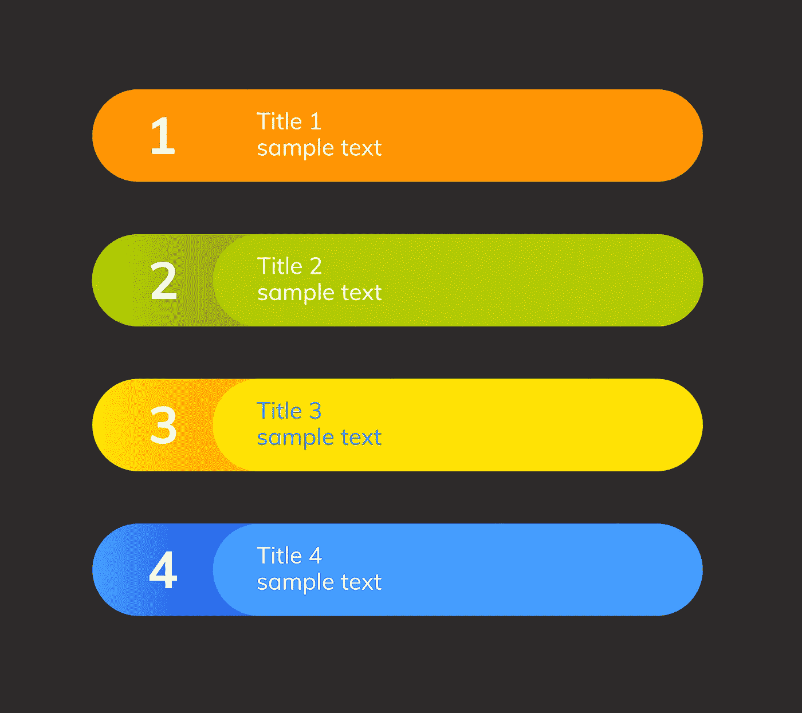
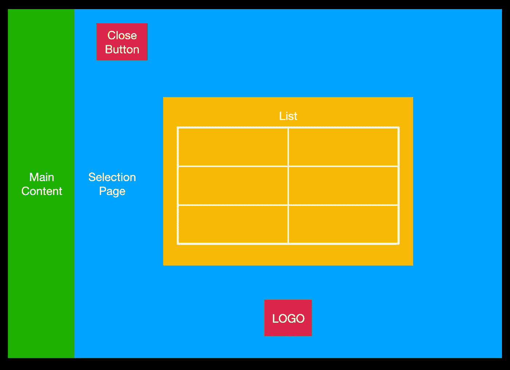
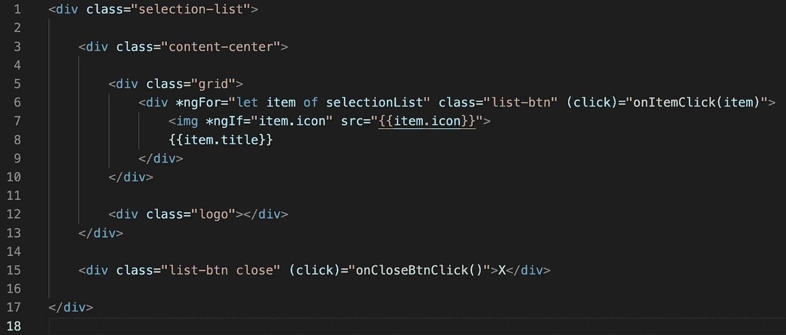
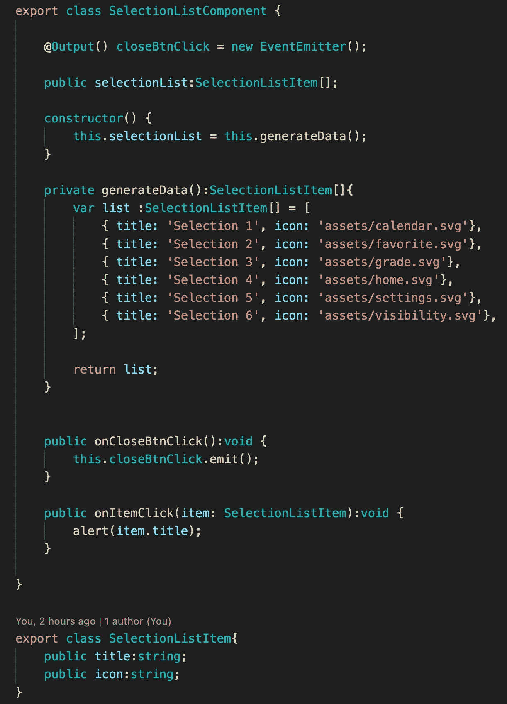
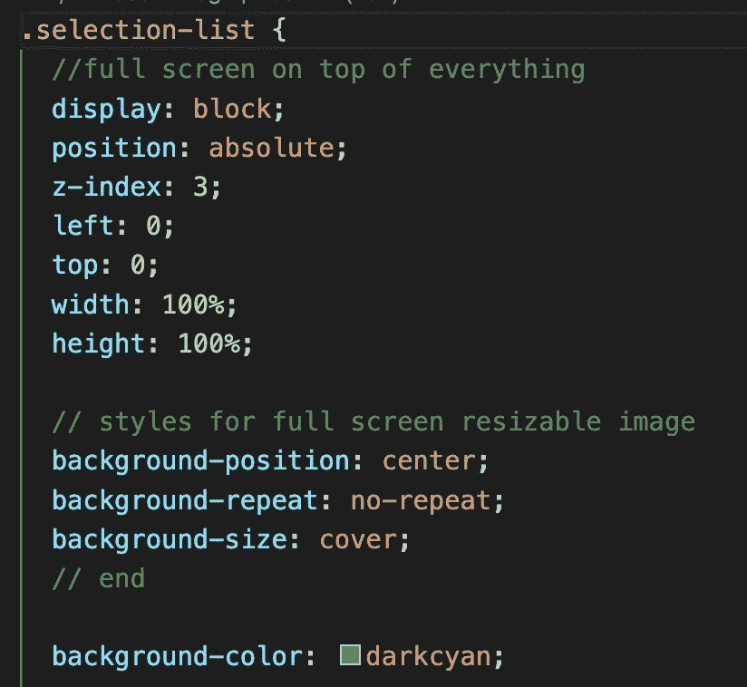
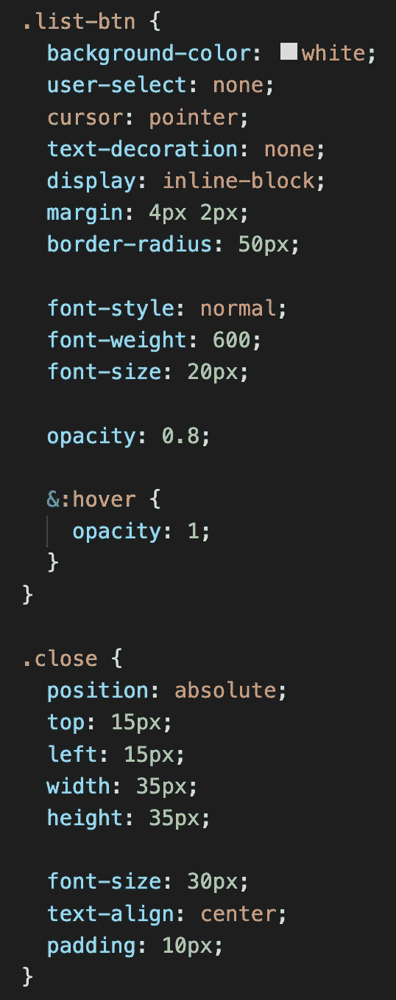
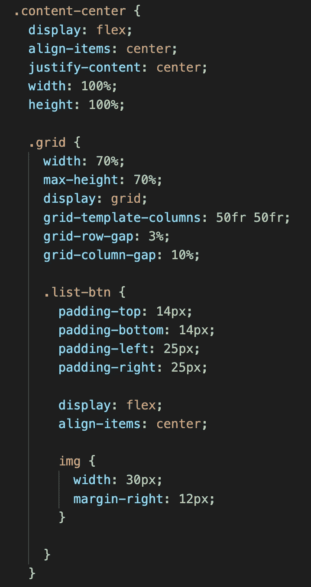
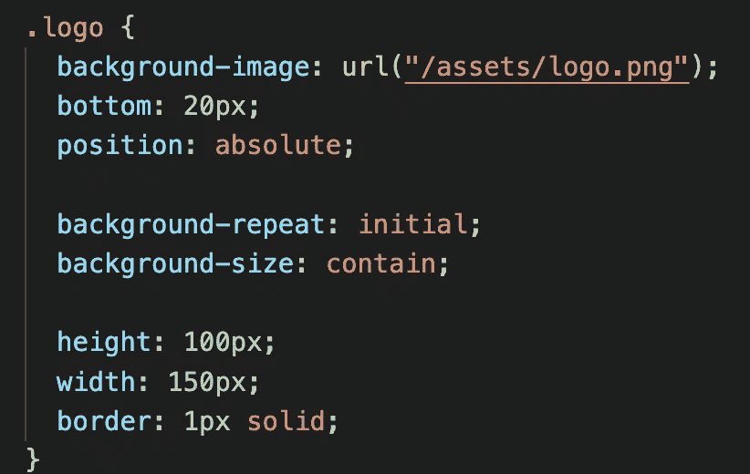
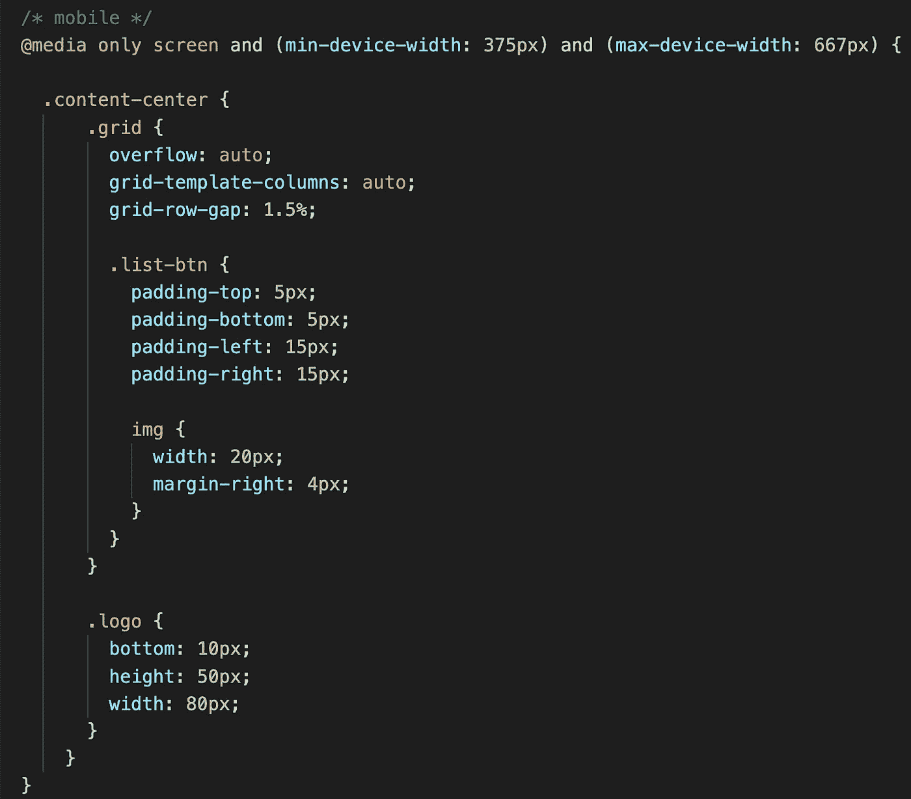
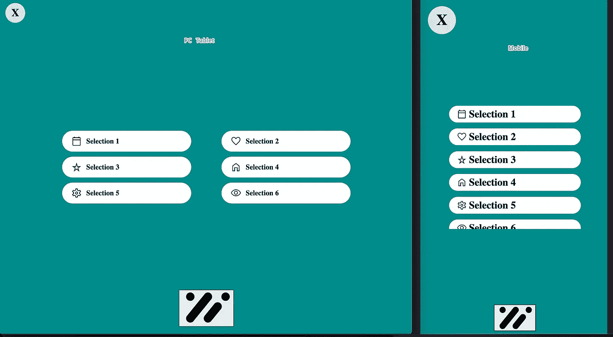

# 选择列表页面

> 原文：<https://medium.com/nerd-for-tech/selection-list-page-356aab603cda?source=collection_archive---------1----------------------->

每个应用程序都有一个选择页面。在这个页面上，用户可以选择一些内容。今天我们将制作我们的选择页面。我们还将使这个页面对手机友好。

让我们做一个选择页面的布局。我们有主页面，当用户点击按钮，选择页面将全屏弹出。在选择页面中，我们有一个隐藏选择页面的按钮。在中间，我们有一个带有不同选项的网格，在底部，我们显示公司的标志。

组件的 HTML 和 TS 代码很简单。在 TS 中，当用户点击关闭按钮时，我们有 EventEmitter 来通知，当用户点击列表中的项目时，我们有处理程序。

在 HTML 中，我们有一堆带有图像的 div。

所有的魔法都发生在 CSS 中。首先，对于主样式，我们用 z-index 值设置一个绝对位置，并使其全屏显示。这意味着主 div 将接受窗口的所有大小，并将位于页面上的所有内容之上。我们可以用背景图片来代替背景色。图像应该是可调整大小的，为此我们需要使用下一个 CSS 样式。

所有款式的纽扣都很漂亮。我们设置在页面左上角的关闭按钮。

其余的样式在页面中央设置一个列表。为了制作一个表格，我们使用包含两列的 CSS 网格。在表格内部，我们调整图标和文本的位置。

在标志风格，我们有大小设置和图像设置。

这一页的最后一部分是使它对手机友好。为此，我们需要使用媒体查询来更改一些样式。通常我们把所有东西都变小。同样对于移动设备，我们的网格只有一列。

我们的选择页面已经准备好了。

如果你需要仔细看看这个项目[，这里是链接](https://github.com/8Tesla8/selection-page)。

*原载于 2022 年 5 月 1 日*[*【http://tomorrowmeannever.wordpress.com】*](https://tomorrowmeannever.wordpress.com/2022/05/01/selection-list-page/)*。*