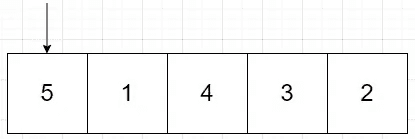
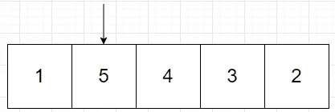
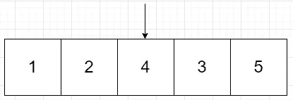
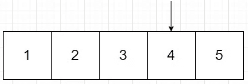
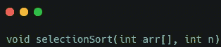
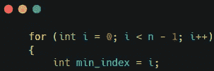
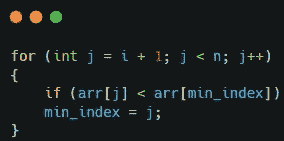
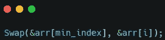
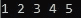
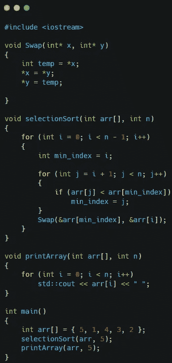

# 选择排序

> 原文：<https://medium.com/nerd-for-tech/selection-sort-2de407aa033c?source=collection_archive---------7----------------------->

选择排序是一种排序算法，它遍历数组中未排序的部分，找到最低或最小的元素，并将其放在开头。选择排序算法有两个子数组。一个是已排序的子数组或已知有序的部分。另一种是未排序的子数组或尚未排序的子数组。该算法在未排序的数组中查找最低的元素，并将其放在该子数组的开头。在下一次传递中，未排序子数组中的第一个元素成为已排序子数组中的最后一个元素。

**例子**

对给定数组{5，1，4，3，2}进行排序。

首先将 5 与数组的其余部分进行比较。1 小于 5，因此我们将跟踪 1 作为最小值。4 小于 5，但 4 不小于最小值，所以我们继续。这在小于 5 但不小于 1 的数字 3 和 2 上重复。在检查完数组中的所有元素后，我们将用最小值 1 来交换 5。

现在我们从数组中的第二个值开始。如果我们经历比较这些值并保存最低值的过程，我们会发现这次最低值是 2。我们将把 5 英镑换成 2 英镑。

从第三个元素开始，我们将再次遍历并找到最小值。一旦找到它，我们将把它换成数组中的第三个元素。

我们将再运行一次来完成检查。这一次列表已经准备好了，所以不会有任何变化。

该算法的时间复杂度为 O( *n* )。

**代码实现**

为了实现这个算法，您将创建一个函数，该函数将一个 int 数组和该数组的大小作为参数。

在这个函数中，您将有一个 for 循环来遍历数组。您还将创建一个变量来跟踪数组中最低的元素。

然后，您将创建一个嵌套的 for 循环来搜索数组中的元素。如果您所在的元素低于最低值，您将把当前元素设置为最低值。

嵌套的 for 循环完成后，你将与第一个 for 循环所在的当前元素交换最小值。

我们可以在 main 函数中测试这一点，通过运行它得到一个按升序排序的数组。

这是带有一些额外的交换和打印数组函数的完整脚本。

