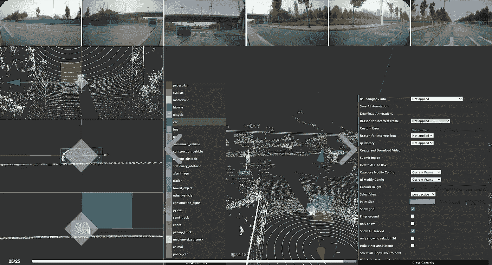

# 自动驾驶标签案例研究——2D/3D 传感器融合项目

> 原文：<https://medium.com/nerd-for-tech/self-driving-labeling-case-study-2d-3d-sensor-fusion-project-4b6f0899199b?source=collection_archive---------2----------------------->

## 自驾定制贴标服务

3D 点云和 2D/3D 传感器融合项目总是**高度定制的服务**。并且由于算法的改进，一段时间后标记要求将会改变。

在这种情况下，需要有丰富项目经验的培训数据服务商的协助，帮助整理标注说明，获取更合适的数据。

字节桥可以根据场景配置灵活的贴标工作流程，**提供面向客户端的数据交付，在一个平台上可靠的 QA**。

## **客户痛点**

1 比例尺标注:每周需要 10 万-20 万帧

2 缺乏一体化解决方案:需要一个用于数据标记、交付和 QA 的解决方案

3 定制需求以及特殊和复杂的场景

## **解决方案**

1 人工智能驱动的传感器融合标记工具:数据预处理

2 智能任务分配:自动任务划分和分配给超过 40 万名员工

3 数据处理系统:通过机器和 QA 团队对一致认可的数据进行 N 次交叉引用 QA

4 专业的质量保证团队:所有的工作成果都经过人力的全面筛选和检验，以保证数据的准确性

5 .有在线数据核对和同步反馈系统

## 自动驾驶行业中的数据标签

自动驾驶的主流算法模型主要基于有监督的深度学习。它是一种算法模型，推导出已知变量和因变量之间的函数关系。需要大量的结构化标记数据来训练和调整模型。

在此基础上，要想让自动驾驶汽车变得更加“智能”，形成可在不同垂直落地场景下复制的自动驾驶应用商业模式闭环，模型需要有海量、高质量的真实道路数据支撑。

在自动驾驶领域，数据标注场景通常包括变道超车、通过路口、无红绿灯控制的无保护左右转弯，以及一些复杂的长尾场景，如车辆闯红灯、行人过马路、路边以及违规停放的车辆等。

# 结束

将你的数据标注任务外包给 [ByteBridge](https://tinyurl.com/yc43pz47) ，你可以更便宜更快的获得高质量的 ML 训练数据集！

*   无需信用卡的免费试用:您可以快速获得样品结果，检查输出，并直接向我们的项目经理反馈。
*   100%人工验证
*   透明和标准定价:[有明确的定价](https://www.bytebridge.io/#/?module=price)(包含人工成本)

为什么不试一试呢？