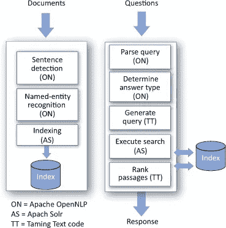
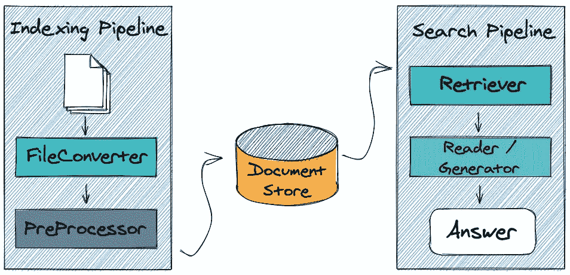
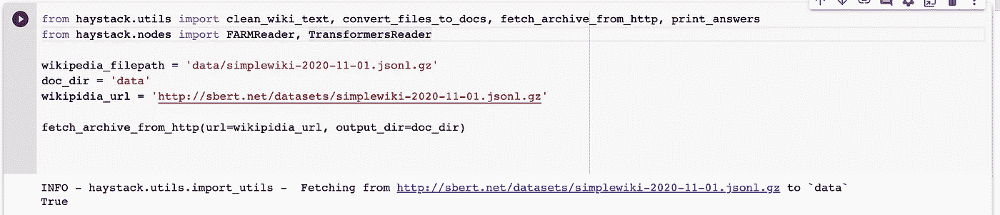
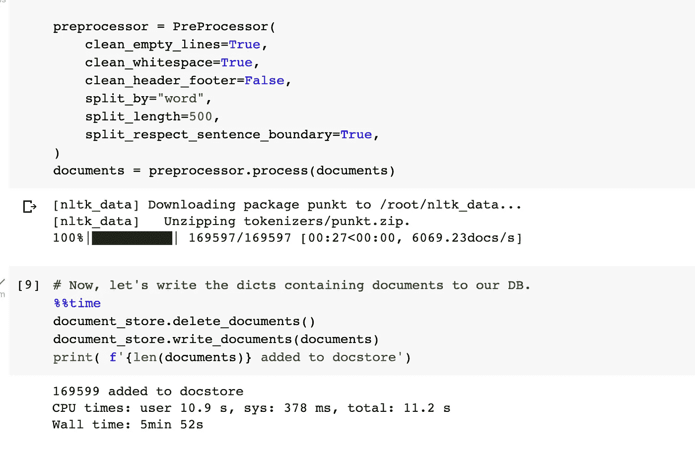
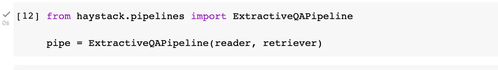
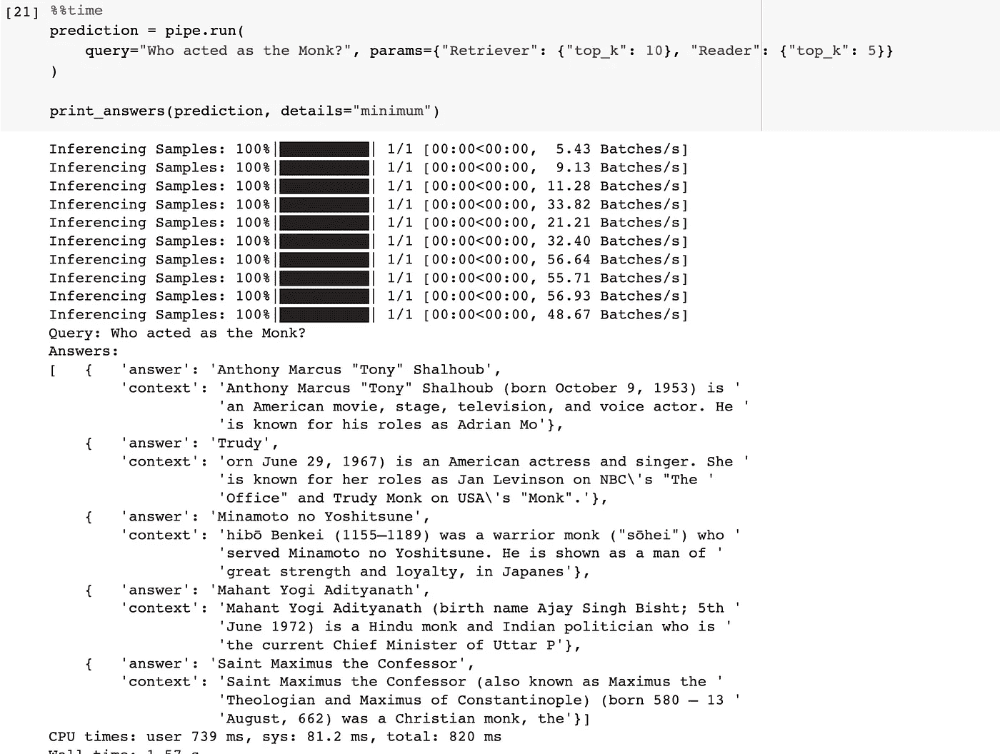
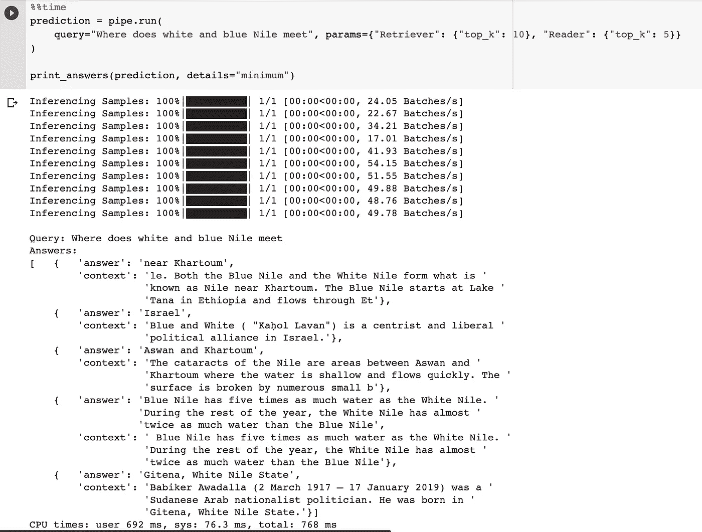

# 使用弹性搜索和预建 NLP 模型的语义搜索:第 1 部分—您有问题吗？

> 原文：<https://medium.com/nerd-for-tech/semantic-search-with-elastic-search-and-pre-built-nlp-models-part-1-you-got-a-question-600e7564890?source=collection_archive---------0----------------------->

几年前，当我们听说一位老奶奶和搜索引擎像对待人类一样对待它时，我们都咯咯地笑了。

大学幽默想象如果谷歌是人类将会是什么样的生活也是一场大笑，人们用奇怪的关键字集与谷歌互动。在过去的一年里，我们都习惯于将“Google”或“Alexa”视为人类，并提出语法良好的问题，而不是带有一些随机“字符串”的查询。企业和产品目录搜索解决方案的客户期待相同的体验。

在本系列中，我们将探索如何将新的基于自然语言的技术与现有的基于 Lucene 的搜索系统相结合，以改善整体搜索体验。在第一部分中，我们将探索一些 Lucene 的基础知识，以及如何使用预先构建的 NLP 模型添加问答功能的细节。

所有 POC 演示的代码都可以在 google colab [这里](https://colab.research.google.com/drive/1RIilVWf_YNygls6KhXox_taUWHN8gWTU?usp=sharing)找到。

# 向量空间—稀疏向量 TF-IDF，BM25

在过去的几十年里，搜索系统已经建立在基于 Lucene 的系统之上，比如 SOLR 和弹性搜索。

这些系统通过倒排索引和直观的 TF*IDF/BM25 评分进行基于关键字的匹配，以控制匹配结果的相关性。我强烈推荐阅读道格·特恩布尔和约翰·贝里曼的[相关搜索](http://manning.com/books/relevant-search)，了解关于这个主题的开创性工作。

基于 Lucene 的搜索引擎基于寻找文档和搜索查询之间的相似性来工作，这些相似性基于基于以下术语频率、逆文档频率和逆文档长度计算的相关性分数。给定一个术语和一个文档 [TF*IDF](https://en.wikipedia.org/wiki/Tf%E2%80%93idf) 分数将表示该术语与该文档的相关程度。向量空间模型也称为单词袋模型，它基于文档的 N 维稀疏矩阵和语料库中的所有术语，每个单元具有 TF*IDF 得分。这个向量是稀疏的，因为大多数术语相对于大多数文档将得到 0 分。Lucene 擅长管理这种稀疏矩阵，并在这方面提供了极低延迟的操作，如检索和评分。任何搜索查询都可以被分解成多个搜索项，并且查询项的总得分可以通过文档上各个项的得分的点积来计算。这大致就是基于 Lucene 的搜索系统确定查询和文档相似性的方式。这个简单而强大的模型需要做大量的工作来使系统理解上下文和自然语言的复杂性，如同义词、同音异义词等。

搜索/相关性工程师在索引和查询处理期间应用一系列技巧，以使搜索系统返回与查询系统的人的意图相匹配的最相关的结果。借助于分类法、NER(命名实体识别)、同义词丰富、查询增强、查询扩展和许多专利技术，索引术语被丰富了上下文元素，以提高**的召回率，而不损害**。****

# ****基于 Lucene 的问答系统****

****问答系统是信息检索中一个有趣的挑战，它经常需要搜索系统来处理。我们必须处理诸如“谁是 1996 年 NBA 总决赛的最有价值球员？”“电视剧里的和尚是谁演的？”或者“珠穆朗玛峰的高度是多少英尺”****

****在基于 Lucene 的系统上构建问答系统有不同的方法。例如[驯服文本](https://www.manning.com/books/taming-text)的第 8 章描述了一种流行的架构。****

********

****第 8 章——驯服文本——QA 系统架构示例****

****这种方法包括在索引阶段之前进行文本分析，使用 NLP 库识别句子和提取实体，产生的丰富术语存储在 Lucene 的倒排索引中。查询管道包括解析查询、确定答案类型，以及基于答案类型生成 Lucene 查询。查询结果提供匹配术语的候选段落，并对结果进行排名。****

****这个解决方案工作得很好，但是仍然将自然语言概念映射到“术语”,并且使用稀疏向量空间。最后，我们寻找的是字符串，而不是东西。****

****自然语言处理(NLP)的最新进展是称为**文本嵌入**的技术，它将单词和句子编码为数字向量。这些向量表示本质上捕捉了文本的语义方面，并且可以用于评估查询和文档之间的相似性。相似性可以通过使用[近似最近邻](https://en.wikipedia.org/wiki/Nearest_neighbor_search)算法计算它们之间的余弦距离来评估。仅仅依靠人工神经网络进行所有的搜索就需要难以置信的大量计算资源来操作搜索系统。使其可行的优化之一是一个两步过程****

****步骤 1:使用基于 Lucene/稀疏矩阵的搜索获得第一组结果****

****步骤 2:使用密集的基于向量的语义搜索作为第二阶段来进一步过滤结果。****

****如果你在过去几年生活在岩石下，你可能没有听说过谷歌利用[伯特](https://arxiv.org/abs/1810.04805)改善[查询理解](https://www.blog.google/products/search/search-language-understanding-bert/)对其搜索进行的重大改进。基于 BERT 的预训练模型使建筑物嵌入速度快得令人难以置信，几乎可以用于需要亚秒级响应时间的实时搜索。****

****在本文的其余部分，我们将看看如何使用这个两步过程，通过弹性搜索和 Haystack 来构建一个问答系统。使用 SOLR 也可以达到同样的效果。****

# ****具有弹性搜索和干草堆的问答系统****

****Haystack 是一个开源框架，帮助人们构建基于 NLP 的搜索系统。它可以使用弹性搜索和 FAISS 作为底层文档库，并利用基于 transformer 的 NLP 模型，如 BERT。****

********

****第一步:下载简单的英语维基百科数据集，它是一个 JSON 数据集。Haystack 为下载和清理文本提供了有用的工具。****

********

****步骤 2:清理文本，预处理文本数据，将其分成段落，并将其加载到一个 Haystack 文档列表中****

********

****步骤 3:将文档添加到弹性搜索文档存储中****

********

****步骤 4:设置检索器和阅读器。Retriever 执行第一级过滤，这是一种快速的基于稀疏矩阵的过滤。它返回一组文本，读者将使用这些文本进行语义匹配，语义匹配基于密集的基于向量的嵌入模型，如 Roberta，这些模型是问答系统的预训练模型。****

********

****步骤 5:将检索器/读取器连接在一起的管道。****

********

****第六步:问问题，把预测拿回来****

****************

****这个例子是基于 Haystack 构建你的第一个 QA 系统[的例子](https://haystack.deepset.ai/tutorials/first-qa-system)。搜索查询不像您在普通的基于 TFIDF 的系统上习惯的那样快，但是结果令人印象深刻。这个快速的概念验证还有很大的改进空间，但是很高兴看到很快就能把这样的东西放在一起。****

****在下一部分中，我们将探索如何使用 Haystack 和大型语言模型 LLM，如 [GPT-3.5](https://beta.openai.com/docs/model-index-for-researchers/models-referred-to-as-gpt-3-5) ，为查询提供新生成的答案，如 ChatGPT 如何工作。****

****参考资料:****

1.  ****[相关搜索](https://www.manning.com/books/relevant-search)应用于 SOLR 和 elastic Search——Doug Turnbull 和 John Berryman****
2.  ****格兰特·s·英格索尔、托马斯·s·莫顿和安德鲁·l·法里斯的《驯服文本》:如何发现、组织和操纵它****
3.  ****[BERT](https://arxiv.org/abs/1810.04805) :语言理解深度双向转换器的预训练。****
4.  ****[草堆](https://haystack.deepset.ai/overview/intro):由 Deepset AI 文档****