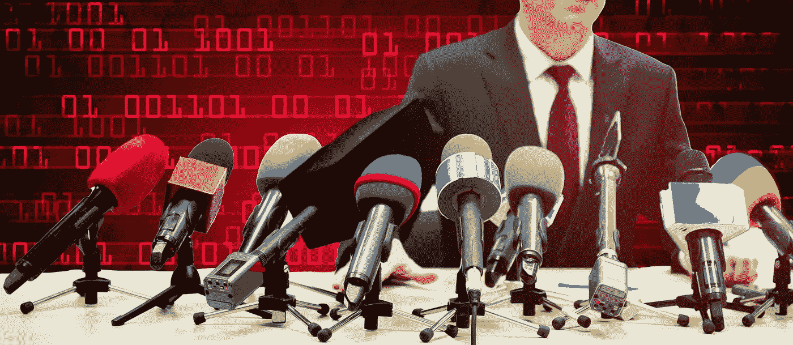

# 参议院法案要求关键基础设施提供网络攻击信息

> 原文：<https://medium.com/nerd-for-tech/senate-bill-to-require-cyberattack-info-from-critical-infrastructure-532f890ca4e5?source=collection_archive---------1----------------------->

ongress 显然希望将“团结则存，分裂则亡”的标志性格言应用于国家关键基础设施(CI)的网络安全。

一项提议的两党法案的关键条款——是的，两党！—目前正在美国参议院等待批准，要求 CI 运营商在 72 小时内向联邦网络安全和基础设施安全局(CISA)报告“实质性”网络攻击，并在 24 小时内报告勒索软件付款。

由于国家的大部分竞争情报是由私营部门拥有和经营的，这将使私人和公共信息共享以一种新的方式结合起来；因此[的新闻稿](https://www.hsgac.senate.gov/media/minority-media/portman-peters-introduce-landmark-legislative-package-to-strengthen-public-and-private-sector-cybersecurity_)称其为“里程碑式”的立法。

当然，这种团结不是自愿的。《T4 加强美国网络安全法案》的报告要求如果成为法律，将是强制性的。

但是从政治上来说，两党共同支持立法的可能性看起来很大。两位共同发起人是参议员加里·彼得斯(D-MI)，国土安全和政府事务委员会主席，和参议员罗布·波特曼(R-OH)，该委员会的资深少数党成员。两人一直在与一个由六名美国代表组成的两党小组合作，其中三名共和党人和三名民主党人一直在众议院领导类似的努力。

对于改善 CI 网络安全的必要性，不应有任何争议。它几乎一直受到攻击，其中一些攻击已经成功并造成了重大损失。

*   天普大学已经收集了一个所谓“关键基础设施勒索软件攻击”的数据集[,其中有 1137 条从 2013 年 11 月到 2021 年 1 月底的记录。它带有一个警告——该列表只包括那些公开披露的信息。](https://sites.temple.edu/care/ci-rw-attacks/)
*   CISA、联邦调查局和国家安全局最近[报告称，2021 年，美国 16 个情报部门](https://www.cisa.gov/uscert/ncas/alerts/aa22-040a)中有 14 个成为勒索软件攻击者的目标。这些行业包括化工、商业设施、通信、关键制造、水坝、国防工业基地、应急服务、能源、金融服务、食品和农业、政府设施、医疗保健、信息技术、核反应堆、运输系统以及供水和废水系统。
*   工业网络安全公司 Claroty 在其最新的半年期工业控制系统风险和漏洞报告中写道，CI 资产“以创纪录的数量暴露在网上，并伴随着它们的所有缺陷:未打补丁的漏洞、不安全的凭证、薄弱的配置以及使用过时的工业协议。”
*   在过去的一周，美国联邦调查局和特勤局[发布了一个关于一个名为 BlackByte 的勒索软件即服务团伙的警告](https://www.ic3.gov/Media/News/2022/220211.pdf)，该团伙已经危害了多家美国和外国企业。该警告称，针对美国情报部门的攻击包括政府设施、金融、食品和农业。

虽然许多攻击只造成轻微的损失，[有些却意义重大](/nerd-for-tech/securing-critical-infrastructure-takes-securing-control-systems-82d35b4b9c03) t。针对 Colonial Pipeline 和 JBS 食品公司的勒索软件攻击造成了严重的燃料和食品供应中断，导致价格飙升和数百万美元的付款。

鉴于当前的国际紧张局势，敌对国家针对 CI 的网络攻击风险正在增加。如果此类攻击扰乱或破坏了食品或水供应、金融服务或电网，它们可能会导致供应问题和价格飙升，使当前的通胀看起来像过去的好日子。

**上篮？没那么多**

所以像这样的法案应该是上篮，对不对？谁会反对让我们的关键基础设施更具弹性？

就像通常的情况一样，细节决定成败。

首先，私人和公共部门在网络领域并不总是合作良好。在网络安全会议上，有许多人抱怨说，当联邦政府呼吁信息共享时，这是一条“单行道”——联邦政府要求私营部门共享，但不会做出回应。

这种敌意可能正在软化。在去年夏天与拜登总统的白宫会议上，一些世界上最大的科技公司的负责人承诺花费数十亿美元用于网络安全培训和改进安全技术。白宫表示，拜登召集此次会议是为了讨论银行、能源和水务行业的私营部门竞争情报实体为改善网络安全和与政府合作所做的努力。

Synopsys 软件完整性小组的首席科学家 Sammy Migues 表示，收集攻击和勒索信息是政府的合法职责。“作为一个‘正在进行的坏事’的中心交换所是一个合适的联邦政府职能，”他说。“他们需要及时获得这些信息，以做联邦政府的事情，这些事情可能涉及从发送推文到军事行动的任何地方。”

新思软件诚信集团(Synopsys Software Integrity Group)的政府合同和价值链安全总监 Emile Monette 同意，联邦政府有能力帮助竞争情报运营商保护自己免受民族国家或其他高度复杂的攻击，但他认为应该有其他内置的激励机制。

“目前还不清楚一家报告公司可能通过报告从政府那里得到什么。我认为它缺少一些 WIFM[它对我有什么好处？]，”他说。“理想情况下，政府会提供一些责任保护或其他安全港，或者将参与此类计划视为减轻因素，以确定该公司是否会受到一些处罚。”

事实上，对科技巨头或其他任何人来说，投资于自身安全是一回事。分享他们不想公开的信息是另一回事。

**还有几年**

将会有时间来解决这些潜在的冲突——也许是很多时间。即使该法案获得通过，其长期影响仍需数年才能知晓。

一个原因是缺乏“实质性网络攻击”的定义，或者如该法案所述，“涵盖的网络事件”。那是什么意思？该法案称，这是一种“符合局长在根据第 2242(b)条发布的最终规则中确立的定义和标准”的攻击

如果我们看看埋在 211 页法案中间的第 2242(b)条，我们会发现定义和标准的最后期限是法案通过后的 42 个月。

米格斯说，大多数竞争情报公司现在对这个定义已经有了很好的想法。“我认为网络安全领域的‘实质性’就像审计领域的‘实质性’，”他说。“当你看到它时，你几乎总能知道它。”

尽管如此，如果归结到一个组织对其所谓的未能满足报告要求的罚款或其他处罚提出上诉，法院可能会想要一些具体的东西。

Monette 指出，该法案确实定义了一个“重大”攻击，但不是“覆盖”事件。他说:“我认为重大事故比重大事故要小，但在较低的情况下界定这一界限可能很困难。”“如果除了一个主要因素之外，它满足所有其他因素，那么它很可能是实质性的。但是，如果它错过了三个元素的“主要”标志呢？两个？五个？这是虚幻的吗？”

“国会应该给它下一个定义——相当不自由的起草，”他补充道。“在我看来，这是国会的一次尝试，因为他们无法解决这个问题，在我看来，这是一个缺陷，因为如果没有人知道‘实质性’的实际含义，它将导致法律——假设它获得通过——很可能永远不会得到执行。”

**无可奉告**

彼得斯和波特曼的办公室都没有回应置评请求。

此外，还不完全清楚未能遵守报告截止日期的公司会受到什么影响。该法案没有规定具体的惩罚措施。

米格斯说，这并不意味着该法案将是无效的。“联邦政府可以利用它提供的任何联邦服务来‘引诱’公司做事，”他说。“不像是一个州的饮酒年龄？扣留他们的联邦公路基金，直到他们改变它。那么，它能被强加于组织吗？即使答案是否定的，也是肯定的。”

Monette 表示，监管机构可能会将未能报告纳入其对受监管竞争情报部门的监督，“这将引发失去运营权的风险。或者可能包含在政府合同中，这将引发《虚假索赔法案》规定的责任。”

目前，这一切都是猜测——该法案只是一项建议。莫内特怀疑，即使有两党的支持，它也能通过。“这很可能会刺激其他人起草修正案，使其变得更有意义，”他说。

如果是这样的话，他有一个修正建议。他说，“如果政府能统一所有的报告要求，把各种州和地方要求放在一边，那就太好了，所有这些要求都增加了合规成本。”