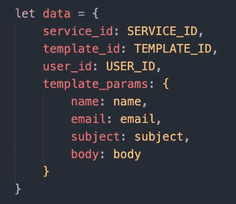
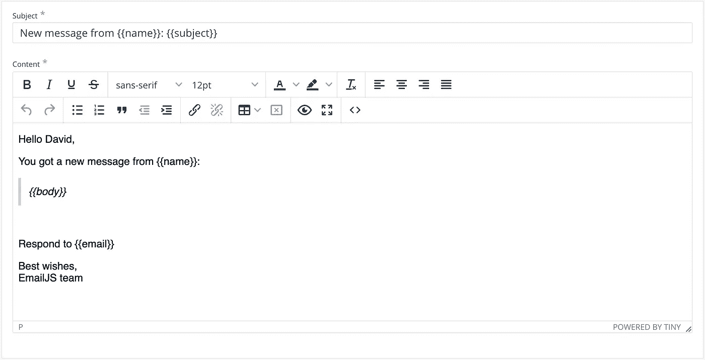

# 直接从 JavaScript 发送电子邮件

> 原文：<https://medium.com/nerd-for-tech/send-emails-direct-from-javascript-b58966154681?source=collection_archive---------10----------------------->


照片由[埃里卡·斯蒂维斯](https://unsplash.com/@ecees)通过[unsplash.com](https://unsplash.com/photos/G_lwAp0TF38)拍摄

# 更新 6.30.22

别忘了测试东西！花了一些时间在我的投资组合网站上刷新我的一些反应技能，结果遇到了一个奇怪的问题。当我尝试使用我在下面设置的 EmailJS 服务发送电子邮件时，我得到了以下错误:

```
Gmail_API: Invalid grant. Please reconnect your Gmail account
```

在快速搜索之后，我意识到 Gmail API 会自动停止任何超过 6 个月没有使用的连接。是的——不幸的是，至少 6 个月没有人给我发电子邮件，老实说，可能从来没有。

不用担心——我所要做的就是登录我的 EmailJS 帐户，断开电子邮件服务，然后重新连接。祝你好运，我希望你比我收到更多的电子邮件！

在之前的[帖子](/nerd-for-tech/implementing-action-mailer-ruby-on-rails-1766f59c6f)中，我写了如何从 web 应用程序中获得电子邮件，以及如何在 Ruby 中使用 Action Mailer 来实现这一点。但是，如果您没有开发一个全栈的 web 应用程序，并且没有后端来处理这个问题，该怎么办呢？

当我在一个用 JavaScript 和 React 构建的投资组合网站上工作时，遇到了同样的场景。我需要一种方法来处理联系表单，以便在访问者提交联系表单后，它会给我发送电子邮件。

在这篇文章中，我将向你展示我是如何使用一种叫做 EmailJS 的服务来完成这个任务的。它非常容易设置，在写作时，每月可以免费发送 200 封邮件(对于一个作品集网站来说绰绰有余)。

# 设置电子邮件

你需要做的第一件事是在 [EmailJS](https://www.emailjs.com/) 上创建一个账户。完成并登录后，您需要设置您的电子邮件服务。点击菜单顶部的`Email Service`。然后点击`+ Add New Service`并选择您喜欢的电子邮件提供商。

不要忘记记下每天的电子邮件限额。我选择了 Gmail，它有每天 500 封邮件的限制，所以没问题。

接下来点击`Connect Account`按钮用你的邮箱登录。此时，弹出窗口应该会显示您已连接到您选择的电子邮件地址，并有一个断开连接的选项。点击`Create Service`按钮继续。如果一切正常，你应该会在收件箱里收到一封测试邮件，而且这项服务应该会列在你的`Email Services`页面上。

我们一会儿会回到你的 EmailJS 账户，但在此之前，让我们跳到我们的节目。

# 在项目中实施 EmailJS

这部分其实很简单。您所需要做的就是用包含正确键和值的对象对 EmailJS 端点进行 API 调用。

下面是我在发送 API 调用时使用的 post 对象。



用 id 和表单变量发布正文对象

`service_id`、`template_id`、`user_id`都是 EmailJS 提供的。`template_params`键用于发送您想要在电子邮件模板中访问的表单信息。我输入了发件人的名字，他们的电子邮件，这样我就可以回复，主题行和正文。

重要提示:别忘了要他们的电子邮件地址，否则你将无法回复他们。EmailJS 从你的电子邮件地址给你自己发送一封电子邮件，所以没有用户的输入，你将不得不尝试谷歌他们的名字，并找到另一种联系方式。

发送调用的端点在下面。这可能会改变，但可以很容易地在他们的网站上的[文档](https://www.emailjs.com/docs/rest-api/send/)中找到。

```
POST https://api.emailjs.com/api/v1.0/email/send
```

到现在为止，除了一个`template_id`，你应该已经拥有了你需要的一切。我这样做是为了让您在 EmailJS 中创建电子邮件模板之前知道您将从表单中收集哪些变量。

# 使用变量创建电子邮件模板

在 EmailJs 中，转到`Email Template`选项卡并点击`Create New Template`。一旦出现，您将可以选择自定义将要发送的电子邮件的主题行和正文。关于如何访问在`template_params`下 API 调用中传递的变量，请参见关于在模板中使用[动态变量的文章。](https://www.emailjs.com/docs/user-guide/dynamic-variables-templates/)



使用名称、主题、正文和电子邮件变量的我的模板的屏幕截图

编辑完模板后，只需点击保存即可。此时，您将可以访问 API 调用所需的所有不同 id，包括`template_id`。如何在程序中存储这些变量取决于你自己。我创建了一个`.env`文件并将我的保存在那里。可能有更好的方法，如果你知道，请在下面的评论中告诉我！

`user_id`:点击左侧的集成，在 API keys 下查看

`template_id`:列在电子邮件模板中您新创建的模板下

`service_id`:列在电子邮件服务中您新链接的电子邮件服务下

现在您已经在 POST 对象中拥有了所有需要的 id 和变量，您已经准备好测试您的新电子邮件服务了！

注意:EmailJS 也有一个 SDK，可以使用 NPM 或鲍尔安装。这允许您用样板函数替换 API 调用，将您的 id 作为参数传递。我使用他们的 API，因为它似乎对我的小项目来说也很容易，但也可以在这里查看他们的文档。