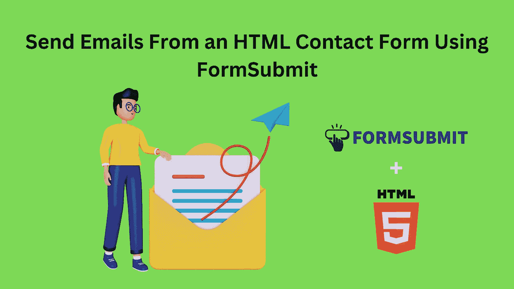
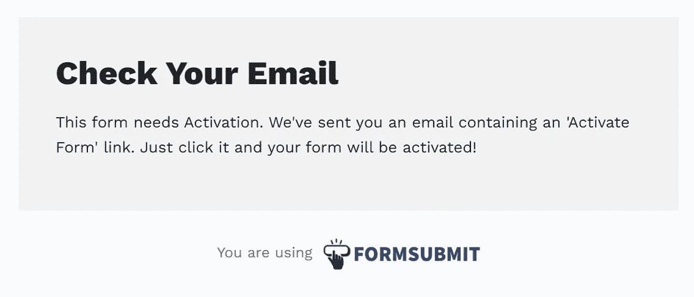

# 使用 FormSubmit 从 HTML 联系人表单发送电子邮件

> 原文：<https://medium.com/nerd-for-tech/send-emails-from-an-html-contact-form-using-formsubmit-8610c7db4a9f?source=collection_archive---------3----------------------->



作者照片

嘿大家好！🤩

您是否正在寻找一种简单的方法，通过网页上的联系人表单发送电子邮件？好了，现在你已经找到解决方法了！我将在这里解释一个超级简单的方法，只用 HTML。

首先，我将制作一个联系人表单，其中有几个输入字段，用于输入姓名、电子邮件和消息，还有一个提交按钮。然后，我将展示在按下发送按钮并重定向到感谢页面后，如何将电子邮件发送到您的电子邮件地址。这里我使用 [FormSubmit](https://formsubmit.co/) 来做这件事。它本质上允许我们将我们的表单连接到他们的表单端点，他们将通过电子邮件发送给我们。

好吧，我们去吧！

下面的代码片段将为我们创建一个表单，其中包含一个使用表单提交端点的操作。您可以只使用您的电子邮件地址，而不是下面代码中的“【your@email.com】”来接收用户的电子邮件。此外，您可以根据需要更改其他输入字段，即使我只是使用它们来获取姓名和电子邮件。

如果您需要重定向到一个感谢页面，您可以在为它创建另一个页面(这里的页面是 thanks.html)后，在表单中使用下面的代码行。

```
<input type="hidden" name="_next" value="https://yourdomain.co/thanks.html">
```

您可以参考[表单提交](https://formsubmit.co/)文档来定制电子邮件格式，并为您的联系人表单添加更多功能。

当您第一次提交表单时，它会触发一封请求确认的电子邮件。消息将如下所示。



表单激活消息

注意:请确保通过 web 服务器打开此页面。因为 FormSubmit 在作为 HTML 文件浏览的页面中不起作用。

TADAA！你已经完成了工作。是不是很酷？😎

如果你从这篇文章中学到了一些新的东西，或者你有什么建议，请留下你的评论。我喜欢收到你的来信。🧡

[](https://www.buymeacoffee.com/sachinibhagya)