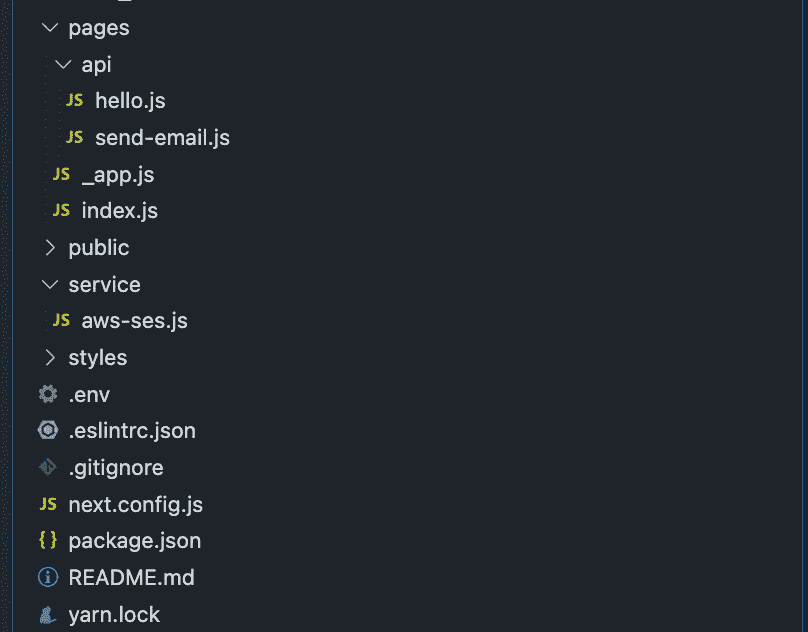
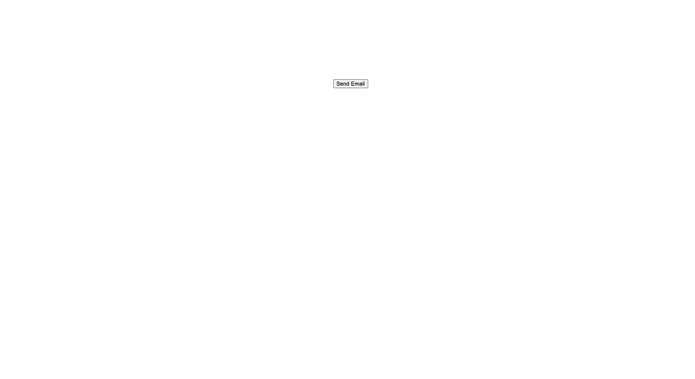
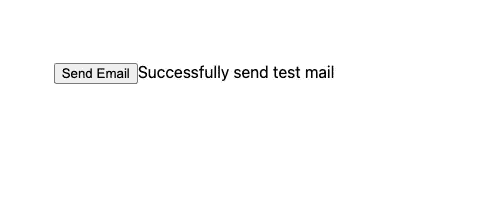
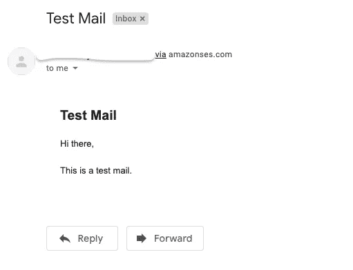

# 使用 NextJS 和亚马逊简单电子邮件服务(SES)发送电子邮件

> 原文：<https://medium.com/nerd-for-tech/sending-emails-with-nextjs-and-amazon-simple-email-services-ses-8e4e10d1d397?source=collection_archive---------0----------------------->

作为亚马逊网络服务的新手，我总是认为发送邮件是一项大任务，并且总是害怕尝试。但是有志者事竟成。这一次，我为一个客户工作，无论如何我必须使用这个功能，这只是我开始工作所需要的小小推动。

1.  首先，让我们设置一个简单的 NextJS 项目来开始。如果您是 typescript 用户，可以按照 TS 文档开始。你可以在这里看到简单的步骤。
2.  你将需要一些依赖。为了便于使用，我们将使用*节点邮件*来创建[传输](https://nodemailer.com/smtp/)(基本上是 SMTP 传输)。我们还将需要 [AWS 官方 SDK](https://www.npmjs.com/package/aws-sdk) 。

```
npm install nodemailer aws-sdk
```

您现在需要从您的 AWS 帐户获取 AWS 密钥和 AWS 访问密钥。如果你对此感到困惑，你可以访问他们的官方文档[这里](https://docs.aws.amazon.com/general/latest/gr/aws-sec-cred-types.html)。一旦有了密钥，就把它们放在环境文件中。

```
# .env 
AWS_ACCESS_KEY=xxxxxxxxxxxxxxxxAWS_SECRET_ACCESS_KEY=xxxxxxxxxxxxxxxxxxxxxxxxx
```

现在让我们添加几个文件来帮助我们解决这个问题。



send-email.js 和 aws-ses.js

index.js 将是项目的切入点。我们将对电子邮件端点进行简单的 api 调用。

```
// index.jsimport React, { useState } from "react";import styles from "../styles/Home.module.css";export default function Home() {const [message, setMessage] = useState(""); const sendMail = async () => { try { setMessage("Sending test mail"); const response = await fetch("http://localhost:3000/api/send-email"); const body = await response.json(); if (body.ok) { setMessage("Successfully send test mail"); } } catch (error) { console.log(error); // handle the error }}; return ( <div className={styles.container}> <button onClick={sendMail}>Send Email</button> {message} </div> );}
```

*send-email.js* 将是我们将用于该项目的 api 端点。

```
// send-email.jsimport { sendTestMail } from "../../service/aws-ses";export default async function checkUserAPI(request, response) {const result = await sendTestMail("test@test.com"); response.json(result);}
```

*aws-ses.js* 将是服务文件，它将包含发送邮件的实际代码。

```
// aws-ses.jsimport * as AWS from "aws-sdk";import * as nodemailer from "nodemailer";AWS.config.update({ accessKeyId: process.env.AWS_ACCESS_KEY, secretAccessKey: process.env.AWS_SECRET_ACCESS_KEY, region: "ap-south-1",});AWS.config.getCredentials(function (error) { if (error) { console.log(error.stack); }});const ses = new AWS.SES({ apiVersion: "2010-12-01" }); // change this to the "to" email that you wantconst adminMail = "yourmail@mail.com";// Create a transporter of nodemailerconst transporter = nodemailer.createTransport({ SES: ses,});export const testMail = async (userEmail) => {try {const response = await transporter.sendMail({from: adminMail,to: userEmail,subject: "Test Mail",html: `<!DOCTYPE html PUBLIC "-//W3C//DTD HTML 4.0 Transitional//EN" "http://www.w3.org/TR/REC-html40/loose.dtd"><html><head><meta http-equiv="Content-Type" content="text/html; charset=UTF-8"></head><body><div style="padding:20px;"><div style="max-width: 500px;"><h2>Test Mail</h2><p>Hi there,<br/><br/>This is a test mail.</p></div></div></body></html>`,});return response?.messageId? { ok: true }: { ok: false, msg: "Failed to send email" };} catch (error) {console.log("ERROR", error.message);return { ok: false, msg: "Failed to send email" };}};
```

*Home.module.scss* 如果需要就是 css 文件。

```
// Home.module.scss
.container { padding: 0 2rem; display: flex; justify-content: center; margin-top: 200px;}
```

现在需要做的就是运行应用程序。你可以用。

```
yarn dev
```

结果:



默认页面



已发送邮件



测试电子邮件已发送

用 AWS SES 和 NextJS 发送电子邮件就是这么简单。Express 应用程序中的实现也是类似的。