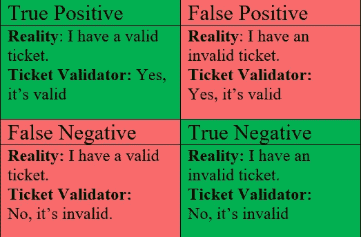
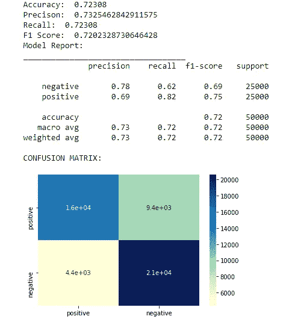
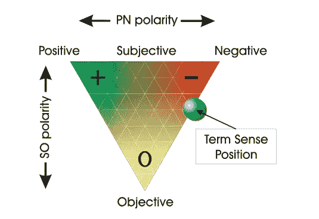
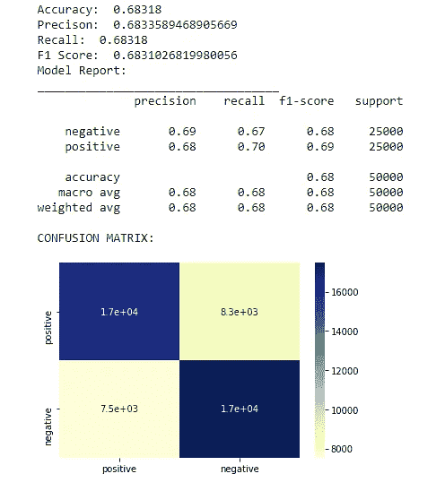
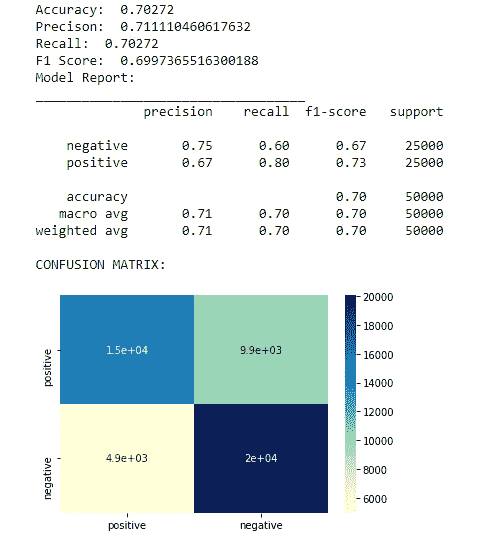
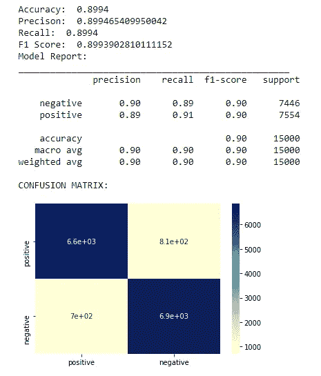
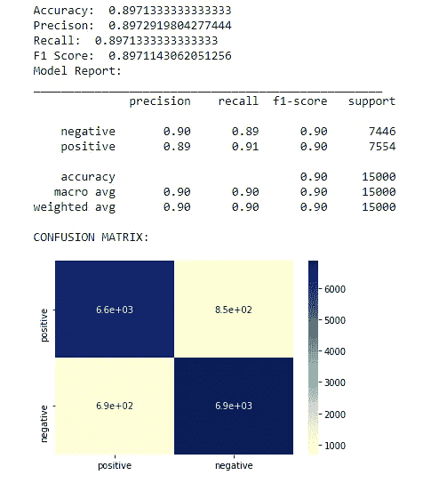
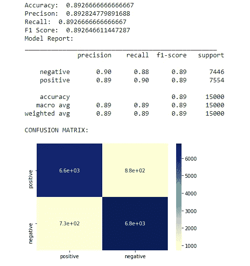
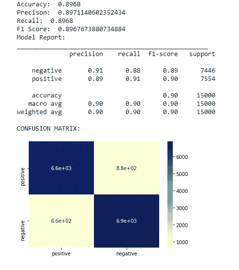

# 情感分析-词典模型与机器学习

> 原文：<https://medium.com/nerd-for-tech/sentiment-analysis-lexicon-models-vs-machine-learning-b6e3af8fe746?source=collection_archive---------0----------------------->

为什么我们会对情感分析感兴趣？嗯，这里的情况可以帮助你理解。


照片由 [Kilyan Sockalingum](https://unsplash.com/@kilyan_s?utm_source=medium&utm_medium=referral) 在 [Unsplash](https://unsplash.com?utm_source=medium&utm_medium=referral) 拍摄

艾米丽在一个小镇上经营一家电影院，她想知道她应该选择放映哪部电影。她发现，在她的镇上，最受欢迎的电影是那些具有良好氛围并能提升观众积极性的电影。为了做到这一点，她收集了过去不同电影在影院上映的数据，发现戏剧、喜剧和动画电影等特定类型的电影比恐怖、惊悚和传记电影的销售额高得多。因此，她预测即将上映的电影一定是以前的类型之一。

我们再举一个例子。


乐观地回顾猫途鹰


带着负面情绪的猫途鹰评论

我们看到第一条评论赞赏食物质量，它**传达了积极的情绪😃**客户的。而在第二次评论中，注意到顾客对酒店有不好的体验。这个**传达的是负面情绪。😞**

我们人类可以很容易地对评论进行分类，但是如何对大量的评论进行分类呢？情感分析来了。它会自动将每条评论分为正面、负面和中性类别，从而使餐厅能够采用数据驱动的方法来改善服务并增加销售额。

# 基本术语

现在我们知道了情感分析的重要性，让我们更深入地研究它的基本术语。

*情感分析是指从文本中提取* ***主观性*** *和* ***极性*** *的方法，语义指向是指词、短语、文本的极性和强弱。*

如果一个句子包含非事实信息，如个人观点、预测和判断，那么这个句子就是主观的。例如，“新冠肺炎疫苗是危险的，在研发的早期阶段接种是有风险的。副作用是致命的。”

如果一个句子包含事实而不是观点，那么它就是客观的。例如，太阳从东方升起。我们清楚地看到，客观句并不是情感分析的首选。

**文本的极性**由[-1，1]范围内的十进制(浮点)值给出。它表示给定句子语气的肯定性。

> **负面情绪:极性< 0**
> 
> **中性情绪:极性=0**
> 
> **积极情绪:极性> 0**

在我们进一步分析数据之前，我们需要清理我们的数据。它意味着对我们想要分析的文本进行预处理和规范化。

**去除标点符号**和特殊字符。

删除停用词，如 a、an、and、for 等。

**单词缩略的扩展**。例如，他们会随心所欲；还没有等。

**标记化** -将句子转换成单词

保持**大小写一致** -将单词转换成大写或小写

**词干化和词汇化**——将一个单词转换成它的基本形式。如苹果- >苹果；幸福- >快乐；

在大多数情况下，我们更喜欢词汇化而不是词干化，因为前者对单词进行形态分析，从而产生更准确的词根。

# **准确率、召回率和 F1 评分:**

**真阳性**描述了实际发生的事件，并且被我们的模型正确预测。**真否定**描绘了没有发生的事件，并且被我们的模型预测为没有发生。

**假阳性**描述的是没有发生，但我们的模型预测已经发生的事件。**假阴性**描述了现实中发生的事件，但我们的模型预测这些事件不会发生。



混淆矩阵

> **精度** =真阳性/所有阳性的数量
> 
> **回忆**=真阳性/(真阳性+假阴性)
> 
> **F1 得分** = 2 *(精度*召回)/(精度+召回)

# 使用基于词典的模型的情感分析

词汇是指一个人、一种语言或一门知识的词汇。这里，在基于词典的情感分析中，我们已经有了一组给定的单词词典，每个单词都被标记为积极的、消极的、中性的情感以及极性、词性和主观性分类器、语气、情态等等。句子被标记化，并且每个标记与模型中的可用单词相匹配，以找出其上下文和情感(如果有的话)。采用诸如 sum 或 average 之类的组合函数来进行关于整个文本成分的最终预测。

IMDB 电影评论[数据集](https://ai.stanford.edu/~amaas/data/sentiment/)用于进行以下预测。

# AFINN 词典:

AFINN 词典是最简单和最流行的情感分析词典。目前的版本是 AFINN-en-165.txt，它包含 3382 个单词及其极性得分。前往[官方知识库](https://github.com/fnielsen/afinn)了解更多信息。



AFINN 词典模型性能

# SentiWordNet:

SentiWordNet 是一个用于观点挖掘的词汇资源。SentiWordNet 为 WordNet 的每个 synset 分配三个情感分数:积极、消极和客观。



Senti-WordNet 采用的图形表示法，用于表示术语意义的观点相关属性。



SentiWordNet 模型性能

# VADER:

VADER (Valence Aware 字典和情感推理器)是一个基于词典和规则的情感分析工具，它是专门针对社交媒体中表达的情感的*。它是完全开源的，可以在 NLTK 包中获得，可以直接应用于未标记的文本数据。VADER 能够探测情感的极性和强度。*

*这里有一个例子-*

```
*sentences = ["VADER is smart, handsome, and funny.",                 # positive sentence example"VADER is smart, handsome, and funny!",# punctuation emphasis handled correctly(sentiment intensity adjusted)"VADER is very smart, handsome, and funny.",# booster words handled correctly (sentiment intensity adjusted)"VADER is VERY SMART, handsome, and FUNNY.",# emphasis for ALLCAPS handled"VADER is VERY SMART, handsome, and FUNNY!!!",# combination of signals - VADER appropriately adjusts intensity"VADER is VERY SMART, really handsome, and INCREDIBLY FUNNY!!!",# booster words & punctuation make this close to ceiling for score*
```

**

*VADER 模型性能*

# *基于监督学习的情感分类*

*有了监督学习，我们得到了每个文本数据以及它们的极性、主观性和客观性的标签。这里我们需要建立一个机器学习模型来分类和预测未来输入到不同类别的情绪中。*

## *文本预处理和数据规范化*

*在训练模型之前是最重要的。我们必须有平衡的阶级分布，这样就不会有阶级偏见。此外，我们必须删除标点符号，html 标签，数字，转换重音字符为 ASCII 以及小写所有文本。*

## *特征工程*

*特征工程是将原始数据转换为更好地代表预测模型潜在问题的特征的过程，从而提高对未知数据的模型准确性。杰森·布朗利博士*

## *模型训练、预测和评估*

*这包括使用各种 ML 模型来训练数据并评估它们，以查看哪一个最适合我们的用例。我们必须进行超参数调整，以获得更准确的结果。*

*在用 SVM 和逻辑回归训练数据之前，我们需要将数据转换成特征向量。我们同样使用计数矢量器和 TF-IDF 矢量器。*

# *单词袋模型-(蝴蝶结)*

*单词袋模型是一种从文本中提取特征用于 ML 建模的方法。在 BOW 中，提取文本中的单词，并列出所有单词及其频率。换句话说，创建了包含文本中所有单词的字典。它被称为单词包，因为单词的结构和它们在上下文中的意义都被删除了。*

> *船首特征的模型性能报告；*

***

左图显示了弓形特征的逻辑回归模型，右图显示了弓形特征的 SVM 模型* 

## *蝴蝶结装饰上的 SVM 模特:*

# *术语频率-逆文档频率(TF-IDF)*

*TF-IDF 背后的中心思想是为文档中出现频率较高的单词提供比出现频率较低的单词更多的重要性。其中**术语频率**指各术语的频率。*

> *TF=freq。一个单词/全部单词。*

***逆文件频率**按下式计算:*

> *IDF=ln(文档总数/包含该单词的文档数)*

*在实际案例中，我们将使用来自 sklearn . feature _ extraction . text 的 TfidfVectorizer。*

> *TF-IDF 特性的型号性能报告:*

****

*左侧图像显示了基于 TF-IDF 特征的逻辑回归模型，右侧图像显示了基于 TF-IDF 特征的 SVM 模型*

# *哪一个更好？*

*我们发现 AFINN 词汇模型比其他词汇模型具有更好的准确率(72%)。在给定的数据上，发现其他模型的性能接近自动神经网络。*

*就监督学习模型而言，基于词袋模型特征的逻辑回归模型是最好的，因为它的准确率为 89.94%。*

*在这里查看笔记本[。](https://github.com/AbhinandanRoul/Sentiment-Analysis--Lexicon-Models-vs-Machine-Learning)*