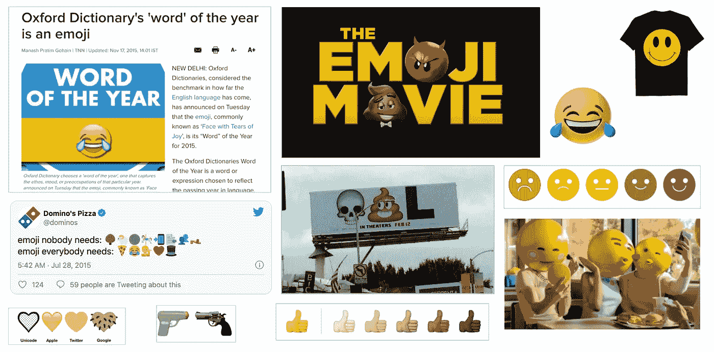
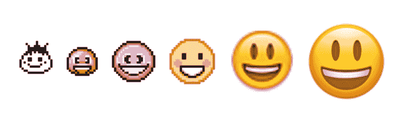
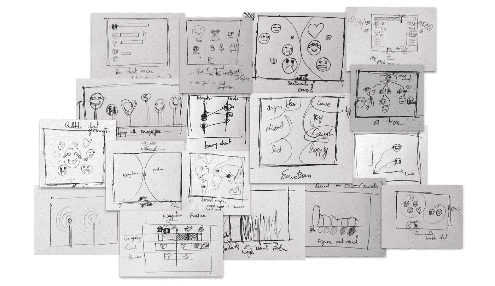
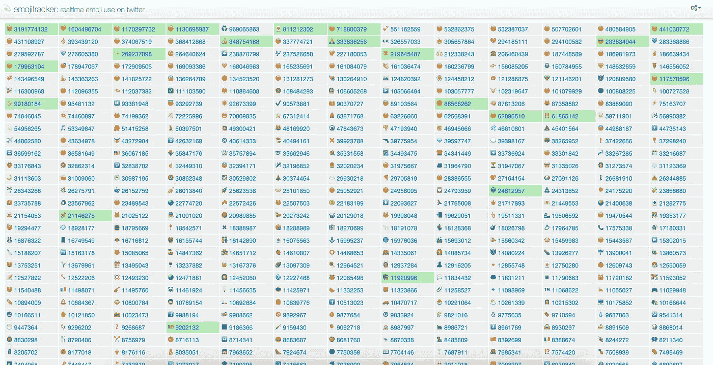
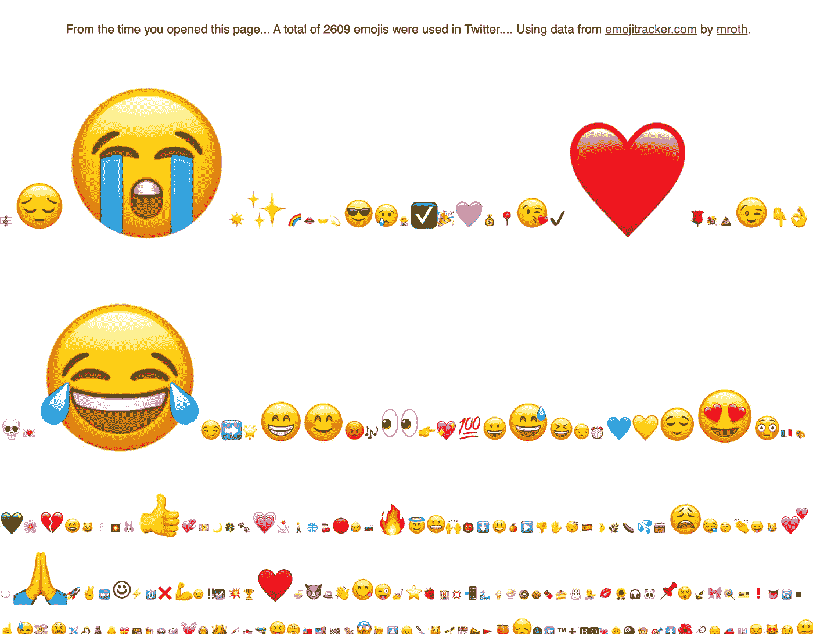
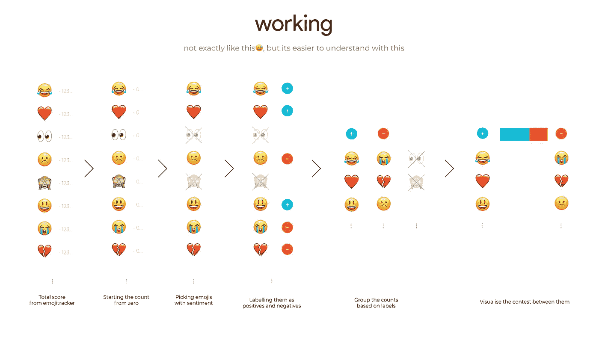
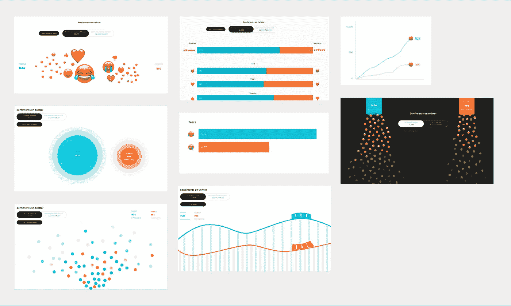
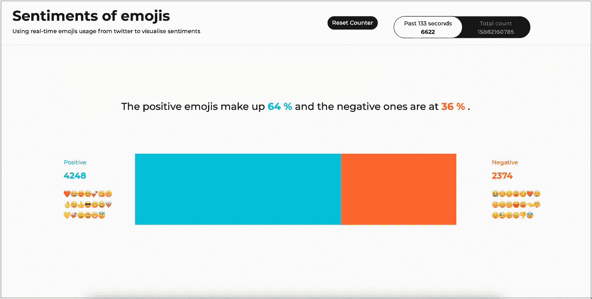

# 表情符号的情感

> 原文：<https://medium.com/nerd-for-tech/sentiments-of-emojis-21860c4f8881?source=collection_archive---------17----------------------->

来自 Twitter 的表情符号直播流能揭示什么？

> 这个故事是我在孟加拉国国家设计学院完成的一门课程“信息可视化”中的一项作业(实际上是远程在线完成的)😅).该项目由[Amit Kapoor](https://amitkaps.com/)先生指导，我感谢他在整个任务过程中提供的宝贵见解和指导。

## **让我们开始吧——表情符号**😀

The word ‘emoji’ comes from Japanese e (絵, “picture”) + moji (文字, “character”). Emojis are popular nowadays. These are the tiny characters like ‘😂❤️🎉…’ seen accompanying texts in social media and messaging platforms.

互联网上的表情符号

他们是如此受欢迎，以至于我们有一部以他们为原型的电影，在 Twitter 和其他社交媒体上也有大量的使用。

表情符号的视觉演变

表情符号在外观、用法以及含义方面已经有了很大的发展。我们都经历过，知道它是什么，在不同的地方如何使用。这对我来说已经足够好了，我可以深入了解我的项目细节，而不会用更多的表情符号琐事来烦你。*附:这些琐事并不无聊，实际上相当有趣，但那是另一天的单独故事。现在让我们只关注我的项目。*

> 从:-)到😀，
> 我们都长大了……

## **Research🧐**

我想用实时数据来直观地展示世界各地的表情符号。我对如何使用表情符号以及用它们代表什么有很多想法。如你所见，我有很多想法。

我最初在纸上画的所有草图和想法

为了更好地理解表情符号及其工作原理，我试图探索和寻找不同来源的表情符号数据。我偶然发现马修·罗森伯格的 e [mojitracker](https://emojitracker.com/) 在推特上实时跟踪表情符号的使用。📈

来自[https://emojitracker.com](https://emojitracker.com/)的截图

因此，它给了我一个从这个应用程序建立以来(2013 年的某个时候)在 Twitter 上使用的所有表情符号的实时分数。

它有一个 REST API，首先给出一个快照，然后是另一个流更新，这太酷了。感谢 Matthew 提供了这个神奇的工具！！

## **概念💡**

一段时间以来我一直在想一些事情。我想到了一些事情，比如通过添加一些额外的参数，根据位置，使用，历史数据，类型和排名，对情绪和情感的表情符号进行过滤和分组。然后，我想先看看表情符号的使用模式，然后再决定做什么。因此，我为自己构建了一个简单的工具来帮助我做到这一点，因为 API 提供了一个总得分，并使用它来获得从您打开页面时开始的计数。

在[https://allwinwilliams.com/live-emoji-meter/](https://allwinwilliams.com/live-emoji-meter/)可以找到简单的探索

这里发生的事情基本上是，清空计数，只在网页打开后开始计数新的表情符号。这是为了看看现在正在使用的表情符号。我决定增加表情符号的大小，因为它们的数量在增加，以便能够很容易地感知正在发生的事情。*我知道一旦计数达到某个点，它会在一段时间后断开，但这是我能理解的任何方式，并不意味着对其他人。*

我只是偶尔打开并重新加载它一段时间，以了解发生了什么，并找到一些模式。😂😭❤️😍是一些总是出现在最上面的表情符号。

**在一个点之后，我固定在 s *事件*上。只是把它们看成*负的和正的*。我认为表情符号是一种简单而有效的表达情感的方式。**

我做了一个图表(不完全)来帮助你(我)理解我的概念。

最终的概念是如何运作的

所以，表情符号有正面的也有负面的。我手头有一份 845 个表情符号的清单，据我说，并不是所有的表情符号都是情绪化的。所以，我想到了挑出带有情绪的表情符号，并将其标记为积极或消极。把有情绪的表情符号放在两个桶里(正面和负面)是我的概念。有趣的是，许多最受欢迎的表情符号都带有情感。

还有，还有一件事。有成对的表情符号。😂-😭, ❤️-💔和👍-👎有些对是相反的，但却有着相同的情感。

看了用的最多的表情符号后，我做了两队会对战的表情符号。正队由❤️组成😂😍😊💕😘😁👌😉👍😎😋😄💗💛💞😀😃😬😇负队有😭😒😔😩😏💔😢😑😞😕😡😫👈😤😣😓😠😖👎😰。

## **视觉探索**

现在，如何视觉化地表现这一点是最后的挑战。我希望它*有趣、快速、简单*，因为观众将主要是那些与表情符号一起成长的人，他们在表达自己和在所有数字平台上交流时广泛使用表情符号*。带着这些想法，我开始构思一些关于这些东西的概念。*

我很快试着想象一些事情，最终选择了其中最简单直接的一个。

表现情感的视觉探索

## 最终解决😇

最后一个是有两个部分的水平堆叠条，一个用于正极，一个用于负极。我在表情符号对之间的打斗中使用了类似的东西。

目前在[https://allwinwilliams.com/emoji-sentiments-twitter/](https://allwinwilliams.com/emoji-sentiments-twitter/)直播的网页

在做这一切的时候，我脑海中又冒出了一个想法，那就是允许用户选择他们想要的任意两个表情符号，并在它们之间进行一场战斗。我想那会很酷并且成功了。

【https://allwinwilliams.com/emoji-sentiments-twitter/】**[****敬请期待。****](https://allwinwilliams.com/emoji-sentiments-twitter/)**

**很多关于表情符号和最重要的数据的学习，如何理解它，甚至更多关于如何以对观众有意义的方式来表现它。在技术方面，使用 javascript 和 [lodash](http://lodash.com/) 来获取和分析从 [Emojitracker](https://emojitracker.com) 的[API](https://github.com/emojitracker/emojitrack-rest-api)提供的数据，这一概念成为可能。棒线战斗，我称之为具有两个实时数据的水平堆叠棒线的这种用法是使用 [d3.js](https://d3js.org/) 制作的。**

**该项目是实时的，可以在[https://allwinwilliams.com/emoji-sentiments-twitter/](https://allwinwilliams.com/emoji-sentiments-twitter/)找到**

**该项目的代码可以在 https://github.com/allwinwilliams/emoji-sentiments-twitter 找到**

**显然有些东西可以改进，可以开发更多的功能。我很想听听你的意见。所以，只要给 iam@allwinwilliams.com 发一封邮件就行了。**

**这个故事是我在一门名为“信息可视化”的课程中完成的一项作业。这是由 Amit Kapoor 先生指导的。**

**关于课程。它是关于如何在数据、信息、知识等各个层面进行可视化，从而给观众更好的体验。不同种类的数据和方法，以及不同的视觉效果在从直接到抽象的不同光谱中的位置。**

**感谢您的阅读！！**