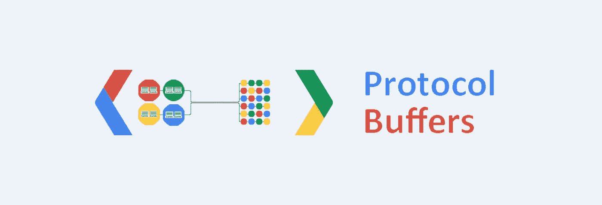

# 使用 Protobufs 进行序列化/反序列化

> 原文：<https://medium.com/nerd-for-tech/serialization-deserialization-with-protobufs-223d401f621d?source=collection_archive---------0----------------------->

图片由 Girija Shankar Behera 提供

在这篇文章中，我将写一下**谷歌**以特定格式**序列化和反序列化**数据的方式。它最初是由谷歌开发人员开发的，作为他们自己通过网络发送数据的内部机制，着眼于提高网络性能和使用率。它主要被设计得比 XML 更简单，但在存储和传输方面更小更快。

这篇文章简要介绍了了解**协议缓冲区**的必要性。它也作为下一个的基础，因为那将是关于**张量流记录**。理解 protobufs 也使得使用 tfrecords 变得更加容易。

## 什么是协议缓冲区？

根据 Google Protobuf 文档，

> 协议缓冲区是 Google 的语言中立、平台中立、可扩展的机制，用于序列化结构化数据——想想 XML，但是更小、更快、更简单。

简单地说，protobufs 只是将消息序列化为二进制格式的另一种方式。序列化的输出是一个字节序列，非常密集，努力节省空间。然后，字节通过线路传输，这比以 **XML 或 JSON** 格式发送相同的数据花费的时间要少得多。用 protobufs 序列化和反序列化数据甚至更快。

## 为什么我们需要协议缓冲区？

Protobufs 只是使用 XML 或 JSON 传输消息的传统方式的替代品。当网络中的性能或负载是应用程序的主要关注点时，这是首选。让我们来看一个例子，看看所有这些格式的消息有多大。我这里有一个字符串“Medium”要序列化。

这些格式的唯一区别是文本在 XML 和 JSON 中是可读的，但在 protobuf 格式中是不可读的。但是如果可读性不是问题，那么我们可以看到 protobufs 占用的空间比它的 XML 和 JSON 变体少得多。与 XML 和 JSON 相比，它允许我们通过网络发送大块的数据，占用更少的空间。

## 协议缓冲格式

> protobuf 的工作从声明我们想要在 **protofile** 中传输的数据结构开始，然后用**protocol**对其进行编译。这就在发送方和接收方产生了编译的代码，该代码作为传输数据的数据结构的源。

这里有一个小的原型文件，包含一个带有两个字段的消息类型。原型文件的扩展名是“”。proto”。这里的第一个字段是字符串字段“name ”,第二个字段是 int32 类型的“age”。右边的数字是标签，在反序列化数据时很有用。反序列化器在解密数据时使用我们明确定义的标记中的编号方案。现在这个 proto 可以用代码中提到的 protoc 编译器编译，这将产生类似于 [this](https://gist.github.com/girija2204/06f25205af185ca15b1f5bc7135c6b4f) 的编译后的类输出。我用 python 格式进行了编译，作为输出，这将允许我们将消息类型用作普通的 Python 类，并且可以如下所示进行实例化。

## **用法**

下面的代码使用来自 protofile 的消息作为一个类，并实例化它。然后，它为其属性赋值。这类似于我们在 Python 中实例化一个类的方式。

序列化过程也很简单。只需调用方法 SerializeToString 来获取它的二进制，可以用 bytes 格式传输。

理解整个序列化过程超出了这里的范围，它使用 ***Varints*** 的[序列化过程对数据进行编码。](https://developers.google.com/protocol-buffers/docs/encoding)

那么，后端到底发生了什么让我们可以创建一个 Person 类的实例呢？我们刚刚创建了一个名为 proto 的文件，其中包含一种消息类型。然后我们用 protoc 编译器编译它，它创建了一个名为 person_pb2.py 的文件，这个文件被导入到这里来访问消息类型 person 作为一个类。为了了解后端发生了什么，我分析了下面的编译文件。

## 内幕

所以它从一个叫做描述符的东西开始，顾名思义，它给出了关于写在 proto 文件中的消息类型的基本信息。有不同类型的描述符，**文件描述符，字段描述符，枚举描述符，枚举值描述符，描述符**等。

这是一个**文件描述符**，它捕获关于文件内容的信息。它包含了 proto 文件的名称、中声明的包、表明它遵循 proto3 版本的语法以及一些其他信息。

生成的编译代码的下一部分是 proto 文件中定义的实际消息类型的描述符。描述符的名称以下划线开头，后跟全大写的消息类型名称。它包含消息类型的名称、全名(包括范围)，以及字段的描述符。文件的描述符是上面的**文件描述符**，消息的描述符是**描述符**，字段的描述符是**字段描述符**。FieldDescriptor 使用:

*   **索引** —指示原型文件中字段的顺序
*   **编号** —表示标签
*   **type** —表示用数字表示的变量的数据类型(9 表示字符串，3 表示 int32)
*   **has_default_value** —指示是否已提供默认值的布尔字段
*   **default_value** —表示缺省情况下提供的值，如果未提供，则 protobuf 具有为每种数据类型定义的缺省值。请继续到底部找到默认值 ***。***
*   **标签** —指示该字段是必填字段、可选字段还是重复字段。请继续阅读底部，了解有关这些标签 ***的更多信息。***

好了，到目前为止，我们已经看到了文件、消息和字段类型的描述符。但是我们还没有看到一个地方正在创造“人”的阶级。

我们知道，当我们实例化一个类时，一个对象就被创建了。类似地，当我们实例化一个 ***元类*** 时，就创建了一个类。

Google protobuf 提供了一个元类'**GeneratedProtocolMessageType**'，它负责在运行时从协议消息描述符创建类。它还将字段描述符注入到类输出中。这允许我们使用 person_pb2 作为包含 person 类及其属性的模块。

但是，仍然有一样东西似乎不见了。在名为 descriptor 的文件描述符和消息 descriptor _PERSON 之间还没有映射。

这就是这里显示的内容。文件描述符通过其名称与消息描述符进行映射。除此之外，它还显示了注册到 protobuf 中维护的符号数据库的消息。文件描述符和消息描述符都在数据库中注册为符号。

**枚举、嵌套类型和作为字段类型的消息**

我们可以有一个预定义值列表的枚举，例如，如果我们希望一个地址是家庭类型或办公室类型，那么我们可以创建一个枚举，将这两种类型都作为它的可能值。枚举必须以 0 值开始，因为如果没有显式提供，它将用作字段的默认值。

我们也可以使用嵌套的消息类型，在另一个消息类型中声明一个消息类型。这里，我们在雇员消息类型中添加了地址消息类型。

我们也可以使用一种消息类型作为另一种消息中使用的字段类型。这里，部门使用雇员作为其现场雇员的类型。这允许我们为字段使用自定义数据类型。

编译好的 python 文件可以在这里找到[。枚举类型和枚举值的描述符是**枚举描述符**和**枚举值描述符**。](https://gist.github.com/girija2204/06ab5f9745e6b7b8dca7f7ae2a4b3717)

**默认值**

从类初始化实例时，每种消息类型都可以接受默认值。如果没有初始化，那么 protobuf 会自己提供这些默认值。

*   对于整数，默认值为 0
*   对于字符串，默认值为空字符串
*   对于字节，默认值为空字节
*   对于 bool，默认值是 bool
*   对于枚举，默认值是值为 0 的值
*   对于消息类型，不设置默认值。

**标签**

*   Required 是必须提供的值，如果没有提供，那么序列化没有值的字段将引发异常。
*   可选是指可以提供或不提供值。如果没有提供，那么将使用默认值。
*   重复是指字段可以重复任意次。

在 proto3 中，Required 不可用，因为默认情况下所有字段都是可选的。这个帖子遵循 proto3 版本，因此没有字段是必需的或可选的。

## **扩展 protobufs**

可能会有这样的情况，我们会在使用一段时间后修改现有的 protobuf。在这种情况下，我们将需要处理一些事情，因为更改需要向后兼容。如果我们想要添加一个新的字段，那么这个字段必须使用一个新的标签。我们不能更新现有字段的标签。由于 proto2 有必填字段，我们不应该在更新时删除必填字段。但是，可以删除可选或重复的字段。按照这些步骤，可以很容易地扩展 protobuf 消息类型。

## 何时不使用协议缓冲区

Protobufs 将数据序列化为二进制格式，然后以字节传输，数据看起来非常密集和小。通过网络传输、序列化和反序列化它们会更快。但是，如果底层应用程序是 web 浏览器，并且数据是直接提供给它的，就不打算使用它们。如果需要可读性，就不要使用它们。XML 和 JSON 都是可读的，甚至不需要知道模式，也是可编辑的。编辑 protobuf 序列化数据是不明智的，因为它会妨碍数据的整体结构和意义。

## 结论

所以，这都是关于原蟾蜍的。虽然它看起来很吸引人，但人们需要知道什么时候使用，什么时候不使用。总的来说，如果性能、网络负载或向后兼容性是问题的话，它们是很好的选择。

***参考文献***

*   要了解更多关于 ProtoBuf 的信息，请关注[谷歌 proto buf 文档](https://developers.google.com/protocol-buffers)。