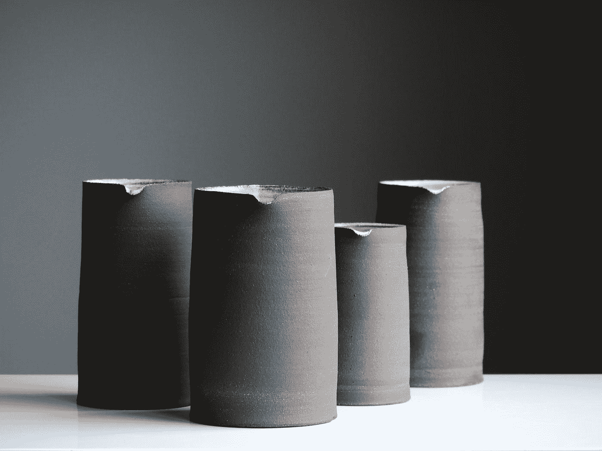

# 用 Ktor 将 JSON HttpResponse 序列化为 Kotlin 对象。

> 原文：<https://medium.com/nerd-for-tech/serialize-json-httpresponse-to-kotlin-objects-with-ktor-a9ac6e4db270?source=collection_archive---------2----------------------->



由[汤姆·克鲁](https://unsplash.com/@tomcrewceramics?utm_source=medium&utm_medium=referral)在 [Unsplash](https://unsplash.com?utm_source=medium&utm_medium=referral) 拍摄的照片

最近我遇到了一个问题，我应该从哪里获得一个 [Jenkins](https://www.jenkins.io/) 作业的最后一次成功构建散列。为此，我通过 http 使用了一个简单的 json api 调用，并得到了一个 HttpResponse。现在的问题是，我需要从这个 HttpResponse 中提取散列值。我想到的第一件事就是使用子字符串，但是我意识到，如果有人改变 json 输出模式的某些东西，这种方法并不可靠。对此，我需要一个更好的、更程序化的解决方案。

首先，让我们用 [Ktor](https://ktor.io) 创建 http 请求，从 Jenkins 那里获取 HttpResponse。

# Jenkins API 调用 Ktor

## 必需的依赖关系

如果你的 Jenkins 不需要认证，你甚至不需要 ktor-client- [auth](https://ktor.io/docs/authentication.html#basic-usage) 依赖。

## 定义 HttpClient

该客户端使用 Jenkins 的密码和用户名进行基本身份验证。不要忘记有**sendwithrequest**的部分！如果该值未设置为 true，每次验证都会失败。

下一部分是带有序列化程序的 JsonFeature。它对 Json 使用普通的 [kotlinxSerializer](https://kotlinlang.org/docs/serialization.html) 。建议将 ignoreUnknownKeys 的值设为 true，因为如果不是 json 字符串的每个值都可以放入数据类中，它将会失败。

最后一步是配置 ResponseValidator。在我的例子中，如果状态代码高于 300，它将抛出一个带有响应文本的自定义 Jenkins 异常。

## 将对象序列化为字符串并反转

让我们先从一个非常简单的例子开始，然后再看更难的。

1.  创建可序列化的数据类

```
**@Serializable** 
**data** **class** Data(**val** a: Int, **val** b: String)
```

2.通过调用以下命令将此类的实例序列化为字符串:

```
Json.encodeToString(Data(42, **"str"**))
```

结果，您得到一个包含 JSON 格式的对象状态的字符串:`{"a": 42, "b": "str"}`

3.通过调用以下命令将字符串序列化为类的实例:

```
**val** obj = Json.decodeFromString<Data>(**"""{"a":42, "b": "str"}"""**)
```

这将创建与步骤 1 中定义的完全相同的对象。

## 创建可序列化的数据类

因为我们的 Jenkins Json 响应看起来像这样，所以我们需要为我们想要序列化的所有东西创建类。

1.  首先，我们需要创建一个包含所有其他内容的根类。在这种情况下，我称之为 JenkinsJsonData。
2.  下一步我们需要的是行动。它包含一个元素数组。
3.  我们最不想要的是包含 SHA1 散列的 *lastBuiltRevision，*。

因为我还需要 buildNumber 用于该项目后面的另一个任务，所以我会立即将其添加到基类的构造函数的参数中。

如您所见，lastBuiltRevision 是可空的。如果不是所有在*动作* 下的对象都包含一个 lastBuiltRevision，这可能会是一个问题。为了弥补这种不安全性，我们在 JenkinsJsonData 类中编写了一个自定义 getter。

它只搜索这些操作的最后一项，其中 lastBuiltRevision 不为空，然后返回它的散列。

## 调用 Jenkins Api 并序列化输出

1.  对 Jenkins Api 调用的 branchName 进行双重编码。
2.  用生成的 URL 调用 client.get 函数。
3.  这个函数需要在 runBlocking 块中，因为它是一个挂起函数。
4.  这将返回一个 JenkinsJsonData 对象，其中包含散列的自定义 getter。
5.  如果状态代码超过 300，get 请求将抛出一个异常，并抛出一个新的自定义异常。

# 反射

## 什么进展顺利？

序列化本身工作得很好，官方文档中的例子也很容易理解和扩展。此外，Ktor 的 get 请求非常有效。

## 有哪些需要改进的地方？

HttpResponse 的读取造成了一些麻烦，因为我必须使用 runBlocking 块来运行它，因为它是一个挂起函数。我不知道这样的功能是什么，也不知道它有什么特别之处。

另一件事是，我对 actions 类的可空的 lastSuccessfulBuild 参数有一些问题。这个问题的解决方案非常简单合理。问题是我没有足够仔细地阅读 stacktrace，这肯定需要改进。

我希望这篇文章对你有用😃