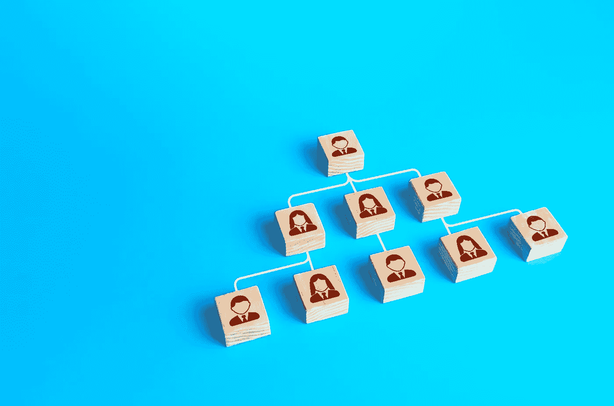
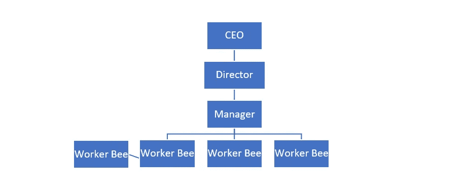
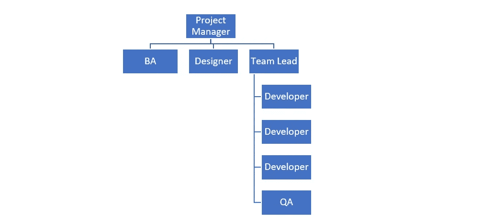

# 服务型领导和提升团队参与度

> 原文：<https://medium.com/nerd-for-tech/servant-leadership-and-elevating-team-engagement-908fdfcebb3c?source=collection_archive---------15----------------------->

# 我们如何看待领导力

当我们想到一个组织中的领导时，我们通常会想到坐在高管层的人，首席执行官，总裁，首席运营官，因为这已经成为标准，已经在我们的脑海中根深蒂固。当你闭上眼睛，你可能会看到这样的画面:

或者就项目团队的领导而言，您可能会想到这种层次结构:

不管是什么组织、部门还是项目，想法都是一样的——一切都从顶层开始，然后向下滚动。在过去的 200 多年里，我们已经看到组织超越了传统的领导实践，从君主制和军队，到 20 世纪和 21 世纪的数百万美元的公司。当你的文化是:

A.不存在或

B.只关注市场地位

在这种领导风格中，我们看到了一种“自上而下”的思维模式，所有的决定、所有的方向都是自上而下提供给团队成员的。我们经常看到以下行为:

*   决策往往是在真空中凭一时冲动做出的，很少考虑员工的影响。
*   当一个决定遭到质疑或失败时，愤怒随之而来。
*   没有解决根本原因的灭火症状。
*   最低限度的员工认可，因为出色的工作被视为他们工作职责的一部分。
*   很少有新的领导者被培养出来。
*   高绩效团队成员超载。
*   相信你在组织结构图中的位置越高，你的权力和权威就越大。

对组织有什么影响？

*   员工士气低落
*   员工参与度和工作满意度下降
*   一种低调、不合作的文化
*   员工流动率高

现在，我并不是说每一家使用这种“自上而下领导”模式的公司都会陷入这些行为或者看到这些后果。我*所说的是，没有经历过这些负面后果的公司(士气高昂、员工参与度更高的公司)通常不会运用传统的领导风格。*

以我的经验来看，是仆人式领导在掌舵。

那么，什么是服务型领导呢？根据格林立夫研究所的说法，it " *主要关注人们及其所属社区的发展和福祉。传统的领导通常是由“金字塔顶端”的人积累和行使权力，而服务型领导则不同。仆人型领导分享权力，把他人的需求放在第一位，帮助人们尽可能地发展和表现。”(*什么是服务型领导)

简而言之，仆人式领导会把团队放在第一位。

服务型领导更多的是关于行为而不是风格，它通过授权和提升团队成员来鼓励工作人员的协作决策。服务型领导沟通问题，鼓励受影响的人解决根本问题，并不断认可员工的成就，无论成就大小。他们促进责任感、开放的交流论坛、团队建设，并努力使团队成员的行动/动机与公司的整体愿景保持一致。

这不再是一种自上而下的层级领导方式，而是一种点对点的协作、支持的心态。

结果如何？

*   感到被授权和被重视的团队成员
*   提高团队成员的参与度和绩效
*   一种紧密团结的社区式文化
*   与公司愿景一致的团队成员
*   营业额下降
*   改善工作/生活平衡，因为团队成员不太可能超负荷工作
*   信任
*   未来的领导者是发达的

你猜怎么着？这也影响到了客户交互！

那么，如何成为一个仆人型领导呢？这并不容易，也不是很快，正如我之前所说，这是一种心态…它始于想要把人放在第一位的愿望。

对我来说，服务型领导始于阅读帕特里克·兰西奥尼的《员工敬业度的真相》一书。这让我问自己如何更好地为我的团队服务，如何增加团队的信心。本书概述的原则改变了我接近管理的方式——这一切都基于一个共同的主题——不满足的人会表现不佳。Lencioni 通过一个虚构的故事向你概述了*为什么*你没有充分利用你团队中的人，*为什么*你的团队士气没有达到你想要的水平。

1.匿名

2.不相关

3.无法测量

# 匿名

如果人们不被了解，他们就无法在工作中得到满足。所有人都需要处于权威地位的人理解和欣赏他们的独特品质。

他们需要感觉到他们是某个事物的一部分。作为领导者，我们花时间去了解我们的团队成员是非常重要的。和他们坐下来，了解他们的生活。而且不能言不由衷也不能假，一定要货真价实。它也必须是持续的。我一直记得的一句话是“没有人会在早上起床编写软件……他们起床是为了过自己的生活，他们的工作任务只是他们生活的一部分”(Lencioni)。通过建立这些关系并将团队成员的需求放在第一位，你就一头扎进了仆人式领导。

# 不相关

每个人都需要知道他们的工作对某人很重要。任何人。如果看不到工作与另一个人或一群人的满意度之间的联系，员工就不会有成就感。

人们需要被需要。他们想知道他们正在做的事情对其他人有影响。没有人活着是为了自私，每个人都有一种需求，一种想以某种身份为他人服务的需求。我们的工作是确保团队看到我们在帮助“谁”以及我们如何影响他们。(参见我之前关于[过度沟通项目愿景](https://awh.net/insights/post?post=project-manager-tips-and-tricks)的博客😊)然后，他们可以处理这样的事实:他们是相关的，他们所做的事是重要的。当团队成员感到有价值时，他们总是会做得更多——他们会分享想法，他们会承担额外的责任，他们会在与仆人式领导相关的行为方面茁壮成长。

# 无法测量

团队成员需要能够衡量自己的进步和贡献水平。如果他们的成功依赖于另一个人的意见或突发奇想，他们就无法完成工作，不管那个人多么仁慈。

人们希望看到他们的影响和进步，而不需要经理进行每周/每季度的主观绩效评估。如果员工能够衡量自己的贡献，他们对自己的进步会有更大的责任感和更高的参与度。想象一场棒球比赛。如果没有统计记录，一个球员如何确切地知道他们的击球率正在提高？答案是他们没有。他们可以说，'我想我这周比上周打了更多的安打'，但这只不过是一种直觉。而且主观。无论是轻松地查看您一周又一周的编码速度，还是像计算您一周完成的待办事项数量这样简单的事情，客观的测量都会带来工作满意度，从而导致团队成员的参与。这与仆人式领导有什么关系？你为团队成员提供了他们*成功所需的*，并把他们放在第一位。

这三个组成部分都与仆人式领导行为和将团队成员放在第一位的愿望联系在一起，以改变他们的生活。这就是我的仆人领导之旅开始的地方。

如何开始你的旅程？

我的第一个建议是读这本书。它真正地把一切放在正确的位置，为你的仆人领导转型提供了一个基础。接下来，开始回顾仆人型领导的特征，并在你的工作日开始采用这些特征。斯皮尔斯中心制定了一份非常详尽的名单:(戴维斯)。

1.倾听

2.神入

3.康复

4.意识

5.说服

6.概念化

7.深谋远虑

8.管理工作

9.致力于人的成长

10.建筑社区

归根结底，领导力有很多定义，很多层次，很多特征。仆人式领导也不例外——许多不同的风格，许多不同的方法。但有一件事是不变的，那就是有意识地、深思熟虑地把你的团队放在首位。

## ——阿曼达·迪顿，AWH 项目经理。我们正在帮助企业通过技术推动增长。

*引文
伦乔尼，帕特里克。员工敬业度的真相:关于解决工作痛苦的三个根本原因的寓言。, 2016.打印。*

*“什么是服务型领导？”格林立夫为仆领导，***。**

**保罗戴维斯。"斯皮尔斯仆人领导中心"服务型领导的十大特征，*[*www . spears center . org/46-un categorized/136-ten-characters-of-Servant-leadership。*](http://www.spearscenter.org/46-uncategorised/136-ten-characteristics-of-servant-leadership.)*