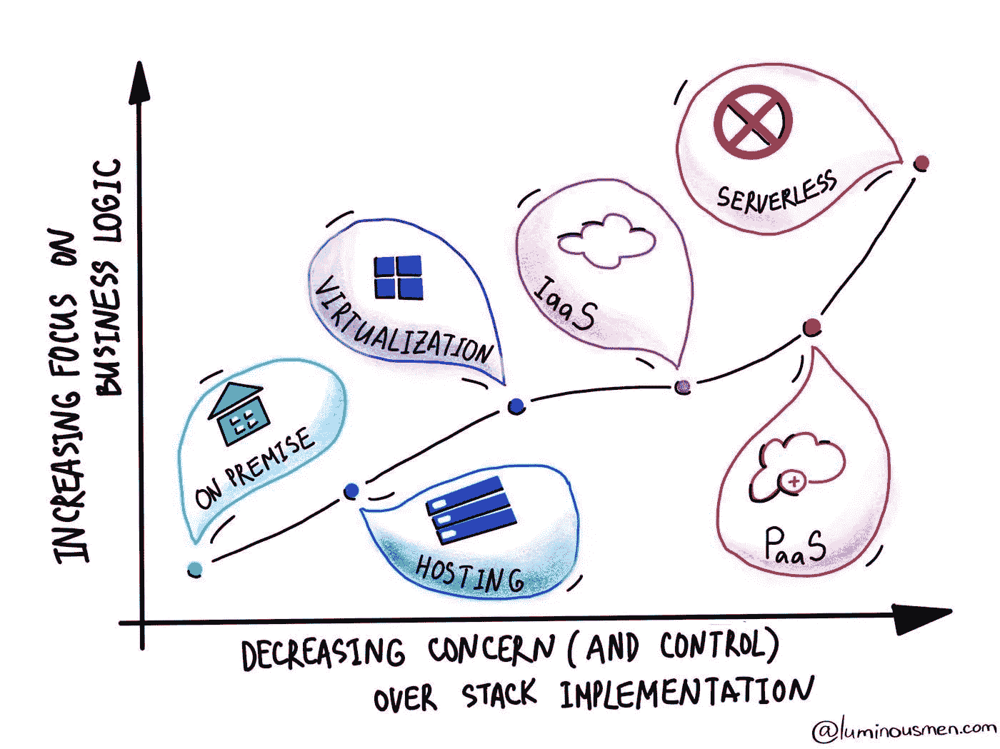

# 无服务器

> 原文：<https://medium.com/nerd-for-tech/serverless-942065aa3439?source=collection_archive---------11----------------------->

web 应用程序的活动是不确定的，有时它们服务于大量的工作负载，但有时它们在没有大量请求的情况下处于闲置状态。在云中的虚拟机上托管应用程序也迫使我们为空闲时间付费。为了解决这个问题，我们必须考虑负载平衡、DNS 查找和自动扩展。很难管理所有这些，在宠物项目上，这毫无意义。