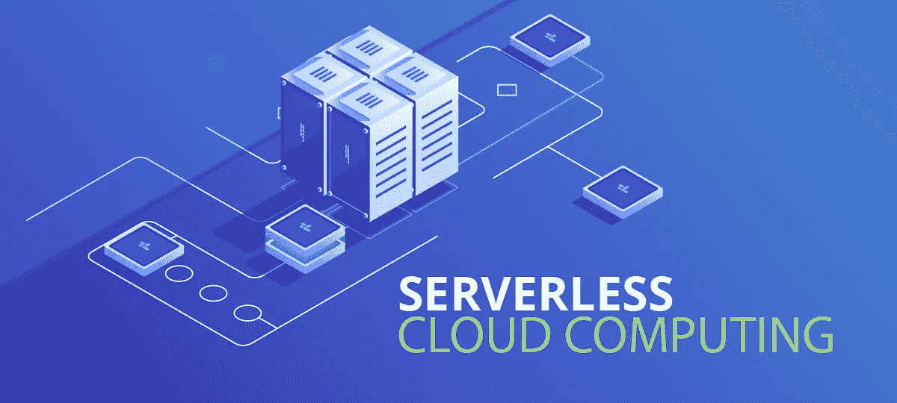
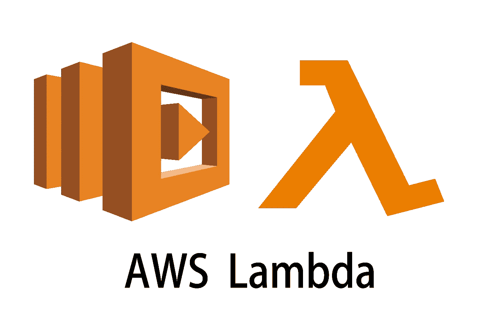

# AWS 上的无服务器计算

> 原文：<https://medium.com/nerd-for-tech/serverless-compute-on-aws-7d45ee573b54?source=collection_archive---------23----------------------->

AWS Lambda 是 Amazon Web Services 的一项计算服务，它允许您在不提供或管理服务器的情况下运行代码。使用 AWS Lambda，您可以运行几乎任何类型的应用程序或后端服务的代码，而不需要管理员。

Aws 管理各种管理员服务:

*   计算设备的配置和容量，提供内存、CPU、网络和其他资源的平衡。
*   服务器和操作系统维护
*   高可用性和自动扩展
*   监控车队健康状况
*   应用安全补丁
*   部署您的代码
*   监控和记录你的 lambda 函数
*   AWS Lambda 在高可用性计算基础设施上运行您的代码

AWS Lambda 在高可用性计算基础设施上运行我们的代码。它仅在需要时执行代码，并根据应用程序的负载自动扩展。我们只支付计算时间，所以没有额外的费用。此外，先决条件是，我们必须上传我们的 lambda 函数形式的代码到 AWS lambda。Lambda 支持 c#、Ruby、python、Go、Python、java、node js 等多种语言。

基于 AWS lambda 的应用程序的生命周期包括创作代码、将代码部署到 AWS lambda 以及监控和故障排除。在这种情况下，我们不能登录实例或定制操作系统或语言运行时。如果我们想管理自己的实例，我们可以使用 EC2 实例或 Elastic beanstalk 来代替 lambda。

# # lambda 如何工作？？？

首先，将代码上传到一个或多个 Lambda 函数中。

第二，lambda 会为我们自己执行代码。

第三，当代码被调用时，lambda 负责提供和管理所有类型服务。

# # lambda = >中的重要术语

1.函数:函数是一种资源，您可以运行它来调用 AWS lambda 中的代码。函数包含处理事件的代码，以及在 lambda 和函数代码之间传递请求和响应的运行时环境。

2.运行时:它允许函数在相同的基础环境下用不同的语言运行。运行时充当 lambda 服务和功能代码之间的中介，在两者之间传递调用事件、联系信息和响应。

3.EVENT:这是一个 JSON 格式的文档，包含函数要处理的数据。

4.事件源/触发器:诸如 Amazon SNS 之类的服务，或者触发您的功能并执行逻辑的定制服务。

5.下游资源:一个 AWS 服务，比如 dynamo DB table 或 S3 buckets，你的 lambda 函数调用一旦被触发。

6.并发性:在给定时间内，函数服务的请求数。

# # Lambda 什么时候触发？

我们可以使用 AWS Lambda 运行您的代码来响应:-

1.  事件，如亚马逊 S3 桶或亚马逊 DynamoDB 表中的数据变化。
2.  使用 Amazon API gateway 运行您的代码来响应 HTTP 请求。
3.  有了这些功能，我们可以使用 lambda 轻松构建数据处理触发器

## AWS lambda 功能配置

lambda 函数由代码和任何相关的依赖项组成。

此外，lambda 函数还有与之相关的配置信息。

最初，我们可以在创建 lambda 函数时定义配置信息。

Lambda 函数为我们提供了一个 API 来更新一些配置数据。

# #λ功能配置信息包括以下关键元素:

你需要的计算资源——我们只能指定我们想要为 lambda 函数分配的内存(RAM)量。

AWS lambda 通过使用与通用 Amazon EC2 实例类型(如 M#类型)相同的比率来分配与内存成比例的 CPU 功率。

我们可以更新配置，并以 64 MB 的增量请求从 128 MB 到 3008 MB 的额外内存。

大于 1536Mb 的函数被分配了多个线程。

##最大执行时间

您需要为用于运行 lambda 函数的 AWS 资源付费。为了防止 lambda 函数无限期运行，我们指定了一个超时时间。当到达指定的超时时间时，AWS lambda 终止 lambda 函数。默认值为 3 秒，最大值为 900 秒[15 分钟]。

IAM Role = >这是 AWS lambda 在代表我们执行 lambda 函数时承担的角色。

# # AWS lambda 函数访问的服务:

*   AWS 服务或非 AWS 服务
*   在 AWS VPC 中的 EC2 实例上运行的 AWS 服务。
*   默认情况下，AWS Lambda 在 VPC 中安全地运行我们的代码。
*   但是，要使 Lambda 函数能够访问 VPC 内部的资源，您必须提供额外的特定于 VPC 的配置信息，包括 VPC 子网 ID 和安全组 ID。

##调用 lambda 函数的不同方式。

1.  同步调用(推送)

它们是调用 Lambda 函数最直接的方式。在这个模型中，当您执行 invoke API 调用时，您的函数会立即执行。

调用标志指定“请求响应”的值。我们等待函数处理事件

并返回响应。

2.异步调用(事件)

在这里，Lambda 将事件放在一个队列中，并返回一个成功的响应，没有附加信息。

Lambda 将事件排队等待处理，并立即返回响应。我们可以配置 lambda 向另一个服务发送调用记录，比如 SQS、SNS、Lambda 和事件桥。

3.基于轮询的调用(基于拉取):

调用模型旨在允许您集成 AWS 流和基于队列的服务，无需代码或服务器管理，lambda 将代表我们轮询以下服务，检索记录并调用您的函数。支持的服务有亚马逊 Kinesis，SQS，DynamoDB 流。