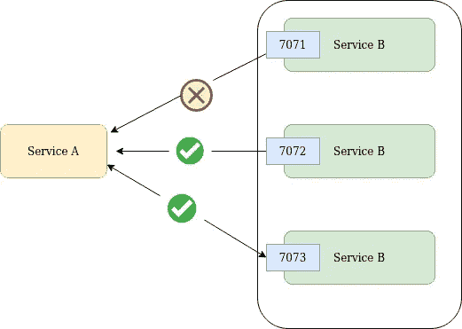
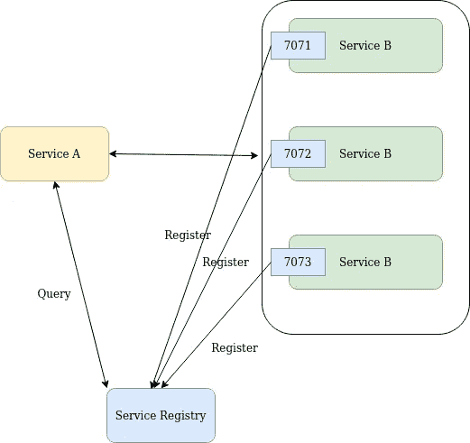
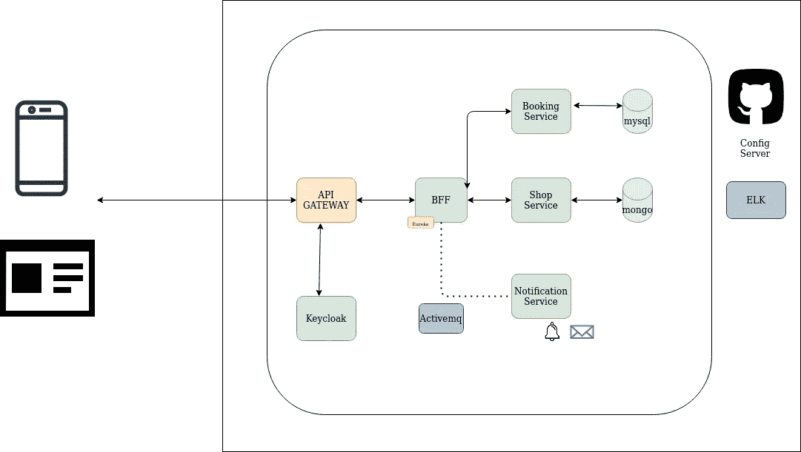
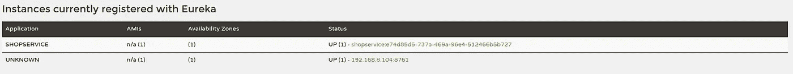

# 微服务中的服务发现——Spring Boot Web Flux

> 原文：<https://medium.com/nerd-for-tech/service-discovery-in-microservices-spring-boot-web-flux-3029f1cf6e68?source=collection_archive---------0----------------------->

带有 web flux 的 Spring 云发现服务器

正如我们在上一篇文章中提到的，我们将继续微服务案例研究。在这个帖子中，我们将讨论微服务中的服务发现。

# 为什么需要服务发现

首先，我们为什么需要服务发现？在现实世界中，当我们处理与微服务的通信时，需要检查服务是否被破坏。如果服务不可达，我们可以与其他实例通信。

在上述示例中，服务 B 的第一个实例将不可访问。因此，当请求来自服务 A 时，如果它访问第一个实例，将无法连接到服务 B。因此出现了在单独的服务器上保存实例注册表的设计模式。以便在连接到服务 b 时给出实例细节。

服务注册中心设计模式

这里，当启动服务 B 实例时，它将被注册在服务注册表中。然后，服务 a 中没有硬编码的实例详细信息。这将有助于动态连接到服务 B。假设如果服务 B 的一个实例失败，那么服务注册中心会阻止与服务 a 的那个实例连接。

# Spring Boot 与网飞尤里卡

让我们使用网飞尤里卡图书馆来实现发现模式。

首先，我们的 web bff 模块充当发现服务器。这些是需要添加到 pom.xml & Annotations 中的主要配置更改。

**网络 Bff 模块**

属国

配置更改

**店铺服务模块**

这里，这个模块需要注册为 eureka 客户端模块。所以他们会自动在尤里卡服务器上注册。

在这里，我们必须为微服务设置应用程序名称和实例 ID。

并为 spring boot 应用程序添加以下注释。

这些注册的微服务将显示在发现服务器管理门户中。

## 使用 Webclient 实现负载平衡

这是棘手的部分。大多数时候我们都是用 RestTemplate 来连接微服务。但是在这个场景中，我们必须使用 [WebClient](https://docs.spring.io/spring-framework/docs/current/javadoc-api/org/springframework/web/reactive/function/client/WebClient.html) 。

确保将 spring-cloud-loadbalancer 添加到项目中。

我们不能像在 RestTemplate 中那样使用`@LoadBalanced`注释。为了在 WebClient 中使用负载平衡行为，需要使用[ReactorLoadBalancerExchangeFilterFunction](https://javadoc.io/doc/org.springframework.cloud/spring-cloud-commons/latest/org/springframework/cloud/client/loadbalancer/reactive/ReactorLoadBalancerExchangeFilterFunction.html)类作为 WebClient 中的过滤器配置。

这将演示如何使用 spring webflux 和 Spring Cloud Discovery 服务。

在这里，您可以访问代码库。

[宠物网-Bff](https://github.com/sajith4u/pet-web-bff)

[宠物店服务](https://github.com/sajith4u/pet-shop-service)