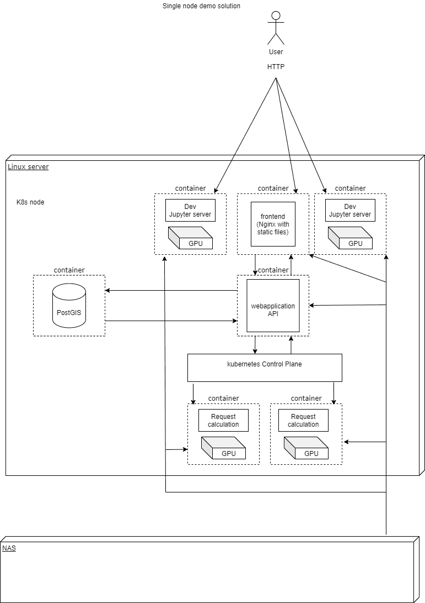

# 服务概述:Kubernetes。我们为什么决定使用它？

> 原文：<https://medium.com/nerd-for-tech/service-overview-kubernetes-why-we-decided-to-use-it-c3c997e7d34a?source=collection_archive---------9----------------------->

## 好消息！ [SoilMate](https://soilmate.ai/) 正在向 Kubernetes 移动！在这篇短文中，我们将解释 Kubernetes 的主要优势以及我们如何在机器学习中使用它。

从 SoilMate 的角度来看，容器化和流程编排证明有利于建立可预测、可重复、快速开发和部署的基础设施。实施 Kubernetes 是在建立一个高效的项目开发过程中向前迈进了一步，并带来了**一系列的好处:**

*   自动缩放——系统的完全自动化和灵活缩放——允许根据应用要求缩放容器；
*   基础设施的通用配置——跨不同云服务提供商的支持和可移植性；Kubernetes 配置在亚马逊网络服务、微软 Azure、谷歌云平台上运行，这使得选择最优定价以及满足 GDPR 合规性需求变得更加容易；
*   机器学习的 GPU 调度解决方案:支持将训练 ML 模型和推理部署的过程扩展到多云 GPU 集群。

# 现代应用架构方法

如今的软件应用程序是一种先进的系统，它能在各种条件下确保高可用性和可靠性，如系统故障或动态变化的负载。

需要**处理大量数据**而不损失性能时间，这促使我们的团队采用 Kubernetes 来构建可扩展的应用程序，以提供目前可用的**最佳客户体验**。

图一。Kubernetes 单节点演示解决方案*

*在这一点上，该图代表了我们目前拥有的 soil mate MVP 版本的 Kubernetes 集群结构。我们计划开发我们的解决方案，所以更新即将到来！

# 使用 Kubernetes 解决容器编排问题

应该在系统中引入一个自动化的编排器来解决这个架构挑战。为此，最流行的工具是 Kubernetes，这是一个自动化 Linux 容器操作的开源平台。它消除了部署和扩展容器化应用程序所涉及的许多手动流程。

Kubernetes 自动化了不同规模的容器化应用程序的配置、部署、管理和监控过程。作为一个操作员，它管理容器的生命周期，通过预定义的规则和条件提供负载平衡和故障恢复的高可用性。

# 机器学习的 Kubernetes

这种方法在机器学习应用程序中特别有用，因为它们高度依赖于资源管理，并且会消耗资源。为了将微服务的灵活性引入到机器学习应用中，Kubernetes 具有四种能力:**可扩展性、GPU 支持、数据管理和基础设施抽象。**

Kubernetes 通过容器编排工作流来应对许多计算挑战。它允许数据科学家可扩展地访问 CPU 和 GPU，当计算需要大量活动时，它们会自动增加，当任务完成时，它们会缩减。