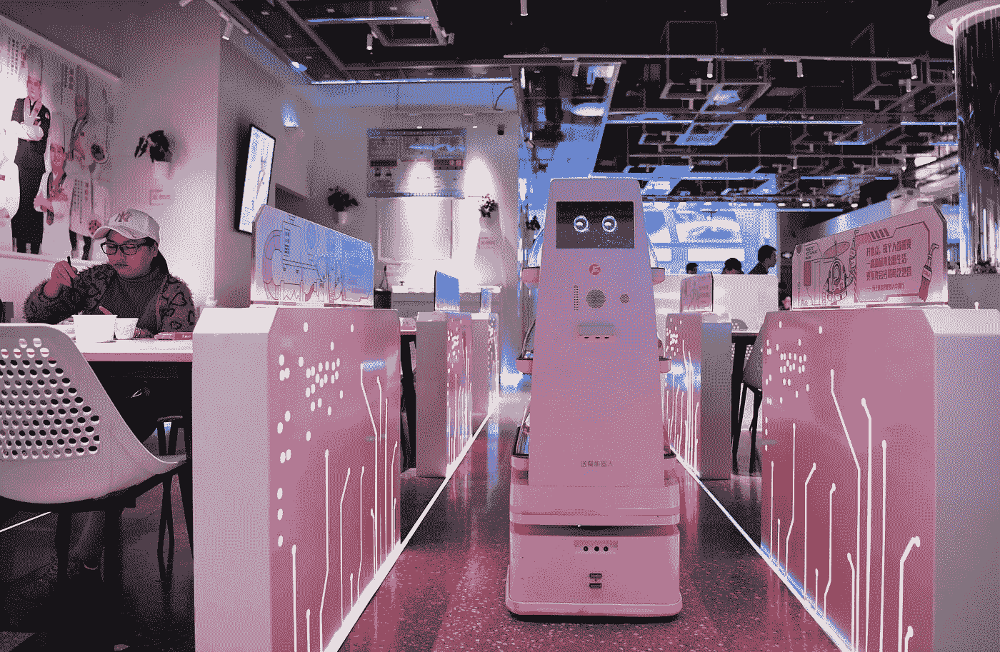

# 服务机器人助力中国餐饮行业智能化转型

> 原文：<https://medium.com/nerd-for-tech/service-robots-help-the-intelligent-transformation-of-the-catering-industry-in-china-f10f2397eeb?source=collection_archive---------4----------------------->

[http://k . Sina . com . cn/article _ 213815211 _ 0 CBE 8 fab 02000 tqw 2 . html？from=food](http://k.sina.com.cn/article_213815211_0cbe8fab02000tqw2.html?from=food)

## 新职业——服务机器人应用技术员

用一句话来形容这个岗位很合适:机器人为人服务，技术人员为机器人服务。

随着技术的进步，伴随着非接触要求的流行，服务机器人市场正在加速发展。在服务机器人行业，服务机器人应用技术人员要带领机器人进入应用场景，帮助机器人顺利开展工作。

自疫情爆发以来，一群特殊的人物也进入了公众的视线。在这场战斗中，无人送货机器人被赋予了与医护人员并肩作战的重任。疫情过后，智能机器人在送餐、迎宾、保洁等更多服务场景中成为了帮手。一个新的职业“服务机器人应用技术员”也应运而生，它保障、优化、维护和管理智能机器人的正常运行。

## 技术员的日常工作

技术员先对店里新买的几台送餐机器人进行常规检查，然后向店员询问各种细节，再打开自己的电脑进行设置。在不到一个小时的时间里，他安装了新机器人的“大脑”，最后耐心地培训工作人员如何控制送货机器人，并列出一些机器人维护的注意事项。技术员张晓明说，“看着机器人在自己的手下‘活’起来，给客户带来良好的服务体验，很有成就感。”

“快”是机器人行业的标准工作节奏。张晓明的公司是国内最早进入室内机器人服务的公司之一。该团队使用先进的智能服务机器人和人工智能技术，创建高效、可靠、实用、稳定的解决方案，帮助各行业的公司提高效率，实现智能升级，并为众多客户服务。服务机器人技术人员的工作不是模块化的而是需要根据不同的环境给出不同的专业建议。

## 定制的训练数据集

随着 AI 商业化进程的加快，以及辅助驾驶、客服聊天机器人等 AI 技术在各行各业的应用，人们对特殊场景下的数据质量的期望越来越高。高质量的标签数据将是人工智能公司的核心竞争力之一。

如果说之前的算法模型使用的一般数据集是粗粮，那么算法模型目前需要的是定制的营养餐。如果公司想要进一步提高某些模型的商业化，他们必须逐步从通用数据集向前发展，以创建独特的数据集。

# 结束

将您的数据标注任务外包给 [ByteBridge，](https://tinyurl.com/5n8pjkrc)您可以更便宜、更快地获得高质量的 ML 训练数据集！

*   无需信用卡的免费试用:您可以快速获得样品结果，检查输出，并直接向我们的项目经理反馈。
*   100%人工验证
*   透明标准定价:[有明确的定价](https://www.bytebridge.io/#/?module=price)(含人工成本)

**为什么不试一试？**

资料来源:https://www.robot-china.com/news/202111/17/68354.html