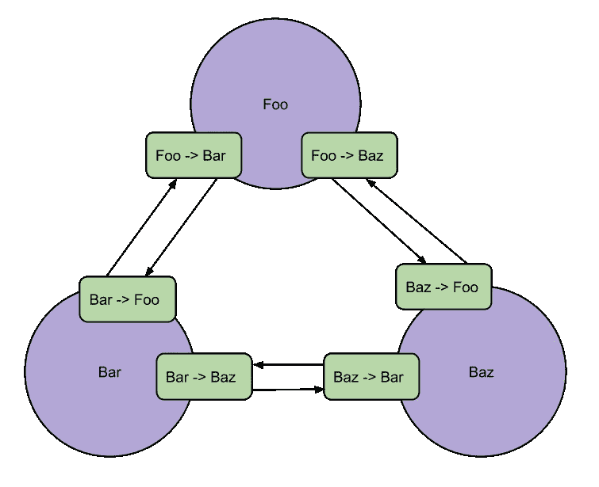
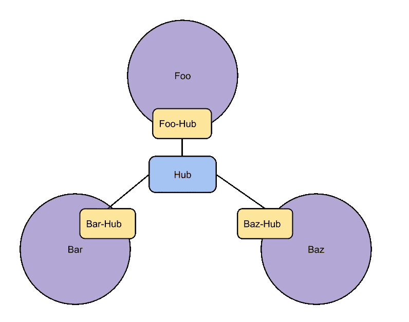
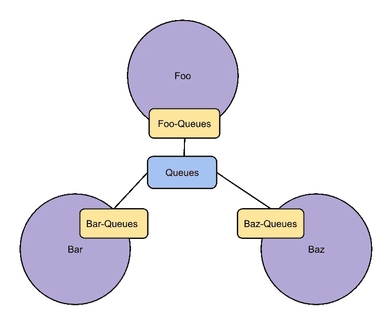
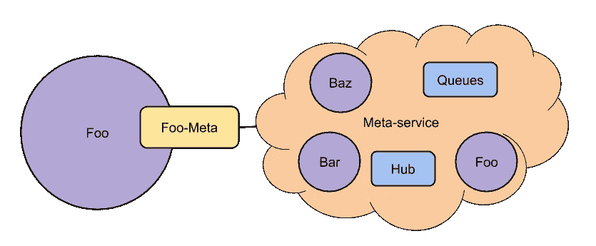

# 面向服务体系结构中的服务到系统通信范例

> 原文：<https://medium.com/nerd-for-tech/service-to-system-communication-paradigm-in-the-service-oriented-architecture-a032c2007da2?source=collection_archive---------0----------------------->

面向服务的架构(SOA)是通过将软件系统分成几个部分来“降低”软件系统复杂性的一种常用方法。我把“减少”放在引号中，因为实际上复杂性总是增加的。将系统分割成独立的定义明确的组件是将系统功能分割成域的逻辑扩展。当一个系统变得太大而不适合利益相关者(工程师、产品经理等)时，处理其复杂性的唯一方法是将它分成几个部分。然后，每个利益相关者将对自己的部分有详细的了解，并能正确地管理这一部分。这种分离实际上并没有降低系统本身的复杂性，而是降低了开发和维护的复杂性。总有一个“通信层”，它有自己的复杂性。

这种额外的复杂性是从 monolith 到 SOA 道路上的绊脚石。但是，在今天的现实中，即使是一个中等规模的企业背后的软件系统也是一件相当复杂的事情，所以，实际上，没有别的办法。你必须在系统进化的某个阶段进行拆分。

因此，这篇文章不是关于 monolith vs SOA。这是关于在您(最终)切换到 SOA 之后，您的系统中的“通信层”的复杂性。

当您做出决定时，会有许多新问题:选择哪种拓扑，我们应该使用同步还是异步通信，我们是否需要消息队列，等等。这些问题相当严肃，这就是为什么有这么多关于它们的书和文章。这些问题通常超出了您的应用程序的领域，它们是关于非功能性需求的，这就是为什么有时我们可以看到一个独立的角色，如架构师(狭义上)负责这些问题的答案。

但最重要的是，从 monolith 到 SOA，我们通常允许每个服务与它的邻居交互，就像它们在 monolith 内部时一样。我们将继续以服务对服务的通信模式构建我们的系统。这是一个错误，它会在以后带来不断增加的复杂性。

本文从讨论这种复杂性是什么、它是如何出现的以及它的位置开始。然后，我们将考虑当我们试图消除复杂性时出现的几个基础设施问题:“什么拓扑更好”和“我们需要消息队列吗”。根据系统中出现的额外复杂性来分析这些选择。我要展示的是，沟通的基础设施并不重要。当然，它在其他方面帮助很大。但是，如果您仍然遵循服务到服务的模式，那么总会出现无法在基础架构层面解决的快速增长的复杂性。控制日益增长的复杂性的唯一方法是转向服务到系统的通信范式。在文章的最后部分，我将展示如何实现新的范例，以及这种范例如何迫使工程师在代码和人类语言交流中使用通用语言(无处不在的语言)。

## 沟通的复杂性是什么？

让我们考虑一个由三个服务组成的人工软件系统:Foo、Bar、Baz。简单来说，这是一个非常对称的情况:服务在内部复杂性方面相当平等，每个服务都与所有其他服务通信。没有“基础设施”逻辑，每个服务可以直接访问其他服务，例如，它们通过 REST API 进行通信。

绿色条表示为了与其他服务通信，必须在每个服务中实现的附加逻辑(复杂性)。例如，Foo -> Bar 是为了与 Bar 通信而在 Foo 中实现的逻辑的一部分。不仅仅是包装 HTTP 请求的代码，这种包装可以用 Bar service 的工程师提供的客户端库来实现。它主要是关于把来自 Foo 和 Bar 服务的抽象(领域知识)放在一起。负责 Foo 的工程师必须对 Bar 有所了解，并且必须将 Bar 的一些抽象集成到 Foo 中。

例如，您的客户管理服务与计费服务进行通信，以便创建发票。负责第一项服务的工程师必须了解计费的某些方面，并且必须在自己的代码中管理相关的功能。换句话说，工程师了解自己领域(客户管理)的一切，还必须了解“一点”其他服务。就 Foo-Bar-Baz 而言，来自 Foo 的工程师完全了解她自己的(Foo)领域，同时，必须管理关于 Bar 和 Baz 的“部分知识”。

这种“部分知识”形成了 Foo->Bar 和 Foo->Baz 通信复杂性的核心。Foo 工程师必须理解 Bar 和 Baz 的接口，了解它们的变化，并相应地修改 Foo 代码。

一般来说，Foo->Bar 和 Bar->Foo 是不对称的。如果从“一知半解”的角度来思考，这是相当明显的。在 Foo->Bar 中你熟知 Foo 和 Bar 的接口，但在 Bar->Foo 中，你熟知 Bar 和 Foo 的接口。因此 Foo->Bar 和 Bar->Foo 是完全不同的复杂性，不能互相替代。

在上面的例子中，通信基础设施非常简单。在不同的机器(容器)上运行服务，并允许它们通过网络进行通信，这没什么大不了的。真正的复杂性在于另一个方面——关于系统内部服务的一些细节的知识。这种知识实际上在你把整块石头分割成服务之前就已经存在于工程师的头脑中了。从事 Foo 部分工作的人非常清楚 Bar 和 Baz 部分的功能。但是当你拆分系统时，就不再有方法和函数的直接调用了，它现在是通过例如 JSON API 或定制客户端库来抽象的。你在巴尔和巴兹的同事现在坐在一个单独的房间里。

综上所述，如果你的 SOA 系统中有 N 个通信方向，那么通信层的复杂度基本上就是每个方向的 N 个复杂度之和。但是，请不要把这个陈述想得太数学化。我们用“部分知识”来定义复杂性，没有合适的方法来计算总和。

## 从网状到星形

让我们看看，如果我们改变通信的拓扑结构，复杂性会发生什么变化。网状的相反情况是星形。动机通常如下。在网状拓扑中，每个服务知道的太多了，让我们创建一个中心集线器(或代理，或非常简单的 API 网关)来处理服务之间的通信。因此，每个服务将只知道中心。考虑集线器只是一个非常简单的路由器，没有任何业务逻辑的情况。

请注意，这个数字与上一个略有不同。集线器侧没有条，也没有箭头(通信中的方向)。这是因为通过中间人的交流有点不同。例如，对于 Foo-Hub，实际上并不需要与 Hub 本身进行通信。Hub 只是一个代理。我们在这里有一个错觉，仅仅通过简单的拓扑变化，我们已经帮助了我们的工程师。但实际上，我们没有。

所有发送到 hub 的请求都发送到隐藏在 Hub 后面的一些服务。Foo 工程师非常清楚每个请求去往何处，它们应该如何被格式化，等等。因此，她总是对与她交互的领域有一些了解。与“部分知识”相关的复杂性几乎保持不变(Foo-Hub 黄色条等于两个绿色条 Foo->Bar 和 Foo->Baz)。

因此，总体通信复杂度至少保持与网状方法相同。此外，您的系统中还有一个新的非功能性组件，这可能也不太简单。

如果我们向 hub 添加更多的业务逻辑，我们可以创建抽象，为其他服务引入一个公共接口。这实际上有助于处理复杂性，因为在这种情况下，我们也有一个从服务到服务到服务到 api 网关的范式转变。离最终目标只剩最后一步(但却是巨大的一步)了。不过这个后面讨论。

## 消息队列、通道、企业服务总线和其他朋友

各种各样的消息队列(MQ)是非常流行的工具，它们假装简化了服务之间的通信。它们不同于路由集线器，因为它们有自己的抽象:队列、通道等。这些抽象泄漏到系统逻辑本身:它们的名称和类型成为系统无处不在的语言的一部分。不是直接操作来自特定域的实体，而是与队列和通道进行交互。

与 Hub 的情况一样，它给人一种感觉，即您与单个通信组件进行交互，因此复杂性可能会降低。但是，再说一遍，这只是一种错觉。在这个场景的背后，是队列和服务之间的知识转换。一方面，您只操作队列，您“看不到”其他服务。但是另一方面，您必须管理关于队列功能的知识——在您与之交互的特定服务范围内，它们是如何连接和处理的。

现在有人可能会认为，我认为集线器和队列是绝对的恶魔，它们只是掩盖了真正的复杂性，并引入了自己的复杂性。这不是我的观点。当您考虑可伸缩性和可维护性时，所有提到的方法都是好的，甚至是必要的。您的系统可能存在一些不平衡，可能只能通过新的非功能性组件来解决。比如系统中的一些服务可能会被通信淹没(客观原因或者只是设计不好)。在这种情况下，队列是平衡通信的一个很好的解决方案。当然，如果系统具有设计良好的通信单元，那么将新服务安装到系统中会容易得多。

我的观点是，所有额外的非功能性组件只会增加整个系统的复杂性。更重要的是，从工程的角度来看，它们增加了特定服务通信的复杂性。工程师仍然必须处理关于其他服务的“部分知识”，此外她还应该理解非功能逻辑。

## 服务到系统范式

让事情变得更简单的唯一方法是稍微改变一下范式。起点与集线器和队列相同——我们将引入更通用的抽象。因此，从特定服务的角度来看，所有其他服务都被元服务所取代。并且通信只发生在服务和元服务之间。

元服务是什么？嗯，其实是整个系统本身！范式转换的想法是忘记系统的个别部分，与系统整体互动。

为了更直观地说明这一点，并表明这种转变没什么大不了的，让我们考虑一下业务方面的利益相关者(产品经理和其他非工程师)是如何看待这个系统的。他们不知道系统中有多少服务，也不知道它们是如何相互作用的。他们只知道系统的外部接口——存在于其中的实体以及可以用这些实体执行的操作。

这个想法是将这样的想法转化到工程方面。而这样的思维，其实早就有了。记得和其他部门的同事开会讨论大事——影响系统中所有服务的决策。因为每个人对其他服务都只有“一知半解”,所以你倾向于在一个对所有参与者都有意义的非常高的层次上讨论功能——在系统层次上。作为负责特定服务的工程师，您完全了解哪些概念与您的服务或您集成的服务相关。所以，实际上，我们都很清楚系统的整体界面，并且能够在这样的类别中思考。

但是当你回到笔记本电脑时会发生什么呢？您还可以返回到服务到服务的范式，将这种高级语言翻译成与特定服务进行通信的语言。例如，为了发送发票，您必须从一个服务获取计费数据，从另一个服务获取一些特定于用户的配置，并且不要忘记将通知推送到活动日志队列。不做这种额外翻译的唯一方法是完全脱离这些细节。你唯一应该知道的是，系统有一个接口，可以让你得到账单，得到配置，发布通知。而且你也不关心这个接口是怎么实现的。

如果您完全从特定的服务中抽象出来，并作为一个整体与系统进行交互，唯一的复杂性就是与元服务的集成。您对元服务的“部分知识”是关于系统本身的非常普遍的知识。

## 我们如何实现这一目标？

元服务角色的第一个候选者是设计良好的 API 网关。事实上，如果我们将简单的路由集线器转换成具有良好定义(和良好记录)的接口的通用 API 网关，这将创建元服务。它将是与系统交互的单一点，它的文档将是关于实体和动作的真实的单一来源。因此，它将代表整个系统的接口。

一个特定的工程师应该知道的只是网关接口以及她的特定服务如何与之交互。她不关心其他服务、通信层的拓扑结构、队列的名称以及其他无聊的东西。

作为一个记录良好的 API 网关，接口的存在还有一个社会学的方面。这些文档(端点规范和它们的人类语言描述)成为工程师们无处不在的语言来源。这里我们谈论的是内部交流的语言，它可能有一些与商业现实相去甚远的抽象概念。但是，理想情况下，为了让它真正无处不在，我们可以(甚至必须)让内部语言非常接近业务语言。

在这一点上，人们可能会注意到向巨石后退了一小步。我们有一项非常非常重要的服务，所有其他服务都非常依赖它。事实上，这是真的。我们确实非常认真地将我们的服务耦合到这个元服务。但是我认为这是降低复杂性和灵活性之间的权衡。灵活性在早期阶段是至关重要的，但是如果你想建造一个巨大的东西，你必须减少自由度的数量，以便理解正在发生的事情。

注意，这种网关是一个独立的应用程序。它可能是一个非常复杂的组件，与领域和基础设施逻辑紧密相关。

然而，还有另一种方法。我们可以在没有任何单独运行的应用程序的情况下实现这个元服务。它可以是完全虚拟的(“元”)。这在具有用相同编程语言编写的服务的系统中是可能的。您可以创建一个库(包),其接口用代码表示。然后，该库作为系统中每个服务的依赖项被包括进来。所有的交流都要通过图书馆。

该库也是一个相当复杂的软件产品。其实复杂度和上面的网关是一样的。但是有两大优势。因为工程师们被迫使用这个库，它将比端点规范更积极地传播这种无处不在的语言。库的编程接口的语言将进入代码和工程师的人类语言。

第二个优点是更美观。仅由程序表达的通用接口。可以在您的代码中使用、可以测试并可以放入版本控制系统的单一真实来源。

在我的下一篇文章中，我将分享我和我的同事为保险领域的系统实现的库的一些实现细节。