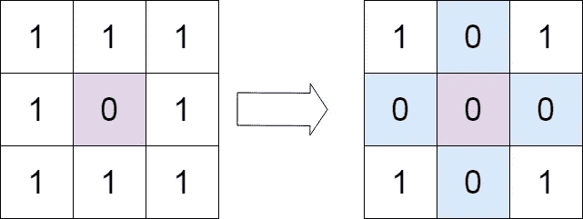
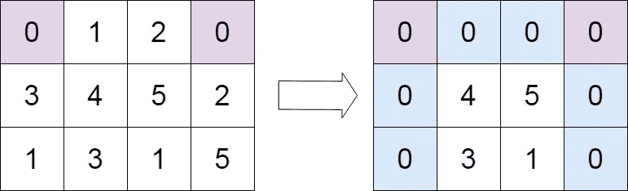

# 设置矩阵零点

> 原文：<https://medium.com/nerd-for-tech/set-matrix-zeroes-edeeb0fb8e24?source=collection_archive---------0----------------------->

***(leet code:Medium)***

给定一个`m x n`整数矩阵`matrix`，如果一个元素是`0`，将其整行整列设为`0`，返回*矩阵*。

你必须在适当的位置做这件事。

**例 1:**



```
**Input:** matrix = [[1,1,1],[1,0,1],[1,1,1]]
**Output:** [[1,0,1],[0,0,0],[1,0,1]]
```

**例 2:**



```
**Input:** matrix = [[0,1,2,0],[3,4,5,2],[1,3,1,5]]
**Output:** [[0,0,0,0],[0,4,5,0],[0,3,1,0]]
```

**约束:**

*   `m == matrix.length`
*   `n == matrix[0].length`
*   `1 <= m, n <= 200`
*   `-2^31 <= matrix[i][j] <= 2^31 - 1`

# 解决方法

1.  **蛮力方法**

识别零，对于每个检测到的零，将行和列中除零之外的所有元素更改为-1(或者根据您的需要更改为任何值)。

现在迭代之后，把 all -1 改成 0。

通过这种方式，您将最终将验证给定条件所需的矩阵设置为零。

**时间复杂度:O((m*n)*(m*n))** 一个 m*n 用于遍历，一个 m*n 用于遍历对应的行和列。

**空间复杂度:O(1)** 因为我们只是在矩阵本身做改变。

```
PS : Try to code this brute force approach yourself. 
```

**2。优化方法**

在这里，我们将两个虚拟数组作为第一行和第一列本身。

```
**class Solution {
public:
    void setZeroes(vector<vector<int>>& matrix) {
        int col0 = 1, rows = matrix.size(), cols = matrix[0].size();****for (int i = 0; i < rows; i++) {
        if (matrix[i][0] == 0) col0 = 0;
        for (int j = 1; j < cols; j++)
            if (matrix[i][j] == 0)
                matrix[i][0] = matrix[0][j] = 0;
    }****for (int i = rows - 1; i >= 0; i--) {
        for (int j = cols - 1; j >= 1; j--)
            if (matrix[i][0] == 0 || matrix[0][j] == 0)
                matrix[i][j] = 0;
        if (col0 == 0) matrix[i][0] = 0;
    }
    }
};**I will dry run the following code for a better and clear understanding. 
matrix = [[1,1,1],[1,0,1],[1,1,1]]colo0 = 1, rows = 3 , cols = 3
i =0, matrix[0][0] = 1 , col0 = 1
matrix[0][1] = 1 i = 0, j= 2
matrix[0][2] = 1
matrix[0][3] = 1so now i = 1
matrix[1][0] = 1
matrix[1][1] = 0 , so matrix[1][0] = 0 and matrix[0][1] = 0 
**matrix = [[1,0,1],[0,0,1],[1,1,1]]**So keep traversing the matrix and filling it up with the values and in the end you will get a matrix fulfiiling the desired conditions.***Time Complexity - O(m*n + m*n)
Space Complexity - O(1)*** 
```

有用的链接:

1.  [https://leetcode.com/problems/set-matrix-zeroes](https://leetcode.com/problems/set-matrix-zeroes)
2.  [https://www.youtube.com/watch?v=M65xBewcqcI&list = plguwdvibif 0 RPG 3 ictpu 74 ywbq 1 cabk 2&index = 7](https://www.youtube.com/watch?v=M65xBewcqcI&list=PLgUwDviBIf0rPG3Ictpu74YWBQ1CaBkm2&index=7)

如果您有任何疑问或问题，请随时在下面提问。在那之前继续编码！！！！💻🙌既然你喜欢看我的博客，为什么不请我喝杯咖啡，支持我的工作呢！！[https://www.buymeacoffee.com/sukanyabharati](https://www.buymeacoffee.com/sukanyabharati)☕