# 使用 Firebase 设置创建-反应-应用程序

> 原文：<https://medium.com/nerd-for-tech/setting-up-a-create-react-app-with-firebase-4fb3601fe2d4?source=collection_archive---------1----------------------->

## 什么是 Firebase？

Firebase 是一个 BaaS(后端即服务)平台，由 Google 开发，用于创建 web 和移动应用程序。它为开发人员提供了许多工具和服务，以帮助他们开发高质量的应用程序，并随着用户群的增加而扩展。

Firebase 提供了一些显著的特性:

*   身份验证 Firebase 身份验证可用于手动将一种或多种登录方法集成到应用程序中。
*   实时数据库—数据在所有客户端之间实时同步，即使在应用程序离线时也保持可用。
*   托管——Firebase 为 web 应用程序提供快速托管。
*   分析—允许您跟踪应用问题并确定其优先级，以及监控应用的成功
*   它提供免费和付费选项

## 设置您的 Firebase 帐户

首先，你需要有一个谷歌账户。如果你没有，或者想专门为 Firebase 创建一个，你可以去谷歌登陆页面免费注册一个。

一旦你创建了一个帐户，请进入 Firebase 并点击“开始”按钮。

继续单击“创建项目”。

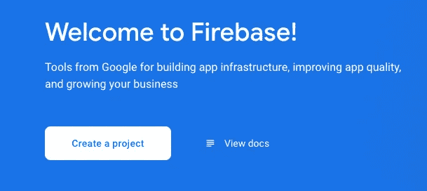

从这里开始，将提示您设置项目。

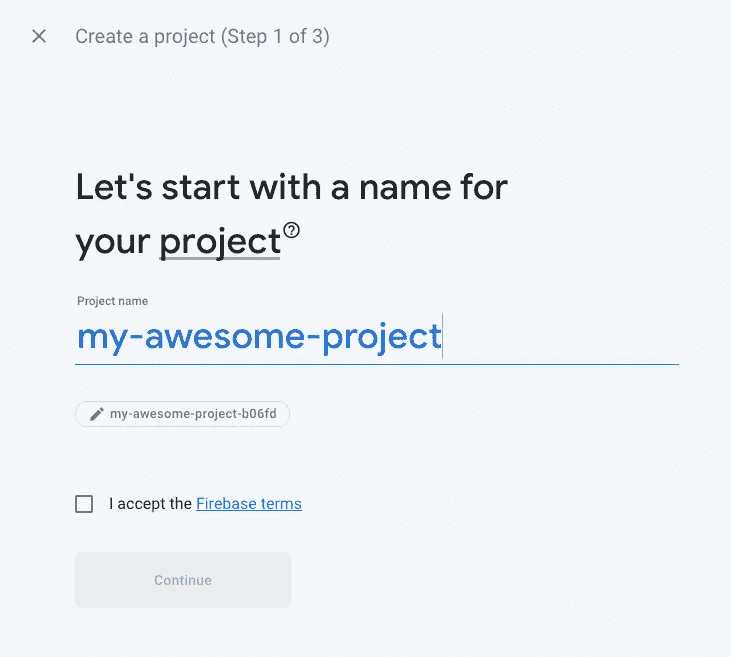

接受条款，选择您想要关联的 Google 帐户，允许分析，然后单击“创建项目”。

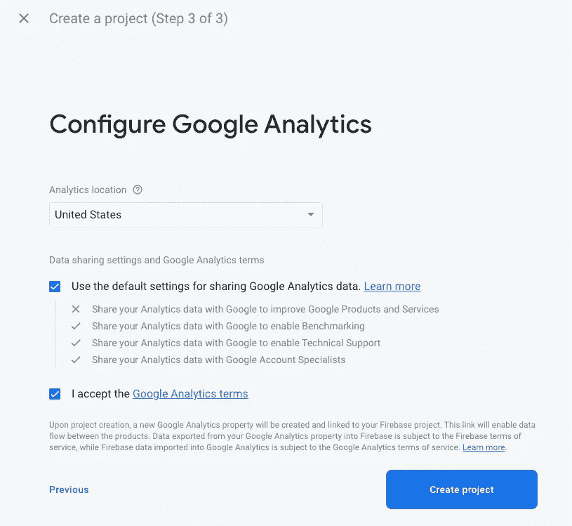

然后，Firebase 将创建项目并引导您进入项目概述。

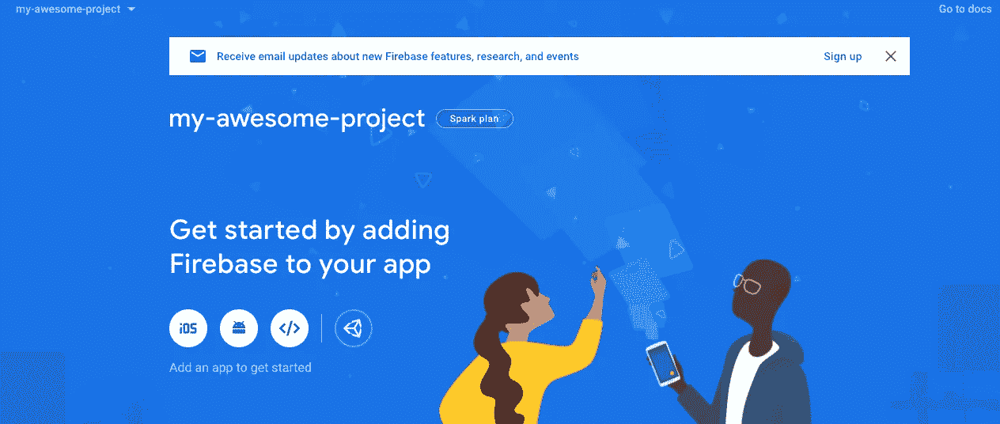

根据您的应用适用的设备，选择正确的图标(iOS、Android、Web)。在这个博客中，我们将把我们的 Firebase 项目连接到一个 web 应用程序，所以请随意选择 web 图标。

系统会提示您注册应用程序。去做吧。

注册后，Firebase 将生成 Firebase SDK 脚本，您将使用该脚本将 react-app 链接到项目。

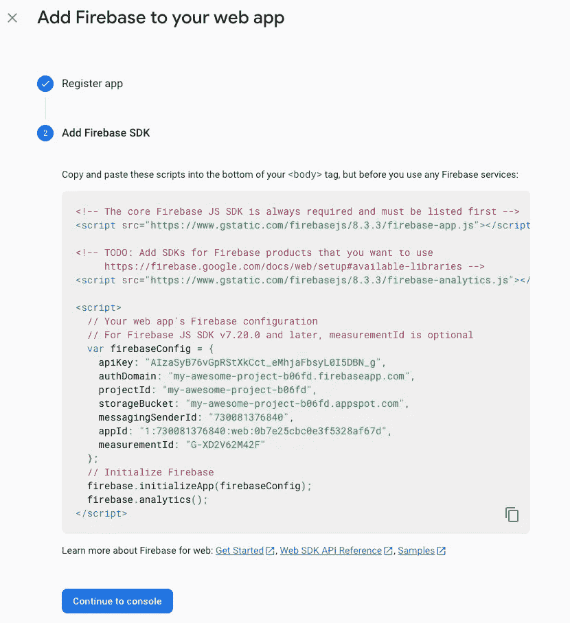

单击“继续到控制台”,您将返回到概览页面。

*   要在任何时候访问此代码，只需点击设置转盘并选择“项目设置”

## 选择您的数据库

从 Firebase 控制台中，选择右侧面板上的“Build”行，下面会显示一些子标题，您可能想看看 Firestore 数据库和实时数据库。

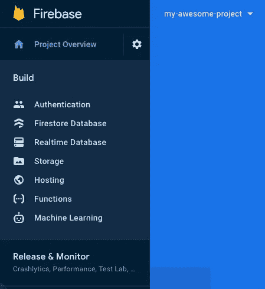

Firebase 描述的两者的区别是:

*   **Cloud Firestore** 是 Firebase 最新的移动应用开发数据库。它以实时数据库的成功为基础，采用了新的、更直观的数据模型。Cloud Firestore 还具有比实时数据库更丰富、更快速的查询和扩展能力。
*   **实时数据库**是 Firebase 的原始数据库。这是一种高效、低延迟的解决方案，适用于需要在客户端之间实时同步状态的移动应用。

(点击了解更多关于[的不同之处)](https://firebase.google.com/docs/database/rtdb-vs-firestore)

对于这个博客，我们将选择 Firestore 作为我们的数据库。

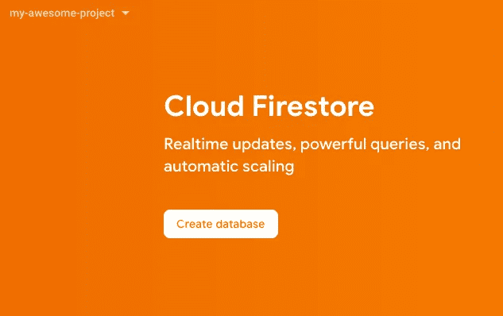

继续并点击“创建数据库”。

然后会提示您以生产或测试模式启动。

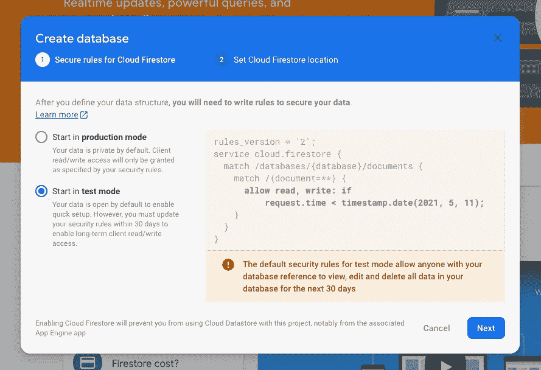

然后选择存储数据的位置。选择最适合您需求的地区，然后单击“启用”。

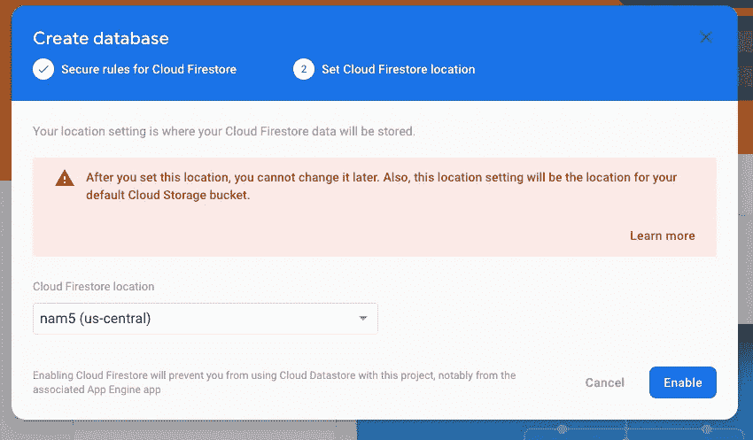

完成后，您将被重定向到您的 Firestore 数据库。

太好了。我们现在有一个向 Firebase 注册的项目和一个与该项目相关联的 Firestore 数据库。您可以通过此控制台手动将数据添加到数据库中，并遵循文档模型的集合。

*Firestore 是一个在云上水平扩展的 noSQL(非关系型)文档数据库(点击了解更多

现在让我们将它连接到我们的 react 应用程序。

## 使用 Firebase SDK 将 Firebase 项目链接到我们的 react-app

如果你还没有创建一个 react-app，那么在你的终端中你想要存储你的应用的文件夹中输入这一行。

一旦 create-react-app 完成了它的工作，在你的组件文件夹中创建一个名为“utils”的新文件夹。在“utils”文件夹中创建一个名为“firebase.js”的文件。

在该文件中，在顶部添加您的导入，并使用 firebase 项目设置中的 SDK 代码创建一个 firebaseConfig 变量。一旦创建了 firebaseConfig 变量，就通过 firebase.initializeApp()方法初始化它。之后，创建一个数据库变量来引用项目的 firestore 数据库。

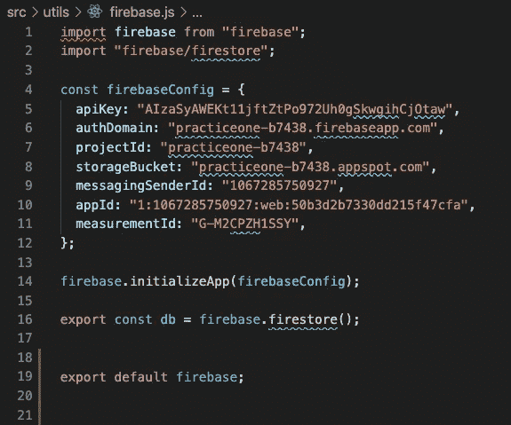

一旦建立起来。最后一步是将其导入到 index.js 文件中。

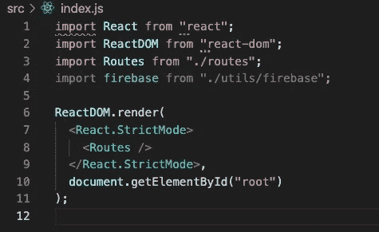

虽然这一行被抑制了，但没关系，因为您已经初始化了应用程序，现在连接到您的 index.js 文件。

就这样。您已经正式创建了一个带有 Firestore 数据库的 Firebase 项目，并将其链接到您的 react-app！

现在有大量不同的工具和服务可供您使用，所以请务必仔细阅读文档，熟悉 CRUD 操作以及身份验证和查询。

现在你已经设置好了，祝你黑客生涯愉快！