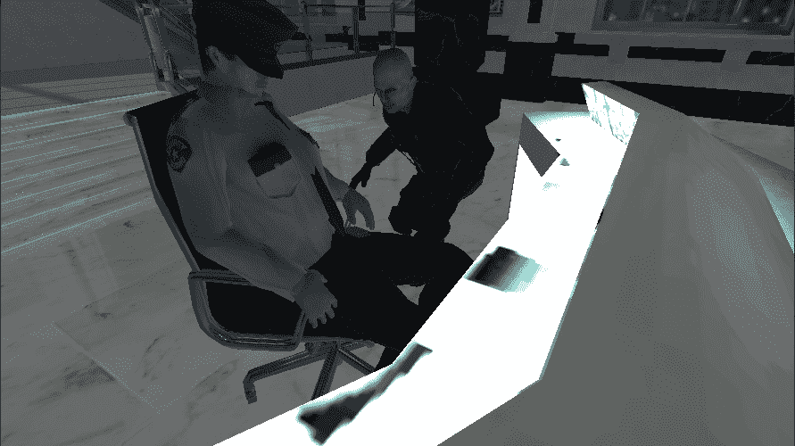
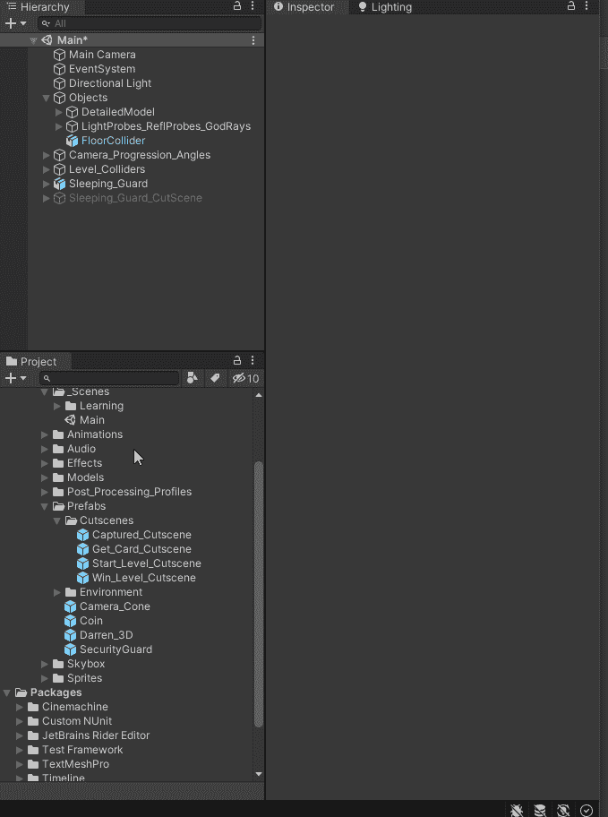
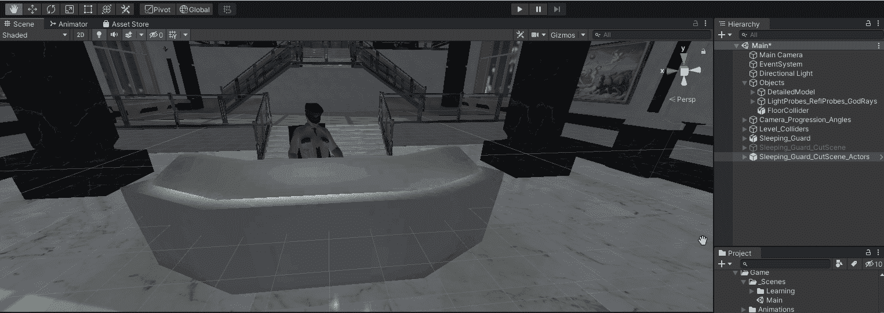
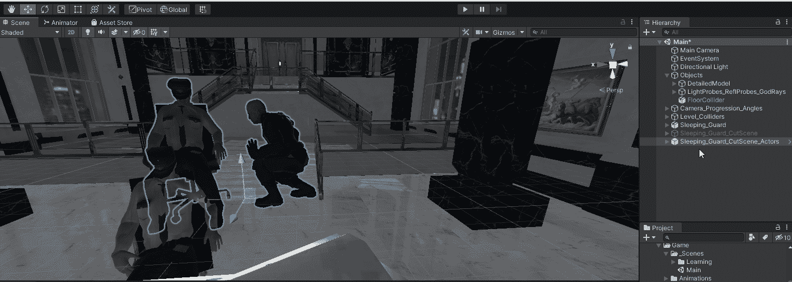

# 在 Unity 步骤 1 中设置过场动画:遮挡镜头

> 原文：<https://medium.com/nerd-for-tech/setting-up-a-cut-scene-in-unity-step-1-blocking-the-shot-b208bd81af06?source=collection_archive---------12----------------------->

**目标:**设置一个过场动画，我们的玩家从睡着的警卫那里偷了一张钥匙卡

过场动画演示

我要做的第一件事是将过场动画演员移到场景中(过场动画是由我们的图形艺术家在 Unity 之外制作的)。那我就改名为《沉睡的守卫剪场景演员》。

创建过场动画对象

现在它已经在场景中了，我需要找到它并把它移动到合适的位置。为了找到这个物体，我将选择它，然后点击场景视图并按“F”键。这将捕捉到对象。然后我就可以把它移到那个位置了。

寻找过场动画

现在，我将微调定位，使它正好位于我想要的位置。

移动到准确的位置

现在演员都就位了，我可以运行游戏并看到过场动画了。

客户场景演示

好了，现在我已经有了合适的演员，动画看起来也不错。我将继续撰写镜头(下一篇文章)。

编码快乐！！！！