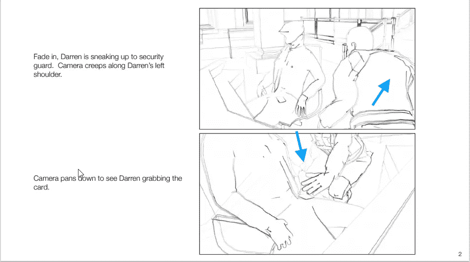
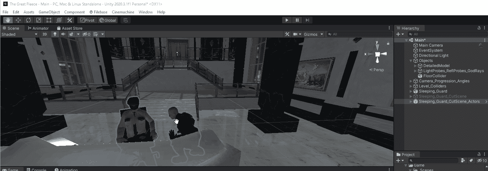
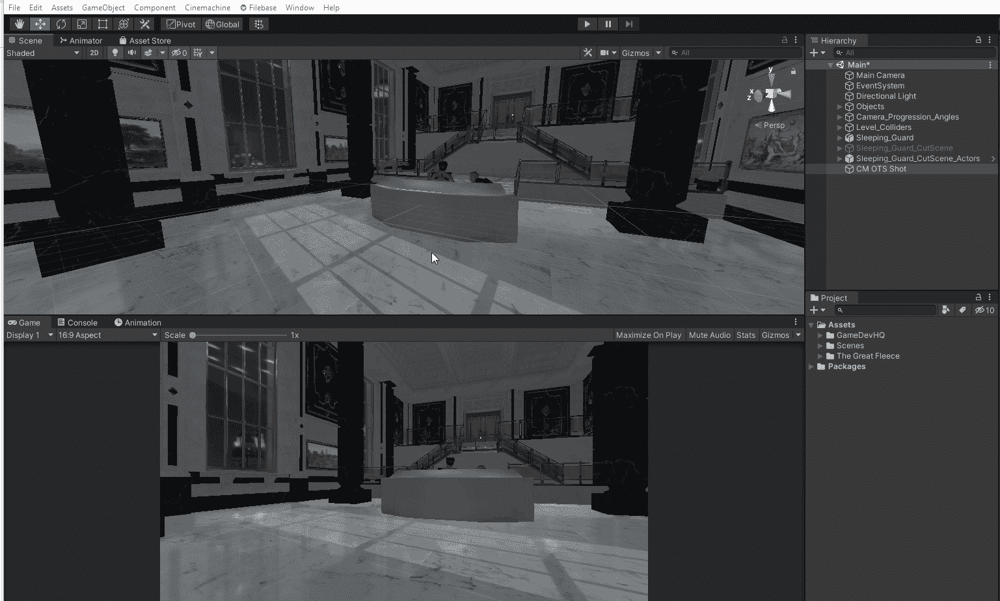
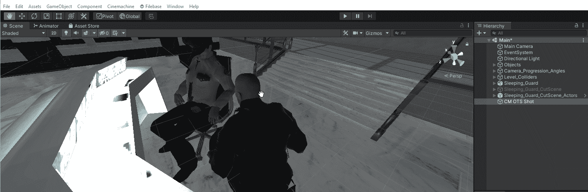
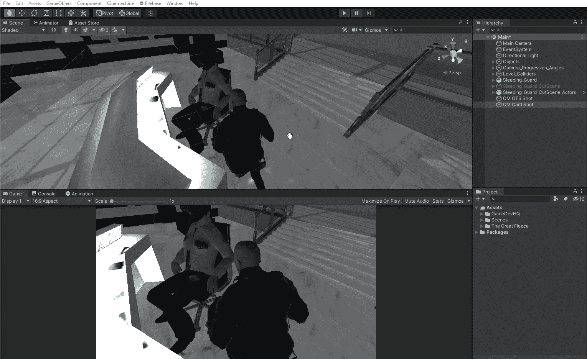
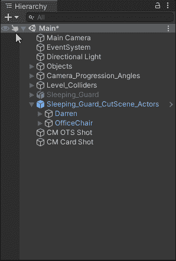
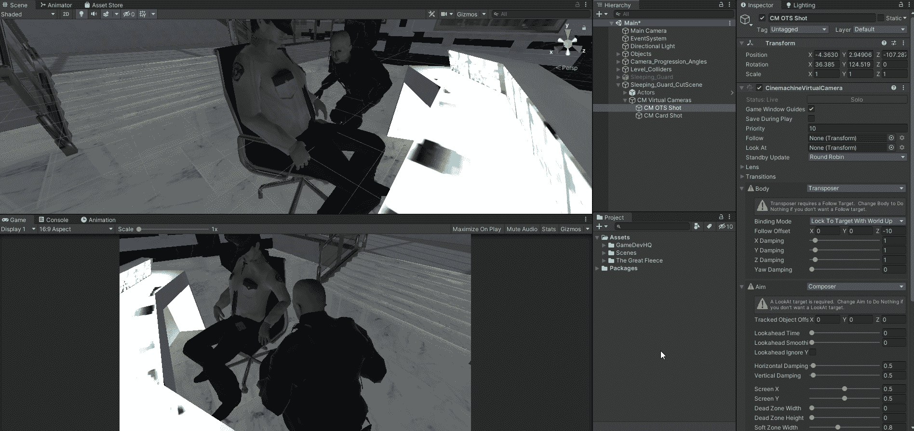

# 在 Unity Step2 中设置过场动画:合成镜头

> 原文：<https://medium.com/nerd-for-tech/setting-up-a-cut-scene-in-unity-step2-composing-the-shot-8a9441988533?source=collection_archive---------5----------------------->

**目的:**根据导演的笔记，合成我们的警卫睡觉的镜头。

导演笔记

根据导演的笔记，我将有两个镜头要创作。第一个是过肩投篮，第二个是抢卡。我将在 cinemachine 中设置虚拟摄像机。

第一个镜头将是“过肩”镜头。选择 Cinemachine，然后选择创建虚拟摄像机。在层次中选择并重命名。我将命名为厘米 OTS 拍摄。

肩膀以上厘米

接下来，我会根据导演的笔记来排列镜头。为此，我将点击场景视图，然后按住“Alt”键，我可以用鼠标移动相机。一旦我在场景视图中有了我想要的外观，我将在层级中选择虚拟相机，然后选择游戏对象菜单，然后对齐视图。这将使虚拟相机捕捉到场景视图。这也可以通过选择虚拟摄像机并使用热键 Ctrl+Shift+f 来完成

对准厘米 OTS 拍摄

创建第二个虚拟摄像机。

CM 卡片拍摄

对齐视图。

对齐 CM 卡片快照

现在我已经按照导演的笔记排好了两个镜头。在继续之前，我将清理层次结构。注意:不要忘记在创建的空游戏对象上清零位置(x，y，z)。

打扫

现在让我们最后看一下这两张照片。

检查两个镜头

好了，现在一切看起来都很好，我将继续使用时间线(下一篇文章)把一切放在一起。

编码快乐！！！！